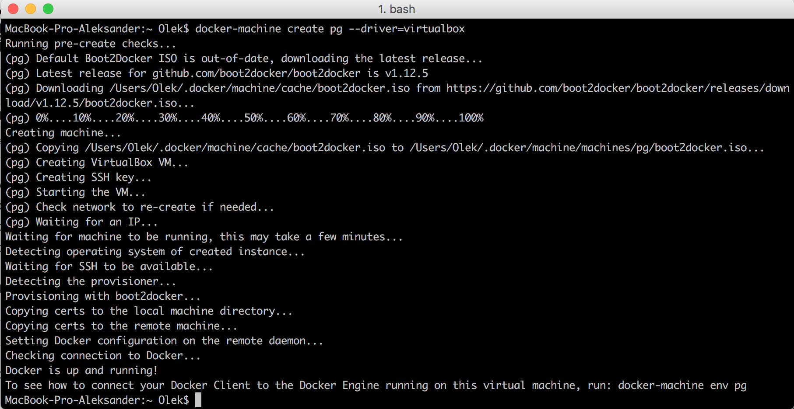
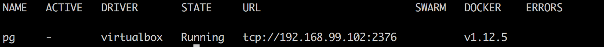
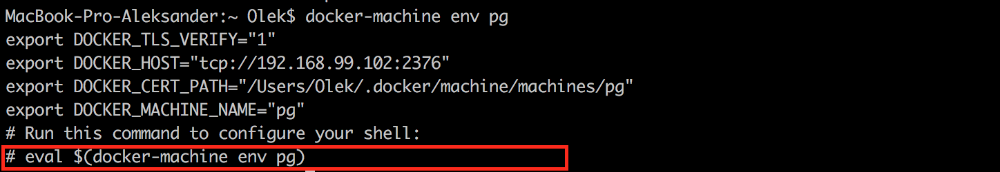
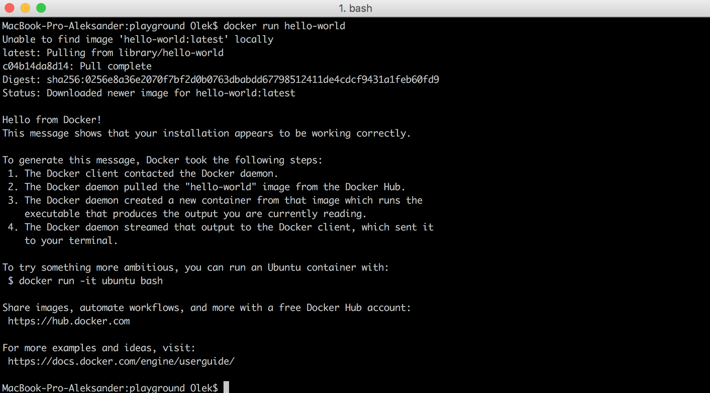
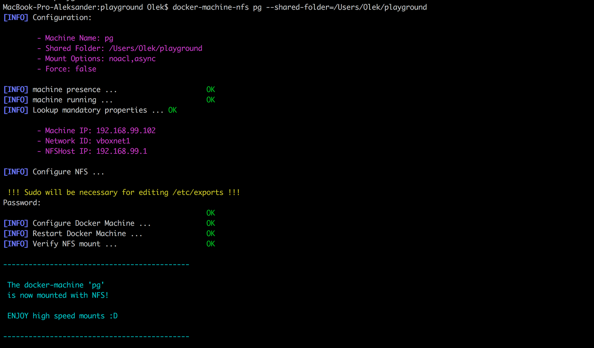

  Moją opinię dotyczącą Dockera poznaliście w poprzednim poście którego możecie przeczytać <a href="http://fsgeek.pl/2016/12/14/docker-cudowne-narzedzie/">tutaj</a>.  Dziś chciałbym się zająć czymś bardziej praktycznym a dokładnie instalacją i podstawowym użytkowaniem tego systemu. Ale nim przejdziemy do rzeczy ciekawych najpierw musimy go zainstalować. W kwesti instalacji odsyłam do strony Dockera -> <a href="https://www.docker.com/products/docker">TUTAJ</a>. Ja osobiście pracuję na komputerze Mac więc będę dalsze kroki pisał z mojej perspektywy ale mam nadzieję, że na innych platformach to działa identycznie.

  W przypadku wersji na Mac&#8217;a prawdopodobnie zaraz po instalacji Docker się otworzy w swojej wersji natywnej. Póki co nie używam tej wersji ponieważ jest ona wolniejsza niż w przypadku użycia docker-machine co w przypadku projektów ma znaczenie. Z tego co czytałem mają to poprawić więc może kiedyś przyjdzie dzień gdzie będę używać wersji natywnej.

<h1 dir="auto">
  Tworzenie docker-machine
</h1>

  Wersja z docker-machine nie różni się wiele od natywnej a wymaga tylko stworzenia maszyny wirtualnej na której będą działały kontenry. Jedyne czego potrzebujemy to zainstalowanego VirtualBox&#8217;a na naszej maszynie. To na nim tak naprawdę stworzymy maszynę wirtualną. Aby stworzyć naszą maszynę wirtualną musimy wpisać w konsoli

<pre class="theme:cisco-router lang:default decode:true">docker-machine create MACHINE_NAME --driver=virtualbox</pre>

**MACHINE_NAME** jest to nazwa maszyny wirtualnej i możecie wstawić tam jaką chcecie. Jeśli wpiszecie tam **default** to stworzycie domyślą maszynę wirtualną i część rzeczy będziecie mogli zrobić automatycznie. Ja osobiście wolę jednak konkretną nazwę (nie mam wtedy szansy tworzyć kontenerów na innej maszynie niż chcę). Ja tam wpiszę **pg **(skrót od playground). Poprawne stworzenie maszyny powinno wyglądać tak:

Jeśli wszystko poszło dobrze to po wpisaniu komendy

<pre class="theme:cisco-router lang:default decode:true">docker-machine ls</pre>

powinno nam się ukazać taki widok:

Teraz musimy wykonać jeszcze jedną rzecz aby móc korzystać z dockera. Musimy &#8222;połączyć&#8221; nasz terminal z maszyną. Aby to zrobić wpiszmy najpierw poniższą komendę w terminalu

<pre class="theme:cisco-router lang:default decode:true">docker-machine env pg</pre>

Jeśli daliście inną nazwę swojej maszynie to wpiszcie ją zamiast pg. Powinno nam się wyświetlić coś takiego.

Teraz musimy tak naprawdę przekopiować tą komendę

<pre class="theme:cisco-router lang:default decode:true">eval $(docker-machine env pg)</pre>

I voilà teraz każda komenda np.: docker-compose będzie wykonana na tej maszynie. Pamiętajcie, że jeśli zamkniecie terminal to potem znów będziecie musieli wpisać ponownie powyższą komendę by wszystko działało. 

Żeby sprawdzić że rzeczywiście wszystko działa wpiszmy w terminalu

<pre class="theme:cisco-router lang:default decode:true">docker run hello-world</pre>

Polecam jeszcze aby zainstalować docker-machine-nfs z tego miejsca ->[ LINK][1]. Pozwala to jeszcze bardziej przyśpieszyć działanie dockera jako serwera lokalnego.  Aby go poprawnie skonfigurować należy wpisać następującą komendę

<pre class="theme:cisco-router lang:default decode:true">docker-machine-nfs MACHINE_NAME --shared-folder=/Users/nazwaUzytkownika/TWOJ_FOLDER</pre>

Ważne jest aby podać dokładny folder w którym będziemy trzymać pliki dla serwera. Dzięki temu możemy mieć stworzonych wiele maszyn do wielu folderów(projektów) i nie będzie konfliktów. Poprawne działanie tej komendy przedstawiłem poniżej.

&nbsp;

 [1]: https://github.com/adlogix/docker-machine-nfs