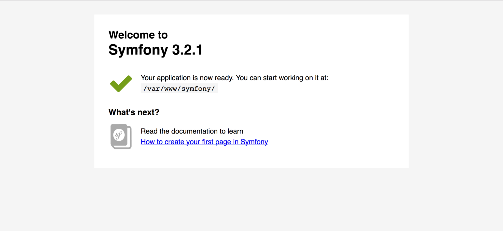
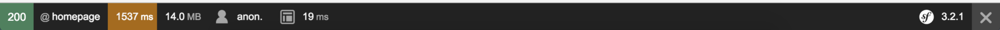

W ostatnim wpisie  stworzyliśmy wszystkie potrzebne kontenery aby móc na nich postawić aplikację w Symfony.  Dziś dokończymy to co zaczęliśmy w ostatnim wpisie(jeśli go ominęliście to znajdziecie go [TUTAJ][1]). Aktualnie Symfony jest chyba najbardziej popularnym frameworkiem php&#8217;owym, którego najnowsza wersja nosi cyfrę 3. Według oficjalnej dokumentacji  najlepszym sposobem na rozpoczęcie zabawy z Symfony jest skorzystanie z oficjalnego instalatora. Dzięki niemu możemy sobie wybierać, którą wersję Symfony chcemy użyć i szybko stworzyć projekt.

## Konfiguracja Symfony  w Dockerze

Aby to wszystko działało z naszymi kontenerami musimy umieścić nasze pliki Symfony w katalogu, który skonfigurowaliśmy w docker-compose.yml w sekcji application>volumes. Jeśli tak zrobicie to po wejściu na adres ip maszyny na porcie 8001 (jest to port na którym wystawiliśmy serwer nginx)  maszyny powinniście zobaczyć następujący widok.

Jeśli wyświetla wam się komunikat** _File not found_** to pierwsze co powinniście sprawdzić to czy foldery zostały odpowiednio podmontowane. Żeby to sprawdzić zalogujcie się na kontener php i zobaczcie czy widzicie wszystkie pliki w _**/var/www/symfony**_. Jeśli nie to znaczy, że katalog nie został podmontowany. U mnie pomogło puszczenie jeszcze raz docker-machine-nfs dla używanej maszyny. Jeśli nie korzystacie z docker-machine-nfs  lub macie inne problemy to piszcie to może uda nam się razem znaleźć rozwiązanie problemu

Wygląda na to że wszystko działa jednak trzeba pamiętać że podczas tworzenia oprogramowania najwięcej czasu spędzicie w trybie developmentu. Aby do niego wejść należy dopisać do adresu /app_dev.php/.  Jak wejdziecie na ten adres to powinniście zobaczyć taki komunikat
  
**_You are not allowed to access this file. Check app_dev.php for more information_**.

Aby to naprawić musimy się udać do pliku web/app_dev.php. Za nasz komunikat odpowiada ten kawałek kodu

<pre class="lang:php decode:true">if (isset($_SERVER['HTTP_CLIENT_IP'])

    || isset($_SERVER['HTTP_X_FORWARDED_FOR'])

    || !(in_array(@$_SERVER['REMOTE_ADDR'], ['127.0.0.1', '::1']) || php_sapi_name() === 'cli-server')

) {

    header('HTTP/1.0 403 Forbidden');

    exit('You are not allowed to access this file. Check '.basename(__FILE__).' for more information.');

}</pre>

Aby się go pozbyć najłatwiej jest zakomentować ten odcinek kodu. Teraz wróćmy do strony. Powinniśmy znowu widzieć nasz ekran powitalny ale z dodatkowym paskiem na dole ekranu.

Jest to tak zwany pasek profilera. Jest to bardzo użyteczne narzędzie z którego będziecie korzystać częściej niż ze strony. Jego pełną wersję można znaleźć pod adresem _**/app\_dev.php/\_profiler**_. Powinniście zobaczyć błąd związany z przechowywaniem sesji.
  
Dla naszych celów wystarczy jak przejdziemy do pliku_ **app/config/config.yml**_ i znajdziemy opcje session. Aby działało wystarczy że zakomentujemy te dwie linie

<pre class="lang:default decode:true ">handler_id:  session.handler.native_file
save_path:   "kernel.root_dir%/../var/sessions/kernel.environment%"

</pre>

i zamiast nich wpiszemy coś takiego

<pre class="lang:default decode:true ">handler_id: ~</pre>

I voil&#8217;a teraz wszystko powinno działać.

W następnym wpisie pokaże jak skonfigurować symfony by działał jako REST serwer.

 [1]: http://fsgeek.pl/2016/12/27/docker-compose/