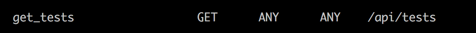
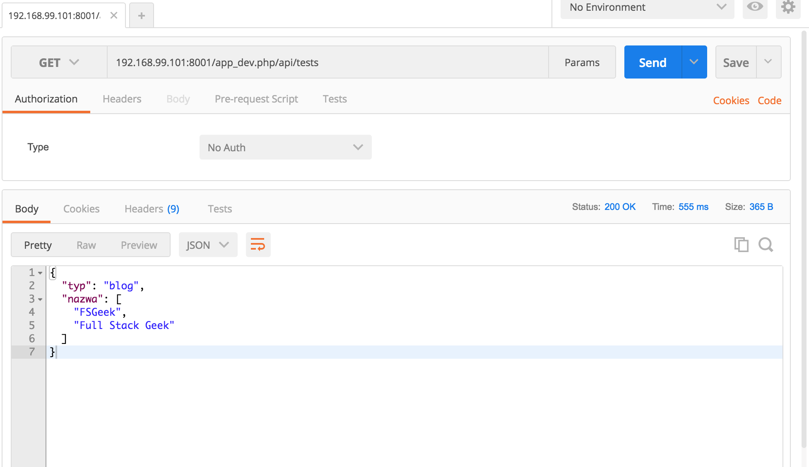

Ostatnimi czasy widzę rosnący trend rozdzielania części frontowej i backendowej aplikacji internetowej. Takie rozdzielenie warstw pozwala na dużą elastyczność w projektowaniu aplikacji. Część backendowa jest aktualnie sprowadzona do serwera REST na który wysyła się zapytania z części frontowej. Dziś chciałbym krótko pokazać jak stworzyć w Symofny taki prosty serwer REST. Będę go potem wykorzystywał w cyklach dotyczących framework&#8217;ów frontendowych.

## Symfony REST

Symfony jest doskonale przystosowany do pełnienia roli serwera REST. Do takiego serwera wysyłane są tylko 4 główne  metody:

  * GET
  * POST
  * PUT
  * DELETE

Aby stworzyć taki serwer w Symofny musimy zainstalować dwa nowe pakiety:

  * FOSRestBundle
  * JMSSerializerBundle

Aby je zainstalować to najlepiej wejść do kontenera php i wpisać następujące komendy

<pre class="theme:cisco-router lang:default decode:true ">composer require friendsofsymfony/rest-bundle</pre>

&nbsp;

oraz

<pre class="theme:cisco-router lang:default decode:true">composer require jms/serializer-bundle</pre>

Pierwsza biblioteka pozwala definiować teraz kontrolery w sposób REST&#8217;owy tzn w nazwie funkcji musimy teraz pisać nazwę metody jaką będziemy się do funkcji odwoływać np. getUsers. Automatycznie też jest tworzona ścieżka pod którą będzie można się odwołać.  Jednak aby to wszystko działało musimy wykonać minimum wysiłku w postaci konfiguracji.

Ja osobiście korzystam z takiej minimalnej konfiguracji w której wskazuję, że formatem którego będę używać będzie json

<pre class="lang:default decode:true">fos_rest:
    routing_loader:
        default_format: json
        include_format: false
    body_listener: true
    format_listener:
        rules:
            - { path: '^/api', priorities: ['json'], fallback_format: json, prefer_extension: false }
            - { path: '^/', stop: true }
    param_fetcher_listener: true
    view:
        view_response_listener: 'force'
        formats:
            json: true</pre>

&nbsp;

Jednak to nie wszystko. Musimy jeszcze zmienić konfiguracje routingu. Aby to zrobić musimy wejść w app/config/routing.yml i usunąć to co tam jest. Od teraz będziemy definiować sami z jakich kontrolerów będą tworzone ścieżki URL. Innymi słowy jeśli jakiegoś kontrolerra nie umieścimy w tym pliku to nie będzie dostępne w postaci endpointu dla części frontendowej. Nowe kontrolery definiujemy w następujący sposób:

<pre class="lang:default decode:true ">Nazwa (ja osobiście tam daję nazwę kontrolera):

resource: Scieżka do controllera

type:rest

prefix:/api</pre>

Opcja prefix powoduje , że każda wygenreowna ścieżka będzie poprzedzona wpisaną tam wartością.  Resource jest to ścieżka do kontroleraTeraz jak jest już wszystko zrobione możemy stworzyć nasz pierwszy REST&#8217;owy kontroler. Ja stworze kontroler o nazwie TestController i stworzę go w ścieżce Controller/API/. Wtedy mój nowy kontroler w pliku routing będzie wyglądał następująco:

<pre class="lang:default decode:true ">test:

resource:AppBundle\Controller\API\TestController

type:rest

prefix:/api</pre>

No to teraz zajmijmy się właściwym kontrolerem. Najwazniejsze jest żeby nasza nowa klasa dziedziczyła po  FOSRestController . Teraz wystarczy tworzyć nowe funkcje w naszej klasie i będą się one tworzyły jako nowe endpointy. Przykładowy plik przedstawiam poniżej.

<pre class="lang:default decode:true ">&lt;?php

namespace AppBundle\Controller\API;

use FOS\RestBundle\Controller\FOSRestController;

class TestController extends FOSRestController
{
    public function getTestsAction()
    {
        return array(
            'typ' =&gt; 'blog',
            'nazwa' =&gt; array(
                "FSGeek",
                "Full Stack Geek",
            ),
        );
    }

}</pre>

&nbsp;

## Czy to działa?

Jednak jak teraz sprawdzić czy wszystko działa? Ja korzystam z narzędzia Postman, które pozwala wysyłać zapytania pod dostępne adresy naszego sewrwera i sprawdzać co otrzymamy z nich. Żeby zobaczyć jakimy endpointami dysponujemy należy wpisać w kontenerze php następujące polecenie:

<pre class="theme:cisco-router lang:default decode:true ">bin/console debug:router</pre>

Wyświetla ono wszystkie dostępne  adresy w naszej aplikacji. W moim przypadku na dole listy pojawił się taki wpis.

I ten adres wpiszę do Postmana , wybiorę metodę GET i wyślę zapytanie.  Na poniższym zrzucie widać efekt tego zapytania jeśli wszytsko działa.

Zapraszam do samodzielnego eksperymentowania i tworzenia własnych kontrolerów.
  
W następnym wpisie zajmę się jeszcze jak stworzyć własną tabelę w bazie danych oraz jak pobierać i zapisywać w niej informacje.