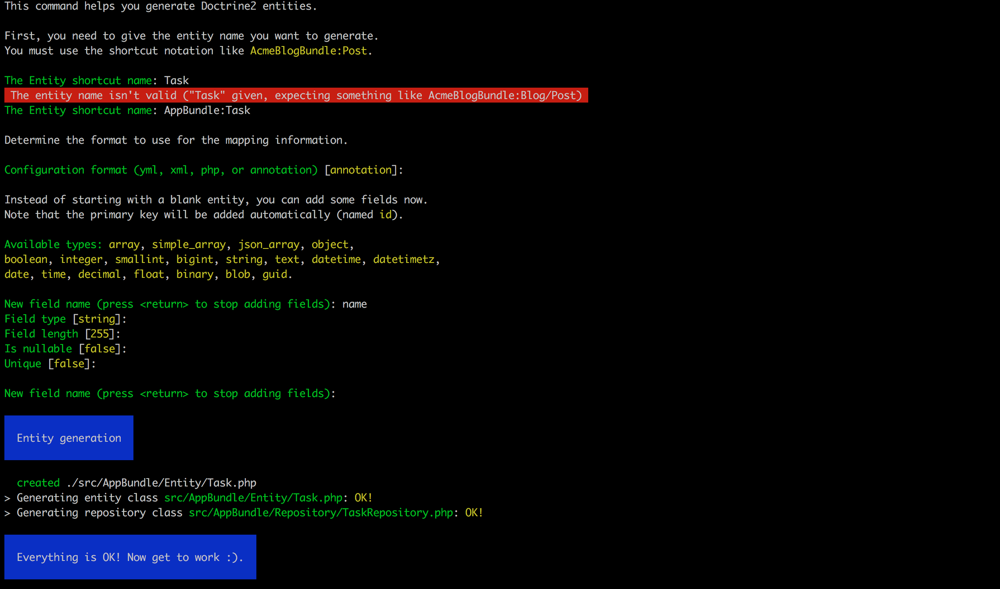
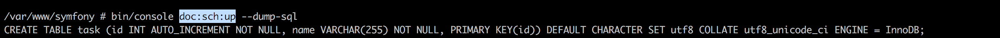
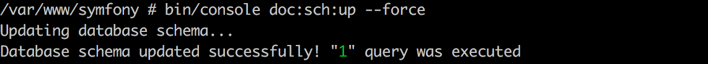

Dziś chciałbym się zająć operacjami na bazie danych w Symfony 3. Są to najbardziej elementarne operacje, które wykonujemy w frameworku backendowym. Symofny ułatwia nam wykonywanie tych operacji o ile właściwie skonfigurujemy. W dockerze, który zbudowaliśmy wcześniej(jeśli ominęliście ten post to znajdziecie go [TUTAJ][1]) mamy dostępne pdo\_sqllite. Jednak ja preferuję mysql I dlatego zainstaluję dodatkowe pakiety w Dockerze. Cała reszta konfiguracji będzie dla mysql\_pdo więc jeśli też chcecie go używać to dopiszcie w pliku docker/php/Dockerfile poniższe linijki:

<pre class="lang:default decode:true ">RUN docker-php-ext-install \
    opcache \
    pdo \
    pdo_mysql \
    mysqli

RUN pecl install apcu apc xcache eacceerator</pre>

Teraz wystarczy zbudować jeszcze raz kontener php tym poleceniem.

<pre class="theme:cisco-router lang:default decode:true">docker-compose up -d --build</pre>

Sprawdzi wszystkie pliki Dockerfile I te które się zmieniły zbuduje na nowo a potem wystartuje je wszystkie.

## Konfiguracja bazy danych

No to skoro mamy już wszystkie potrzebne narzędzia to mozemy skonfigurowac naszą aplikację.  Zaczniemy od pliku app/config/parameters.yml. Widzimy tutaj następujace pozycje

<pre class="lang:default decode:true ">parameters:
    database_host:     127.0.0.1
    database_port:     ~
    database_name:     symfony
    database_user:     root
    database_password: ~

    mailer_transport:  smtp
    mailer_host:       127.0.0.1
    mailer_user:       ~
    mailer_password:   ~

    secret:            ThisTokenIsNotSoSecretChangeIt</pre>

Większość rzeczy jest oczywista a ja chciałbym zwrócić uwagę na opcję database_host. Tam musimy umieścić nazwę kontenera z pliku docker-compose.yml gdzie jest konfiuracja naszej bazy danych.

## Encje

W symofny korzystamy z bazy danych przy pomocy tak zwanych encji. Są to klasy, które reprezentują nasze tabele w bazie danych. Można je tworzyć ręcznie lub skorzystać z komend dostarczonych nam przez Symfony. Ta poniższa pozwala na stworzenie nowej Encji

<pre class="theme:cisco-router lang:default decode:true ">bin/console doc:gen:entity</pre>

Ja w ramach przykładu chcę stworzyć przykładową klasę Task, która będzie, oprócz pola klucza prywatnego, tylko jedno pole name. Jako opcje konfiguracji wybieram annotation ponieważ jestem do nich przyzwyczajony i są dosyć intuicyjne w użyciu. Teraz wystarczy podać konfigurację tej zmiennej w bazie danych i można zakończyć działanie komendy. Cały proces tworzenia encji przeze mnie przedstawiam poniżej

Oprócz stworzenia klasy encji komenda stworzyła również plik TaskRepository. W tym pliku będziemy mogli tworzyć bardziej zaawansowane zapytania do naszej bazy danych.  Natomiast nasza encja powinna wyglądać w ten sposób :

<pre class="lang:default decode:true ">&lt;?php

namespace AppBundle\Entity;

use Doctrine\ORM\Mapping as ORM;

/**
 * Task
 *
 * @ORM\Table(name="task")
 * @ORM\Entity(repositoryClass="AppBundle\Repository\TaskRepository")
 */
class Task
{
    /**
     * @var int
     *
     * @ORM\Column(name="id", type="integer")
     * @ORM\Id
     * @ORM\GeneratedValue(strategy="AUTO")
     */
    private $id;

    /**
     * @var string
     *
     * @ORM\Column(name="name", type="string", length=255)
     */
    private $name;

    /**
     * Get id
     *
     * @return int
     */
    public function getId()
    {
        return $this-&gt;id;
    }

    /**
     * Set name
     *
     * @param string $name
     *
     * @return Task
     */
    public function setName($name)
    {
        $this-&gt;name = $name;

        return $this;
    }

    /**
     * Get name
     *
     * @return string
     */
    public function getName()
    {
        return $this-&gt;name;
    }
}

</pre>

&nbsp;

## Synchronizacja encji z bazą danych

Po powyższych czynnościach będziemy mieli nową encję jednak w bazie danych nic się jeszcze nie zmieni. Aby to się stało musimy zaktualizować naszą bazę danych  na podstawie zmian w encji. Do tego służy nam następujące polecenie

<pre class="theme:cisco-router lang:default decode:true ">doc:sch:up</pre>

Można jej wywołać z dodatkowymi flagami:

&#8211;dump-sql spowoduje wyświetlenie zapytania mysql jakie zostanie wykonane na bazie danych by zsynchronizować ją z encją. Polecam ją wykonywać zawsze zanim zaktualizujecie bazę danych żeby zobaczyć  czy  wykona się to co naprawdę chcemy.

&#8211;force spowoduje wykonanie kodu na bazie danych co zmieni jej strukturę

Innym sposobem aktualizacji bazy danych jest korzytanie z DoctrineMigrations ale na ten temat opowiem w innym poście.

Teraz możemy już wykonywać zapytania REST i wykorzystywać bazę danych do przechowywania danych.  Do nowej encji stworzyłem  kontroler(jeśli nie wiecie jak go stworzyć to zapraszam do poprzedniego postu, znajdziecie go TUTAJ) . Umieściłem w nim 3 przykładowe endpointy:

  * Do pobrania wszystkich rekordów z tabeli
  * Pobranie rekordu o podanym id
  * Dodanie nowego rekordu

Łatwo zauważyć, że operacje na bazie danych wykonujemy za pomocą EntityManager&#8217;a. Przy pobieraniu podajemy tak naprawdę z jakiej encji chcemy skorzystać a nie tabeli. Wato też zauważyć że przy tworzeniu nowego elementu tworzymy nowy obiekt klasy encji a Symofny sam wie gdzie go zapisać w bazie danych. Zapis do bazy danych odbywa się przy pomocy dwóch funkcji persist() i flush(). Za pomocą persist() informujemy, że będziemy chcieli zapisać ten element a dopiero funkcja flush() wykonuje operacje INSERT na bazie danych.

&nbsp;

Zapraszam do testowania na własną rękę możliwości Symofny i testowania swoich endpoint&#8217;ow w Postmanie lub innym narzędziu które pozwala na wysyłanie zapytań REST

 [1]: https://fsgeek.pl/2017/01/09/symfony_rest/