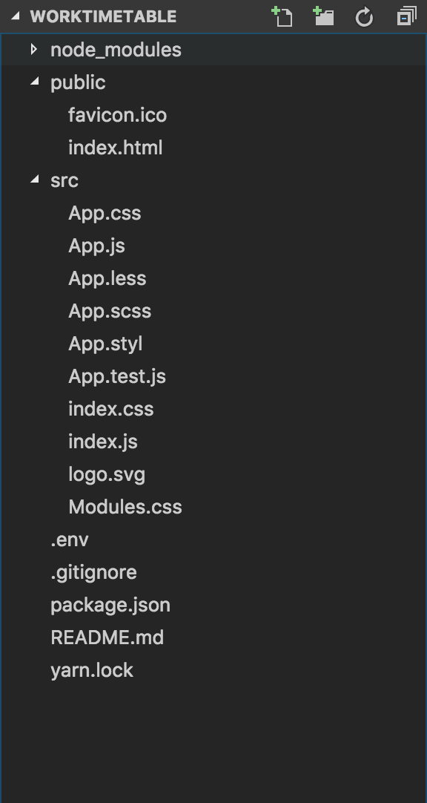
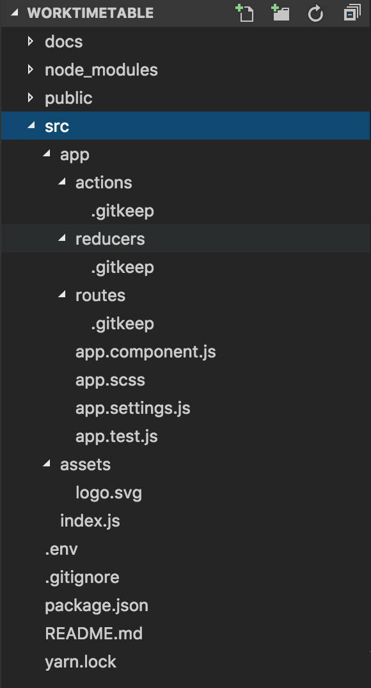

Jako, że konkurs już się zaczął to czas zacząć programować. Dziś będzie jeszcze krótko na temat startu projektu w React&#8217;cie. W moim projekcie zamiast standardowego menadżera npm będę korzystać z yarna(trochę informacji o nim i dlaczego uważam, że jest lepszy od npm znajdziecie [TUTAJ][1]). Tak więc nie zostaje nam teraz nic innego niż stworzyć WorkTimetable.

<!--more-->

## Niech się stanie WorkTimetable

Jeśli zajrzeliście do innych moich postów to wiecie, że jestem zwolennikiem generatorów do tworzenia ogólnego szablonu aplikacji. Jako, że chciałbym korzystać z SCSS użyję  <https://github.com/kitze/custom-react-scripts>.

Korzystanie z niego jest proste i sprowadza się najpierw do zainstalowania go globalnie przy pomocy yarna a następnie użyciu komendy

<pre class="lang:default decode:true ">create-react-app WorkTimetable --scripts-version custom-react-scripts</pre>

do stworzenia nowego projektu. Oto co dostajemy po użyciu komendy.

Jednak mnie nie wystarczyło takie coś więc dostosowałem to pod swoje wymagania i wizję. Stworzyłem sobie podstawową strukturę katalogów. Jako, że w większości są na razie puste skorzystałem z .gitkeep aby się prawidłowo dodały do do Git&#8217;a. Po moich zmianach struktura aplikacji wygląda następująco:

Prawda, że przyjemniej?

Jako, że struktura została wymyślona przeze mnie i nie wszyscy się mogą z nią zgodzić chciałbym pokrótce wyjaśnić co będzie w każdym z folderów. Jeśli macie pomysły lub lepiej praktykę jakby można to było lepiej ułożyć to zapraszam do komentowania. Póki co struktura będzie wyglądać następująco:

  * actions &#8211; będę tam trzymał definicje wszystkich akcji używanych w systemie np.: GET_EVENTS
  * reducers &#8211; miejsce na reducery, czyli funkcje które będą defioniowały jak aplikacja ma się zmieniać po wystąpieniu konkretnych akcji
  * routes &#8211; w tym katalogu będą trzymane wszystkie komponenty Reactowe wraz ze stylami

Co to są akcje i reducery powiem dokładnie jak będę do aplikacji wprowadzał Redux&#8217;a.

## Repozytorium Github

Ostatnią rzeczą jaka została mi do zrobienia na starcie to wrzucenie mojego podstawowego projektu do repozytorium GitHub&#8217;a. Nie było to dosyć skomplikowane i wymagało użycia następujących komend:

<pre class="lang:default decode:true">git init
git add .
git commit -m "initial commit"
git remote add origin https://github.com/Feridum/WorkTimetable-UI.git
git push -u origin master</pre>

## Bonus

Jako bonus mam zamiar skorzystać Github Pages aby pokazywać wam działający projekt. Będę do tego używał folderu docs dzięki czemu będziecie mogli na bieżąco śledzić stan mojego projektu od strony UI. Możecie śledzić to na bieżąco [tutaj.][2] Początkowo miałem trochę problemów żeby to działało ale w końcu się udało.

Na razie to tyle. W przyszłym tygodniu mam zamiar dalej rozbudowywać projekt i napisać co nieco o SCSS oraz BEM&#8217;ie z których będę korzystał.

 [1]: https://fsgeek.pl/2017/01/22/czym-jest-yarn/
 [2]: https://feridum.github.io/WorkTimetable-UI/