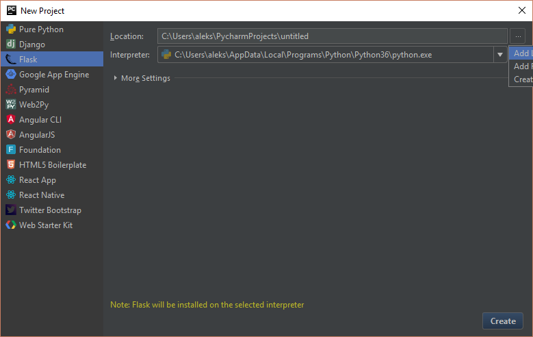
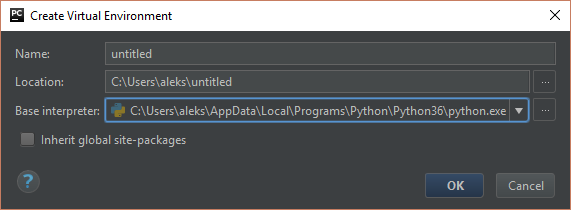
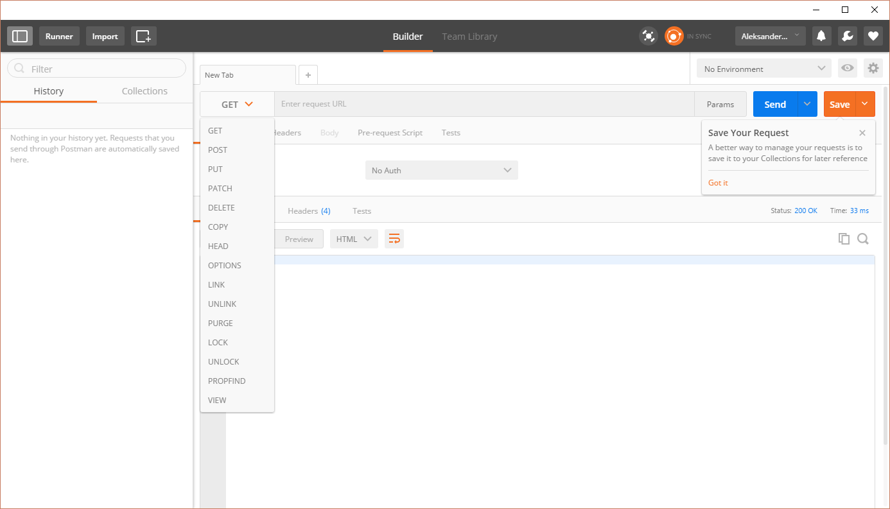
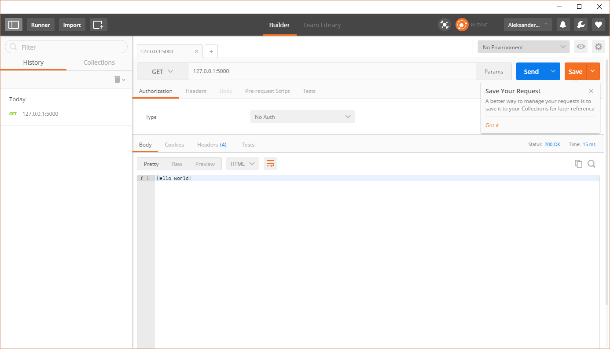
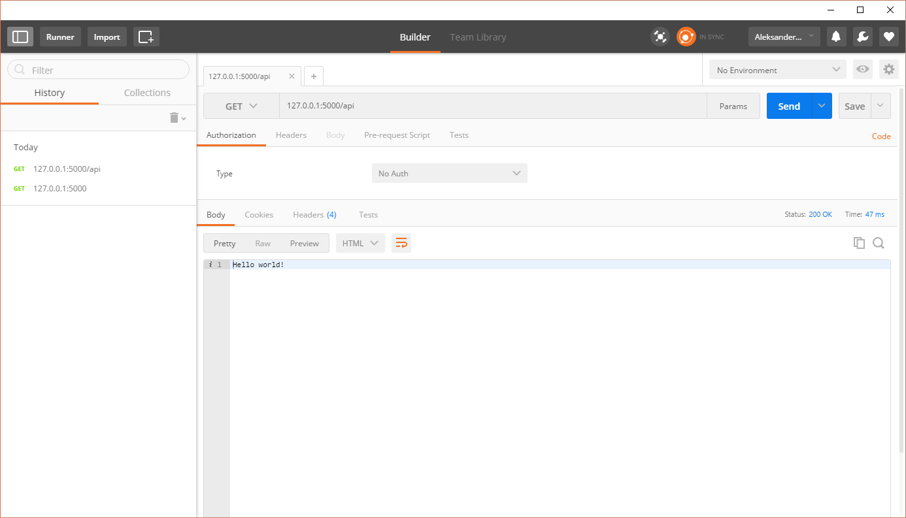

Tak jak już pisałem wcześniej teraz chcę się zająć częścią serwerową aplikacji. Będę to pisał w Pythonie przy pomocy frameworka Flask. Dlaczego Python? Ponieważ jest to jeden z najpopularniejszych języków programowania na świecie, którego można użyć do naprawdę wielu rzeczy między innymi machine learning, analiza danych, tworzenie modeli statystycznych, tworzenie API itd. Powoduje to, że jest to dość ciekawa propozycja do nauki. Zanim jeszcze przejdę do części właściwej wpisu muszę ostrzeć, że jestem kompletnie zielony w tym temacie i wszystko co tutaj napisałem powstało na bazie moich prób. Dlatego też będę wdzieczny za wszelkie porady dotyczące tego wpisu i także kolejnych.

## Stwórzmy sobie projekt

Jako, że jestem cały czas studentem to jako IDE do pracy z Pythonem wybrałem PyCharm od firmy JetBrains. Był to dla mnie naturalny wybór ponieważ dużo pracuję na produktach z tej firmy i jestem przyzwyczajony do pracy w ich środowisku. Jeśli jednak znacie inne programy w których wygodnie się pisze to podzielcie się nimi w komentarzu. Proces tworzenia nowego projektu w PyCharm jest prosty i ogranicza się do wybrania właściwych opcji

Na chwilę uwagi zasługuje opcja Interpreter która pozwala na zdefiniowanie interpretera dla  naszego projektu. Zdecydowałem się na opcję VirtualEnv co ( wedle tego co przeczytałem) pozwoli mi na izolację środowisk dla każdego projektu co dla mnie jest całkiem niezłą opcją bo mam zamiar trochę eksperymentować z Pythonem.

Po utworzeniu projektu jest stworzony jeden plik o takiej treści:

<pre class="lang:default decode:true">from flask importFlask

app=Flask(__name__)

@app.route('/')

    def hello_world():

        return'Hello world!'

if __name__ == '__main__':

app.run()

</pre>

Kod przedstawiony wyżej jest prosty i sprowadza się do tego, że mamy w systemie zdefiniowaną jedną ścieżkę i w momencie gdy na nią wejdziemy dostaniemy w odpowiedzi tekst &#8222;Hello World!&#8221;.

Teraz przy pomocy opcji Run w IDE możemy uruchomić nasz kod i wysłać zapytania do naszego świeżo stworzonego serwera.

## Jak to testować?

Zanim zaczniemy dodawać własny kod warto wiedzieć jak to testować. W przypadku tworzenia serwerów Api warto zaopatrzyć się w narzędzie, które pozwoli nam wysyłać dokładnie takie same zapytania jak nasza aplikacja. Ja korzystam z programu Postman który jest dostępny zarówno jako zwykła aplikacja jak i dodatek do chroma. Jest to prosty program, który daje naprawdę duże możliwości.

Mamy tutaj dostęp do pola w którym wpisujemy adres pod którym chodzi nasza aplikacja, następnie wybieramy jaką metodę chcemy użyć i klikamy Send. W polu poniżej widzimy co na dane zapytanie zwróci nam serwer API. No to sprawdźmy co zwróci nam nasz świeżo stworzony serwer.

Jak widać wszystko działa poprawnie. Jednak chciałbym żeby mój serwer był widziany pod ścieżką /api i dlatego zrobiłem pewne zmiany w kodzie:

<pre class="lang:default decode:true ">from flask import Flask, Blueprint

app = Flask(__name__)
app.debug = True

api = Blueprint('api',__name__)

@api.route('/')
def hello_world():
    return 'Hello world!'

app.register_blueprint(api,url_prefix="/api")
if __name__ == '__main__':
    app.run()
</pre>

Ważne jest to, że linijkę 13 musiałem umieścić po zdefiniowaniu ścieżki ponieważ w innym przypadku kod nie działał poprawnie. Na koniec trzeba przetestować czy po moich zmianach kod ciągle działa

  
Jak widać po zmianie ścieżki na /api dostaję prawidłową odpowiedź z serwera więc wygląda na to że wszystko działa. Kod będzie dostępny w innym repozytorium, które znajdziecie [tutaj][1]. Następnym krokiem będzie stworzenie odpowiednich kontrolerów które będą sterowały przepływem danych. Ale to już w następnym wpisie. Tak więc do usłyszenia wkrótce.

 [1]: https://github.com/Feridum/WorkTimetable-Backend