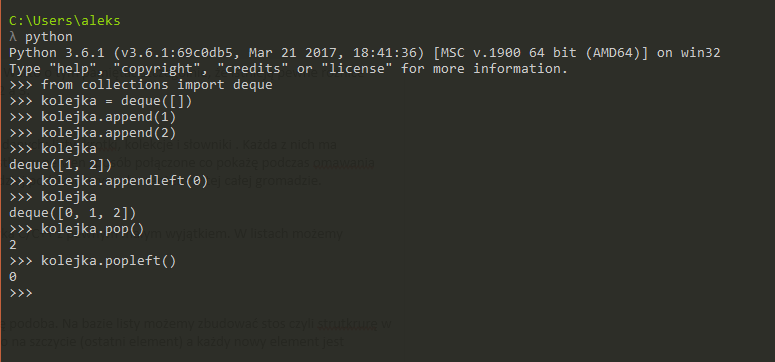
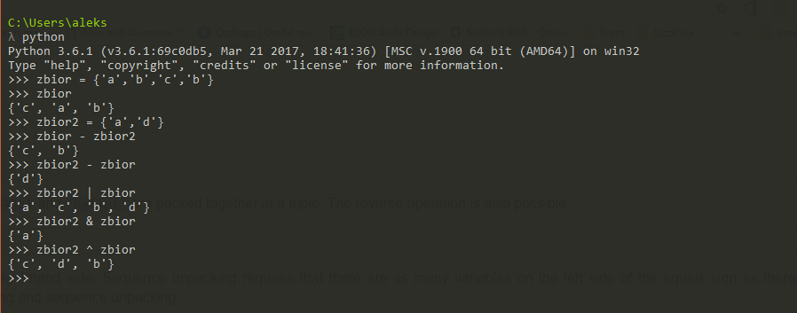

W związku z tym, że w poprzednim wpisie(jeśli go ominęliście to znajdziecie go [tutaj][1]) zacząłem budować serwer api w Pythonie to również był to początek mojej nauki tego języka. Dziś będzie krótko na temat wbudowanych struktur danych, których będę mógł użyć przy dalszej rozbudowanie serwera. Wpis będzie realizowany dla wersji 3.6.1 Pythona. Warto o tym pamiętać szczególnie, że istnieją pewne różnice pomiędzy wersjami Pythona a szczególnie pomiędzy wersją 2 a 3.

## Dostępne struktury danych

W Pythonie możemy wyróżnić 4 główne struktury danych: listy, krotki, zbiory i słowniki . Każda z nich ma odmienną budowę i zastosowania jednak są wszystkie w pewien sposób połączone co pokażę podczas omawiania każdej struktury. Zacznę od listy, która jest najbardziej podstawowym elementem w tej całej gromadzie.

####  Listy

Listy najbardziej przypominają tablice znane z języka C/C++ z pewnym małym wyjątkiem. W listach możemy przechowywać dane różnego typu np.:

Dzięki temu możemy tam wrzucać co tylko nam się podoba. Na bazie listy możemy zbudować stos czyli strukturę w której mamy dostęp tylko do elementy dostępnego na szczycie (ostatni element) a każdy nowy element jest dodawany na koniec listy.

Oprócz tego na bazie listy można stworzyć kolejkę jednak nie jest to najszybsze rozwiązanie. Jest to spowodowane tym że w kolejce elementy są dodawane na początek listy i trzeba przesuwać resztę elementów. Dlatego jeśli chcemy korzystać z kolejki i wprowadzać i pobierać dane z początku listy lepiej użyć collections.deque która została do tego stworzona.

&nbsp;

#### Krotki (tuples)

Krotka jest to specjalny rodzaj zmiennej, która pozwala na przechowywanie kilku wartości. Podobnie jak w listach wartości mogą być różnych typów. Jednak w przeciwieństwie do list wartości w krotce nie mogą być modyfikowane. Raz zdefiniowana krotka nie zmienia swojej wartości. Moża ich używac jako parametru funkcji lub jako zwracana wartość jeśli potrzebujemy zwrócić więcej niż jedną zmienną. 

Warto wspomnieć również o tym że możemy w prosty sposób rozłożyć krotkę na pojedyncze zmienne

#### Zbiory

W Pythonie zbiory są nieposortowaną kolekcją bez powtórzeń. Czyli są tak naprawdę dokładnie tym samym czym pojęcie zbioru w matematyce. Oznacza to, że można na nich wykonać dokładnie takie same operacje jak w matematyce czyli: suma, różnica, iloczyn i różnica symetryczna 

#### Słowniki

Będzie to ostatnia z wbudowanych struktur o jakim chcę wspomnieć w tym wpisie. Słownik jest specjalnym rodzajem zbioru, który składa się z par klucz:wartość, przy czym klucze muszą mieć wartości unikalne w słowniku. Ten typ jest w innych językach znany pod pojęciem tablicy asocjacyjnej.

&nbsp;

Krótko nie wyszło ale można by było jeszcze dłużej. Jak tylko pobawię się tym więcej i znajdę jakieś triki i ciekawe przykłady wykorzystania to wrócę do tego tematu i napiszę o tym więcej. Na dzisiaj to by było tyle. Zapraszam do komentowania, czytania innych wpisów i do usłyszenia w kolejnym poście.

 [1]: https://fsgeek.pl/2017/04/04/worktimetable-pora-na-api-w-pythonie/