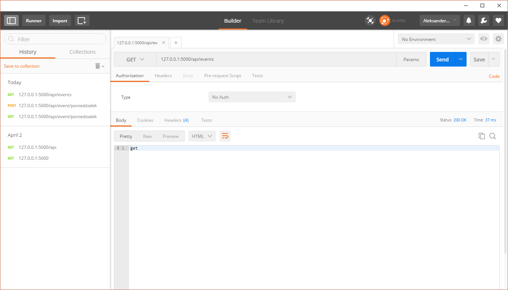
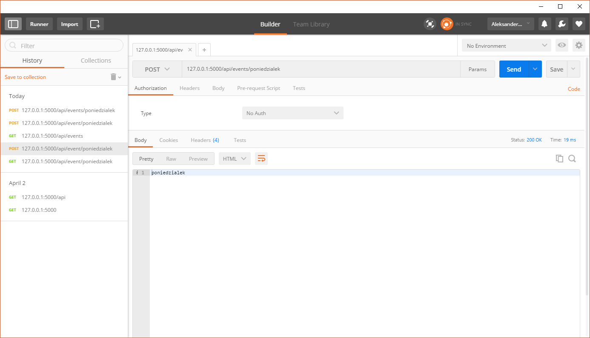
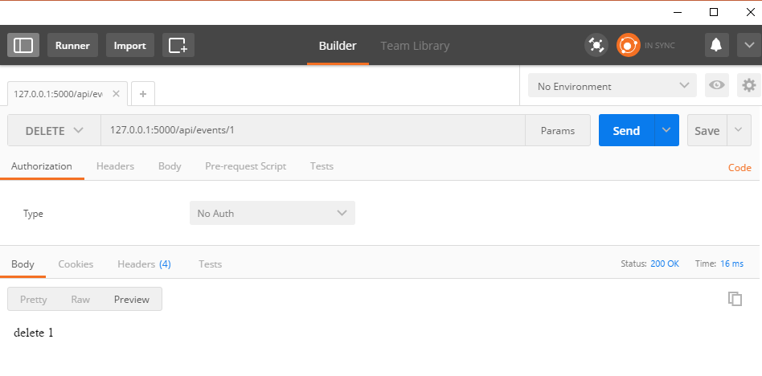
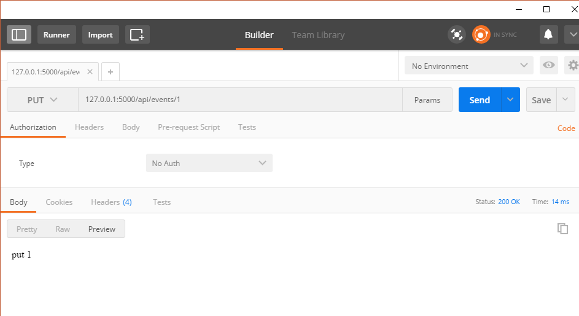
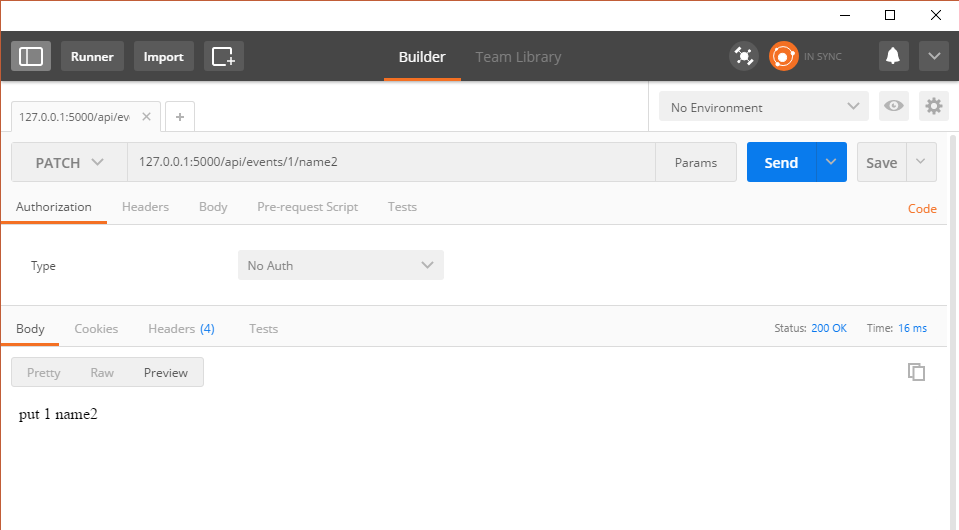

W ostatnim wpisie dotyczącym projektu stworzyłem podstawowy projekt w Pythonie. Jednak z jedną ścieżką wiele nie zdziałam więc czas na zdefiniowanie ścieżek. Cały mój kod możecie zobaczyć i ściągnąć [tutaj][1].

## Architektura REST

Ścieżki zwane również endpoint&#8217;ami będą punktami do których będziemy się odwoływać w aplikacji żeby  otrzymać lub dodać dane. W celu trzymania się pewnych standardów będę korzystał z architektury REST w której są dostępne 5 metody:

  * GET &#8211; pobranie rekordu lub rekordów
  * POST &#8211; dodanie nowego rekordu
  * PUT &#8211;  aktualizacja całego rekordu
  * PATCH &#8211; aktualizacja pojedynczego pola w rekordzie
  * DELETE &#8211; usunięcie pojedynczego rekordu lub rekordów

## Dodajmy własne ścieżki

Mając tą podstawową wiedzę można budować już ścieżki w Pythonie. Aby wszystko było w miarę ładnie poukładane to wstawię je do nowego pliku events.py w folderze routes. Pierwszą ścieżką będzie ta która pozwoli pobrać wszystkie rekordy.

<pre class="lang:default decode:true ">from flask import Blueprint

event = Blueprint('event', __name__)

@event.route('/')
def get_events():
    return 'get'</pre>

Żeby to wszystko działało musimy poinformować nasz serwer, że chcemy obsługiwać takie ścieżki. Robimy to dodając następującą linijkę do pliku api.py

<pre class="lang:default decode:true">from routes.events import event

app.register_blueprint(event,url_prefix="/api/events")</pre>

Od teraz ścieżki związane z wydarzeniami będą dostępne pod adresem <adres_serwera>:<port>/api/events

Tak jak mówiłem w poprzednim wpisie warto często testować nasze ścieżki w celu sprawdzenia czy wszystko działa.

## Czas na więcej

Teraz już nic nie stoi na przeszkodzie by dodać więcej ścieżek do naszego serwera tak aby wykorzystać wszystkie metody z architektury REST.  Póki co ścieżki zwracają sztywno ustawione wartości tylko po to by pokazać zasadę działania

<pre class="lang:python decode:true ">@event.route('/&lt;name&gt;', methods=['POST'])
def post_events(name):
    return name

@event.route('/&lt;int:id&gt;', methods=['PUT'])
def put_events(id):
    return 'put %d '% id

@event.route('/&lt;int:id&gt;', methods=['DELETE'])
def delete_events(id):
    return 'delete %d '% id

@event.route('/&lt;int:id&gt;/&lt;name2&gt;', methods=['PATCH'])
def patch_events(id,name2):
    return 'put %d %s' % (id,name2)</pre>

Na chwilę uwagi zasługują dwie kwestie. Pierwsza z nich to opcja methods podawana podczas definicji nowej ścieżki. Domyślnie każda nowa ścieżka odpowiada na zapytania GET więc jak chcemy korzystać z innych metod to musimy to jawnie zadeklarować.  Drugą rzeczą wartą spojrzenia jest sposób w jaki zwracam tekst. Korzystam tutaj ze sposobu formatowania znanego z języka C. W przypadku gdy chcemy w ten sposób wyświetlić wartość dwóch zmiennych musimy je umieścić w krotce co widać w ostatniej linii.

&nbsp;

Jak widać nie jest to ciężkie. Python pozwala bardzo szybko stworzyć podstawowy serwer API, który zwraca wartości, które chcemy. Nic nie stoi na przeszkodzie by teraz zamiast zwykłych tekstów zwracać JSONa.  Teraz będę chciał przepisać istniejący kod na Flask_RESTful na którego natknąłem się ostatnio. Potem będę się łączył z bazą danych i wtedy nasze ścieżki będą już w pełni funkcjonalne. Tak więc do usłyszenia wkrótce.

 [1]: https://github.com/Feridum/WorkTimetable-Backend