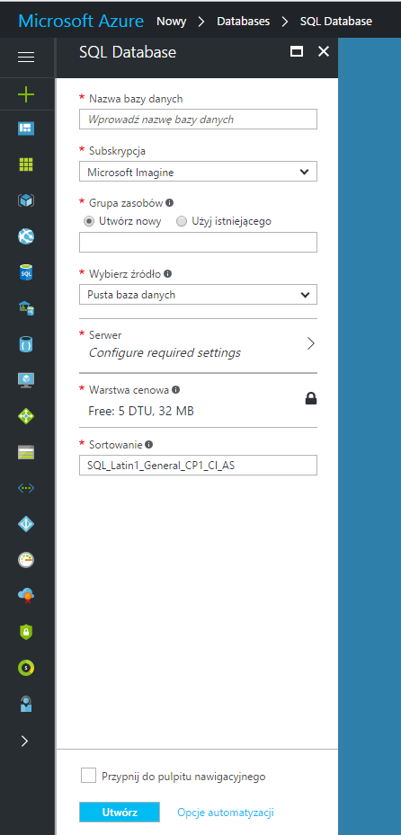
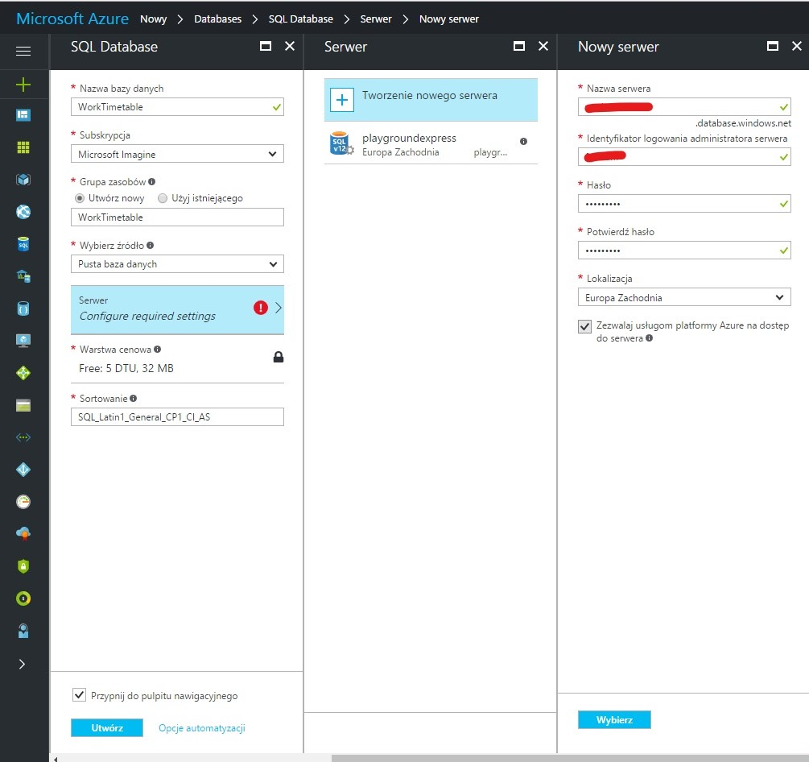
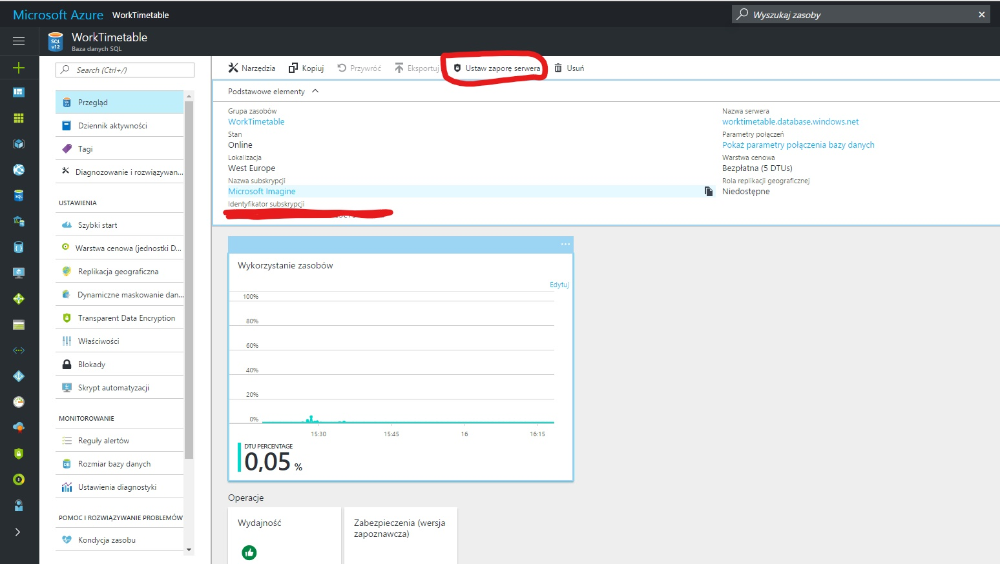
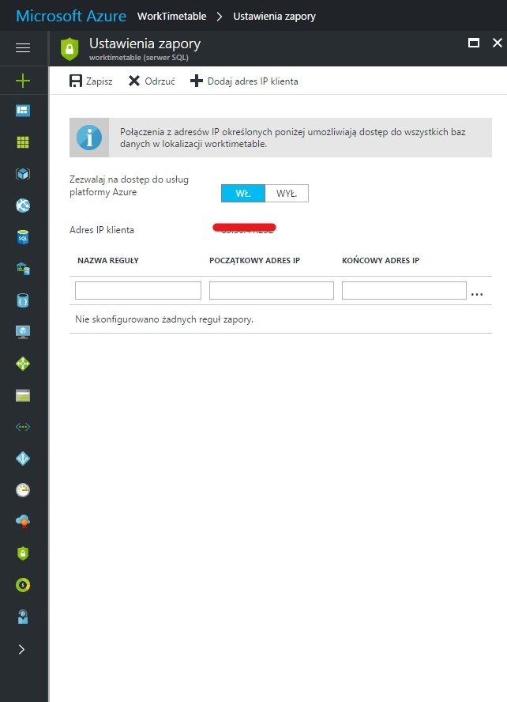
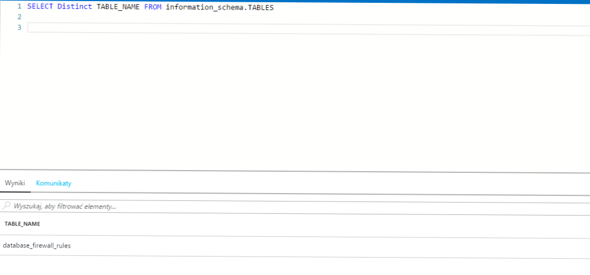
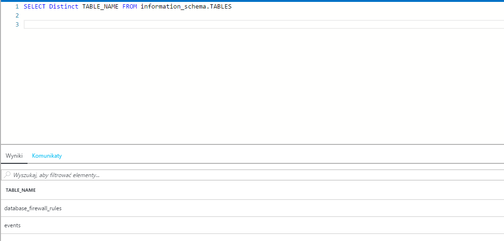
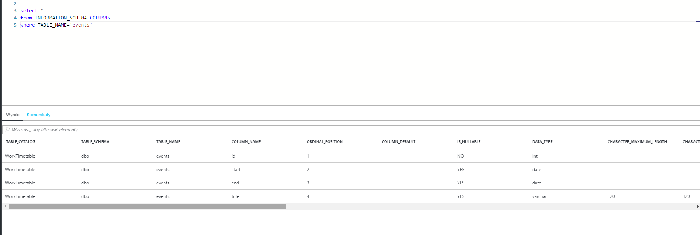

W ostatnim wpisie udało mi się stworzyć kontrolery do mojej aplikacji, które będą odpowiedzialne za dostarczanie danych. Jednak żeby to wszystko działało to trzeba te dane gdzieś trzymać i w jakiś sposób operować na nich.  Tak więc dziś krótki poradnik jak skonfigurować SQLAlchemy we Flasku, żeby działało na bazie danych SQL na Azure.

## Baza danych SQL w Azure

Zanim zaczniemy cokolwiek konfigurować to trzeba mieć bazę danych z którą będziemy się łączyć. Jako, że jestem studentem to mam dostęp do części funkcji Azure za darmo i jedną z nich jest baza danych SQL. Ale sposób tworzenia i konfiguracji powinien być identyczny także dla płatnych wersji. Tworzenie bazy danych jest proste i zaczyna się od wybrania odpowiedniej opcji w menu. Nas aktualnie insteresuje Databases-> Bazy danych SQL. Po wybraniu pokazuje się następujące okienko, które należy odpowiednio wypełnić.

Poniżej przedstawiam jak ja to wypełniłem:

To teraz jeszcze parę rzeczy nim przejdziemy do kodu. Pierwsza ważna rzecz trzeba dodać swój numer IP w Zaporze serwera. Opcję tą znajdziemy pod linkiem Ustaw zaporę serwera znajdującej się na górze strony zakładki Przegląd naszej bazy danych.

Teraz wystarczy, że klikniemy Dodaj adres IP klienta i wybierzemy opcję Zezwalaj na dostęp do usług platformy Azure. Dzięki temu będziemy mogli wykonywać operacje na bazie z poziomu kodu na naszym komputerze.

Następną rzeczą jaką jeszcze zrobię to sprawdzę jakimi tabelami dysponuję aktualnie. Aby to sprawdzić wchodzę w zakładce Przegląd do linka Narzędzia i wybieram Edytor zapytań. Następnie loguję się za pomocą danych jakie podałem przy tworzeniu bazy danych i w okienku konsoli najpierw wybieram swoją bazę danych a potem wpisuję komendę która wypisuje wszystkie stworzone tabele. Po wykonaniu pokazuje się następujący widok.

To znaczy, że mamy czystą bazę i możemy się teraz zająć kodem.

## Konfiguracja SQLAlchemy

Konfigurację SQLAlchemy zacząłem od zainstalowania odpowiednich bibliotek przy pomocy tego polecenia:

<pre class="lang:default decode:true">Pip install pyodbc flask_sqlalchemy</pre>

Następnie dodałem następującą wartość do konfiguracji aplikacji

<pre class="lang:default decode:true ">app.config['SQLALCHEMY_DATABASE_URI']='mssql+pyodbc://%s:%s@%s/%s?driver=SQL+Server'%(config['database']['user'],config['database']['password'],config['database']['server'],config['database']['database'])

</pre>

Zmienne potrzebne do połączenia trzymam w innym pliku, gdzie mam zamiar trzymać wszystkie takie rzeczy. Będzie to plik podobny do parameters.yml w symfony. Wygląda póki co nasepująco

<pre class="lang:default decode:true ">import configparser

config = configparser.ConfigParser()
config['database'] = {
    'user': 'username',
    'password': 'password',
    'server': 'serwer adress',
    'database': 'database name'
}
</pre>

Nie wiem czy jest to w pełni poprawny sposób ale taki znalazłem na StackOverflow i działa więc póki co zostawiłem ale jeśli znacie lepsze sposoby to będę wdzięczny za wskazówki. Na sam koniec zostało zainicjowanie SQLAlchemy za pomocą zmiennej app

<pre class="lang:default decode:true">db=SQLAlchemy(app)</pre>

Teraz za pomocą zmiennej db będę w stanie wykonywać operacje na bazie danych. Aby sprawdzić czy wszystko działa stworzyłem klasę, która będzie reprezentowała tabelę w bazie danych.

<pre class="lang:default decode:true">class Events(db.Model):
    id = db.Column(db.Integer, primary_key=True)
    start = db.Column(db.Date)
    end = db.Column(db.Date)
    title = db.Column(db.String(120))</pre>

Póki co jest to prosta tabela z 4 polami: data rozpoczęcia, zakończenia, tytuł i klucz podstawowy. To teraz już tylko zostało stworzenie tej tabeli w bazie danych. Aby to zrobić trzeba przejść do konsoli Pythona i wykonać parę kroków. Po pierwsze należy zaimportować plik w którym jest tabela którą chcemy stworzyć. Po drugie plik w którym mamy zdefiniowaną zmienną db. Mając to zrobione wystarczy uruchomić komendę

<pre class="theme:cisco-router lang:default decode:true">db.create_all()</pre>

Jeśli nie wystąpiły błędy to powinniśmy zobaczyć na Azure nową tabelę jak widać poniżej.

&nbsp;

&nbsp;

Nie powiem, że cały proces był łatwy ponieważ wszędzie czaiły się drobne rzeczy, które powodowały, że kod się nie wykonywał. Jednak było to warte wysiłku ponieważ teraz możemy w łatwy sposób operować na naszych danych. W następnym wpisie chciałbym poskładać ścieżki i bazę danych w jedną całość. Tak więc do usłyszenia w następnym wpisie