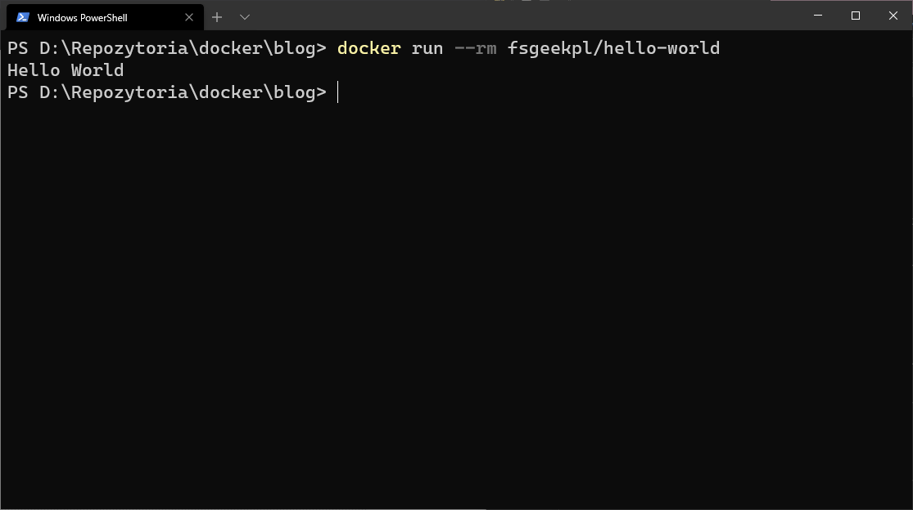
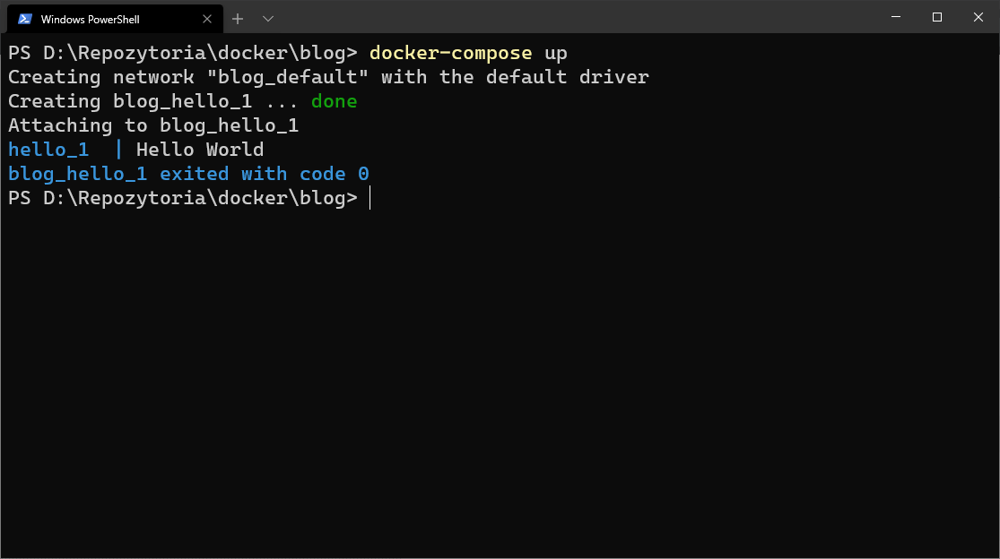

Docker zagościł się na dobre w programowaniu. I bez znaczenia czy go lubisz czy nie - trzeba go znać. Nawet jeśli jesteś frontend developerem i myślisz, że ciebie to nie dotyczy. W końcu trzeba uruchomić lokalnie backend, czasem trzeba coś naprawić na szybko, a nawet stworzyć własny obraz. 

<!--more-->

## Docker image vs docker container

Dwie najpopularniejsze nazwy, jakie usłyszysz podczas pracy z dockerem to `image` i `container`. Zacznijmy od `image`.  Obraz Dockerowy to zestaw warstw systemu plików oraz metadanych Dockera. Fajna definicja, ale co to znaczy? Każdy obraz definiuje mini system, na którym będziemy uruchamiać daną aplikację. Czyli na dole będziemy mieć jakiś system operacyjny np.: Ubuntu lub Alpine. Potem mamy warstwy konkretnie związane z naszą aplikacją np.: zainstalowany Node, PHP, baza danych itd. No i na samym końcu nasza aplikacja backendowa, wygenerowane pliki z frontendu itd. Tworzenie takiego obrazu jest podobne do stawiania serwera - instalujemy odpowiednie paczki, konfigurujemy je, kopiujemy pliki itd.

A czym jest w takim razie `container`? Niczym innym jak instancją obrazu. Spotkałem się z ciekawą analogią - obraz i kontener można porównać do klasy i obiektu z programowania obiektowego. Klasa definiuje, to co jest dostępne, ale operacje wykonujemy już na obiektach. Możesz oczywiście uruchomić wiele razy ten sam obraz i mieć dzięki temu wiele kontenerów(tak jak możesz stworzyć wiele instancji klasy). To jak uruchomić kontener?

## docker run

Podstawową komendą służąca do uruchomienia kontenera jest `docker run`.  Pobiera ona obraz (o ile nie mamy już go lokalnie) i tworzy z niego kontener. To, co będzie się po tym działo, zależy od tego, z jakim kontenerem mamy do czynienia. Może on wykonać tylko jedną operację i zakończyć działanie (ale nie będzie usunięty). Może też działać ciągle np.: backend naszej aplikacji lub baza danych. Polecenie wygląda następująco - `docker run <nazwa_obrazu>`. Możemy jeszcze dodać przełączniki do tego polecenia, ale ważne jest, by były one **przed nazwą obrazu.** Wszystko, co jest po nazwie obrazu, jest przekazywane do niego jako parametry. Jak może wyglądać uruchomienie przykładowego obrazu?

```yaml
docker run --rm fsgeekpl/hello-world
```



Polecenie to jest użyteczne, gdy musimy uruchomić jeden kontener, by wykonać jedną konkretną operacje i zakończyć działanie. Ale stawianie przy jego pomocy całej aplikacji jest zadaniem skomplikowanym. Dlatego tez istnieje coś takiego jak `docker-compose`.

## docker-compose

`docker-compose` jest komendą, która uruchamia kontenery na podstawie konfiguracji zapisanej w pliku `docker-compose.yaml`. W tym pliku definiujemy jakie obrazy, z jakimi parametrami chcemy uruchomić. Dzięki temu możemy automatyzować tworzenie całej aplikacji. Jest to szczególnie pomocne w momencie, gdy w naszej aplikacji korzystamy z wielu obrazów, wykorzystujemy sporo przełączników i mamy zależności między obrazami np.: obraz aplikacji musi czekać, aż baza danych wstanie. Dzięki temu nie musimy tworzyć 10 stronicowej instrukcji uruchamiania poszczególnych obrazów czy pisać ręcznie skryptów. Jak wygląda taki przykładowy plik?

```yaml
version: "3.9"
services:
  hello:
    image: fsgeekpl/hello-world
```



## Przydatne komendy

Mam również dla ciebie słowniczek podstawowych komend z Dockera, które pomogą ci zacząć przygodę z nim (póki nie będziesz ich znał na pamięć, dobrze mieć je pod ręką).

- `docker run <nazwa_obrazu>` - tworzy i uruchamia kontener
- `docker ps` (i przełącznik `-a`) -  wyświetla działające kontenery (z przełącznikiem `-a` również te zatrzymane)
- `docker stop <id_kontenera>` - zatrzymanie działania kontenera
- `docker rm <id_kontenera>` - usunięcie kontenera
- `docker-compose up` - tworzy i uruchamia kontenery
- `docker-compose down` - zatrzymuje i usuwa kontenery
- `docker-compose ps` (i przelącznik `-a`) - wyświetla działające kontenery (z przełącznikiem `-a` również te zatrzymane)

Oczywiście jest dużo więcej komend i przełączników, ale te są podstawowe i ich znajomość jest właściwie obowiązkowa.

## Zadanie domowe

Teoria jest fajna, ale bez praktyki niczego się nie nauczymy. Dlatego mam dla ciebie dwa proste zadanka, które pozwolą ci przyswoić to co przeczytałeś. Zadanka są krótkie - nie chcę zajmować ci całego popołudnia.

1. Uruchom dowolny obraz przy pomocy polecenia `docker run`. Możesz wykorzystać stworzony przeze mnie obraz (wyświetla w konsoli Hello World) - tutaj masz [link do obrazu fsgeekpl/hello-world](https://hub.docker.com/r/fsgeekpl/hello-world), który użyłem w tekście.
2. Uruchom ten sam obraz przy pomocy docker-compose. Postaraj się napisać plik `docker-compose.yml` samodzielnie.

Jeśli chcesz, podziel się wynikami na Instagramie (lub innym social media), oznacz mnie i powiedz, co myślisz o takiej formie pisania postów. Możesz też do mnie napisać na [kontakt@fsgeek.pl](mailto:kontakt@fsgeek.pl).