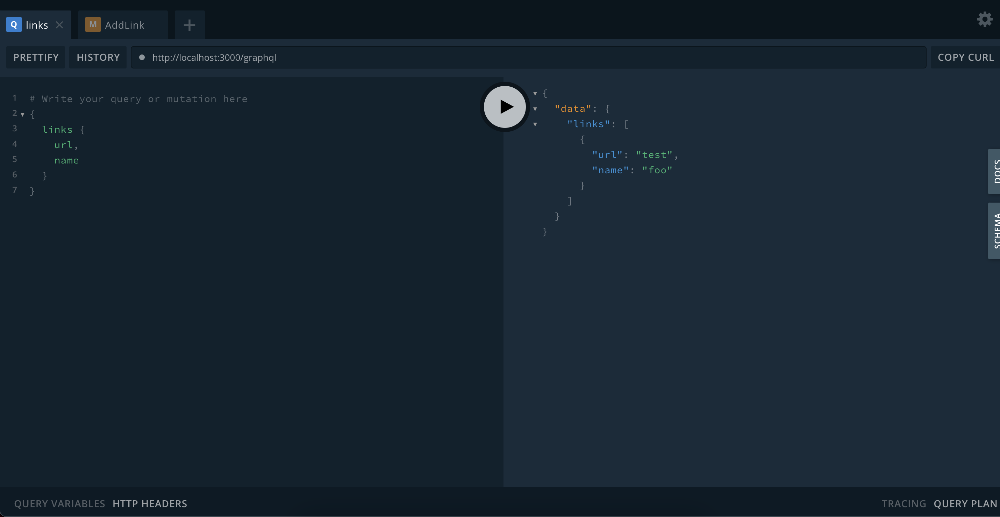
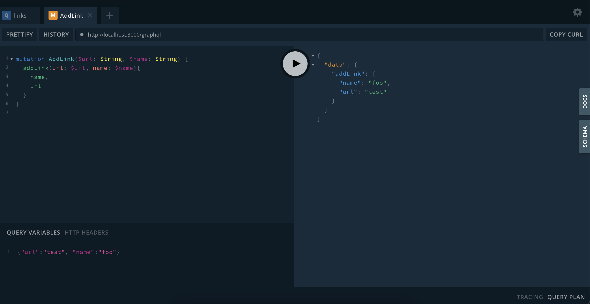

Graphql jest coraz popularniejszy i widzę go coraz częściej w rozwiązaniach produkcyjnych. Chyba jednym z najbardziej popularnych rozwiązań do implementacji tego rozwiązania na backendzie jest Apollo Server. Zaimplementowałem go w aplikacji napisanej w Fastify (klon Linktree).

<!--more-->

## Instalacja i konfiguracja Apollo Server

Standardowo, zanim będzie można cokolwiek zaimplementować, trzeba zainstalować biblioteki.

```jsx
npm install apollo-server-fastify@next-v3 graphql --save
```

Zwracam uwagę na wersję biblioteki, jaką wykorzystałem. Jest to wersja alpha, która jest zgodna z wersją 3 Fastify, którą wykorzystuję.

Teraz można zarejestrować bibliotekę w Fastify.

```jsx
import { ApolloServer } from 'apollo-server-fastify';

const server = new ApolloServer({ typeDefs, resolvers });
fastify.register(server.createHandler())
```

Jak widać, inicjalizuję Apollo Server przekazując dwa elementy: `typeDefs` i `resolvers`. Są to elementy, które muszę zaimplementować, by API działało.

## Apollo Server - Schema & Resolvers

Dwa najważniejsze elementy przy tworzeniu API Graphql są: 

- `schema` - jest to opis typów w naszym API wraz z dostępnymi Queries i Mutations
- `resolvers` - są to faktyczne funkcje, które będą wywoływane by obsłużyć zapytania od użytkownika

Całą pracę najlepiej zacząć od zdefiniowania Schemy - od niej będą zależały inne elementy. Dla klona Linktree potrzebuję następujące typy:

```jsx
import { gql } from 'apollo-server-fastify'

export const typeDefs = gql`
    type Link {
        url: String,
        name: String,
    }

    type Query {
        links: [Link]
    }

    type Mutation {
        addLink(url: String, name: String): Link
    }
`
```

Więcej o budowaniu schemy możesz przeczytać u mnie na blogu - [Budowanie schemy w GraphQL](https://fsgeek.pl/post/graphql-wlasne-typy/)

Resolvers powstają z typów `Query` i `Mutations`. Definiują one jakie operacje może wykonywać użytkownik. I trzeba je zaimplementować. `Query links` jest proste, bo będzie zwracać tylko nasze linki. Natomiast w `Mutation addLink` muszę wybrać zmienne przekazane w zapytaniu i utworzyć nowy link. Dodatkowo muszę zwrócić nowo utworzony link, ponieważ w typie zdefiniowałem, że taki link jest zwracany.

```jsx
const resolvers = {
  Query: {
    links: () => links,
  },
  Mutation: {
    addLink: async (_, { url, name }) => {
      links.push({ url, name });

      return { url, name }
    }
  }
};
```

Query i Mutation przyjmują w funkcji 4 argumenty: 

- `parent` - czyli wartość z poprzedniego resolvera
- `args` - przekazane argumenty
- `context` - globalny obiekt, wspólny dla wszystkich resolver'ów
- `info` - dodatkowe informacje o operacji

`Context` jest o tyle ciekawy, że możemy w nim przechowywać połączenie do bazy danych. Dzięki temu w każdej funkcji mamy dostęp do danych. Pozwala to również na zrobienie szybkiego mocka np.: na potrzeby testów. Jak to wygląda? Na sam początek przeniosłem operacje do osobnego pliku. 

```jsx
//db.mjs

const links = []

const addLink = (link)=>{
    links.push(link);
    return link;
};

const getLinks = ()=>links;

export const db = {
    links: {addLink, getLinks}
}
```

Następnie przy inicjalizacji naszego serwera musimy dodać pole `context`.

```jsx
import { db } from './db.mjs';

const server = new ApolloServer({
  typeDefs, 
	resolvers, 
	context: () => ({
    db,
  })
});
```

I wtedy mamy dostęp do tego w naszych funkcjach 

```jsx
const resolvers = {
  Query: {
    links: (_, args, {db}) => db.links.getLinks(),
  },
  Mutation: {
    addLink: async (_, { url, name }, {db}) => {
      return db.links.addLink({ url, name });
    }
  }
};
```

## Testowanie

Na sam koniec zostawiłem kwestię testowania. Najprościej testować api Graphql przy pomocy wbudowanego `Graphql Playground`. W Apollo Server uruchamia się on automatycznie pod adresem `http://localhost:3000/graphql` (jeśli masz aplikację uruchomioną na innym porcie to użyj swojego portu).

Query jest proste do zrobienia, ponieważ wystarczy podać nazwę interesującego nas query i pola, jakie chcemy pobrać.

```jsx
{
  links {
    url,
    name
  }
}
```



Mutacja jest minimalnie trudniejsza, ponieważ musimy przekazać wartości do zapytania.

```jsx
mutation AddLink($url: String, $name: String) {
  addLink(url: $url, name: $name){
    name,
    url
  }
}
```

Dane przekazujemy w okienku niżej - `Query variables`(zobacz na zdjęciu poniżej).



Co więcej, takie same Query i Mutation będziemy musieli zaimplementować na frontendzie, by pobrać dane. Ale to już w innym wpisie.

A ty co sądzisz o GraphQL? Miałeś okazję, już z tym pracować? Jak widzisz, kod stał się czytelniejszy i od razu mamy walidację danych. Ja jestem dużym zwolennikiem tego sposobu komunikacji i widzę wiele zalet.
