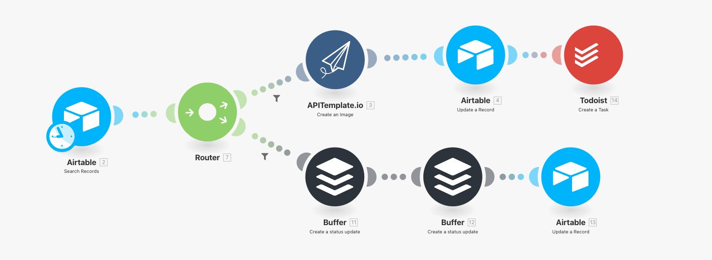
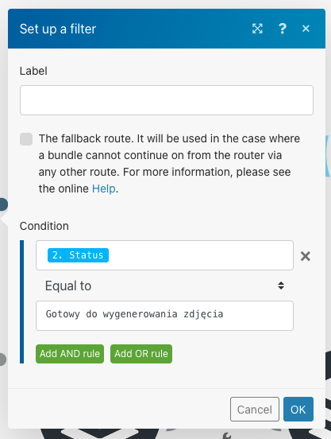
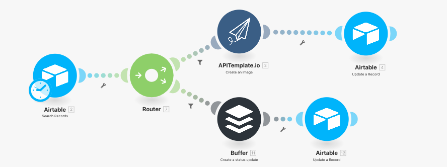
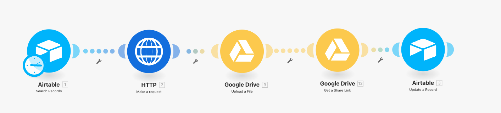
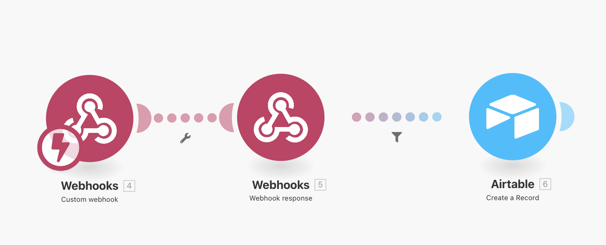
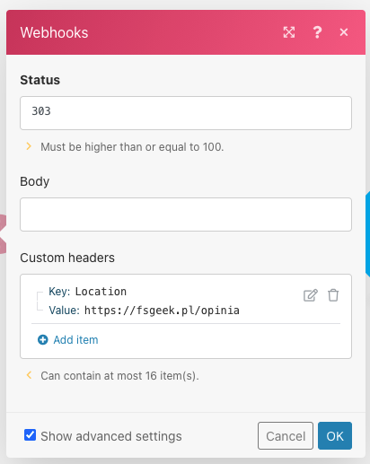

Automatyzacje są uzależniające. Zaczynasz od jednej, potem nagle masz kilka i ciągle rośnie. W tym poście opisuję swoje kolejne automatyzacje, które wprowadziłem ostatnio do swojego bloga.

<!--more-->

## Poprzednie automatyzacje

Jest to już drugi post o moich automatyzacjach na blogu. Jeśli interesujesz się tym tematem, to zerknij na poprzedni post  - [4 gotowe automatyzacje dla twojego bloga](https://fsgeek.pl/post/automatyzacje-dla-bloga-integromat-airtable/).

## Newsletter Social Media

To jest chyba automatyzacja, z której jestem najbardziej zadowolony. Pozwala mi na całkowitą automatyzację promocji mojego newslettera. Jak wygląda u mnie proces?

1. Zbieram linki w Airtable.

2. Z najnowszych linków wybieram w osobnym arkuszu te, które chcę umieścić w poście.

3. Tu wchodzi automatyzacja, która pobiera te tytuły, wysyła do APITemplate i zwraca gotowy obrazek.

4. Następnie muszę stworzyć opisy na Social Media - FB&Instagram oraz Twitter.

5. Wszystko jest automatycznie zaplanowane przy pomocy Buffer.

Dużą pomocą jest tutaj Router, który rozdziela zadania na podstawie filtru. 

Użyte elementy

- Airtable - do pobierania konfiguracji dla aktualnego postu
- Router - do rozdzielania zadań zależnie od statusu
- [APITemplate.io](http://apitemplate.io) - do tworzenia obrazków
- Buffer - do planowania postów
- Todoist - do tworzenia zadania by uzupełnić opis na SM

## Recenzje Social Media

Bardzo podobnym scenariuszem jest wypuszczanie recenzji książek na blogu. Znowu mam osobny arkusz, gdzie zbieram informacje o przeczytanych książkach. 

Co zbieram w Airtable?

- tytuł książki
- ocena
- link do okładki
- recenzja
- data publikacji

Pierwsze 3 elementy są potrzebne do wygenerowania obrazka do Social Media. W momencie, gdy jest już obrazek, recenzja i data publikacji to wszystko jest zaplanowane w Buffer. 

Użyte elementy

- Airtable - do pobierania konfiguracji dla reccenzji
- Router - do rozdzielania zadań zależnie od statusu
- [APITemplate.io](http://apitemplate.io) - do tworzenia obrazków
- Buffer - do planowania postów

## Code snippets

Ta automatyzacja pozwoliła mi zaoszczędzić sporo czasu przy generowaniu fragmentów kodu do newslettera. Wcześniej korzystałem z serwisu [carbon.now.sh](http://carbon.now.sh) - musiałem wybrać interesujący mnie fragment, przekopiować, wybrać swoje ustawienia i pobrać. 

W tym przypadku wykorzystuję Airtable do zbierania kawałków kodu i potem pozwalam, by wszystko się automatycznie wygenerowało i zostało umieszczone z powrotem w Airtable, gdzie mogę z tego korzystać. 

Mam tylko jeden problem z aktualnym scenariuszem - wygląda na to, że Airtable nie pozwala na uplaod plików przy pomocy API. Żeby dodać plik, trzeba dać URL do tego pliku. Więc code snippet jest wrzucany do Google Drive i z tego miejsca wrzucany do Airtable. Pracuję nad tym, by to jeszcze zoptymalizować. Jestem otwarty na Twój pomysł. 

Użyte elementy

- Airtable - do pobierania kawałków kodu
- HTTP - robię request do [https://carbonara.vercel.app/api/cook](https://carbonara.vercel.app/api/cook), która udostępnia API do łączenia się z wspomnianym serwisem carbon, tutaj znajdziesz więcej informacji [https://github.com/petersolopov/carbonara](https://github.com/petersolopov/carbonara)
- Google Drive - do uploadu obrazków po wygenerowaniu

## Ocena maili

To jest jedna z automatyzacji, która pozwala mi na śledzenie moich maili i wyciąganie wniosków. Zasada działania jest bardzo prosta. Chcę zbierać opinie o swoich mailach - czy się podobały czy też nie. Na podstawie tego będę w stanie je ulepszać. 

Aby to zrobić utworzyłem webhook'a - jest to specjalny link, który Integromat generuje. I teraz jak użytkownik wejdzie na ten link, to mogę uruchomić automatyzację. W mailach umieściłem link takiej postaci: `<webhook>/?ocena=x`. Wszystkie parametry są przekazywane do automatyzacji, więc jestem w stanie w Airtable zbierać te dane. 

Ważna jest też odpowiedź Webhooka. W moim przypadku przekierowuję na stronę z podziękowaniem na moim blogu. Niżej możesz zobaczyć jak to zrobić.

Ważna uwaga - w Mailerlite podczas wysyłki maila zaznaczam, że chcę dodać kampanię Google Analytics. Dzięki temu mam informacje o nazwie maila i nie muszę tego wprowadzać ręcznie przy każdym mailu. Sprawdź jak to wygląda u ciebie w systemie.

Użyte elementy: 

- Webhooks - do nasłuchiwania na wizyty i przekierowanie
- Filtr przed Airtable - wyfiltrowanie kliknięć bez danych z GA (filtry antyspamowe lubię klikać po linkach w mailu)
- Airtable - do zbierania informacji o ocenach
