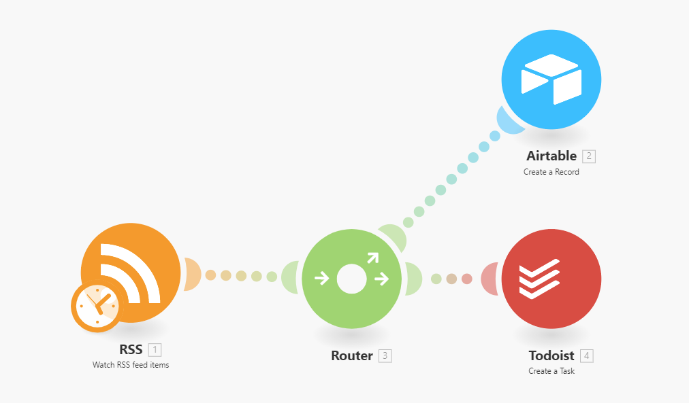
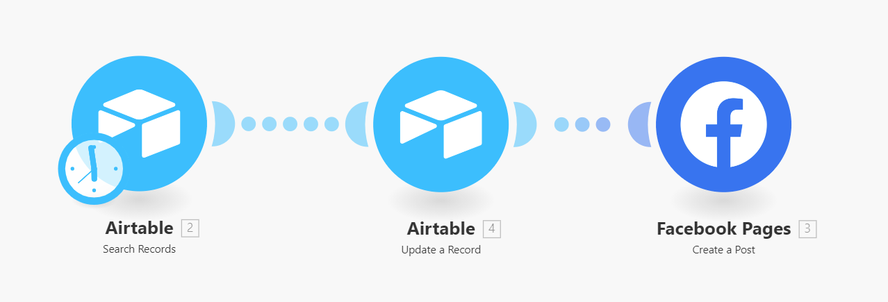
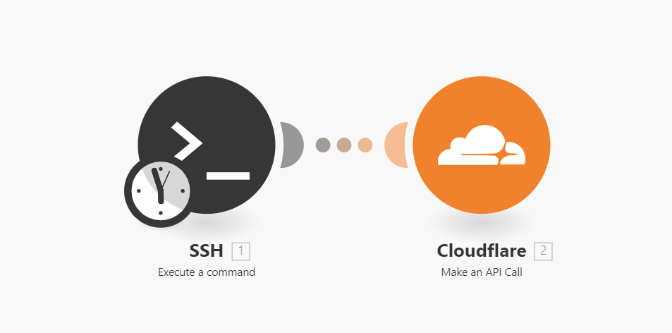
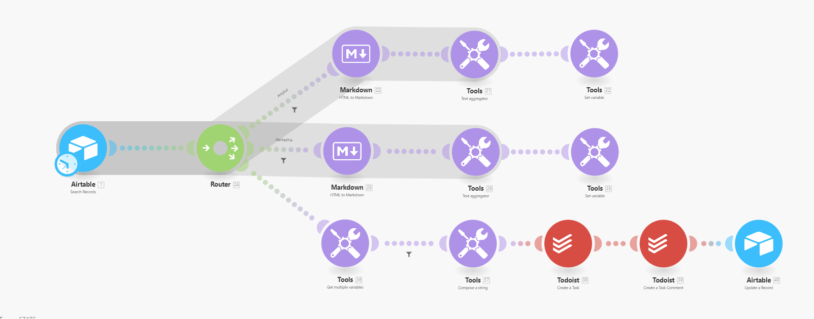

Bardzo lubię automatyzować nudne procesy. Dzięki temu, że robią się one automatycznie, jest to bezpieczniejsze, szybsze i oszczędza mi czas. Ostatnio bawię się automatyzacjami na moim blogu i postanowiłem je opisać. Co więcej - możesz je już dzisiaj zaimplementować na swoim blogu i zyskać więcej wolnego czasu.

<!--more-->

## Kiedy warto automatyzować?

Według mnie na pewno nie na początku. Warto najpierw przejść dany proces ręcznie. Dlaczego? Bo na samym początku proces może nie być doskonały lub możesz nawet nie znać go w całości. Dlatego warto najpierw testować najlepsze podejście, a potem jak będzie już wszystko działało to automatyzować. 

## Z jakich narzędzi korzystam?

Staram się korzystać z ograniczonej ilości narzędzi - im ich więcej tym trudniej nad nimi zapanować. Poniższy zestaw daje mi sporo możliwości: 

⚙️ [Integromat](https://www.integromat.com/?pc=fsgeek)  
⚙️ [Airtable](https://airtable.com/invite/r/lhBOyKr7) - do trzymania danych   
⚙️ Todoist - planowanie zadań

Najważniejszym z tych narzędzi jest Integromat - pozwala na połączenie tych wszystkich usług w jeden działający proces. Jaki procesy mam aktualnie zaimplementowane na blogu?

## Dodawanie nowych postów do Airtable

Na początek coś bardzo prostego. Ta automatyzacja nasłuchuje na RSS bloga i dodaje nowe rekordy do Airtable. Dzięki temu mam w tabeli zestaw wszystkich postów, które do tej pory wypuściłem. Oczywiście na początku musiałem puścić to dla wszystkich postów, ale teraz nasłuchuję już tylko na nowe.

**Po co:** Do aktualizacji danych w Airtable, do ponownego wykorzystania w przyszłości.

**Użyte elementy:**

- RSS - odpalany w konkretne dni, pobiera ostatni wpis
- Router - dzięki temu można kilka rzeczy robić równolegle
- Airtable - Tworzony jest nowy rekord w tabeli (wpis z RSS jest automatycznie parsowany, więc można wybrać np.: tytuł, url, itd)
- Todoist - zadanie by uzupełnić wpisy na social media

## Recykling starych postów

Skoro stworzyłem bazę wszystkich moich postów w Airtable, to wykorzystuję ją do tego, by dokonywać recyklingu treści. Co to znaczy recykling treści? Co piątek dodaję na Social Media jeden z moich poprzednich postów. A dokładniej to Integromat robi to za mnie - ja muszę tylko dodać opisy do postu.

**Po co:** Automatycznie mogę się dzielić wartościowymi postami, bez konieczności pamiętania o tym.

**Użyte elementy:** 

- Airtable - pobranie wpisu i aktualizacja statusu
- Facebook Pages - utworzenie nowego wpisu na FB z danych z Airtable

## Deploy nowej wersji strony

To coś, co oszczędzi mi mnóstwo pracy. Blog tworzę przy pomocy Gatsby, więc są generowane statyczne pliki. Pliki następnie pakuję do zip'a i wysyłam na serwer ftp (to muszę przenieść jeszcze do Github Actions). Następnie ten plik musi być rozpakowany do folderu, z którego serwowany jest html, a poprzednia wersja jest archiwizowana. Druga część procesu jest wykonywana teraz przy pomocy pliku *.sh, który jest wywoływany z Integromata.

**Po co:** Automatyczny deploy zmniejsza ryzyko, że o czymś zapomnę albo zrobię w złej kolejności (albo usunę zły katalog 😱).

**Użyte elementy:** 

- Ssh - łączę się po ssh i uruchamiam konkretny skrypt na serwerze, który wykonuje wszystkie potrzebne kroki
- Cloudflare - wywołuję czyszczenie cache, aby wszyscy mogli zobaczyć nową wersję strony

## Tworzenie nowego maila w newsletterze

Automatyzacja, z której jestem, na razie najbardziej zadowolony. Pozwala na pobieranie zbioru linków z Airtable i złożenie z tego pliku Markdown, który wam co tydzień wysyłam w newsletterze. Dzięki temu mogę się skupić na rzeczach istotnych (znajdowanie i opisywanie linków), a resztę robi automat. Ta automatyzacja jest już przygotowywana do automatycznego tworzenia maili - wystarczy dodać parę kroków po dodaniu zadania do Todoist. Nie mam tego zaimplementowanego, bo darmowa wersja Mailerlite na to nie pozwala. 

**Po co:** Automatyzacja oszczędza mi czas i pozwala na efektywaniejszą pracę.

**Użyte elementy:** 

- Airtable - pobieram wszystkie wpisy, które są gotowe
- Router by przetwarzać równolegle
- Markdown (HTML to Markdown) - tworzę szablon html z danymi z Airtable, które przekształcam do Markdown
- Tools (Text Aggregator) - łączę n osobnych markdown'ów w jeden duży
- Tools (Set variable) - zapisuję wynikowy markdown do zmiennej automatyzacji
- Tools (Get multiple variables) - pobieram zapisany markdown dla narzędzi i artykułów
- Tools (Compose a string) - łączę pobrane markdowny w jeden wynikowy
- Todoist - tworzę zadanie i wpisuję sobie jako komentarz wynikowy markdown

## Co dalej mam w planach

- Automatyczne dodawanie maili do archwium
- Napisanie prostej wtyczki do chrome'a do dodawania rekordów do airtable
- Automatyzacja kolejnych elementów
- Automatyzacja deploy'u z wykorzystaniem Github Actions

Zachęcam do spróbowania swoich sił w automatyzacji i stworzenie jakiegoś prostego scenariusza. Uwaga - to uzależnia. Po pierwszym scenariuszu człowiek chce robić więcej i więcej ;).