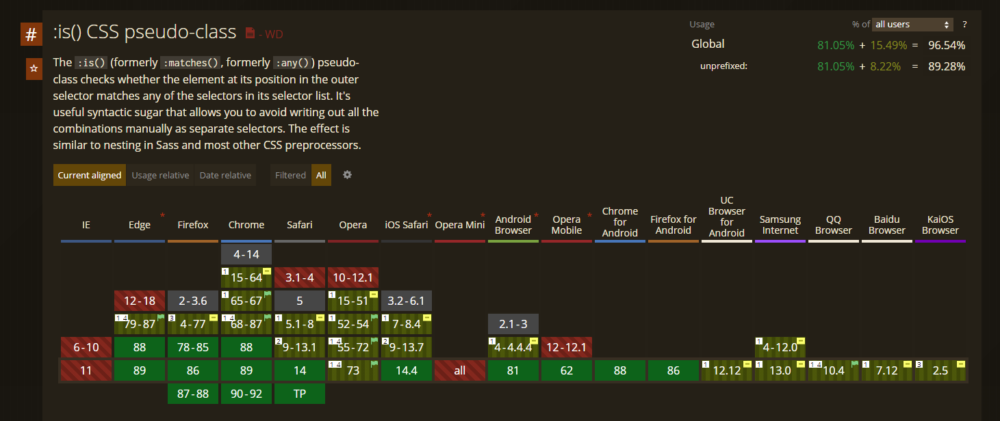

CSS rozwija się równie dobrze jak JS, ale dużo częściej pomijamy te nowości. A powoduje to, że często próbujemy rozwiązać problem, który już nie istnieje. Dlatego mam dla Ciebie opis ostatnich nowości, jakie pojawiły się w CSS.

<!--more-->

> Artykuł pisałem w marcu 2021 - zdjęcia dotyczące wsparcia dla funkcjonalności mogą być nieaktualne, jeśli czytasz to później.

## Aspect Ratio

`aspect-ratio` jest nową właściwością w CSS, która **pozwala na utrzymanie tzw.: aspect ratio w obrazkach i video**. Aspect ratio jest to stosunek szerokości do wysokości obrazu np.: obrazek 200x300 ma ratio 2:3. Najczęściej wykorzystywanym ratio jest 4:3 oraz 3:2 dla zdjęć i 16:9 dla filmów. Możesz zerknąć w swoje zdjęcia i pewnie będą w jednym z tych ratio. Do tej pory, żeby zachować ratio obrazków, trzeba było wspomagać się właściwością `padding-top`. A po co nam takie rozwiązanie? Na przykład, by stworzyć kontenery pod obrazki lub prawidłowo zaprojektować layout. Będzie to szczególnie istotne dla rezultatów Web Vitals, które zaczyna mierzyć CLS (Cumulative Layout Shift).


Jak wygląda wsparcie? Na razie tylko Chrome i Edge to wspierają, natomiast Firefox już nad tym pracuje.

## Content-Visibility i Contains-Intrinsic-Size

Nowość, którą trzeba koniecznie sprawdzić to właściwość content-visibility. Ustawiając `content-visibilty: auto`, informujemy przeglądarkę, że nie musi się przejmować renderowaniem elementów poza aktualnym viewport. W przypadku bardzo długich stron może to dawać potężne przyspieszenie ładowania strony. 

<blockquote class="twitter-tweet"><p lang="en" dir="ltr">CSS &quot;content-visibility:auto&quot; is amazing: skip rendering &amp; painting offscreen content until needed. I got a ~1s faster render on a long HTML document on desktop, ~3s on mobile.<a href="https://t.co/Q2X2xPVj6l">https://t.co/Q2X2xPVj6l</a> <a href="https://t.co/2FLggzsT9C">pic.twitter.com/2FLggzsT9C</a></p>&mdash; Addy Osmani (@addyosmani) <a href="https://twitter.com/addyosmani/status/1368479029683122180?ref_src=twsrc%5Etfw">March 7, 2021</a></blockquote> <script async src="https://platform.twitter.com/widgets.js" charset="utf-8"></script>

Dodatkowo do tej funkcjonalności mamy właściwość `contain-intrinsic-size`, która pozwala ustawić jaki rozmiar będzie mieć element, gdy zostanie załadowany.


## Układ masonry 

Układ masonry jest dosyć popularny (jest obecny między innymi w stronie Pinterest). Układ ten charakteryzuje się ułożeniem obrazków o różnych rozmiarach tak, aby nie było między nim przerw. Przypomina to układanie kamiennego muru - każdy kamień ma inny kształ i rozmiar, a nie chcemy by w murze były dziury. Do tej pory mogliśmy korzystać z biblioteki [https://masonry.desandro.com/](https://masonry.desandro.com/). Teraz będziemy mogli zrobić to natywnie z wykorzystaniem CSS Grid i właściwości `grid-template-rows: masonry;`


Niestety przyjdzie nam jeszcze poczekać na tę funkcjonalność. Mam nadzieję, że nie za długo.

## :is()

`:is`jest nową pseudoklasą dostępną w arkuszach CSS. Bierze selektory podane jako argumenty psudoklasy i aplikuje style do każdego z nich. Najprościej pokazać to na przykładzie.  Załóżmy ze mamy takie style

```jsx
h1 a:hover,
h2 a:hover,
h3 a:hover {
	background-color: red
}
```

Z nową psudoklasą `:is()`, można to zapisać w następujący sposób.

```jsx
:is(h1,h2,h3) a:hover{
	background-color: red
}
```



Dodatkowo wsparcie wygląda naprawdę dobrze i warto korzystać z tego już dzisiaj.

## Text Decoration

Dostaliśmy też nowe właściwości z grupy `text-decoration`.

 ✅ `text-decoration-thickness`  
 ✅ `text-underline-offset`  
 ✅ `text-decoration-skip`  

Pełny opis właściwości można przeczytać w [specyfikacji Text Decoration Level 4](https://drafts.csswg.org/css-text-decor-4). Wykorzystując te nowe właściwości, można stworzyć dużo bardziej zaawansowane dekoracje do tekstu np.: grubsze podkreślenia czy zakreślenie tekstu. A co ze wsparciem?


Poza `text-decoration-skip` wsparcie jest całkiem przyzwoite. Ciekawe, że dla tej własności wsparcie zostało cofnięte z Chrome'a.

## Scroll Margin

Niewielka, ale bardzo przydatna właściwość. Aktualnie przy tzw.: anchor-link gdzie zawartość strony jest przewijana, aż do określonej kotwicy to przewijanie kończy się, gdy element kotwicy znajduje się na górze ekranu. **Z wykorzystaniem tej właściwości możemy określić górny margines, jaki ma być zachowany podczas takiego przewijania.**

```jsx
[id]: {
	scroll-margin-top: 100px,
}
```


A może ty coś znalazłeś ostatnio jakąś nowość w CSS? Jeśli tak to koniecznie się pochwal.