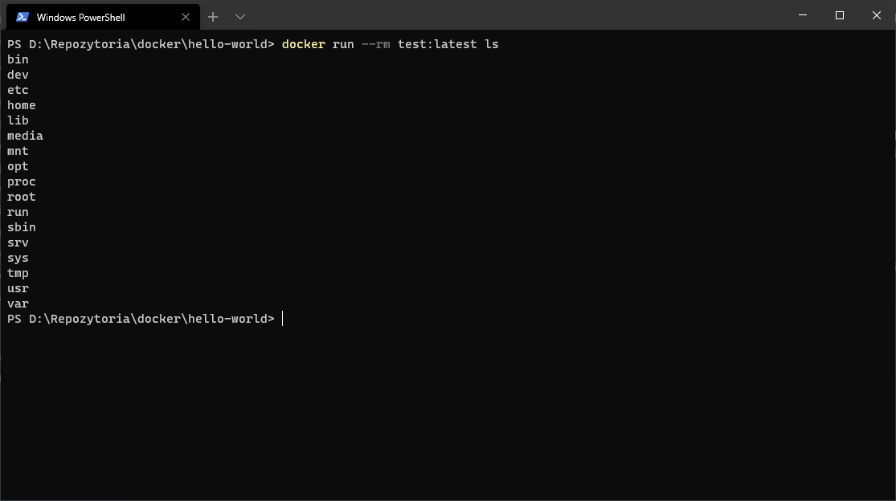
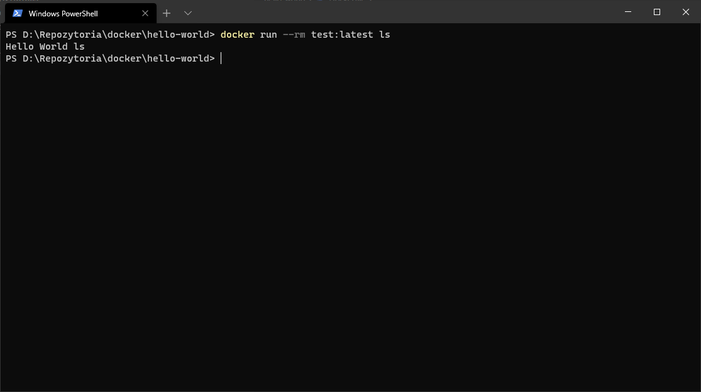
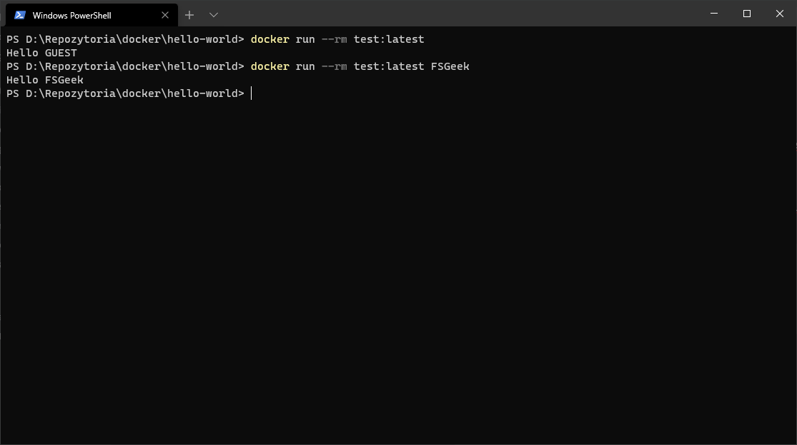

Przy tworzeniu własnej aplikacji bardzo często będziemy musieli tworzyć obrazy Dockera dla nich. Ale nie patrz na gotowe repozytoria jak to zrobić. Ja ci pokaże, jak można zbudować swój pierwszy obraz w 10 minut.

<!--more-->

## Dockerfile

Przy budowaniu obrazów Dockera najważniejszy jest tajemniczy plik `Dockerfile`. Zawiera on instrukcje, krok po kroku, jak będzie budowany obraz. Najprościej będzie to porównać do własnoręcznego stawiania serwera - instalujemy poszczególne elementy, konfigurujemy je, uruchamiamy i .... wracamy do początku ;). Na szczęście przy Dockerze szansa, że coś zepsujemy, jest naprawdę mała. Jak wygląda struktura takiego pliku? Wspólny element to będzie pobranie bazowego obrazu (`FROM`) i uruchomienie dowolnej komendy na nim (`CMD` lub `ENTRYPOINT`). Pomiędzy tymi dwoma elementami może być dużo innych elementów.

## Czym jest bazowy obraz?

To, że w Dockerze budujemy nasze obrazy, nie znaczy, że zawsze musimy startować od 0. Bazowy obraz to jest punkt startowy, od którego zaczynamy instalować kolejne biblioteki. Przykładem takiego obrazu startowego może być ubuntu, alpine(bardzo lekka dystrybucja Linuxa) czy dowolna inna dystrybucja Linux'a. Ale może to już być nawet obraz z Node'a gdzie oprócz czystego Linux'a jest zainstalowana i skonfigurowana konkretna wersja Node'a. W takim przypadku nie musimy już nic instalować dodatkowo tylko skopiować pliki i ruszyć naszą aplikację. No i oczywiście to może być jakiś twój poprzedni obraz, który teraz rozbudujesz.

## Twój pierwszy obraz

No to zbudujmy pierwszy obraz. Tak jak wspomniałem, potrzebny jest plik `Dockerfile`. Następnie w tym pliku umieścimy taką zawartość.

```docker
FROM alpine:3.12
CMD ["echo", "Hello World"]
```

Co tu się dzieje? Bazujemy na obrazie alpine i wykorzystując polecenie echo, wyświetlamy Hello World. Po tym wszystkim działanie kontenera się zakończy.

Teraz musimy na podstawie powyższej konfiguracji zbudować gotowy obraz. Służy do tego polecenie `docker build`

```docker
docker build -t test:latest .
```

Polecenie buduje obraz, któremu nadajemy nazwę i tag (przełącznik `-t` w formacie nazwa:tag). Na samym końcu musimy podać ścieżkę do pliku Dockerfile (jeśli plik znajduje się w tym samym katalogu, to wystarczy dać `.` tak jak w przykładzie)

Jeśli wszystko zostało zrobione poprawnie, to po uruchomieniu polecenia `docker images` powinniśmy zobaczyć nasz obraz. To jak uruchomić obraz wiesz po poprzednim poście (a jeśli nie to [wróć do postu o podstawach dockera](https://fsgeek.pl/post/docker-podstawowe-pojecia-komendy/))

## CMD vs ENTRYPOINT

Na sam koniec coś bardziej zaawansowanego - różnica pomiędzy `CMD` a `ENTRYPOINT`. Obydwa wywołają polecenie w naszym kontenerze, ale diabeł tkwi w szczegółach. 

> Polecenie CMD da się nadpisać podczas uruchamiania obrazu

Zrób szybki eksperyment - uruchomcie poprzednio zbudowany obraz takim poleceniem

```docker
docker run --rm test:latest ls
```



Teraz jak widać w naszym kontenerze, nie jest wywoływane polecenie `echo` tylko `ls`.  `ENTRYPOINT` działa inaczej.

> ENTRYPOINT nie da się nadpisać podczas uruchamiania (bez dodatkowych przełączników)

Można nadpisać przełącznikiem `--entrypoint` ale jest to przypadek szczególny. Znowu zrób eksperyment - zbuduj obraz tylko zastąp linijkę z `CMD ["echo", "Hello World"]` linijką `ENTRYPOINT ["echo", "Hello World"]` i uruchom poniższe polecenie.

```docker
docker run --rm test:latest ls
```



Teraz jak widzisz, nie nadpisaliśmy polecenia, ale dopisaliśmy jako kolejny argument do już zdefiniowanego. 

Najlepsze efekty możemy osiągnąć, wykorzystując oba polecenia. Zbuduj następujący obraz.

```docker
FROM alpine:3.12
ENTRYPOINT ["echo", "Hello"]
CMD ["GUEST"]
```

I uruchom dwa polecenia.

```docker
docker run --rm test:latest 
docker run --rm test:latest <twoje imie>
```

Zobaczysz coś takiego



Jak widać, teraz `CMD` definiuje nam domyślne argumenty, kiedy odpalimy obraz bez żadnych parametrów. W momencie, kiedy przekażemy własny parametr, to parametr z `CMD` zostanie zignorowany.

## Zadanie domowe

Zadanie domowe na dzisiaj jest proste. Zbuduj swój pierwszy obraz i pobaw się poleceniami CMD i ENTRYPOINT. Zobacz sobie, jak to działa i zapamiętaj różnicę pomiędzy `CMD` a `ENTRYPOINT` (jest to też popularne pytanie na rekrutacji). Jako zadanie napisz obraz, który wyświetli ci listę katalogów z lokalizacji podanej podczas uruchamiania. Jeśli nic nie zostało przekazane, niech pokazuje główny katalog (`/`).