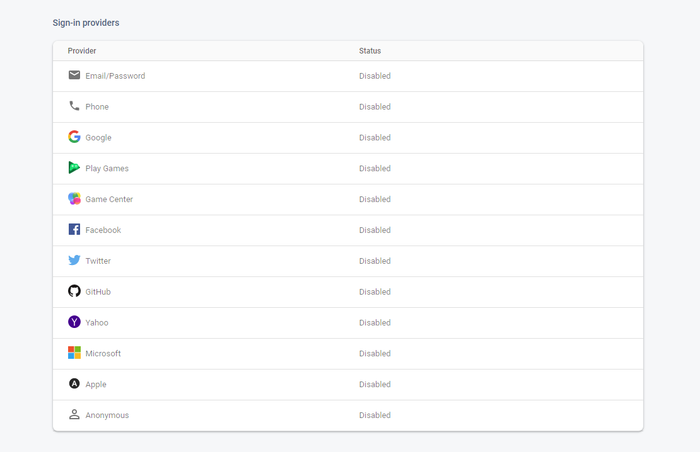
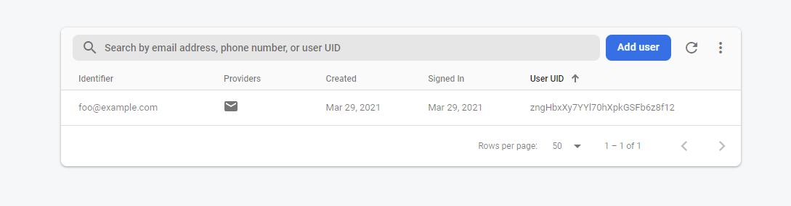

Bezpieczeństwo aplikacji webowych to ważny temat. Nie chcemy w końcu, by dowolna osoba miała uprawnienia administratora. W 90% przypadków w naszej aplikacji potrzebujemy mechanizmu autoryzacji i uwierzytelniania. Możemy do tego celu wykorzystać Firebase Authentication.

<!--more-->

## Autoryzacja vs uwierzytelnienie

Te pojęcia lubią się mylić - dlatego najpierw szybka powtórka.

- Uwierzytelnienie - potwierdzenie swojej tożsamości
- Autoryzacja - potwierdzenie dostępu do konkretnych informacji

I szybki przykład: Użytkownik może być uwierzytelniony w systemie i z niego korzystać, ale jeśli nie ma roli admina, to nie przejdzie autoryzacji, by móc np.: obejrzeć logi z systemu.

## Metody uwierzytelniania w Firebase Authentication

Główną zaletą Fireabse Authentication jest dostęp do wielu metod uwierzytelniania. Wśród najczęściej wykorzystywanych znajdziemy:

- email + password
- Google
- Facebook

Dzięki temu, że są już one zaimplementowane w Firebase, to zyskujemy wiele możliwości. Po pierwsze nie musimy się przejmować poprawną implementacją lub aktualizacją biblioteki. Po drugie możemy zawsze dołożyć kolejną metodę logowania i nie będzie to skomplikowane (o ile zaimplementujemy to poprawnie).

## Konfiguracja Firebase Authentication

Zanim będziemy mogli zrobić coś w kodzie, to musimy wejść do panelu Firebase i aktywować nasze metody uwierzytelniania. Najprościej zacząć od zwykłej kombinacji email + password.



Rzecz, której mi brakuje to możliwość zdefiniowania własnej polityki co do hasła. Jedyna walidacja, jaka występuje to długość hasła - musi być min 6 znaków. Jeśli chcemy mieć bardziej restrykcyjne zasady, to musimy zrobić to samodzielnie w kodzie FE lub (lepiej) na backendzie.

Mając aktywną tę metodę, możemy przejść do kodu.

## Firebase Authentication w kodzie

W kodzie będziemy wykonywać 3 główne operacje:

- rejestracja nowych użytkowników
- logowanie użytkowników
- wylogowywanie

I do każdej z tych operacji mamy osobną metodę. Najpierw rejestracja:

```jsx
const result = await firebase.auth().createUserWithEmailAndPassword(email, password)

return result.user;
```

Po rejestracji użytkownik jest już uwierzytelniony i może np.: uzyskać dostęp nowych widoków. To samo możemy uzyskać poprzez logowanie.

```jsx
const result = await firebase.auth().signInWithEmailAndPassword(email, password);

return result.user;
```

No i najprostsze na koniec - wylogowanie

```jsx
const res = await firebase.auth().signOut();
```

Warto też jeszcze w tym miejscu zobaczyć co widzimy z poziomu admina. A właściwie czego nie widać. **Nie widzimy hasła użytkownika.** I jest to bardzo dobra wiadomość.



Na koniec zostaje jeszcze wykorzystać mechanizm uwierzytelniania, by zabezpieczyć dane. 

## Zabezpieczanie danych dla zalogowanych użytkowników.

Uwierzytelnianie wprowadzamy, by chronić część danych. Aby to zrobić trzeba skorzystać z tzw.: `Security Rules`. Decydują one czy będziemy w stanie wykonać operację na danych. Security Rules są dosyć rozbudowane i pozwalają na tworzenie zaawansowanych polityk. Poniżej jest tylko prosty przykład, jak można to wykorzystać.

```jsx
allow read: if true;
allow write: if request.auth != null;
```

W tej polityce na odczyt danych zezwalamy wszystkim - odczyt jest publiczny. Natomiast zapis, czyli tworzenie i edycja danych będzie już dostępny tylko dla zalogowanych użytkowników. Co się stanie, gdy spróbujemy sami coś zapisać? Dostaniemy poniższy błąd.

```jsx
FirebaseError: Missing or insufficient permissions.
```