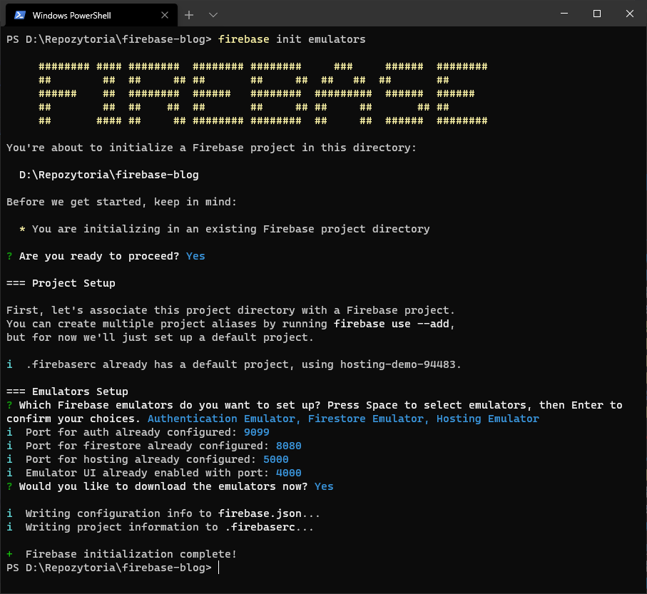
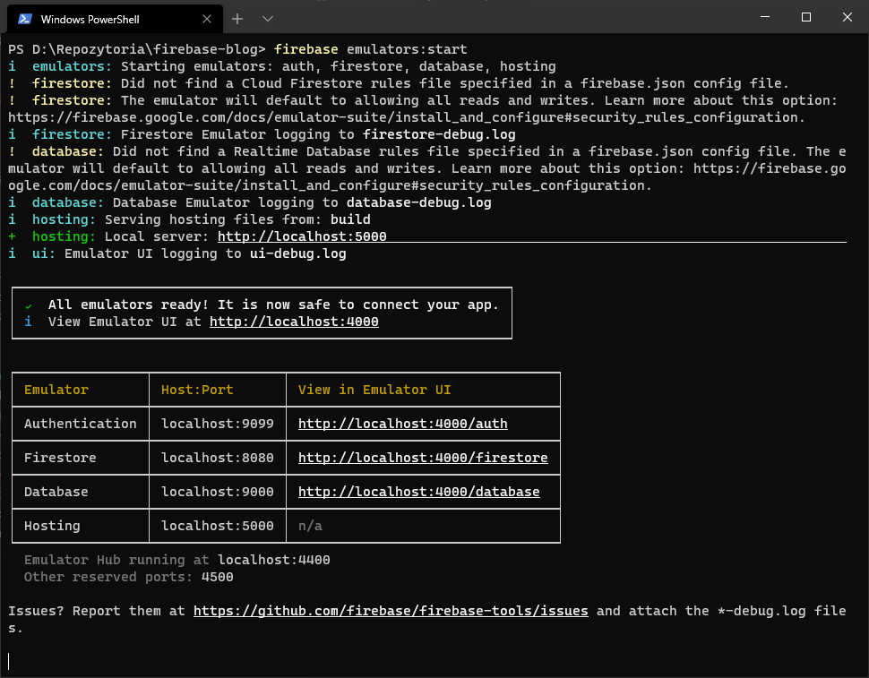
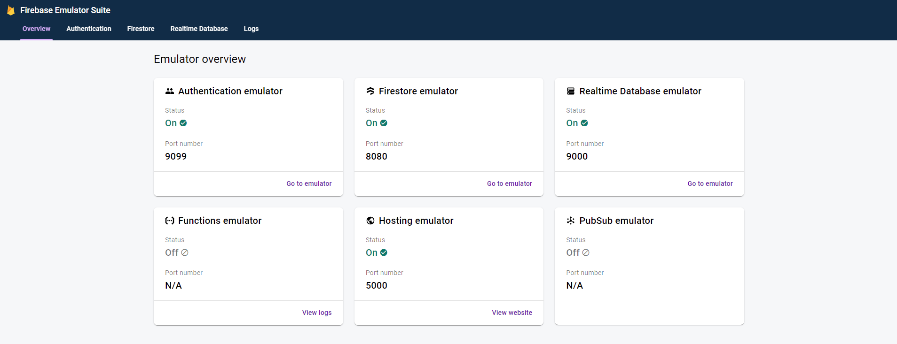

Jedną z przeszkód przy nauce firebase'a może być strach przed kosztami. Strach przed tym, że zrobimy jakąś głupotę i zapłacimy majątek, może być blokujący. Pokażę ci, jak można to zrobić w 100% bezpiecznie i za darmo.

<!--more-->

## Local Emulator Suite

Rozwiązaniem tego problemu jest wykorzystanie emulatora. Narzędzie tego typu pozwala na bezpieczną zabawę i naukę. Dostajemy środowisko testowe, które pozwala na przetestowanie funkcjonalności. Co więcej, można to wykorzystać podczas developmentu, by na spokojnie opracować optymalną strukturę. 

Oczywiście nie mamy dostępu do wszystkich funkcjonalności. Z czego możemy skorzystać:

✅ Authentication  
✅ Function  
✅ Firestore  
✅ Database  
✅ Hosting  
✅ Pub/sub  

Możemy również wykorzystać tę funkcjonalność przy testach. Szczególnie przy integracyjnych będzie miało to dla nas duże znaczenie. Mamy wtedy możliwość przetestować całe flow, ale jesteśmy zabezpieczeni przed błędami.

## Korzystanie z Local Emulator Suite

Do zainstalowania `Local Emulator Suite` potrzebujemy tylko Firebase CLI i polecenia `firebase init emulators`. Zostaniemy wtedy zapytani o parę ustawień, między innymi co chcemy emulować oraz czy chcemy dashboard dla emulatora (i tak - chcemy).



Jak sprawdzimy teraz plik konfiguracyjny to zobaczymy nowe wartości. 

```js
"emulators": {
    "auth": {
      "port": 9099
    },
    "firestore": {
      "port": 8080
    },
    "database": {
      "port": 9000
    },
    "hosting": {
      "port": 5000
    },
    "ui": {
      "enabled": true,
      "port": 4000
    }
  }
```

Możemy ustawiać porty dla każdej aplikacji. Najciekawszy w tym momencie będzie panel dashboard. Znajdziemy tam uproszczoną wersję, tego co jest w panelu Firebase dla projektu. Dzięki temu można zobaczyć, co się dzieje w naszym projekcie.

Teraz trzeba uruchomić emulator. Wykorzystam do tego polecenie `firebase emulators:start`



I teraz możemy wejsć na adres [http://localhost:4000/](http://localhost:4000/) by zobaczyć panel emulatora



## Hosting

W ostatnim poście pokazywałem, jak można wykorzystać Firebase jako hosting dla naszej aplikacji. Hosting też jest jednym z elementów emulatora i wystarczy, że wejdziemy na adres [http://localhost:5000/](http://localhost:5000/), by testować naszą aplikację (jeśli masz ustawiony inny port, to musisz samodzielnie wpisać adres). 

A jak wygląda sytuacja dla pozostałych funkcjonalności? Możesz sprawdzić sam w dokumentacji albo dopisać się do mojego newslettera, gdzie będę to dokładnie opisywał ;)