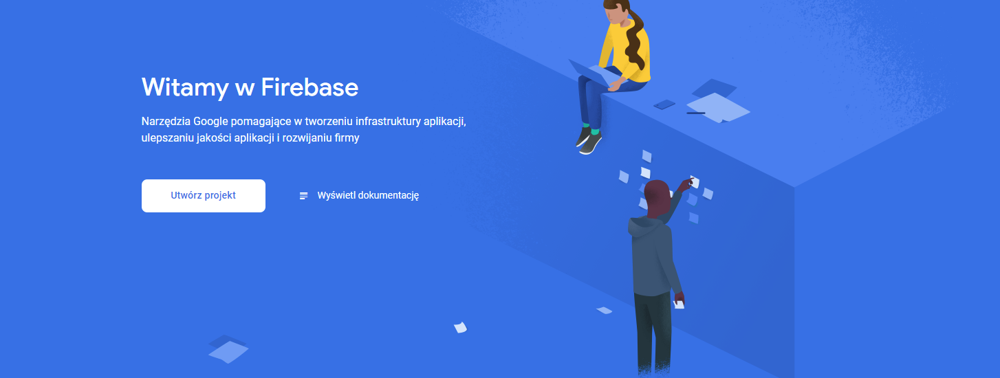
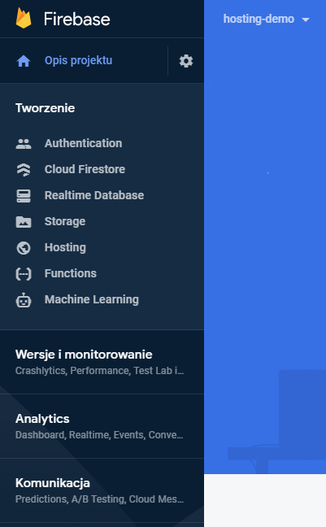
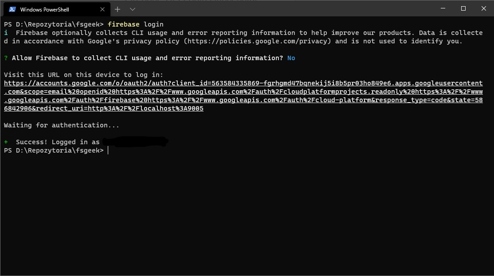
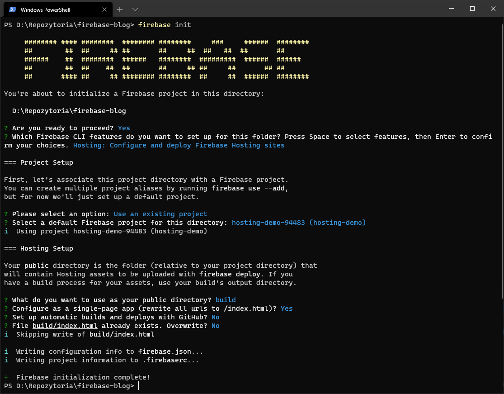
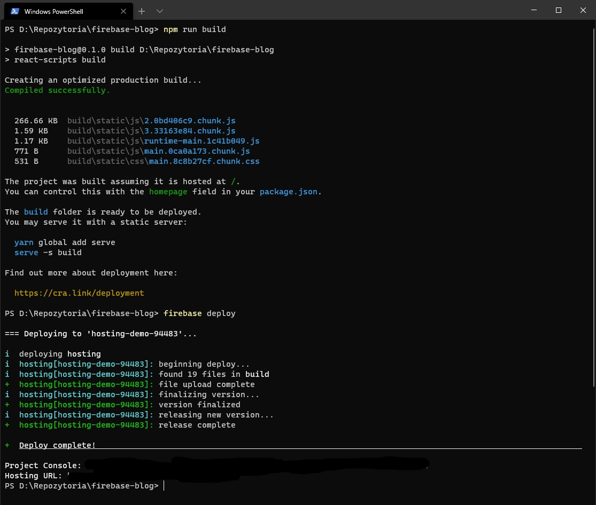

Firebase jest platformą Google'a, która daje narzędzia do budowania aplikacji internetowych. Narzędzi jest sporo i pozwalają na zbudowanie zaawansowanych aplikacji bez konieczności pisania backendu. Jednym z narzędzi jest Firebase Hosting. Można to wykorzytać do hostowania naszej aplikacji.

<!--more-->

## Co będę hostować?

Nie będzie to żadne rocket science. Pokażę ci jak wypuścić na hosting podstawową aplikację stworzoną w React. Proces będzie wyglądać identycznie dla każdej aplikacji frontendowej, którą budujemy do postaci statycznych plików. Jeśli pracujesz nad swoją aplikacją, to możesz ją wykorzystać. A jeśli nie masz żadnej aplikacji (albo boisz się wykorzystać aktualną) to spróbuj na czystym projekcie.

```json
npx create-react-app firebase-hosting-demo
cd ./firebase-hosting-demo
npm i
npm build
```

W tym momencie w folderze `build` są wszystkie pliki gotowe do wyhostowania.

## Koszty hostingu na Firebase

Zanim przejdę do tego, jak wykorzystać Firebase jako hostingu trochę o kosztach. Do zabawy/prototypowania nadaje się idealnie. Jak wyglądają darmowe limity dla hostingu?

✅ Pojemność 10GB  
✅ Transfer danych 360MB na dzień

Jeśli to jest za mało to można przejść na płatny plan. Płacimy wtedy za wykorzystane zasoby: 

✅ Pojemność $0.026/GB  
✅ Transfer danych $0.15/GB

Jak widać, nie jest to drogie. Koszty dla małych aplikacji będą zerowe lub bliskie zeru. A większe aplikacje powinny spokojnie zarobić na siebie.

## Firebase hosting krok po kroku

Firebase znajdziesz tutaj [https://firebase.google.com/](https://firebase.google.com/). Jest to usługa Google'a więc logowanie odbywa się za pomocą konta Google'a. 



Możesz tutaj stworzyć nowy projekt. Kreator jest prosty, więc nie pokazuję tutaj co robić - dasz radę samemu ;). Możesz pominąć na razie opcję z Google Analytics - zawsze można to włączyć potem w panelu. Po utworzeniu projektu zobaczysz panel projektu.



Nas dzisiaj interesuje zakładka **Tworzenie** i opcja **Hosting**. Teraz możemy przejść do konsoli. Pierwsza rzecz do zrobienia to zainstalowanie **Firebase CLI**. Z wykorzystaniem tego narzędzia można wiele rzeczy skonfigurować i ustawić. 

```json
npm install -g firebase-tools
```

Teraz wystarczy skorzystać z tego narzędzia. Pierwsza rzecz to zalogowanie się na nasze konto google'owe, dzięki czemu mamy dostęp do naszych projektów w firebase.

```json
firebase login
```



Teraz zostaje inicjalizacja projektu. Mamy oczywiście do tego komendę:

```json
firebase init
```

Polecenie to tworzy plik konfiguracyjny, który będzie wykorzystywany podczas innych poleceń. Moglibyśmy to oczywiście stworzyć ręcznie, ale polecenie zrobi to za nas szybciej i lepiej. 



W trakcie procesu dostajemy serię pytań, która pozwala na dostosowanie ustawień pod konkretne wymagania. Jak wygląda teraz taki przykładowy plik konfiguracyjny?

```json
{
  "hosting": {
    "public": "build",
    "ignore": [
      "firebase.json",
      "**/.*",
      "**/node_modules/**"
    ],
    "rewrites": [
      {
        "source": "**",
        "destination": "/index.html"
      }
    ]
  }
}
```

Mamy to, co najważniejsze, czyli nazwę folderu gdzie są zbudowane pliki i jakie pliki ignorować. No i sekcja `rewrites` jest bardzo ważna. W przypadku aplikacji SPA mamy tylko jeden plik HTML i cała reszta jest sterowana przez JS'a. Jeśli nie damy przekierowania z dowolnej strony do pliku index.html, to po odświeżeniu strony nic nam się nie załaduje.

Na sam koniec wystarczy jedna komenda by wszystko działało:

```json
firebase deploy
```



Adres aplikacji znajdziecie w zakładce Hosting w panelu projektu w Firebase. Będą tam dostępne dwie domyślne domeny i opcja, by dodać własną. I tyle. **Zajmuje to 5 minut, a aplikacja stoi i jest gotowa na kolejne prace**.