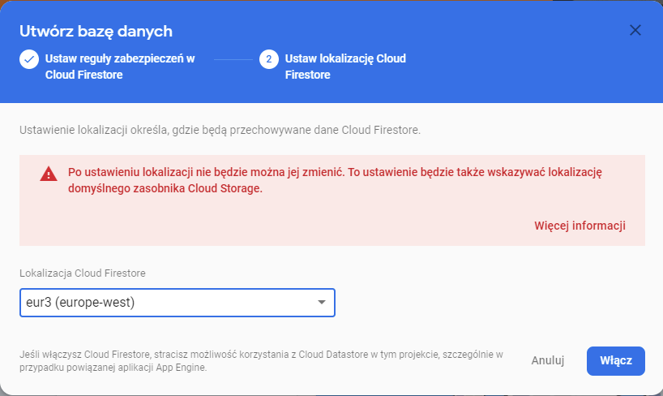
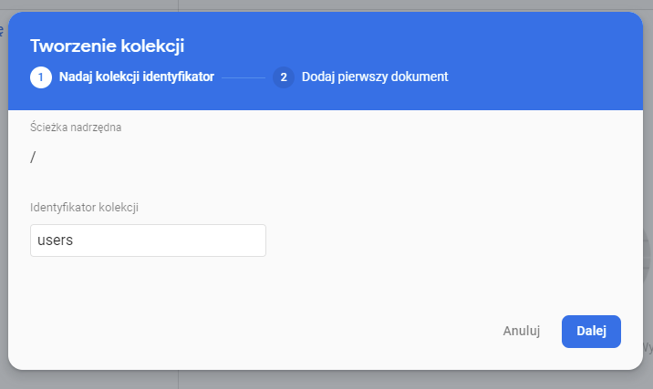
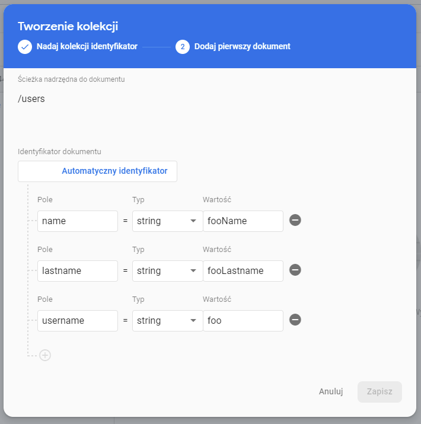
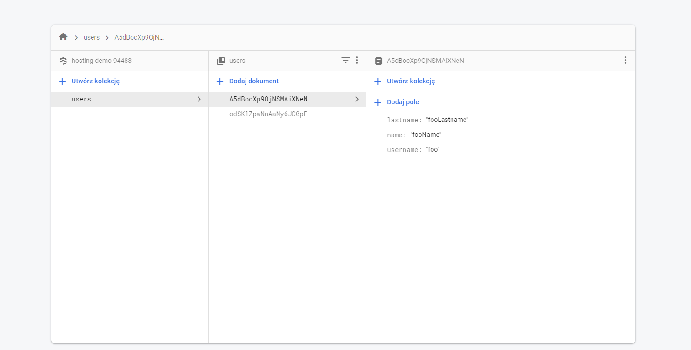

Aplikacja bez bazy danych byłaby uboga. Na szczęście Firebase daje dostęp do bazy danych NoSQL. Możemy ją wykorzystywać na wielu różnych platformach w tym Web. Jak praktycznie wykorzystać Fireastore w naszej aplikacji?

<!--more-->

## Zalety Firebase Firestore

Firestore jest bazą NoSQL, podobną do MongoDB. Ma to oczywiście swoje zalety, jak i wady. Nie będę się skupiał na tym, kiedy wybór takiej bazy danych ma sens - to jest temat na inny post. Natomiast jeśli potrzebujesz bazy NoSQL, to Firestore może ci zaproponować następujące funkcjonalności. 

✅ Elastyczność - w Firestore dane trzymamy w postaci dokumentów, które następnie łączymy w kolekcje. Daje to duże możliwości tworzenia struktur danych, które będą nam odpowiadały,  
✅ Zaawansowane filtrowanie - tutaj nie trzeba wiele dopisywać. Mamy możliwości tworzenia zaawansowanych filtrów, żeby uzyskać interesujące nas dokumenty,  
✅ Aktualizacje na żywo - Firestore dokonuje synchronizacji danych na wszystkich urządzeniach, czyli możesz dokonać zmiany w aplikacji webowej i widzieć to w aplikacji mobilnej,  
✅ Wsparcie trybu offline - wszystkie dane są cachowane i w momencie, gdy wróci połączenie z serwerami, to zmiany są wysyłane,  
✅ Skalowanie - tutaj nie powinno być zaskoczenia. Firestore opiera się na infrastrukturze Google'a i jest w stanie obsłużyć bardzo duże obciążenie.  

## Kolekcje, dokumenty i subkolekcje

Zanim pokażę, jak wykorzystać praktycznie Firestore, to muszę omówić, czym jest kolekcja, dokument i subkolekcja. Tak jak wspomniałem wyżej, jedną z zalet Firestore jest elastyczność tworzenia struktur danych. Odbywa się to dzięki wspomnianym strukturom. 

**Dokument jest podstawową strukturą, która reprezentuje pojedynczy rekord z odpowiednimi polami i wartościami** (taki odpowiednik wiersza w bazie relacyjnej). 

Następnie dokumenty, które reprezentują jeden konkretny byt, możemy umieścić we **wspólnym kontenerze - to będzie nasza kolekcja**. Trzeba pamiętać, że w bazie dokumentowej każdy dokument w kolekcji może mieć inną strukturę - ale lepiej trzymać się w obrębie kolekcji konkretnego zestawu pól.

Na sam koniec zostawiłem **subkolekcje**. **Są to kolekcje, które są stworzone wewnątrz dokumentów**. Standardowym przykładem jest chat. Mamy kolekcję pokoje. Teraz każdy pokój będzie dokumentem, który opisuje właściwości pokoju. I do takiego pokoju możemy przypisać kolekcję wiadomości, gdzie dokumentami będą pojedyncze wiadomości. 

## Konfiguracja Firebase w projekcie

Zanim zaczniemy korzystać z Firebase Firestore w projekcie, musimy skonfigurować projekt. Trzeba zacząć od zainstalowania odpowiedniej biblioteki.

```json
npm i firebase --save
```

Następnie musimy ją skonfigurować. Aby to zrobić, trzeba dodać poniższy kod:

```js
const firebaseConfig = {
  apiKey: "",
  authDomain: "",
  projectId: "",
  storageBucket: "",
  messagingSenderId: "",
  appId: ""
};
// Initialize Firebase
firebase.initializeApp(firebaseConfig);
```

Obiekt trzeba oczywiście wypełnić odpowiednimi danymi. Można je znaleźć w ustawieniach projektu w panelu Firebase. Teraz możemy już zacząć pobierać dane w Firestore.

## Stworzenie bazy banych

Jeszcze jedna rzecz, zanim pobierzemy dane - musimy jakieś mieć. Najprościej zacząć od stworzenia bazy danych w konsoli projektu. Aby to zrobić, musimy wejść w `Tworzenie > Cloud Firestore`. Dostaniemy modal, w którym musimy wybrać reguły zabezpieczeń (na razie wystarczą testowe) i następnie region. Region oczywiście najlepiej wybrać pod docelowych użytkowników - będzie to wtedy działało szybciej.




Teraz możemy stworzyć nasz pierwszy dokument. Jak przejdziemy do bazy danych, to widzimy pustą bazę. Możemy stworzyć nową kolekcję przez kliknięcie `Utwórz kolekcję`. Dostaniemy kreator, który pozwoli nam stworzyć kolekcję oraz pierwszy dokument.







Ja postanowiłem stworzyć kolekcję `users` wraz z dwoma przykładowymi dokumentami.

> Uwaga! Przy dodawaniu ręcznie dokumentów trzeba zwrócić uwagę, by tak samo nazywać wszystkie pola!!!

Teraz możemy w końcu pobrać pierwsze dane w naszej aplikacji.

## Pobieranie danych z Firestore

Żeby pobrać dane, trzeba skorzystać z wcześniej zainicjalizowanej biblioteki i wyciągnąć obiekt odpowiedzialny za komunikację z Firestore

```jsx
const db = firebase.firestore();
```

Teraz możemy wykorzystać to do wyciągania danych. W przypadku Firestore'a zawsze będziemy operować na pojedynczej kolekcji. Najprostsza operacja to pobranie wszystkich dokumentów.

```jsx
const col = await db.collection('users').get();
console.log(col.docs.map(doc=>doc.data()));

/*
	[
		{"username":"foo","name":"fooName","lastname":"fooLastname"},
		{"username":"bar","lastname":"barLastname","name":"barName"}
	]
*/
```

Warto zwrócić uwagę na konieczność przejścia po tablicy dokumentów, by uzyskać dostęp do danych.

Jeśli znamy ID naszego dokumentu to możemy go pobrać bezpośrednio z kolekcji.

```jsx
const doc = await db.collection('users').doc('A5dBocXp9OjNSMAiXNeN').get();
console.log(doc.data());

/*
	{"username":"foo","name":"fooName","lastname":"fooLastname"}
*/
```

## Filtrowanie, sortowanie i limitowanie

Do podstawowych operacji związanych z pobieraniem danych trzeba zaliczyć filtrowanie i sortowanie. Dzięki tym operacjom jesteśmy w stanie zapewnić większość podstawowej funkcjonalności, jakiej oczekuje użytkownik. Do filtrowania mamy specjalną metodę `.where(<pole>, <operator>, <wartość>)`. Z jakich operatorów możemy skorzystać?

- `<`
- `<=`
- `==`
- `>`
- `>=`
- `!=`
- `array-contains`
- `array-contains-any`
- `in`
- `not-in`

```jsx
const filter = await db.collection('users').where("username", "==", "bar").get();
console.log(filter.docs.map(doc=>doc.data()));

/*
	[
		{"username":"bar","lastname":"barLastname","name":"barName"}
	]
*/
```

Jeszcze zostało nam sortowanie i limitowanie ilości danych. Do limitowania danych mamy metodę `.limit()`.  Natomiast do sortowania mamy metodę `.orderBy(<pole>, "asc" | "desc")`

```jsx
const sort = await db.collection('users').orderBy("username", "asc").get();
```