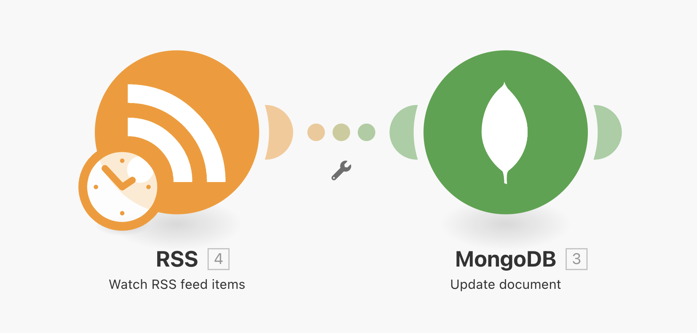

Ostatnio ukończyłem swój poboczny projekt - klon Linktree na potrzeby mojego bloga. Po co w ogóle mi to było? Dlaczego zmieniłem architekturę w środku projektu? I co zyskałem dzięki temu projektowi?

<!--more-->

## Dlaczego postanowiłem stworzyć aplikację do wyświetlania linków?

Głównym powodem była ograniczona możliwość automatyzacji. W rozwiązaniu, z którego korzystałem (nie było to Linktree, ale tam to jest płatne), nie było możliwości automatycznej aktualizacji linków - a bardzo mi na tym zależało. Coraz więcej rzeczy staram się automatyzować. I brakowało mi takiej automatycznej aktualizacji linków w procesie.

Kolejny powód - chęć nauki Fastify i potrzeba realnego projektu. Uważam, że najlepiej się uczyć na prawdziwych projektach i chciałem stworzyć coś, z czego będę korzystał. 

No i na koniec moje odczucia co do używanego rozwiązania. Nie podobał mi się wygląd i ograniczona możliwość zmiany wyglądu. Uznałem, że sam jestem w stanie stworzyć coś podobnego i zoptymalizować pod moje zapotrzebowania.

## Jak się zmieniła architektura?

Skoro zdecydowałem, co chcę budować, to zabrałem się do roboty. I zacząłem z grubej rury. Początkowo Fastify miało dostarczać dane po GraphQL'u. I potem aplikacja w React miała pobierać te dane i wyświetlać. Czyli typowa aplikacja SPA + Backend + GraphQL. Dlaczego więc ostatecznie zrezygnowałem z tego pomysłu i postawiłem wszystko jako aplikację backendową, która tworzy widoki?

Staram się kierować zasada **KISS - Keep it simple stupid**. I to jest odpowiedź na wszystko. 

Dwie osobne aplikacje, osobny deploy, konieczność synchronizacji deployu - to nie brzmi jak coś prostego. **Dużo łatwiej jest stworzyć i zarządzać jedną aplikacją**. Dodatkowo - czy faktycznie potrzebowałem Reacta (albo cokolwiek innego)? Mój widok składa się z paru div'ów i paru styli, które ograłem biblioteką Tailwind.

Drugi powód - SEO i UX. Takie strony muszą się szybko ładować. Użytkownik nie będzie czekał, aż strona się załaduje, poleci request do backendu i zostaną wyrenderowane linki. Bez względu na optymalizacje - to by było wolne. **Dużo lepiej było tworzyć widoki na backendzie i zwracać gotowy HTML. Mniej zapytań, 0 JS'a - idealny układ.**

Po analizie tych punktów widać, że wybór SPA+backend, byłby tylko moją zachcianka i nie miałby oparcia w wymaganiach biznesowych.

## Jakie korzyści widzę?

To na czym mi najbardziej zależało, czyli AUTOMATYZACJA. Wykorzystuję Integromat i zastanawiałem się jak ograć aktualizację linków na stronie. Myślałem o jakimś API, tokenie do edycji itp. Ale okazało się to prostsze, niż myślałem. Integromat ma gotowe integracje do komunikacji z bazą danych MongoDB (również integracje dla innych baz danych są dostępne). 

Jak widzisz powyżej - automatyzacja jest banalnie prosta. Nasłuchuje na RSS i gdy wykryje nowy wpis na blogu, to aktualizuje konkretny wpis w bazie danych. Proste, skuteczne i bardzo elastyczne.

## Poodsumowanie

Stworzenie całej aplikacji nie zajęło mi dużo czasu - do zrobienia w jedno popołudnie. A robiąc to samemu zyskujesz możliwości, które najczęściej są płatne:
- dowolna zmiana wyglądu 
- automatyzacje
- deploy na własnej domenie 

Minusem jest konieczność posiadania wiedzy technicznej, by to stworzyć, wypuścić na hosting i utrzymywać rozwiązanie. Ale jeśli jesteś programistą, to rozważ stworzenie takiej strony. Na pewno możesz się podzielić wieloma rzeczami.

Linki: 
- [Moja strona z linkami](https://links.fsgeek.pl/)
- [Github z kodem](https://github.com/Feridum/fastify-your-links)