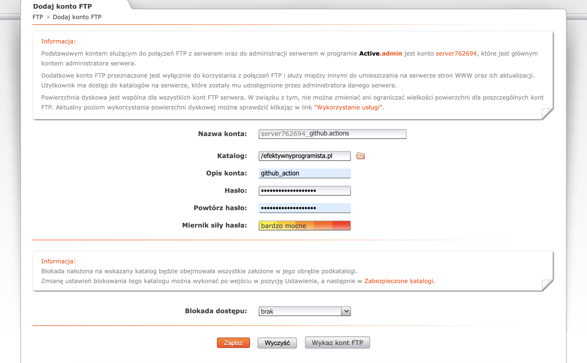
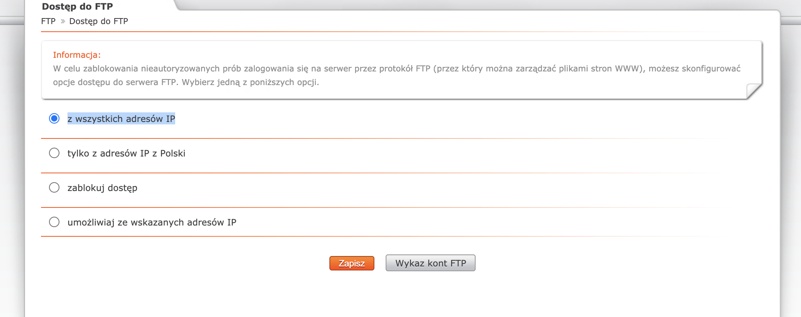
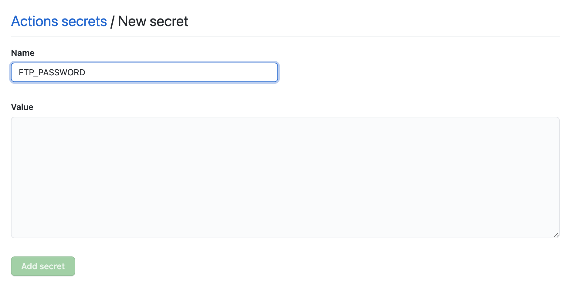
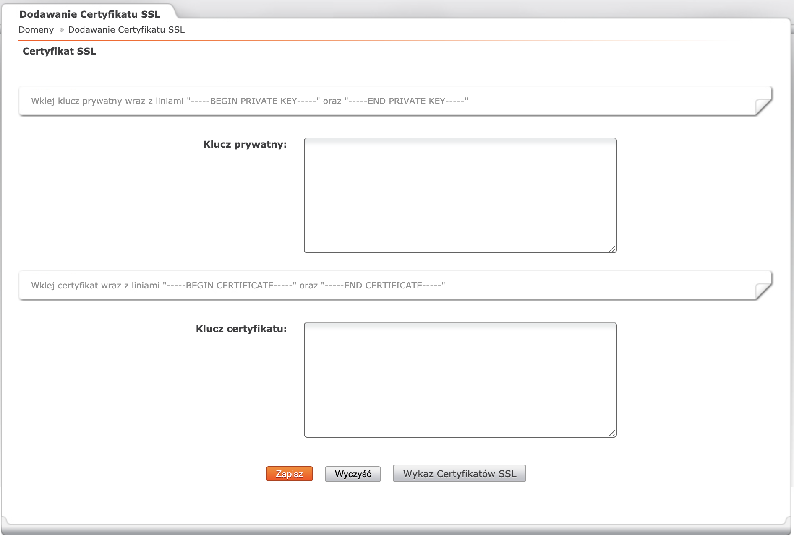
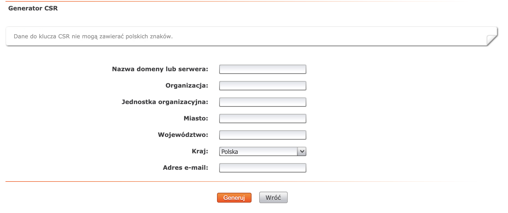

Jeśli chcemy zarobić na naszej aplikacji lub zwyczajnie pokazać ją światu, to musimy zrobić przysłowiowy deploy. Najprostszym sposobem jest wykorzystanie do tego hostingu i FTP. Dziś pokażę jak to zautomatyzować na CloudHostingu oferowanym przez [nazwa.pl](http://nazwa.pl/).

<!--more-->

> Post powstał przy współpracy z nazwa.pl

## Deploy przez FTP

Miejsc do trzymania naszej strony jest pełno — AWS, Google Cloud, Azure, Digital Ocean itd. Jednak najbardziej podstawowym i najprostszym są zwykłe hostingi z dostępem do FTP. Będę dziś korzystał z usługi CloudHosting, którą dostarcza [nazwa.pl](http://nazwa.pl/). Pokażę krok po kroku jak skonfigurować automatyczny deploy SPA/statycznej strony.

Nie omawiam kwestii zakupu usługi, podpięcia domeny czy też poprawnego skonfigurowania DNSa. Jeśli nie wiesz jak to zrobić, to zerknij do bazy wiedzy, dostępnej na https://www.[nazwa.pl](http://nazwa.pl/)/pomoc/ lub odezwij się do mnie na priv.

## Przygotowanie konta FTP

Wykorzystanie osobnego konta FTP jest istotne ze względu na bezpieczeństwo. Przy jego tworzeniu możemy zawęzić dostęp do pojedynczego katalogu. Dzięki temu, nawet jeśli konto wycieknie, straty i zagrożenia są minimalne. Dodatkowo przy takiej sytuacji można je bezproblemowo usunąć i stworzyć na nowo.

Konto na serwerze CloudHosting możesz dodać z poziomu panelu Active.admin w `FTP>Dodaj konto FTP.` Polecam nazwę github.action albo coś podobnego. Dzięki temu wiesz, gdzie korzystasz z danego konta. Ważne jest aby w opcji katalog wybrać tylko nasz pojedynczy katalog, z którego serwujemy stronę.



> Uwaga! Trzeba pamiętać by w panelu Active.admin w `FTP>Dostęp do FTP` zmienić wartość na `z wszystkich adresów IP`. Bez tego nie będziemy mogli się zalogować z poziomu Giithub Actions.
> 



Na sam koniec należy umieścić nasze hasło w tzw. Github Secrets. Jest to specjalnie miejsce w każdym repozytorium, gdzie należy trzymać dane wrażliwe np. hasło do kont czy adres serwera. Takie zmienne po zapisaniu nie są widoczne nawet dla admina i można je wykorzystać tylko w Github Actions. Takie informacje możesz dodać w `Settings>Secrets>New repository secret`



Podobnie w Secrets musimy umieścić nazwę użytkownika (`FTP_USERNAME`) i adres serwera (`FTP_SERVER`).

## Deploy strony statycznej

Kiedy mamy już przygotowane konto FTP, możemy skonfigurować Github Actions. Dzięki temu za każdym razem gdy nowy kod trafi na główną gałąź, zostanie wykonany automatyczny deploy. Poniżej znajdziesz gotową konfigurację (należy ją umieścić w `.github/workflow/deploy.yml`).

```jsx
name: Deploy

on:
  push:
    branches: [ main ]

jobs:
  build:
    runs-on: ubuntu-latest
    steps:
      - uses: actions/checkout@v2
      - name: Use Node.js
        uses: actions/setup-node@v1
        with:
          node-version: '14.x'
      - name: Installing dependencies
        run: npm i
      - name: Building React
        run: npm run build
      - name: Deploy to server
        uses: SamKirkland/FTP-Deploy-Action@4.1.0
        with:
          server: ${{ secrets.FTP_SERVER }}
          username: ${{ secrets.FTP_USERNAME }}
          password: ${{ secrets.FTP_PASSWORD }}
          local-dir: ./build/
          protocol: 'ftps'
```

Flow jest dosyć proste. Pierwsze 3 kroki są przygotowaniem do operacji:

1. Uzyskujemy dostęp do kodu przy pomocy `actions/checkout@v2`.
2. Pobieramy aktualną wersję Node.
3. Instalujemy wszystkie potrzebne zależności.

Od tego momentu dzieje się to co najważniejsze:

1. Budujemy stronę do plików statycznych - wszystko ląduje w folderze build.
2. Wysyłamy pliki na serwer FTP.

Najważniejsza w tej konfiguracji jest akcja `SamKirkland/FTP-Deploy-Action@4.1.0`. Udostępnia ona API do przesyłu plików po FTP. Co musimy podać:

- Server - adres serwera FTP, na który wysyłamy pliki (znajdziesz w panelu).
- Username, password - użytkownik i hasło, które przed chwilą zakładaliśmy.
- Local-dir – folder, w którym znajduje się nasza zbudowana strona (czyli w przypadku Reacta build).
- Protocol – protokół, jaki wykorzystujemy przy przesyle.

Zauważ, że nie podajemy jawnie informacji dotyczących FTP! Jest to istotne ze względu na bezpieczeństwo i możliwe wycieki. Korzystamy ze zmiennych, które zapisaliśmy w Secrets, w ustawieniach repozytorium.

To wszystko. Normalnie te operacje zajmują ok. 5 minut. Jednak trzeba pamiętać o kolejności wykonywania operacji, nazwie folderu, szukaniu hasła i nie zapomnieć o zbudowaniu nowej wersji itd. Przy takiej konfiguracji za każdym razem, gdy nowy kod trafi do głównej gałęzi, jest budowana nowa wersja strony.

## Dodanie SSL'a

Dzisiaj strona bez SSL nie istnieje. Jeśli posiadasz domenę w [nazwa.pl](http://nazwa.pl/), to dodanie certyfikatu SSL dla domeny wymaga dosłownie paru kliknięć, a informacje o tym znajdziesz w ich [Centrum Pomocy](https://www.nazwa.pl/pomoc/). Ja chcę się skupić na innych możliwościach dodania certyfikatu SSL do strony.

### Dodanie posiadanego certyfikatu

Najprostsza metoda to dodanie certyfikatu, który już się posiada. Aby dodać taki certyfikat do strony, należy wejść w `Domeny>Certyfikaty SSL` i kliknąć `Dodaj nowy certyfikat`.


Aby dodać nowy certyfikat potrzebujesz `klucza prywatnego, klucz certyfikatu oraz RootCa który wkleić należy pod kluczem certyfikatu`.



Po zapisaniu będziesz mógł aktywować certyfikat dla swojej domeny.


Trzeba teraz zaznaczyć certyfikat i włączyć go dla domeny. Po tym wszystkim, gdy wejdziesz na swoją stronę (koniecznie z adresu https://), to zobaczysz zieloną kłódkę przy adresie strony.

### Wygenerowanie certyfikatu od 0

Jeżeli nie posiadasz certyfikatu i nie chcesz na razie płacić (bo póki co testujesz rozwiązanie), to dobrym pomysłem będzie skorzystanie z certyfikatu LetsEncrypt. Są to darmowe certyfikaty SSL, które są ważne przez 3 miesiące. Można znaleźć wiele stron, które pozwalają wygenerować taki certyfikat. Aby to zrobić trzeba zacząć od wygenerowania CSR – czyli informacji, które są wymagane do utworzenia certyfikatu. Aby zrobić to w panelu admina, kliknij na `Wygeneruj CSR`.



Aby wygenerować CSR, potrzeba kilku danych. Wszystko można zrobić przy pomocy formularza. Po kliknięciu Generuj dostaniesz zakodowane informacje, które wykorzystasz przy rejestracji SSL.

Dalej są dostępne dwie opcje - można samemu generować certyfikat przy pomocy Certbota (to temat na inny wpis) lub znaleźć stronę, która zrobi to za nas.


Gdy będziesz mieć już certyfikat, to musisz go dodać do zgłoszenia, które wykorzystałeś (`kliknij Dodaj certyfikat`).


Tutaj wystarczy podać tylko klucz certyfikatu. Dalej kroki są identyczne, jak podczas dodawania całego certyfikatu ręcznie.