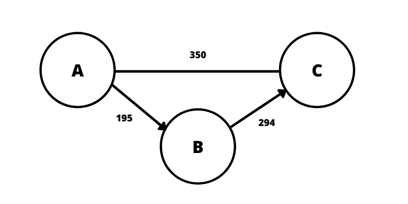
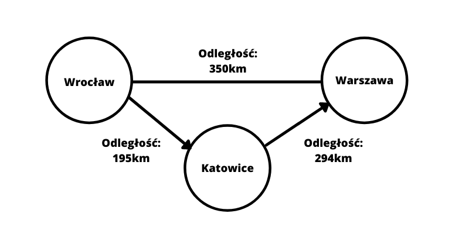
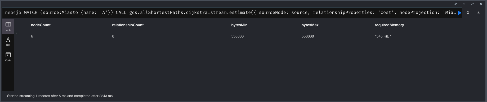
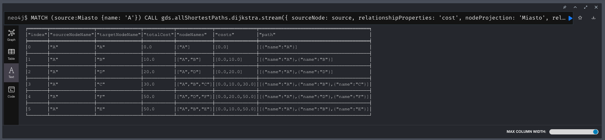

Najczęściej korzystamy z baz relacyjnych np.: mySQL, Mariadb czy PostgreSQL. Potem są dokumentowe np.: Mongo i klucz-wartość np.: Redis. I na tym kończy się znajomość baz danych. A są bazy grafowe np.: Neo4j, które dają nam ogromne możliwości przy niektórych zastosowaniach.

<!--more-->

## Kiedy warto się zainteresować bazami grafowymi?

Bazy grafowe mocno się różnią od pozostałych baz danych. Składają z węzłów (będą to obiekty) i relacji między nimi. To co jest istotne to rola relacji. Relacja w bazie grafowej niesie dużo więcej informacji na temat połączenia między węzłami niż w przypadku bazy relacyjnej. Tutaj relacja nie ma żadnych ograniczeń jeśli chodzi o tworzenie, modyfikowanie, usuwanie. Każdy węzeł może mieć dowolną ilość relacji. Relacja zawiera również dodatkowe informacje np.: połączenie pracownik → miejsce pracy może zawierać datę podpisania umowy albo połączenie miasto A → miasto B zawiera odległość. 

Kiedy warto wykorzystać bazę grafową?

- nasze relacje mają przechowywać więcej informacji niż tylko sam fakt istnienia relacji
- kiedy zależy nam na elastyczności w tworzeniu relacji
- kiedy potrzebujemy wykorzystać algorytmy grafowe do rozwiązania problemu np.: najkrótsza ścieżka między dwoma węzłami

Jakie są przykłady wykorzystania baz grafowych:

- system rekomendacji (np.: rekomendacja stron na podstawie polubień znajomych z którymi często piszesz lub jesteś w tej samej grupie)
- wykrywanie oszustw np.: pranie pieniędzy przez system kont
- zaawansowane analiza danych
- sieci społecznościowe
- wyszukiwanie najlepszej drogi między punktami (typowy przykład wykorzystani algorytmu grafowego)

## Podstawy grafów

Żeby dobrze zrozumieć zasadę działania bazy grafowej dobrze wiedzieć co to w ogóle jest graf. Graf jest zbiorem węzłów i krawędzi, które je łączą.  Najprościej to zobaczyć na obrazku  poniżej.



Mamy dwa rodzaje połączeń:

- skierowane
- nieskierowane

Najprościej jest to porównać do drogi. Krawędź(połączenie, relacja) skierowane jest jak droga jednokierunkowa, gdzie ruch odbywa się w stronę pokazywaną przez strzałkę. W przypadku krawędzi nieskierowanej jest to droga dwukierunkowa.

Tyle teorii wystarczy na początek - jeśli zainteresuje cię ten temat to znajdziesz bardzo dużo materiałów na temat grafów. Ten temat jest bardzo dobrze zbadany i posiada bogatą bazę gotowych algorytmów. 

A jak przenieść teorię na praktyczny przykład?

Węzłem będą dowolne dane, które przechowujemy w bazie - np.: dane miast, osób itd. Najprościej to porównać do zwykłej tabeli w bazie danych. Krawędź jest relacją jaką znamy z baz relacyjnych. Jak będzie wyglądał powyższy przykład, gdy damy bardziej życiowy przykład?



Mamy tutaj prostą mapę z miastami jako wierzchołki a połączenia są odległością pomiędzy miastami.

## Pierwsze kroki z Neo4j

Chyba jedną z najpopularniejszych grafowych baz danych jest Neo4j. Neo4j jest napisane w Javie i korzysta z języka Cypher do tworzenia zapytań i modyfikacji grafu. Zabawę z tą bazą danych można rozpocząć na wiele sposób ale ja polecam skorzystanie z Docker'a. Poniższym poleceniem uruchomisz bazę danych Neo4j.

```yaml
docker run --rm -p 7687:7687 -p 7474:7474 -e NEO4J_AUTH=neo4j/test neo4j
```

Teraz wejdź w przeglądarce pod adres [http://localhost:7474/](http://localhost:7474/). Powinieneś zobaczyć taki sam panel jak na zdjęciu poniżej.


U góry strony masz pasek (zaczyna się od neo4j$), który umożliwia wpisywanie komend - będziesz tam zarówno tworzył węzły i relacje, modyfikował je i wyszukiwał potrzebne ci wzorce.

## Tworzenie pierwszego grafu

Zacznijmy od podstaw czyli tworzenie pierwszego grafu. Do tworzenia węzłów i relacji służy komenda.

```yaml
create (:Miasto {name: "A"})
```

Dalej musimy połączyć węzły relacją

```yaml
match (a:Miasto {name: 'A'}) create (a)-[:DROGA {cost: 0}]->(a)
```

Możemy to zrobić jedną komendą - zapamiętaj tę komendę, będzie zaraz nam potrzebna

```yaml
CREATE (a:Miasto {name: 'A'}),
       (b:Miasto {name: 'B'}),
       (c:Miasto {name: 'C'}),
       (d:Miasto {name: 'D'}),
       (e:Miasto {name: 'E'}),
       (f:Miasto {name: 'F'}),
       (a)-[:DROGA {cost: 10}]->(b),
       (a)-[:DROGA {cost: 20}]->(d),
       (a)-[:DROGA {cost: 100}]->(f),
       (b)-[:DROGA {cost: 10}]->(d),
       (b)-[:DROGA {cost: 20}]->(c),
       (b)-[:DROGA {cost: 40}]->(e),
       (d)-[:DROGA {cost: 30}]->(f),
       (f)-[:DROGA {cost: 10}]->(e);
```

Mając naszą bazę warto pobawić się w proste zapytania. Najprostszym zapytaniem jest wyświetlenie wszystkich węzłów.

```yaml
match(n) return n
```

Możemy też filtrować to co otrzymujemy

```yaml
match (a:Miasto {name: 'A'}) return a
```

To co pokazałem to dopiero wierzchołek góry lodowej. Można tworzyć dużo bardziej zaawansowane zapytania. Zachęcam do próbowania i testowania. Jeśli temat cię zainteresował to wpisz w konsoli `:guide movie-graph` - jest to samouczek od Neo4j gdzie poznasz dokładniej język zapytań i jego możliwości.

## Algorytm Dijkstry

Na sam koniec jeszcze przykład wykorzystania bardzo znanego (przynajmniej w świecie grafów) algorytmu czyli Algorytm Dijkstry. Wyszukuje on najkrótszą ścieżkę pomiędzy wierzchołkiem startowym a wszystkimi innymi wierzchołkami w grafie. Sprawdzi się idealnie do naszego przykładu z powyżej. Znajdziemy najkrótsze drogi pomiędzy miastem Alpha i wszystkimi innymi. 

Aby skorzystać z gotowej implementacji algorytmu Dijsktra musimy zainstalować plugin `graph-data-science`. Poniżej masz polecenie, które musisz uruchomić aby zrobić w Docker.

```yaml
docker run --rm -p 7687:7687 -p 7474:7474 -e NEO4J_AUTH=neo4j/test -e NEO4JLABS_PLUGINS='["graph-data-science"]'  neo4j
```

Następny krok to załadowanie miast(wykorzystaj polecenie wyżej). Dalej mamy już kroki związane z samym algorytmem. Zanim zaczniemy szukać najkrótszej drogi warto sprawdzić ile zajmie to pamięci. Możemy to sprawdzić poniższą komendą.

```yaml
MATCH (source:Miasto {name: 'A'})
CALL gds.allShortestPaths.dijkstra.stream.estimate({
    sourceNode: source,
    relationshipProperties: 'cost',
    nodeProjection: 'Miasto',
    relationshipProjection: 'DROGA',
		relationshipWeightProperty: 'cost'
})
YIELD nodeCount, relationshipCount, bytesMin, bytesMax, requiredMemory
RETURN nodeCount, relationshipCount, bytesMin, bytesMax, requiredMemory
```

W rezultacie dostaniemy taką informację.



Teraz możesz uruchomić liczenie poniższą komendą 

```yaml
MATCH (source:Miasto {name: 'A'})
CALL gds.allShortestPaths.dijkstra.stream({
    sourceNode: source,
    relationshipProperties: 'cost',
    nodeProjection: 'Miasto',
    relationshipProjection: 'DROGA',
    relationshipWeightProperty: 'cost'
})
YIELD index, sourceNode, targetNode, totalCost, nodeIds, costs, path
RETURN
    index,
    gds.util.asNode(sourceNode).name AS sourceNodeName,
    gds.util.asNode(targetNode).name AS targetNodeName,
    totalCost,
    [nodeId IN nodeIds | gds.util.asNode(nodeId).name] AS nodeNames,
    costs,
    nodes(path) as path
ORDER BY index
```

Po chwili zobaczysz wynik(najlepiej się przełączyć na wyświetlanie w tabeli albo jako text).



Zaczynając od naszego węzła A mamy koszt oraz jak przebiega trasa do wszystkich innych węzłów. Jeśli temat cię zainteresował to polecam się pobawić samemu, pozmieniać coś, wydobyć konkretne dane i eksperymentować.