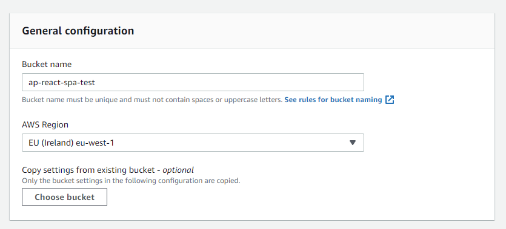
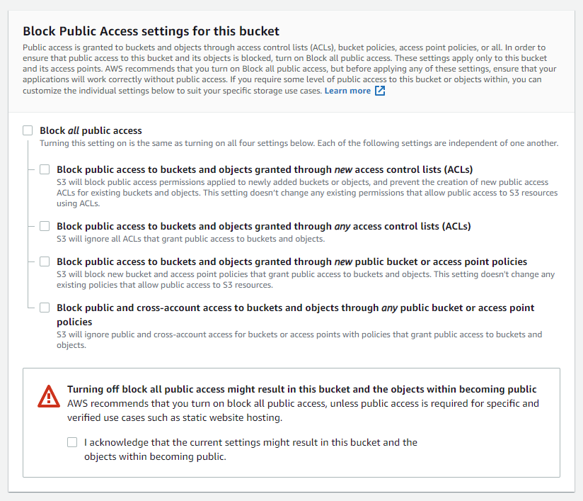
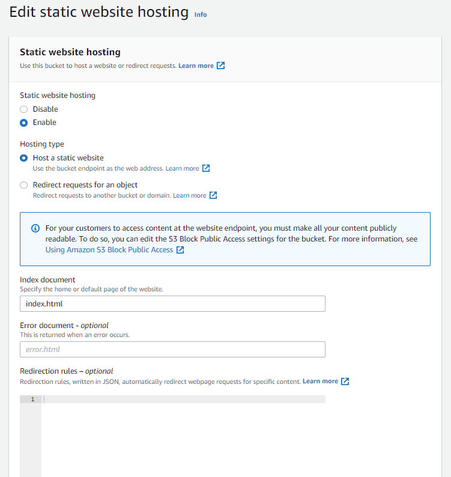
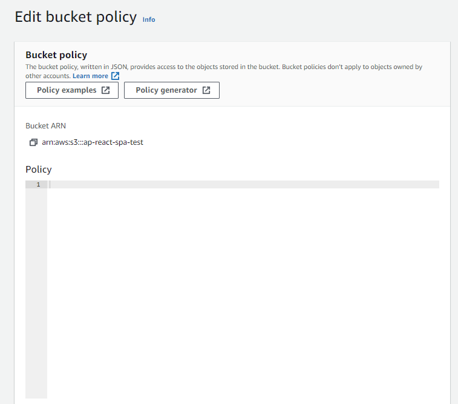

Amazon S3 jest bardzo uniwersalną usługą. Na pierwszy rzut oka pozwala na przechowywanie różnego rodzaju plików np.: zdjęć, video. Ale to nie wszystko. Możemy wykorzystać S3 do hostowania prostej aplikacji typu SPA. Zobacz w jaki sposób.

<!--more-->

## Co to jest S3?

S3, czyli Simple Storage Service, jest jednym z najstarszych oraz jednym z najprostszych serwisów w AWS. Możemy tam przechowywać różnego rodzaju dane:

- logi aplikacji,
- dane analityczne,
- obrazki i video,
- dane z aplikacji,
- backupy.

W S3 tworzymy tzw.: buckety (pojemniki na dane) i potem w nich umieszczamy nasze pliki. Pojedynczy plik może mieć do 5TB wielkości.  Struktura katalogów wewnątrz bucketa jest dowolna i mamy nad nią pełną kontrolę.

S3 oferuje kilka różnych rodzajów przechowywania danych. Różnią się między sobą zachowaniem oraz oczywiście ceną. Na przykład, jeśli chcesz wykorzystywać S3 jako archiwum, to sprawdź, jakie są różnice w cenie przechowywania 1TB danych dla EU(Ireland):

- S3 standard - 23.55 USD
- S3 Glacier - 4.12 USD (dla średniego rozmiaru obiektu 16MB)
- S3 Glacier Deep Archive - 1.03 USD (dla średniego rozmiaru obiektu 16MB)

Oczywiście S3 Glacier ma minusy w postaci czasu uzyskania danych - mogą to być nawet godziny.

Jeśli chcesz sprawdzić, ile będzie cię kosztował serwis S3, to sprawdź [kalkulator](https://calculator.aws/#/createCalculator/S3).

S3 jest też w pewien sposób unikalną usługa. Jest usługą regionalną (czyli wybieramy region, w którym są nasze dane) ale nazwa bucketa musi być unikalna globalnie.

## Tworzenie S3 bucket pod deploy SPA

Aby utworzyć nowy bucket, musisz wejść do usługi S3 i kliknąć przycisk Create Bucket. Dostaniesz poniższy formularz, który trzeba uzupełnić.



Pamiętaj, by dać unikalną nazwę i wybrać odpowiedni region AWS'a. Ma to znaczenie z kilku powodów: 

- różnice w cenie,
- powinieneś wybrać lokalizację jak najbliżej swoich użytkowników końcowych,
- normy prawne dotyczące przechowywania danych użytkowników.

Jeśli chcemy korzystać z S3 jako źródła naszej strony WWW, to trzeba pamiętać o zezwoleniu na publiczny dostęp do bucketu.



Pierwszą rzeczą jaką trzeba zrobić to wrzucić pliki do bucket'a. Można to zrobić na 3 sposoby: 

- korzystając z SDK,
- korzystając z CLI,
- klikając przycisk Upload w szczegółach bucketa.


Ale to nie wszystko. Aby korzystać z S3 jako static web hosting musimy to jeszcze skonfigurować. Trzeba wejść w zakładkę `Properties` w górnym menu i znaleźć sekcję `Static website hosting`.


Pojawi się taki formularz.



To co najważniejsze to ustawienie pliku index.html.

Po zapisaniu zmian znowu znajdź sekcję `Static website hosting`. Tym razem zobaczysz, jaki jest adres url twojej strony.


Jak teraz wejdziesz na stronę to zobaczysz błąd `403 Forbidden`. Dlaczego? Odpowiedź jest w ustawieniach AWS'a dotyczących prywatności. Domyślnie publiczny dostęp jest zablokowany ze względów bezpieczeństwa. Przy tworzeniu bucketa zezwoliliśmy na publiczny dostęp do bucketa, ale musimy jeszcze zezwolić na dostęp do wszystkich plików. 

Aby to poprawić musisz wejść do zakładki `Permissions`, znaleźć sekcję `Bucket policy` i kliknąć `Edit`


Zobaczysz poniższy formularz. Poniżej przygotowałem treść Policy jaką musisz wkleić do pola. Jedyna rzecz jaką musisz zmienić, to umieścić Bucket ARN w odpowiednim miejscu (`<twoj-bucket-arn>`). 



```json
{
    "Version": "2012-10-17",
    "Id": "Policy1636820138649",
    "Statement": [
        {
            "Sid": "Stmt1636820137004",
            "Effect": "Allow",
            "Principal": "*",
            "Action": "s3:GetObject",
            "Resource": "<twoj-bucket-arn>/*"
        }
    ]
}
```

Po zapisaniu zmian i odświeżeniu zobaczysz swoją stronę.

Jak widzisz, nie jest to nic trudnego. Mając taki serwis stworzony, można integrować go dalej z innymi usługami. Możliwości są ogromne, część z nich postaram się pokazać w kolejnych postach.