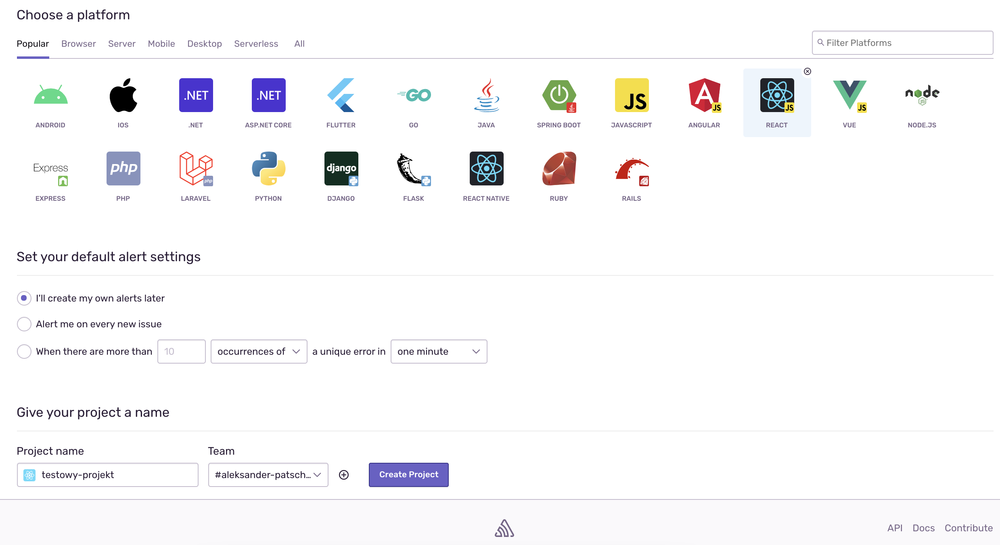
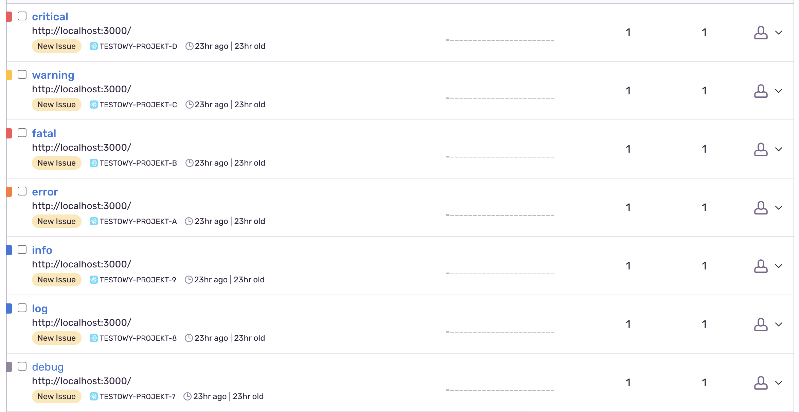

Programiści dzielą się na dwie grupy - ci co mają logi i ci, co wprowadzą je po pierwszej awarii. Posiadanie logów jest bardzo ważne - bez tego nie wiemy, co się dzieje w naszej aplikacji. Do logowania zdarzeń w aplikacji możemy wykorzystać Sentry.

<!--more-->

## Po co nam logowanie zdarzeń na froncie?

Spotykałem się już z systemami, które nie miały zaimplementowanego logowania. I wszystko jest dobrze, dopóki nic się nie zepsuje. Bo jak się zepsuje, to wpadłeś jak śliwka w kompot. Wyobraź sobie, że dostajesz zgłoszenie od klienta - na stronie /abc po kliknięciu przycisku aplikacja się wywaliła. Sprawdzasz lokalnie i działa. I co teraz? Szukasz, aż znajdziesz? Czy olewasz? A gdybyś miał logi, to dostałbyś więcej informacji, które by ci pomogły zaoszczędzić czas przy naprawie błędu. Dla aplikacji frontendowych do zbierania takich logów możemy wykorzystać Sentry. Warto się tym zainteresować już na początku projektu - będzie to mniej bolesne niż wprowadzanie logowania do już istniejącej aplikacji. 

## Sentry - tworzenie projektu

Zanim można konfigurować Sentry w aplikacji, trzeba utworzyć nowy projekt. Jeśli nie masz do tej pory żadnego projektu, to na głównej stronie zobaczysz następującą planszę.


Następnie musimy wybrać typ projektu, sposób alarmów oraz nazwę projektu



## Sentry - podstawowa konfiguracja dla React

Konfigurację Sentry dla projektu, trzeba zacząć od instalacji wszystkich potrzebnych zależności.

```jsx
npm install --save @sentry/react
```

Teraz trzeba aktywować Sentry dla projektu. Najlepiej to zrobić w pliku index.ts lub bezpośrednio w następnym. Minimalna konfiguracja wymaga podania parametru `dsn` - znajdziesz go w ustawieniach projektu (zakładka Client Keys w ustawieniach projektu)

```jsx
import * as Sentry from '@sentry/react';

Sentry.init({
  dsn: "",
  environment: process.env.REACT_APP_ENV,
  release: "testowy-projekt@" + process.env.REACT_APP_VERSION,
});
```

Ja oprócz tego dodałem jeszcze `environment` i `release`, ponieważ ułatwia to śledzenie błędów na różnych środowiskach oraz dla kolejnych wersji aplikacji. Następnie trzeba dodać komponent, który będzie łapał wszystkie błędy z aplikacji. Szczególnie chodzi o błędy niezłapane, które pojawiają się w nieprzewidzianym miejscu. Kiedyś pisałem taki komponent samodzielnie, ale Sentry dostarcza też gotowy komponent.

```jsx
<Sentry.ErrorBoundary fallback={"An error has occurred"}>
		<App />
</Sentry.ErrorBoundary>
```

Teraz można przetestować konfigurację i spowodować błąd

```jsx
<button onClick={() => { throw new Error('error test') }}>exception</button>
```

Po kliknięciu przycisku zobaczymy w sentry nowy wpis.


Jakie informacje dostajemy w takim błędzie?

- przeglądarka
- system operacyjny
- url
- środowisko
- gdzie wystąpił błąd
- dane dotyczące błędu

Pozwala to na znalezienie błędu i naprawienie go.

## Sentry - wysyłanie błędów

Powyższa konfiguracja to minimum, jakie trzeba zrobić, by ułatwić sobie życie. Ale na tym nie kończą się możliwości Sentry. Jedną z przydatnych rzeczy jest możliwość samodzielnego raportowania błędów i innych wiadomości. Kiedy może to być przydatne? Na przykład, gdy robimy zapytanie na serwer i chcemy wiedzieć, gdy zapytanie zakończy się błędem.

```jsx
try {
  ...
} catch (e) {
  Sentry.captureException(e)
}
```

Oprócz łapania błędów możemy też raportować inne informacje i dzielić ja ze względu na rodzaj.

```jsx
Sentry.captureMessage('info', Sentry.Severity.Info);
Sentry.captureMessage('log', Sentry.Severity.Log);
Sentry.captureMessage('debug', Sentry.Severity.Debug);
Sentry.captureMessage('warning', Sentry.Severity.Warning);
Sentry.captureMessage('error', Sentry.Severity.Error);
Sentry.captureMessage('critical', Sentry.Severity.Critical);
Sentry.captureMessage('fatal', Sentry.Severity.Fatal);
```

I potem widzimy to w taki sposób w Sentry



Dzięki temu możemy zbierać więcej informacji diagnostycznych, by wiedzieć, co się dzieje w systemie. W momencie, gdy musimy naprawić błąd, każda informacja jest na wagę złota. Zachęcam do sprawdzenia tego rozwiązania i zaimplementowania w swoim projekcie.