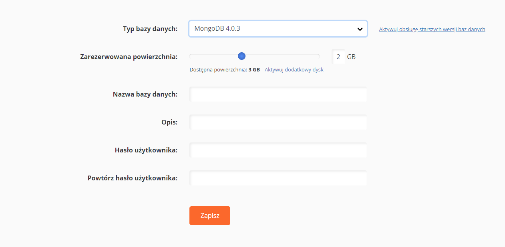
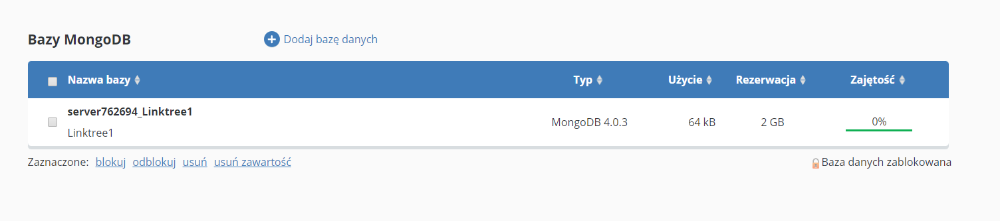
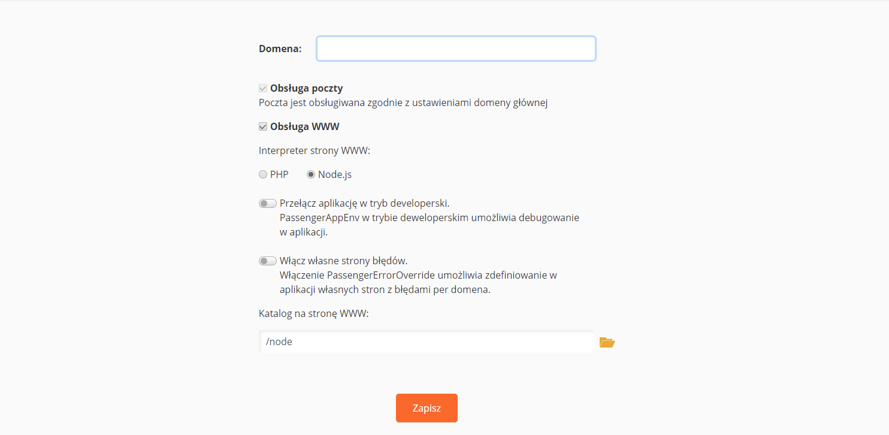

Jedną z zalet JavaScript jest możliwość wykorzystania tego języka zarówno w przeglądarce, jak i po stronie serwera. Deploy takiej aplikacji może okazać się czasami działaniem skomplikowanym, gdyż musimy zadbać nie tylko o wdrożenie samego oprogramowania, ale również o bazę danych. Całość działań możemy wykonać w wygodny sposób w ramach CloudHostingu [nazwa.pl](http://nazwa.pl/).

<!--more-->

## Przygotowanie bazy danych MongoDB

Pierwszą rzeczą, jaką musimy zrobić, jest stworzenie bazy danych. W usłudze CloudHosting mamy do wyboru następujące bazy:

- PostgreSQL,
- MariaDB,
- MongoDB.

Ja postanowiłem, że na potrzeby mojej aplikacji najlepsza będzie baza danych MongoDB. Aby stworzyć bazę, trzeba wybrać `Bazy danych > Dodaj bazę danych` w  CloudHosting Panelu.



> Dostęp do bazy danych jest możliwy tylko z poziomu serwera. Nie można połączyć się z bazą np. podczas developmentu lub korzystając z zewnętrznego klienta. Jeśli potrzebujesz takiego połączenia z bazą danych, to możesz skorzystać z bazy danych MariaDB lub PostgreSQL.


Dodając bazę, zapamiętaj dane, które wprowadzasz. Będą one potrzebne do połączenia w aplikacji. Po poprawnym dodaniu bazy zobaczysz ją na wykazie.



W aplikacji będzie się można połączyć z bazą danych przy pomocy tzw. connection string. Wygląda on następująco:

```yaml
MONGO_URL=mongodb://<nazwa_bazy>:<hasło_do_bazy>@<adres_twojego_serwera>:<port>
MONGO_DB=<nazwa_bazy>
```

W przypadku CloudHostingu zmienne będą zawierać:

- port - `4021`,
- adres_twojego_serwera - `mongodb.server<numer>.nazwa.pl`,
- resztę danych wprowadzasz podczas tworzenia bazy danych.

Połączenie z bazą przedstawia się następująco (z wykorzystaniem biblioteki `mongodb`): 

```yaml
const {MongoClient} = require('mongodb');

//MONGO_DB i MONGO_URL są wyciągnięte ze zmiennych środowiskowych
//NIGDY nie umieszczaj tych wartości w kodzie
const client = new MongoClient(MONGO_URL)
await client.connect()
const db = client.db(MONGO_DB)
```

## Przygotowanie hostingu do aplikacji Node.js

Domyślnie przy dodawaniu nowej domeny wykorzystuje ona interpreter PHP. Żeby móc zrobić deploy aplikacji Node.js, musisz jawnie to skonfigurować.



W ramach ustawień ważne jest określenie katalogu na serwerze FTP, w którym będziemy umieszczać naszą aplikację.

## Przykładowa aplikacja Node.js

Jeśli nie masz aplikacji, którą możesz wdrożyć, to masz szczęście :). Możesz skorzystać z tej, którą ostatnio stworzyłem w ramach nauki Fastify. Służy ona do trzymania wszystkich linków w jednym miejscu. Jeśli masz swojego bloga lub prowadzisz biznes w sieci, to takie strony są pomocne - szczególnie na Instagramie. Możesz zobaczyć, jak to wygląda na [https://links.fsgeek.pl/](https://links.fsgeek.pl/), a cały kod znajdziesz na Github.

Jeżeli chcesz stworzyć własną aplikację, musisz pamiętać o kilku rzeczach:

- aplikacja musi posiadać plik startowy app.js,
- serwer nie wspiera nowego ładowania modułów w Node.js (musisz używać require() do importowania i module.exports do eksportowania),
- CloudHosting wspiera Node.js w wersji 15, 14 LTS, 12 LTS, 10 LTS.

## Deploy aplikacji Node.js

Wdrożenie aplikacji trzeba zacząć od umieszczenia wszystkich plików na serwerze. Możesz to zrobić ręcznie albo od razu to zautomatyzować. O tym, jak zautomatyzować proces, możesz przeczytać na [Deploy na FTP w 5 minut - Github Actions i CloudHosting](https://fsgeek.pl/post/github-action-deploy-ftp-nazwa-pl-cloudhosting/). Post dotyczył strony statycznej, ale bardzo dobrze sprawdzi się dla aplikacji Node.js. **Przy deploy’u zwróć uwagę, by nie wysyłać plików node_modules.**

> Aplikacja musi posiadać plik startowy app.js

Następnym etapem jest zainstalowanie wszystkich zależności na serwerze. Musisz zalogować się na konto FTP, przejść do katalogu z projektem i wpisać w konsoli `npm install`. Jeśli Twoja aplikacja wymaga zbudowania jakichś plików statycznych, jak np. styli, to pamiętaj o zrobieniu tego.

Kolejna rzecz to zmienne środowiskowe. Najprościej jest wykorzystać plik .env i wpisać tam wartości, które wykorzystuje aplikacja. Możesz też ustawić bezpośrednio w systemie przy pomocy polecenia `export NAZWA=WARTOŚĆ`.

Jeżeli wszystko jest zrobione poprawnie, to Twoja aplikacja będzie działać pod domeną, która została ustawiona wyżej.

## Debugowanie

Na sam koniec dwie przydatne informacje, co robić, gdy aplikacja nie działa. Najważniejszym plikiem, który będzie Ci służył pomocą jest `/tmp/apache_passenger.log`. Znajdziesz tam informacje, które pozwolą zdiagnozować problem w aplikacji. Dodatkowo warto ją przełączyć w tryb developerski (zrobisz to w ustawieniach domeny) poprzez `NODE_ENV=development` i będziesz mieć więcej informacji w logach (o ile jest to zaimplementowane).

## Podsumowanie

1. Zacznij od stworzenia bazy danych.
2. Musisz mieć domenę, która ma ustawiony interpreter Node.js.
3. Aplikacja musi mieć plik app.js.
4. Pamiętaj o zainstalowaniu swoich zależności przy pomocy `npm i`.
5. Nie zapomnij o ustawieniu zmiennych środowiskowych.
6. Jeśli masz problemy z aplikacją, zerknij do logów przy pomocy polecenia `cat/tmp/apache_passenger.log`.