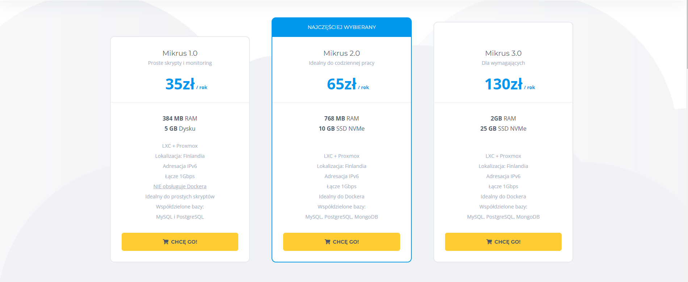
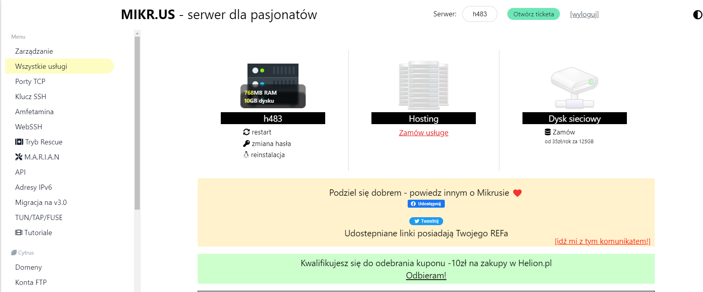

Od kiedy programuję, zawsze chciałem jakiegoś małego VPS'a do zabaw. Ostatnio testowałem Mikr.us, czyli tanie VPS'y dla pasjonatów. Zobacz, co sądzę o tej usłudze. I czy ta usługa jest dla ciebie. 

<!--more-->

## Oferta
Zacznę od standardowych metryczek. W ofercie Mikr.us są 3 opcje cenowe:
- 1.0 35zł/rok, 348 MB RAM, 5GB Dysku
- 2.0 65zł/rok, 768 MB RAM, 10GB SSD NVMe 
- 3.0 130zł/rok, 2GB RAM, 25GB SSD NVMe

Oprócz tego warto zwrócić uwagę, że opcja 1.0 nie obsługuje Dockera. Oprócz tego w wersji 1.0 nie znajdziesz współdzielonej bazy MongoDB. Cała reszta jest wspólna dla wszystkich opcji. 

A jak wygląda to w innych firmach?
- OVH 204 zł/rok 2GB 40GB SSD NVMe
- Nazwa.pl 120 zł/rok 500MB 10GB NVMe
- Homecloud 216zł/rok 2GB 40GB NVMe
- Cyberfolks 178zł/rok 1GB 25GB SSD

Oczywiście sprawdziłem tylko wersje podstawowe. Wszystkie wyżej wymienione serwisy podają ceny na miesiąc, więc przemnożyłem cenę przez 12, by móc porównać wyniki.

Już teraz widać, że cena Mikr.us jest bardzo konkurencyjna. Nie znajdziesz nic równie taniego, jeśli chcesz się pobawić lub stawiasz pierwsze kroki w administrowaniu linuxem.

## Panel 

Panel to jest chyba jedyna rzecz, do której można się przyczepić. I tak jest już lepiej, ale dalej to nie szczyt UI/UX. Nawigowanie jest na początku trochę nieintuicyjne i się trochę gubiłem. Trochę przeszkadza brak podświetlenia aktualnej pozycji w menu. Inna rzecz to standardowa nawigacja, która przeładowuje stronę i trzeba scrollować do aktualnej pozycji w menu.

Rzecz, która może denerwować, to oferty rozszerzenia naszego serwisu o dodatkowe opcje. Ja rozumiem, że nie trzeba tego kupować, by normalnie pracować. No i to jest dla osób, które potrzebują dodatkowych zasobów, funkcji itd. Jednak mogłoby, to być lepiej pokazywane w panelu, bo opcje już wbudowane i te płatne niczym się nie różnią w menu. Dopiero jak wejdziesz w konkretną opcję to widać, że trzeba zapłacić dodatkowo.

## Usługi w Mikr.us

Usługi obecne w ofercie:
- zarządzanie portami tcp (do 7 portów dostępnych)
- WebSSH
- Tryb Rescue - fajna rzecz, gdy przypadkiem odciąłeś się od serwera i potrzebujesz się dostać z powrotem
- M.A.R.I.A.N - system do samodzielnej naprawy VPS'a
- Bazy danych - MySQL, PostgresSQL, MongoDB
- kilkanaście dystrybucji gotowych do instalacji
- ZjebanOS - dystrybujcja z celowo wprowadzonymi błędami do nauki
- Tutoriale - zarówno płatne, jak i bezpłatne produkty
- a dodatkowo buckupy, snapshoty, Wireguard VPN, automatyzacje, Gmail forward

Jak widać, dla początkującej osoby jest to idealny zestaw usług na początek, a i ci bardziej zaawansowani znajdą coś dla siebie. Mnie najbardziej podobają się dwa systemy do ratunku, jeśli popełnimy błąd. A na początku bardzo łatwo popełnić błąd z komendą. ZjebanOS też jest super do nauki. 

Podczas zabaw nie spotkałem się, by coś nie działało. Wiadomo, zdarzają się awarie jak wszędzie, ale zazwyczaj dotyka użytkowników danego serwera, na którym jest problem. Również administratorzy stoją na wysokości zadania i starają się jak najszybciej rozwiązać problem. Na grupie FB siedziałem od dłuższego czasu i nie zauważyłem awarii, która by trwała dłużej niż 0,5-1 dnia. A skoro o społeczności mowa...

## Społeczność FB

To jest to, co odróżnia tę usługę od innych. Społeczność na FB jest super. Jeżeli masz problem z Linuksem lub postawieniem aplikacji na VPS, to w tej grupie znajdziesz fachową pomoc. Bardzo często odpowiada twórca usługi, czyli Jakub Mrugalski. Również, jeżeli coś się dzieje z usługą, to wszystkie informacje są podawane na grupie. Do samej grupy możesz dołączyć nawet bez usługi. Z całego serca polecam, bo sam dużo się dowiaduję z informacji tam zawartych.

Grupę znajdziesz tutaj: https://www.facebook.com/groups/mikrusy i jeśli chcesz postawić własną aplikację i masz problem, to tu znajdziesz kogoś, kto ci pomoże. 

## Czy Mikr.us jest dla Ciebie?

Jeśli zaczynasz przygodę z administrowaniem systemami linux i szukasz VPS'a do zabaw to jest to idealna opcja dla ciebie. Za niewielką cenę dostajesz idealane środowisko do nauki i popełniania błędów. Nic lepszego na polskim rynku nie znajdziesz.

Jeżeli chcesz stworzyć małą aplikację, gdzie nie potrzebujesz bardzo dużych zasobów, to Mikr.us też wydaje się odpowiedni. 

A jeśli masz aplikację z tysiącem użytkowników, miliony requestów itd. to jednak poszedłbym w bardziej profesjonalne usługi.

A jeśli zastanawiasz się jaki plan potrzebujesz, to Jakub Mrugalski stworzył specjalny [formularz](https://tally.so/r/w2jb9w), który odpowie na Twoje pytanie.

## Czy polecam?

Zdecydowanie polecam Mikr.us jako pierwszy VPS lub VPS do zabaw. Niska cena + świetna społeczność pomogą ci w nauce oraz stawianiu pierwszych aplikacji. Jeśli nie wiesz, czy to jest dla ciebie, to kwota 35zł (kwota jednego obiadu na mieście) pozwoli ci sprawdzić taką usługę. Jeśli jesteś programistą i nigdy nie miałaś/miałeś VPS, to koniecznie wypróbuj. 

## Zainteresowana/Zainteresowany?

Jeśli jesteś zainteresowany to mam dla Ciebie specjalny [link](https://mikr.us/?r=5b9ee2f7). Dzięki niemu dostajesz miesiąc gratis usługi Mikr.us. Ja również wtedy otrzymuję dodatkowe 2 miesiące. 
