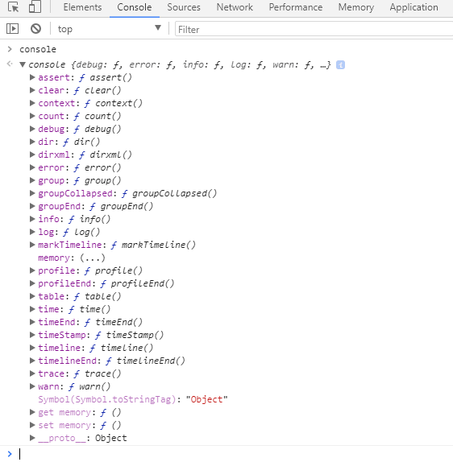
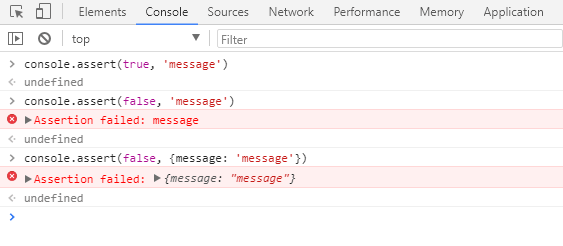
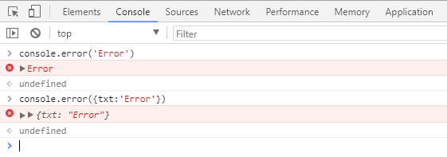
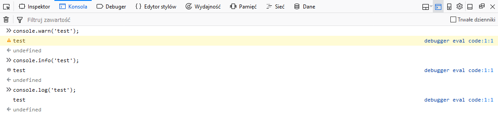
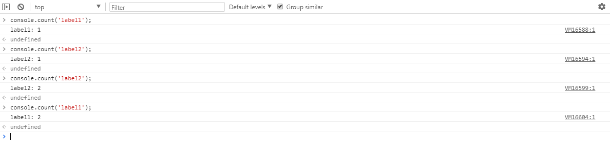
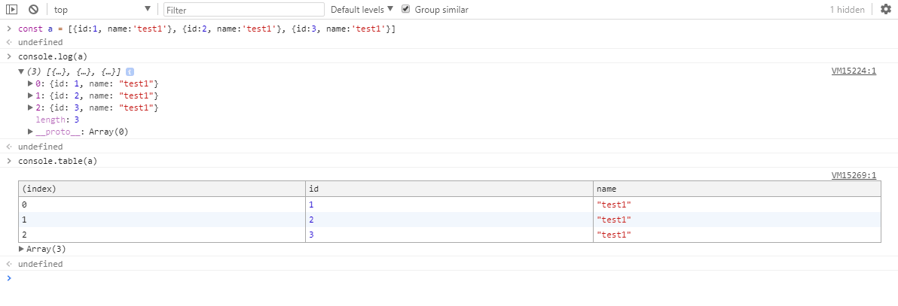
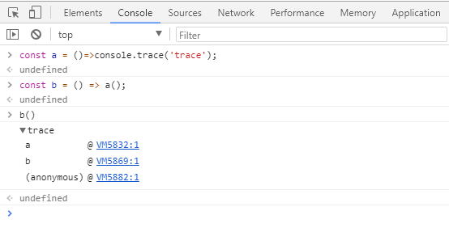
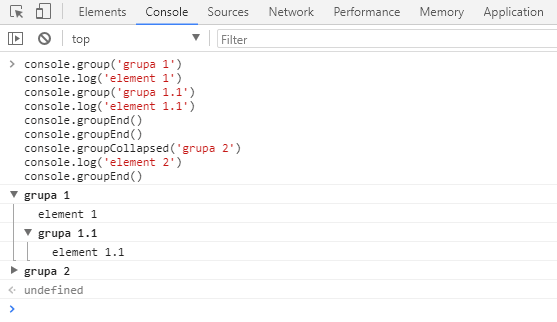
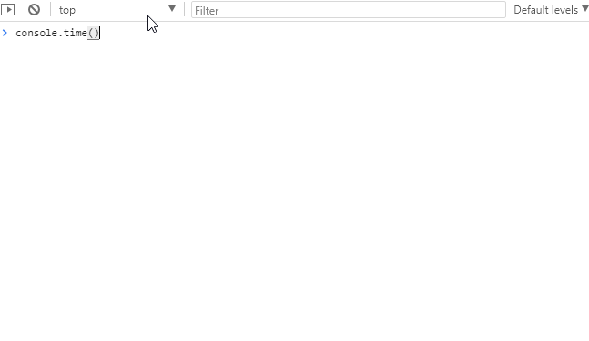

W świecie tworzenia aplikacji internetowych polecenie `console.log` jest jedną z pierwszych rzeczy jakie poznajemy. Pozwala nam w prosty sposób sprawdzić co się dzieje wewnątrz funkcji, jakie dane otrzymujemy oraz sprawdzić dlaczego coś nie działa tak jak chcemy. Jednak możemy użyć innych metod należących do obiektu `Console` o czym często zapominamy.

<!--more-->

## Informacje w konsoli

`Console` jest obiektem który istnieje w przeglądarce, posiadający zbiór metod których zadaniem jest wypisywanie danych w odpowiedni sposób do konsoli. Najczęściej używanym i pewnie znanym jest `console.log` ale nie jest on jedynym: 

Bardzo wiele metod z tej listy jest ciekawszych od zwykłego `loga` i może być dużo bardziej pomocne jeśli wiemy jak działa oraz że istnieje ;) 

Pierwsza na liście jest metoda `assert` która wyświetla w konsoli błąd jeśli pierwszy z argumentów tej funkcji przyjmuje wartość `false`:

Podobna do  `console.assert()` jest metoda `error`, która w ładny sposób wyświetla błąd w konsoli. 

Jak już mówimy o wyświetlaniu błędów to można od razu wspomnieć o `warn` i `info`.  `Warn` wyświetla nam w ładny sposób ostrzeżenia kolorując je na żółto w konsoli natomiast `info` wygląda prawie identycznie jak log oprócz małej ikonki `i` w niektórych przeglądarkach (u mnie pokazywała się w Firefox ale w Chromie już nie)

## Wyciągnij więcej z konsoli

Te wszystkie metody bardzo ciekawie wyglądają jak tworzymy jakieś własne biblioteki czy nawet zamknięte kawałki kodu i chcielibyśmy poinformować osobę która będzie z tego korzystała o błędzie jeśli go popełni. Jednak najczęsciej używamy obiektu `console` do szybkiego sprawdzenia czy  coś działa lub nawet częściej dlaczego nie działa. I możemy to sobie ułatwić wykorzystując odpowiednie metody.

Pierwszą z brzegu jest metoda `count` która wypisuje ile razy została wywołana. Możemy dodawać do tej metody etykietę i wtedy będzie zliczana ilość wywołań tej funkcji z daną etykietą. 

Dużo ciekawszymi są metody: `table` i `trace`. Pierwsza z nich pozwala na wyświetlenie w tabelce danych które przekażemy. Jest to dosyć wygodne ponieważ bardzo często w Javascript'cie korzystamy z tabel do przechowywania danych które otrzymaliśmy z zapytania REST i czasami potrzebujemy zajrzeć do środka. Metoda `log` co prawda wyświetla te dane ale zmusza do przeklikiwania się by dostać się do tego co potrzebujemy, natomiast `table` wyświetla wszystko od razu w ładnej tabeli

Również ciekawa jest metoda `trace`, która wyświetla nam jakie funkcje były wywołane aż do wyświetlenia komunikatu:

W przypadku zagnieżdżonych pętli albo funkcji ciekawą opcją może być grupowanie tego co wypisujemy w konsoli przy pomocy metody `group`. Wszystko co zostanie wypisane pomiędzy tą metodą a metodą `groupEnd` znajdzie się w jednej grupie. Możemy oczywiście zagnieżdżać je w sobie. Domyślnie grupa jest rozwinięta i jeśli chcemy by była domyślnie zwinięta musimy użyć 3 metody - `groupCollapsed`.

Właściwie to co wymieniłem to wszystko co zazwyczaj jest przydatne podczas debugowania aplikacji ale czasami warto się pochylić nad wydajnością oraz czasem wykonywania się kawałków kodu. Możemy do tego wykorzystać metodę `time` do rozpoczęcia pomiarów oraz `timeEnd` do zakończenia oraz wyświetlenia rezultatu. Podobnie jak w przypadku metody `count` możemy dodać dodatkowe etykiety które sprawią że będziemy  w stanie prowadzić do aż 10000 pomiarów jednocześnie

A czy wy znacie jeszcze jakieś inne ciekawe pomysły na wykorzystanie metod obiektu `console`? A może coś ominąłem lub dopiero niedawno się pojawiło lub ma zmienić? Zapraszam do komentowania 

