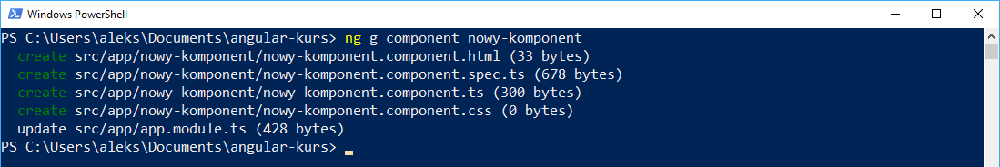

Ostatnio opisałem po krótce jak rozpocząć zabawę z Angularem(jeśli ominęliście post to znajdziecie go [tutaj](https://fsgeek.pl/post/angular-hello-world/)). Pisząc w tym frameworku najważniejszym funkcjonalnymi elementami są komponenty z których jak z cegiełek budujemy naszą aplikację. Im bardziej nasze komponenty będą uniwersalne i małe tym programowanie nie będzie ciężką pracą a bardziej składaniem systemu z gotowych elementów. Jednak by tak móc zrobić zacznijmy od stworzenia komponentu
<!--more-->
## Stwórzmy komponent

Aby stworzyć nowy komponent mamy dwie opcje: 1) ręcznie stworzyć właściwy plik lub 2) wykorzystać angular-cli. Ja polecam oczywiście opcję numer 2). Eliminuje ona nudny i powtarzalny proces  tworzenia nowego komponentu czyli: folder-> prawy->utwórz nowy-> … Jest to dosyć monotonne i warto się tego pozbyć. Aby wykorzystać do tego celu angular-cli musimy w konsoli wpisać następujące polecenie: `ng g component nazwa-komponentu` gdzie w miejsce `nazwa-komponentu` musimy podać nazwę naszego komponentu. Po wywołaniu tego polecenia zobaczymy w konsoli nastepujący efekt. 


 
Warto zauważyć, że nasz komponent został umieszczony w folderze o takiej samej nazwie oraz że oprócz samego pliku `*.component.ts` powstał odpawiadający mu plik `component.html`, `component.css` oraz `component.spec.ts` do testów jednostkowych. Oprócz utworzenia samych plików również został zmodyfikowany plik app.module.ts. Po co jednak? Jak zerkniemy do niego to zobaczymy, że została tam dodana następujące linijki 

```javascript
import{NowyKomponentComponent}from'./nowy-komponent/nowy-komponent.component'; // <-- ta


@NgModule({
declarations:[
AppComponent,
NowyKomponentComponent // <-- i ta
],

```

Jeśli pamiętacie w poprzednim wpisie wspominałem, że każdy tworzony przez nas komponent musi zostać zarejestrowany w pliku `app.module.ts`. Dzięki użyciu angular-cli nie musimy o tym samemu pamiętać, komenda zrobi to za nas. Dzięki temu możemy się skupić na kodzie. To jak wygląda nasz świeżo wygenerowany komponent?

## Pokaż komponencie co masz w środku

Komenda `ng g component` nie tworzy nam pustego pliku lecz już go częściowo wypełnia kodem. Świeżo wygenerowany komponent wygląda następująco: 

```javascript
import{Component,OnInit}from'@angular/core';

@Component({
	selector:'app-nowy-komponent',
	templateUrl:'./nowy-komponent.component.html',
	styleUrls:['./nowy-komponent.component.css']
})
export class NowyKomponentComponent implements OnInit{

	constructor(){}

	ngOnInit(){}

}

```

Widać, że została stworzona klasa o podanej przez nas nazwie (ale zmienionej na camelCase). W ciele klasy znalazł się konstruktor oraz specjalna funkcja ngOnInit, która jest jedną z funkcji nalężąca do tak zwanego cyklu życia komponentu - o tym opowiem więcej w następnym wpisie. Oprócz tego klasa została poprzedzona wymaganym dekoratorem @Component w której znalazły się następujące pola: 

- Selector czyli nazwa naszego taga w html
- templateUrl - url do miejsca gdzie jest plik *.html 
- styleUrl - url do pliku  *.css

Teraz żeby użyć naszego komponentu musimy w dowolnym pliku html umieścić taki tag `<app-nowy-komponent></app-nowy-komponent>`. Ja to umieściłem w pliku `app.component.ts` i po uruchomieniu aplikacji ukazał się taki widok: 


## Dekorator @Component

Oprócz wymienionych wyżej pól w dekoratorze @Component możemy zdefiniować wiele innych. Według dokumentacji mamy do wyboru następujące pola: 


Początkowo chciałem opisać wszystkie ale w oficjalnej dokumentacji każde jest dobrze opisane wraz z przykładem więc wspomnę o kilku ciekawszych. Ciekawymi polami są na przykład `template` i `style`. Pozwalają one  zdefiniować nasz szkielet html lub style css bezpośrednio w komponencie. Może być przydatne na przykład jak tworzymy małe komponenty np.: przycisk gdzie nie ma potrzeby żeby tworzyć osobny plik specjalnie dla jednego taga html i możemy go zdefiniować bezpośrednio w komponencie. Równie ciekawie wyglądają pola `inputs` i `outputs`. Pozwalają one zdefiniować dane wejściowe dla komponentu np.: nazwa przycisku oraz funkcję która ma być wywołana na określone zdarzenie w komponencie np.: zdarzenie onClick na przycisku. Można to porównać do przekazywania propsów w React'cie i jest to funkcjonalność bardzo często wykorzystywana więc pokażę jak można to zaimplementować

## Inputs i Outputs w komponencie

Żeby skorzystać z tych funkcjonalności w komponencie możemy albo wykorzystać pole w dekoratorze @Component lub jak to jest polecane wykorzystać dekoratory  `@Input()` i `@Output()` (link do [style guide](https://angular.io/guide/styleguide#decorate-input-and-output-properties)). Z racji tego, że najlepiej uczyć się dobrych praktyk podczas nauki wykorzystam to drugie, zalecane podejście. Pierwsze co zrobiłem to w moim utworzonym komponencie dodałem następujace linijki: 

```
@Input() buttonName:string;
@Output() buttonClick= new EventEmitter();
```
Jak widać jest to dosyć proste. Zmienną, której wartość chcę by była przekazana poprzedzam słówkiem `@Input()` natomiast tam gdzie chcę podpiąć funkcję, która będzie obsługiwała wydarzenie z komponentu poprzedzam słówkiem `@Output()`. Ważne również żeby nasze wydarzenie było obiektem klasy EventEmitter.   W pliku html również dodałem jedną linijkę

```
<button(click)="onClick()">{{buttonName}}</button>

```

Jedyna nowa rzecz o której nie mówiłem to jest `(click)="onClick()"`. W Angularze okrągłe nawiasy oznaczają że podpinamy do jakiegoś zdarzenia wewnątrz nawiasów funkcję w naszym komponencie. Jak można się domyślić `(click)` oznacza, że podpinamy się wydarzenia onClick z DOM'u i jak się wydarzy to wywołujemy funkcję `onClick()` z naszego komponentu która wygląda następująco: 

```
onClick(){
	this.buttonClick.emit();
}

```

Funkcja jest dosyć prosta i jedyne co robi to wywołuje funkcję którą przekazaliśmy do naszego pola `buttonClick`. Aktualnie nie przekazujemy żadnych parametrów ale możemy to zrobić co pokażę za chwilę. W tym momencie tak naprawdę cały komponent jest już gotowy do użycia. W pliku  `app.component.ts`  gdzie poprzednio zadeklarowałem komponent zrobiłem małą zmianę: 

```
<app-nowy-komponent buttonName="input test"(buttonClick)="increment()"></app-nowy-komponent>{{counter}}

```

Przekazałem do zmiennej `buttonName` własny tekst oraz podpiąłem funkcję pod akcję przyciśnięcia przycisku. Funkcja jest prosta i ogranicza się do zwiększenia wartości zmiennej `counter` o jeden by było widać efekt: 

```
increment(){
	this.counter++;
}

```

Efekt całości prezentuje się następująco: 


To czego nie widać to po każdym naciśnięciu przycisku zmienia się wartość pod przyciskiem. Tak jak wspominałem możemy również przekazywać parmetry przy wywołaniu funkcji `emit()`.  Funkcja ta może przyjąć 0 albo 1 argument więc jak potrzebujemy wysłać więcej danych to musimy opakować je w pojedynczy obiekt. Przekazanie parametru sprowadza się więc do wpisania wartość przy wywołaniu funkcji `this.buttonClick.emit('argument test');`. Żeby to teraz poprawnie przyjąć by móc to obsłużyć w naszej funkcji musimy dokonać małych zmian. To co przekażemy w funkcji emit jest widoczne jako zmienna `$event` w funkcji obługującej zdarzenie. Wystarczy więc, że zrobimy następującą zmianę w pliku html: `(buttonClick)="increment($event)"` oraz w naszej funkcji: 

```
increment($event){
	console.log('increment',$event)
	this.counter++;
}

```
Teraz po naciśnięciu przycisku w konsoli wyświetli nam się nasz przekazany tekst co znaczy że prawidłowo zaimplementowaliśmy przekazywanie argumentów


Dziś to by było na tyle. Starałem się przekazać według mnie najpotrzebniejsze rzeczy. Wiele innych wyjdzie na pewno przy pisaniu kolejnych artykułów więc będą tam opisane. Jeśli uważacie, że pominąłem coś ważnego lub w którymś miejscu coś źle opisałem to piszcie w komentarzu a dopiszę/poprawię. Według moich wewnętrznych zapisków następnym tematem o którym mam zamiar napisać to testy jednostkowe lub cykl życia komponentu. Jeśli was to interesuje to nie zapomnijcie polajkować fanpage'a [FSGeek](https://www.facebook.com/fsgeekk/) na fb by mieć pewność, że dostaniecie powiadomienie o kolejnym artykule.
