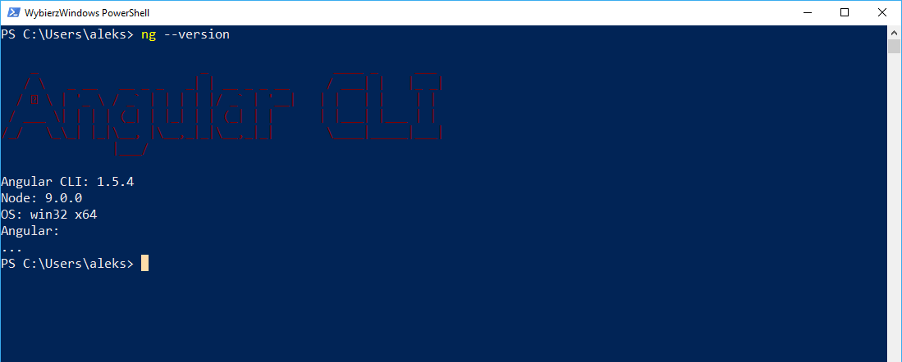
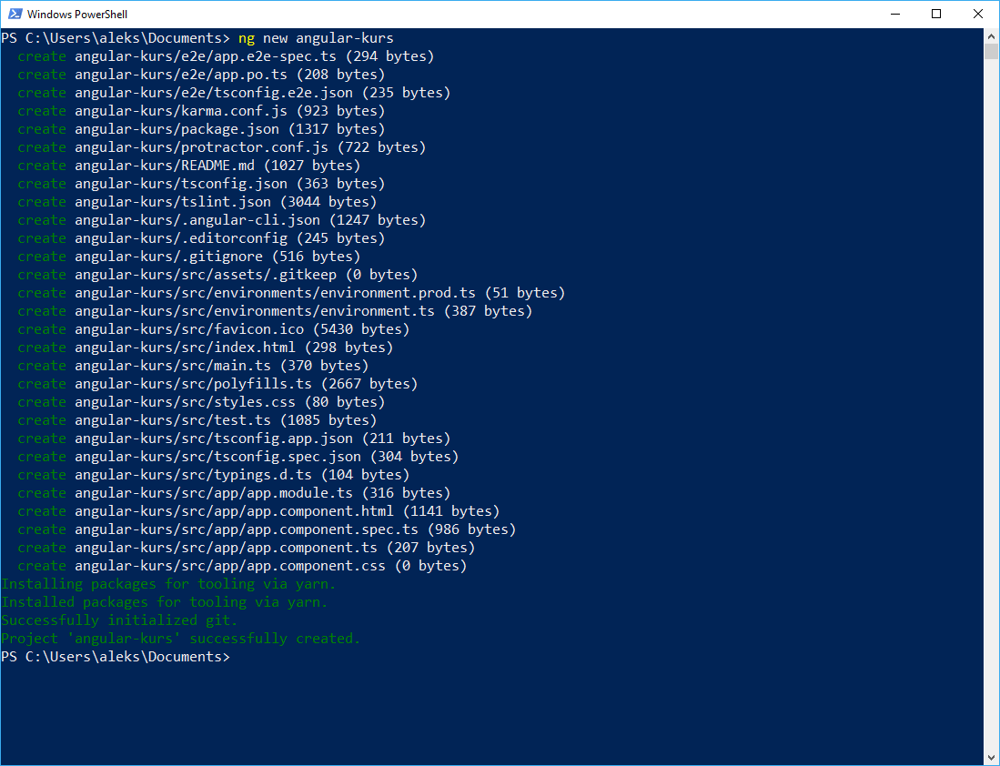
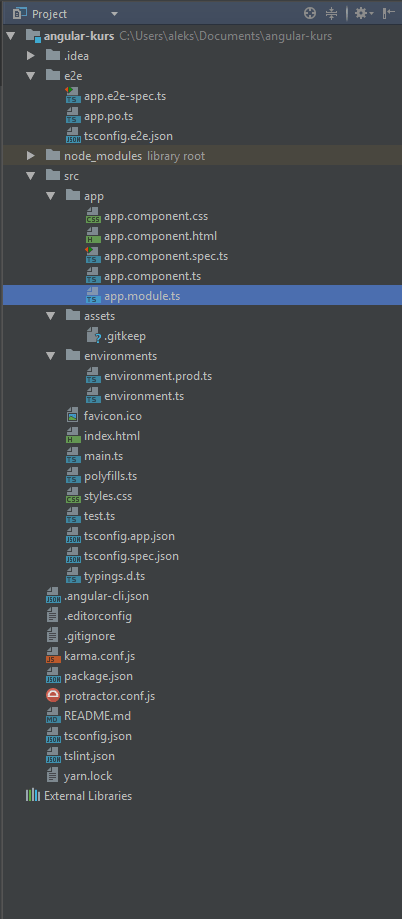
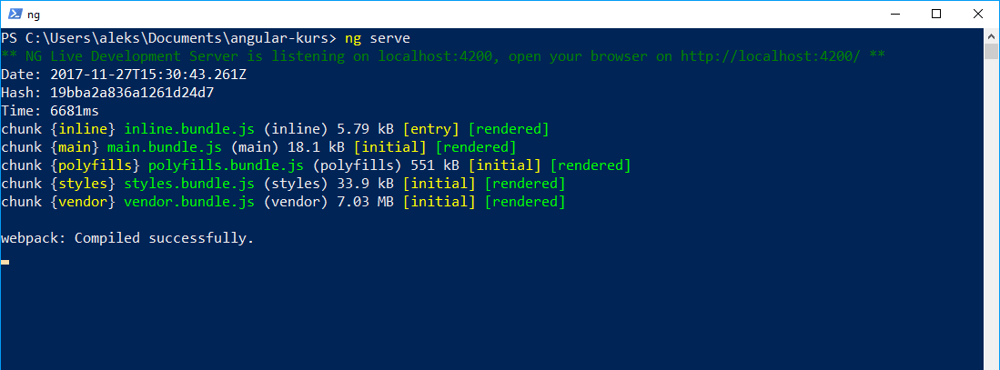

Ostatnio u mnie na blogu było sporo rzeczy dotyczących backendów. Jednak sam backend nie wystarczy by stworzyć aplikację w pełni. Użytkowników interesuje tak naprawdę jak coś wygląda, jak tego się używa a nie jak to działa wewnętrznie. Dlatego dzisiaj chciałbym zacząć serię mniejszą lub większą na temat Angulara. Będzie to dla mnie całkowicie nowy temat gdyż na co dzień piszę w Reactie ale będzie to też dobra okazja by spróbować czegoś nowego. Jeśli chcecie tak jak i ja spróbować swoich sił w Angularze to zapraszam. 
<!--more-->

## Jak zacząć pisać w Angular?

Angular(który teraz jest już w wersji 5) jest frameworkiem, który wyszedł spod rąk programistów Google'a. Jest to nowa, ulepszona wersja poprzedniego rozwiązania czyli AngularJS. Pomimo że jest to następca poprzedniej wersji to różnice są na tyle duże że bardziej się mówi o zupełnie nowym rozwiązaniu.  Razem z Angularem dostajemy potężne narzędzie w postaci Angular-CLI, które pomaga nam tworzyć, uruchamiać i rozszerzać aplikację. Jest zalecanym narzędziem do pracy więc i ja będę z niego korzystał starając się wyciągnąć z niego jak najwięcej. 

Żeby zacząć z niego korzystać należy go dodać globalnie do naszego systemu używająć npm lub yarn (ja osobiście wolę yarna ale nie ma to większego znaczenia) : `yarn global add @angular/cli`. Od teraz możemy w konsoli korzystać z polecenia `ng`, które pomoże nam w pisaniu aplikacji na Angulara.  



Dodatkowo wykonałem następującą komendę by również angular-cli korzystał z yarn'a : `ng set --global packageManager=yarn`.  Teraz wystraczy w konsoli wpisać  `ng new nazwa-projektu` gdzie `nazwa projektu` to nazwa katalogu pod jakim zostanie umieszczony nasz projekt. Jeśli zobaczymy coś takiego to znaczy, że projekt został utworzony pomyślnie:



## Angular - struktura plików

Jako, że Angular-CLI tworzy strukturę plików dla dowolnego projektu to mamy tutaj wszystko co możemy potrzebować więc i drzewo katalogu jest dość spore. 



Idąc od góry mamy następujące katalogi i pliki:

- e2e w którym mamy testy e2e naszej aplikacji, które dla Angulara są pisane w bibliotece Protractor
- src - główny katalog projektu w którym będą się znajdować wszystkie nasze komponenty
- Na samym dole mamy zestaw różnych plików konfiguracyjnych między innymi dla biblioteki Karma i Protrator, ustawienia dla typescripta czy tslinta. Dziś nie będę się nimi zajmował. Omówię je przy okazji omawiania tych bibliotek
	
Wewnątrz folderu `src` znajdziemy następujące rzeczy: 

- Folder app w którym jest nasz główny komponent aplikacji 
- Folder assets w którym będziemy umieszczać nasze obrazki, 
- Folder enviromets w którym znajdują się pliki gdzie możemy przechowywać konfiguracje która ma się różnić w zależności od środowiska
- Kolejne pliki konfiguracyjne ;) 

Wśród wszystkich wygenerowanych plików warto zwrócić uwagę na dwa: `app.modules.ts` oraz `main.ts`. Pierwszy z nich jest to plik, który jest wymagany w każdej aplikacji. Opisuje on z jakich komponentów jest zbudowana aplikacja. Wygląda następująco:

```
@NgModule({
  declarations: [
    AppComponent
  ],
  imports: [
    BrowserModule
  ],
  providers: [],
  bootstrap: [AppComponent]
})
export class AppModule { }
```

Jak widać składa się z kilku części: 

- `declarations` - tutaj znajduje się każdy komponent stworzony przez nas w aplikacji
- `imports` - tutaj wpisujemy jakie moduły z Angulara wykorzystujemy w aplikacji. Zawsze znajduje się tu BrowserModule ale również tutaj umieścimy np..: HttpClientModule czy RouteModule
- `providers` - tutaj można zadeklarować serwisy, które potem będziemy mogli wstrzyknąć w dowolnym komponencie w całej aplikacji
- `bootstrap` - określamy tutaj nasz nadrzędny moduł w aplikacji (można zadeklarować wiele komponentów ale zazwyczaj jest jeden)
	
Warto wspomnieć że plik ten jest mały tylko na początku pisania aplikacji. Wraz z rozwojem będzie się on powiększać.

Drugi plik jest troszkę mniejszy ale równie ważny. Wygląda następująco:

```
if (environment.production) {
  enableProdMode();
}

platformBrowserDynamic().bootstrapModule(AppModule)
  .catch(err => console.log(err));
```

Najważniejsza jest ostatnia linijka, która tworzy i umieszcza komponent, zadeklarowany jako `bootstrap` w poprzednim pliku, w odpowiednim miejscu pliku `index.html`. W przeciwieństwie do poprzedniego pliku on nie będzie tak często zmieniany.

## Angular  Hello World

Rozpisałem się trochę na temat samego Angulara, tworzenia projektu i jakie pliki dostajemy na starcie. Teraz przyszedł czas żeby coś uruchomić. Nie będziemy dziś tworzyć jeszcze własnych komponentów, skupimy się na istniejącym `app.component.js`: 

```
@Component({
  selector: 'app-root',
  templateUrl: './app.component.html',
  styleUrls: ['./app.component.css']
})
export class AppComponent {
  tekst = 'Hello World!';
}
```

Każdy komponent jest klasą poprzedzoną specjalnym dekoratorem `@Component`, dzięki któremu możemy do klasy dopisać plik html, style, selektor oraz wiele innych rzeczy które postaram się omówić dokładniej przy opisywaniu komponentów. Selektor jest to nazwa  taga w pliku html gdzie zostanie umieszczony nasz komponent. Nasz komponent ma selektor o wartości `app-root` i jak zerkniemy do pliku index.html to zobaczymy coś takiego
```
<body>
    <app-root></app-root>
</body>
```
Taki kawałek kodu sprawi, że pomiędzy znacznikami `body` zostanie umieszczony kod odpowiedzialny za nasz komponent. To teraz możemy delikatnie zmodyfikować plik `app.component.html` aby wyświetlić napis `Hello World!` Mój plik będzie wyglądał następująco: 

```
<div style="text-align:center">
  <h1>
    {{ tekst }}
  </h1>
</div>

```

Jedyna rzecz która może zdziwić w pliku html to `{{tekst}}`. Nie jest to element html a część Angulara. Zapis ten oznacza, że odwołujemy się do zmiennej zadeklarowanej w naszym komponencie i pobieramy jej wartość. Jako, że w naszym komponencie zmienna tekst ma wartość `Hello World!` to w przeglądarce powinniśmy zobaczyć nasz upragniony napis.   
Aby uruchomić aplikację musimy otworzyć konsolę i wpisać tam `ng serve`. Spowoduje to zbudowanie aplikacji przy pomocy webpacka oraz uruchomienie lokalnego serwera. Jeśli wszystko się udało to w konsoli powinniście zobaczyć coś takiego: 



Jeśli teraz wejdziecie w przeglądarce na adres `http://localhost:4200/` to powinniście ujrzeć upragniony napis Hello World


Dziś zrobiłem, krótki wstęp do nowego Angulara. W następnych postach będę chciał się pochylić głębiej nad konkretnymi elementami i zobaczyć co jesteśmy w stanie zrobić. Jeśli spodobał wam się post i nie chcielibyście ominąć następnych to pojalkujcie stronę [FSGeek](https://www.facebook.com/fsgeekk/) na facebooku by mieć pewność, że dostaniecie powiadomienie kiedy pojawi się nowy post. I do usłyszenia w kolejnym poście
