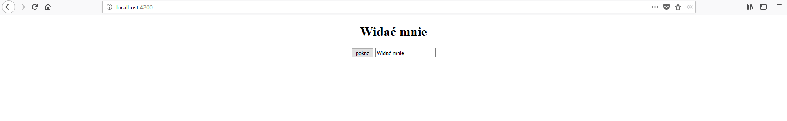
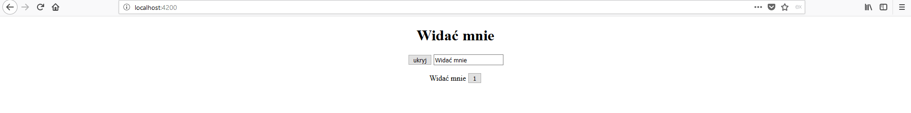
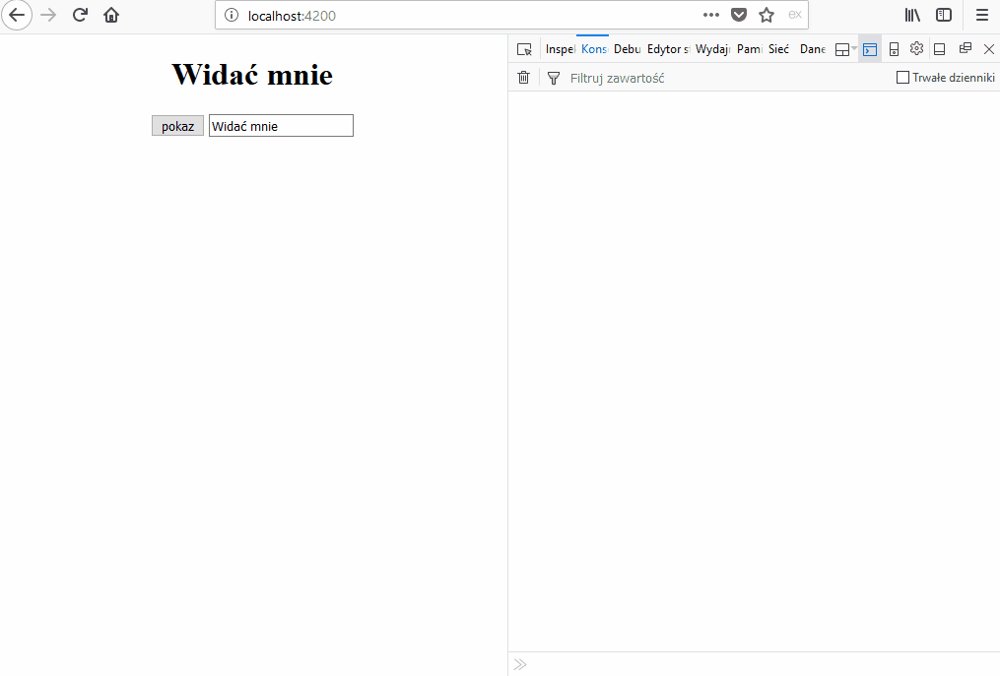
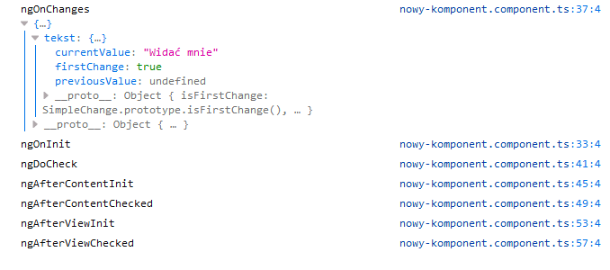
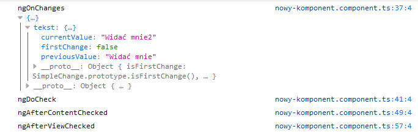

Komponenty w Angularze(podobnie jak w React'cie) mają swój cykl życia, który możemy wykorzystać przy pisaniu aplikacji. Jesteśmy w stanie zareagować na pojawienie się komponentu, jego zniknięcie czy zmiany jakie w nim zachodzą przy pomocy kilku funkcji. Jeśli jesteście ciekawi jak to zrobić i do czego wykorzystać to zapraszam do dalszego czytania.

<!--more-->

## Lifecycle Hooks

Mianem lifecycle hooks (macie pomysł jak to można nazwać po polsku?) określamy metody dzięki którymi jesteśmy w stanie podpiąć się do wydarzeń związanych z cyklem życia komponentu. Mamy dostępnych 8 metod: 

- ngOnChanges
- ngOnInit
- ngDoCheck
- ngAfterContentInit - po inicjalizacji `<ng-content>`
- ngAfterContentChecked - po każdej zmianie w `<ng-content>`
- ngAfterViewInit - po zainicjalizowaniu widoku komponentu
- ngAfterViewChecked - po każdej zmianie w widoku
- ngOnDestroy

Część z nich wywołuje się tylko raz w danym cyklu życia a część jest wywoływana przy każdej aktualizacji danych komponentu. 

## ngOnInit()

Jest to najbardziej podstawowa metoda, która jest wywoływana __*jednokrotnie*__ podczas tworzenia komponentu. Jest wywoływana zaraz po konstruktorze klasy oraz metodzie `ngOnChanges()` o której będzie niżej. Powinniśmy wykorzystywać tą metodę do inicjalizacji wszystkich danych jakich potrzebuje nasz komponent do pracy np.: pobranie danych z API.

## ngOnDestroy()

Skoro istnieje metoda, która się wywołuje przy tworzeniu komponentu musi też istnieć taka, którą możemy użyć tuż przed tym jak nasz komponent przestanie istnieć. `ngOnDestroy()` pozwala nam wykonać operacje zanim nasz komponent zniknie. Powinniśmy tutaj zatrzymać wewnętrzne liczniki oraz zwolnić wszystkie zasoby, które nie będą zwolnione automatycznie i będą zabierać pamięć.

## ngOnChanges()

Druga chyba z najczęściej wykorzystywanych metod. Jest wywoływana za każdym razem jak zmienia się wartość pola oznaczonego jako `@input()` w komponencie. W funkcji też jako parametr dostajemy obiekt, który zawiera obiekty o nazwie pól `@input()` które się zmieniły. Wewnątrz takiego obiektu mamy dostępne 3 pola: 

- currentValue - aktualnie przekazana wartość dla tego pola (wartość nowa)
- firstChange - pole typu boolean, które jest równe true tylko podczas pierwszej zmiany
- previousValue - pole zawiera poprzednią wartość pola

## ngDoCheck()

Jeśli w naszym komponencie mamy inne pola, które nie sią typu `@input()` a chcielibyśmy reagować na ich zmianę możemy użyć funkcji `ngDoCheck()`, która jest wywoływana przy każdym zauważeniu zmiany w komponencie. Trzeba bardzo uważać przy korzystaniu z tej funkcji gdyż jej złe wykorzystanie może spowodować wyraźne spowolnienie aplikacji. 

## Przykład

Teoria teorią jednak najlepiej pokazać jak to można wykorzystać. Stworzyłem prosty komponent który możecie zobaczyć poniżej: 

```
export class NowyKomponentComponent implements OnInit,
OnChanges,
DoCheck,
AfterContentInit,
AfterContentChecked,
AfterViewInit,
AfterViewChecked,
OnDestroy {

	counter = 1;
	@Input() tekst = '';
	
	ngOnInit() {
		console.log("ngOnInit",);
	}
	
	ngOnChanges(e) {
		console.log('ngOnChanges', e);
	}
	
	ngDoCheck() {
		console.log('ngDoCheck');
	}
	
	ngAfterContentInit() {
		console.log('ngAfterContentInit');
	}
	
	ngAfterContentChecked() {
		console.log('ngAfterContentChecked');
	}
	
	ngAfterViewInit() {
		console.log('ngAfterViewInit');
	}
	
	ngAfterViewChecked() {
		console.log('ngAfterViewChecked');
	}
	
	ngOnDestroy() {
		console.log('ngOnDestroy');
	}

}

```
Pierwsze na co warto zwrócić uwagę to dodanie odpowiednich interfejsów do naszej klasy. Nie jest to wymagane ale jest dobrą praktyką ponieważ możemy wtedy korzystać z typowania w Typescript oraz narzędzi w naszym edytorze.  

Wykorzystanie lifecycle hooks ogranicza się do stworzeniu funkcji o odpowiednich nazwach oraz napisaniu obsługi w nich. Aplikacja, która napisałem jest prosta i wygląda następująco:





Jest tu tylko przycisk do pokazywania i chowania naszego komponentu (tak właściwie to jest on tworzony i niszczony co za chwilę będzie widać) oraz pole input które posłuży do przekazywania nowej wartości do komponentu.



W momencie jak kliknąłem przycisk `pokaż` to został stworzony nasz komponent co widać w konsoli



W momencie inicjalizacji są wywoływane wszystkie metody cyklu życia oprócz `ngOnDestroy`(bo było by to głupie). Warto zauważyć że metoda `ngOnInit()` nie jest pierwsza z wywołanych metoda tylko drugą. 
Jako pierwsza została wywołana metoda `ngOnChanges`, która nie zawiera wartości poprzedniej(bo takiej nie ma - komponent został dopiero co stworzony), ale zawiera nową wartość oraz pole `firstChange` o wartości `true`. Dzięki takiej kolejności jesteśmy w stanie wykorzytsać podczas inicjalizacji komponentu dane do niego przekazane.  
Kolejność w jakiej zostały wywołane metody jest niezmienna i identyczna dla każdego komponentu. Jedyna zmiana może wystąpić jeśli nie mamy żadnych pól typu `@Input()`. Wtedy nie wykona się funkcja `ngOnChanges()`. 

Po zmianie tekstu w polu input została wywołana grupa metod: 



Znów podobnie jak w przypadku inicjalizacji komponentu mamy tutaj stałą kolejnośc wywoływania metod cyklu życia. Tym razem w `ngOnChanges` mamy już dostępną wartość poprzednią i możemy ją wykorzystać. 

Jak klikniemy przycisk to wykonają się wszystkie funkcje oprócz  `ngOnChanges()`. Jest to spowodowane tym że zmieniły nam się dane na widoku i musi on zostać odświeżony.  
Ze wszystkich metod zostało nam tylko `ngOnDestroy`. Zostanie on wywołany w momencie jak będziemy usuwać nasz komponent drzewa DOM. W moim przypadku dzieje się to poprzez kliknięcie przycisku `ukryj`

Ze wszystkich metod cyklu życia najczęściej będziemy korzystać z `ngOnInit()` i `ngOnChanges`. Pozostałe są użyteczne ale w przypadku konkretnych zastosowań, które wynikną podczas pisania kodu.

