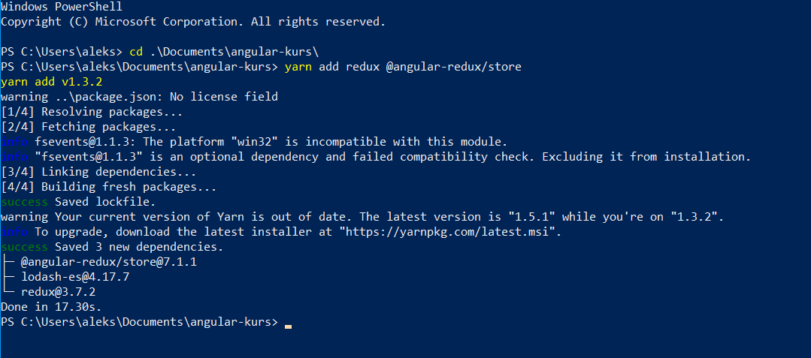
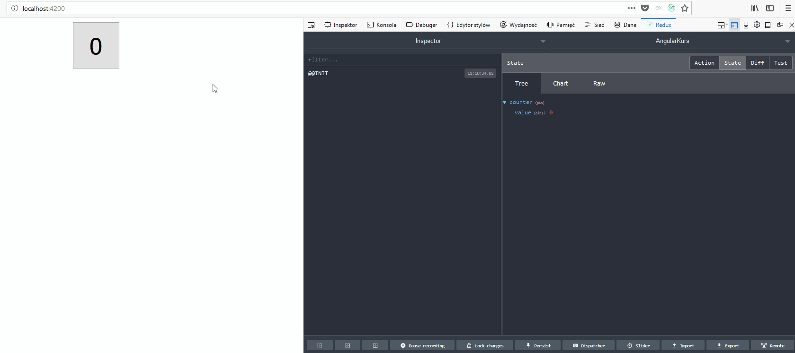

Od ponad pół roku pracuję z połączeniem React&Redux i po początkowych problemach polubiłem taką architekturę. Idea pojedynczego źródła danych oraz czyste funkcje pomaga przy tworzeniu oraz utrzymywaniu oprogramowania. Jak zacząłem zabawę z Angularem zacząłem się zastanawiać czy mogę użyć znanego mi już Reduxa w Angularze. I w ten sposób znalazłem `angular-redux`

<!--more-->

## Idea Reduxa

Idea tego rozwiązania jest prosta pomimo tego, że początkowo przytłacza ilością elementów i może wydawać się niezrozumiała. Reduxa można w skrócie opisać przy pomocy 3 zasad:

- Pojedyncze źródło prawdy - stan aplikacji jest przechowywany w pojedynczym obiekcie
- Stan aplikacji można tylko odczytać - zmiana stanu odbywa się wywołanie akcji
- Zmiany odbywają się przy pomocy czystych funkcji 

Z tych zasad wynikają 3 elementy o które musimy zadbać pisząc aplikację: 

- Store - przechowuje stan naszej aplikacji. W całej aplikacji istnieje tylko jeden taki obiekt.
- Actions - są to akcje wywoływane w aplikacji np.: CREATE_EVENT. Tylko za ich pomocą możemy aktualizować nasz Store.
- Reducers - są to czyste funkcje, które obsługują akcje. Na podstawie poprzedniego stanu aplikacji oraz wywołanej akcji jest zwracany nowy stan aplikacji


## Redux w Angularze

Jak wspomniałem we wstępie lubię idea pojedynczego źródła prawdy w aplikacji więc zacząłem szukać bibliotek, które pomagają to osiągnąć w Angularze i znalazłem dwie pozycje:  

- [angular-redux](https://github.com/angular-redux/store)
- [ngrx](https://github.com/ngrx/store)

Pierwsza z nich wyglądała dla mnie bardziej znajomo do tego co znam z Reacta więc postanowiłem ją wybrać.  Aby ją zainstalować wystarczy jedna komenda:

```
yarn add redux @angular-redux/store
```



Konfiguracja też nie jest ciężka co mam nadzieję za chwilę pokazać. Pierwsza rzecz jaką musimy zrobić to stworzyć nasz `store` w aplikacji. Robimy to poprzez zaimportowanie klasy `ngReduxModule` do naszego modułu aplikacji oraz następnie stworzenia store'a w konstruktorze.

```
@NgModule({
  declarations: [
    AppComponent,
  ],
  imports: [
    BrowserModule,
    NgReduxModule,
  ],
  providers: [],
  bootstrap: [AppComponent]
})
export class AppModule {
  constructor(ngRedux: NgRedux<IAppState>) {
    ngRedux.configureStore(rootReducer, undefined);
  }
 }

```

Mamy tutaj parę elementów na które warto zwrócić uwagę. Pierwszym jest argument w konstruktorze, który jest obiektem generycznym klasy NgRedux. W związku z tym musimy podać typ jaki będzie obsługiwała nasza klasa a co za tym idzie nasz redux store. Jako typ podajemy interfejs, który zawiera pola wraz typami, które są zgodne z zawartością naszego store'a. 

Mając to możemy faktycznie stworzyć nasz obiekt do przechowywania danych w aplikacji przy pomocy funkcji `configureStore`. Ma ona dwa wymagane parametry: reducer oraz stan początkowy. Jak zauważyliście u mnie stan początkowy ma wartość `undefined` - dzięki temu mogę podać osobno stan początkowy dla każdego reducera osobno. 


## Praktyczny przykład

Jeśli czytaliście mój wpis o komponentach w Angularze (a jeśli ominęliście to [zapraszam](https://fsgeek.pl/post/angular-komponenty/)) to omawiałem tam temat na przykładzie prostej aplikacji gdzie po wciśnięciu przycisku inkrementowała się liczba. Teraz pokażę jak można to zrobić z użyciem `angular-redux`.

Pierwsze co należy zrobić to zdefiniować jak ma wyglądać nasz store. 

```
export interface IAppState{
  counter: CounterState
}

```


Przykład jest prosty więc interfejs nie jest skomplikowany. Następna rzecz to nasz reducer, który będzie tworzył nowy stan aplikacji. 

```
const rootReducer = combineReducers<IAppState>({
  counter: counterReducer,
})

```

Wykorzystałem tutaj trochę na wyrost funkcję `combineReducers`. Pozwala ona zdefiniować więcej niż jeden reducer dla naszej aplikacji i wewnątrz tworzy z tych małych pojedynczych jeden duży.

Skoro zaimportowaliśmy nasz reducer to warto by zobaczyć jak on wygląda. 

```
import { Action } from 'redux';
import { INCREMENT_COUNTER } from './counter.actions';

export interface CounterState {
  value: number;
}

export const counterInitialState: CounterState = {
  value: 0,
};

export function counterReducer(state: CounterState = counterInitialState, action: Action): CounterState {
  switch (action.type) {
    case INCREMENT_COUNTER: return { value: state.value + 1 };
    default: return state;
  }
}

```

Dla tych co robili kiedyś w połączeniu React+Redux+Flow może się to wydawać znajome. Na samej górze definiuję interfejs dla danego reducera. Następnie definiuję jego stan początkowy. Jest to istotne ponieważ stan aplikacji musi być zawsze zwrócony oraz musi być zgodny ze zdefiniowanymi przez nas interfejsami

Na samym dole mamy część właściwą reducera czyli faktyczną funkcję, która przyjmuje dwa argumenty: aktualny stan oraz wywołaną akcję. Na podstawie tych informacji jesteśmy w stanie zdefiniować jak ma wyglądać nowy stan aplikacji. W momencie gdy zostanie wywołana akcja, której nie znamy to musimy ją zignorować ale musimy także coś zwrócić - więc zwracamy poprzedni stan.


No to zostało jeszcze określenie naszych akcji. Przyznam szczerze, że zrobiłem to identycznie jak w przypadku Reacta chociaż widziałem również inne propozycje. 

```
import { Action } from "redux";

export const INCREMENT_COUNTER = 'counter/INCREMEENT_COUNTER'

export const incrementCounter = (): Action =>({
    type: INCREMENT_COUNTER
})

```

W tym wykonaniu jest to bardzo proste, ponieważ definiuję tylko typ akcji oraz funkcję, która tworzy odpowiedni obiekt dla reducera - ustawia typ akcji jako mój zdefiniowany.

Mając to zostaje ostatnia rzecz - połączenie tego z komponentem. 


```
@Component({
  selector: 'app-root',
  templateUrl: './app.component.html',
  styleUrls: ['./app.component.css'],
})
export class AppComponent {
    @select('counter') counter$: Observable<CounterState>;
    
    constructor(private ngRedux: NgRedux<IAppState>){
    }

    onClick(){
      this.ngRedux.dispatch(incrementCounter());
    }

}
```

Mamy tutaj znowu parę elementów na które warto zwrócić uwagę. Pierwszy to dekorator `@select`, która pozwala pobrać ze store'a interesujący nas element i umieścić ją w zmiennej typu `Observable`. Funkcja ta może przyjąć kilka argumentów: 

- 0 argumentów - wtedy odpowiedni element ze store'a jest wybierany na podstawie nazwy np.: `@select() counter$` wybiera element `counter` (nie ma znaczenia czy damy na końcu znak `$` czy nie - $ na końcu jest tylko konwencją nazewniczą)
- 1 argument - wtedy wybiera dokładnie podany element
- tablica argumentów - tzw.: selektor ścieżki czyli z elementów tablicy tworzy ścieżkę do konkretnej zmiennej np. `@select(['counter', 'value'])` wybierze element `value`, który znajduje się w obiekcie `counter` w state'cie
- Funkcja - wtedy nasz dekorator wykorzysta funkcję by znaleźć właściwy element, argumentem funkcji jest obiekt state np.: `@select(state=>state.counter)`
	
Idąc dalej w konstruktorze tworzymy instancję klasy `NgRedux` dzięki czemu w funkcji `onClick()` możemy wykorzystać funkcję `dispatch`, która wywoła akcję `increment()`.

Na sam koniec jeszcze tylko warto pokazać jak wyświetlić taką zmienną typu Observable na widku.

```
<div style="text-align:center">
  <button (click)="onClick()">{{(counter$ | async).value}}</button>
</div>
```

Z racji tego, że jest to zmienna Observable musimy użyć pipe'a async. Pobiera on ostatnią wartość dla tej zmiennej kiedy tylko się pojawi i wyświetla. Jako, że pobrana wartość w tym przypadku to obiekt to muszę jeszcze wyłuskać odpowiednie pole. Wygląda trochę dziwnie ale działa :D


Na sam koniec narzędzie bez którego nie wyobrażam sobie pracy z Reduxem czyli reduxDevTools. Na szczęście konfiguracja tego narzędzia jest prosta i ogranicza się do jednej linijki:

```
export class AppModule {
  constructor(ngRedux: NgRedux<IAppState>, devTools: DevToolsExtension,) {
    ngRedux.configureStore(rootReducer, undefined, [], devTools.isEnabled() ? [ devTools.enhancer() ] : []);
  }
 }
```

Pusty nawias, który jest przekazany jako 3 argument jest obowiązkowy ponieważ tam jest miejsce dla zdefiniowanych przez nas middlewarów.  A jak całość działa?



Może się wydawać, że wsadzanie Reduxa niepotrzebnie komplikuje naszą aplikację. Jest to prawa dla małych aplikacji ale  czy wtedy potrzebujemy takiego dużego frameworka jak Angular? Dla dużych aplikacji widać korzyści z tego płynące i osobiście bardzo polecam. A może używaliście kiedyś tego drugiego rozwiązania i moglibyście powiedzieć czy wybrałem dobrze czy źle? Zapraszam do dyskusji.


