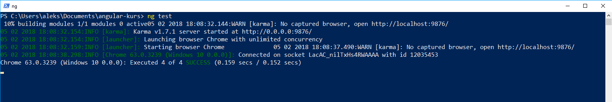
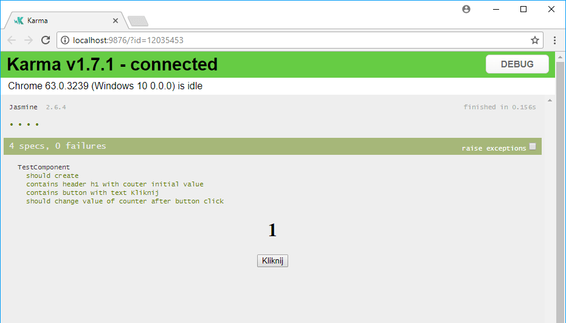

Testy są jednym z elementów naszej pracy jako programiści. Cokolwiek by o nich nie powiedzieć są ważną częścią wytwarzania oprogramowania i nie wyobrażam sobie aktualnie wypuszczenie kawałka kodu bez testów do niego. Dziś chciałbym poruszyć kwestię testowania komponentów w Angularze. Jeśli nigdy tego nie robiliście i chcielibyście zacząć to zapraszam do dalszego czytania.

<!--more-->

## A po co mi są w ogóle testy?

Jak już wspomniałem we wstępie testy są wymaganym elementem przy tworzeniu oprogramowania. Pozwalają nam kontrolować zmiany i pilnują byśmy nie popełnili błędów podczas rozwijania naszego kodu. Niech pierwszy rzuci kamieniem kto nie trafił do starego projektu gdzie nie było ani jednego testu. Praca w takim środowisku to strach i stres, że nasze zmiany zepsują inną część systemu. Nie polecam pracy w takich warunkach. Lepiej trafić do projektu gdzie mamy testy, które pilnują nas dopóki się porządnie nie wdrożymy. Tak więc kierujać się zasadą: `pisz taki kod do jakiego sam byś chciał trafić` piszmy dobry kod z dobrymi testami. Jeśli chcecie poczytać więcej o samych testach lub o testach w React'cie to zapraszam do poprzednich wpisów: [O testach w programowaniu](https://fsgeek.pl/post/czym-sa-testy-w-programowaniu/), [Testowanie w React'cie](https://fsgeek.pl/post/react-testowanie-jest-i-enzyme/)


## Testowanie w Angularze

W React'cie do testowania korzystamy najczęściej z połączenia Jest i Enzyme. Musieliśmy to odpowiednio skonfigurować by z tego korzystać. W Angularze dzięki wykorzystaniu Angular-Cli mamy wszystko już skonfigurowane i dostępne od razu do wykorzystania. Korzystamy tutaj z Jasmine, Karmy, Protractora oraz zestawu narzędzi napisanych specjalnie do testowania. Dziś się skupię tylko na testowaniu jednostkowym - testowaniu komponentów a do tematu testów e2e wrócę przy innej okazji.

Przy testowaniu komponentów najważniejsze jest by przetestować najważniejsze jego elementy. Tak aby jak będziemy w nim coś zmieniać mieć pewność, że nasze zmiany niczego nie popsuły. Pod tym pojęciem można umieścić wiele rzeczy ale głównie chodzi nam o sprawdzenie czy kluczowe elementy komponentu się wyświetlają np.: przyciski, nagłówki, przekazany tekst oraz czy nasz komponent właściwie reaguje na akcje które wykonuje użytkownik np.: określona zmiana na naciśnięcie przycisku. 


## Testowanie prostego komponentu

Chciałbym pokazać przykład jak można testować prosty komponent. Dziś pokażę tylko proste rzeczy, żeby pokazać że nie trzeba się tego bać oraz że nawet najprostsze komponenty zasługują na napisanie pod nich testów. Kod którym mam zamiar się dziś zająć wygląda następująco: 

```

<div style="text-align:center">
<h1>
{{ counter }}
</h1>
<button (click)="increaseCounter()">Kliknij</button>
</div>


```


Tak jak mówiłem - jest bardzo prosty i pewnie niektórzy by pomyśleli, że nie ma co tam testować. A to błąd. Jednak zacznijmy od początku. Pliki testujące są rozpoznawane przez rozszerzenie `spec.js`.  Jak utworzymy nowy komponent przy pomocy Angular-Cli to dostaniemy gotowy szablon pliku: 

```

describe('TestComponent', () => {
	let component: TestComponent;
	let fixture: ComponentFixture<TestComponent>;
	
	beforeEach(async(() => {
		TestBed.configureTestingModule({
			declarations: [ TestComponent ]
		})
	.compileComponents();
	}));
	
	beforeEach(() => {
		fixture = TestBed.createComponent(TestComponent);
		component = fixture.componentInstance;
		fixture.detectChanges();
	});
	
	it('should create', () => {
		expect(component).toBeTruthy();
	});

});


```

Szablon ten będzie identyczny dla każdego pliku tego typu i można w nim wyróżnić kilka elementów:

- `describe` - opakowuje nasze testy pod wspólną nazwą 
- `it` - definiuje pojedynczy test
- `beforeEach` - wewnątrz tej funkcji możemy umieścić kod, który wykona się przed każdym pojedynczym testem

 W wygenerowanym kodzie mamy dwa funkcje `beforeEach()`. Pierwsza z nich jest asynchroniczna i pozwala na skompilowanie naszego komponentu czyli złożenie wszystkich plików, które się na niego składają w jedną całość. Zaraz po tym jak się zakończy ta funkcja jest wywoływana druga, która tworzy nam komponent oraz go zwraca dzięki czemu jesteśmy w stanie wyszukiwać w nim elementy, sprawdzać ich zawartość itd. Ciekawa jest funkcja `fixture.detectChanges();` która wywołuje sprawdzanie zmian w komponencie.  Robimy to w każdym  teście ponieważ pozwala na wpisaniu wartości domyślnych które są zdefiniowane w komponencie do naszego widoku (w przypadku tego komponentu wartości zero dla zmiennej counter).

Mając tak przygotowany szkielet można tworzyć testy. Pierwszy test który jest od razu tworzony to sprawdzenie czy nasz komponent się w ogóle poprawnie tworzy. Oprócz niego możemy dopisywać własne testy. Ja jestem zwolennikiem pisania małych testów, które sprawdzają pojedyncze rzeczy. Wychodzi ich czasami więcej ale uważam, że łatwiej jest panować nad zmianami i można szybciej znaleźć błędy na ich podstawie. 

Testy zaczynam zazwyczaj od sprawdzenia czy komponent inicjuje się wartościami początkowymi i dla tego komponentu stworzyłem następujące testy: 

```

it('contains header h1 with couter initial value', () => {
	const h1 = fixture.debugElement.query(By.css('h1')).nativeElement;
	expect(h1).toBeTruthy();
	expect(h1.textContent).toContain(0);
});

it('contains button with text Kliknij', () => {
	const button = fixture.debugElement.query(By.css('button')).nativeElement;
	expect(button).toBeTruthy();
	expect(button.textContent).toContain('Kliknij');
});


```
W obu przypadkach najpierw sprawdzam czy szukany element istnieje a następnie czy ma oczekiwaną przeze mnie wartość. Szukanie elementów w komponencie jest wykonywane przy pomocy funkcji `query(By.css('h1'))`. Możemy tutaj szukać nie tylko po nazwie tagu ale również klasy i identyfikatora.

Oprócz testowania statycznego w większości komponentów możemy wykonywać pewnego rodzaju akcje i warto je też przetestować. W tym przykładzie jesteśmy w stanie kliknąć w przycisk co spowoduje zwiększenie wartości licznika. 

```
it('should change value of counter after button click', () => {
	const h1 = fixture.debugElement.query(By.css('h1')).nativeElement;
	const button = fixture.debugElement.query(By.css('button')).nativeElement;
	expect(h1.textContent).toContain(0);
	button.click();
	fixture.detectChanges();
	expect(h1.textContent).toContain(1);
});

``` 

Test jest dosyć prosty i składa się ze znalezienia przycisku, sprawdzenia jego wartości początkowej, wykonania akcji kliknięcia na niego i sprawdzenie jego stanu po tym wydarzeniu. Ważne jest aby wywołać `fixture.detectChanges();` dzięki czemu w komponencie zostaną wykryte zmiany a on sam zostanie zaktualizowany. 

Aby uruchomić napisane testy musimy w konsoli wpisać `ng test`.  Dzięki temu zostaną uruchomione testy - w konsoli zobaczymy wynik testów wraz czasem wykonania: 



Otworzy nam się również okno Chroma gdzie zobaczymy status poszczególnych testów. Możemy również tutaj uruchomić pojedynczy test lub też ponownie sprawdzić cały zestaw: 



Na dzisiaj to by było tyle. Dla niektórych pewnie mało ale chciałem pokazać podstawy by osoby które nigdy nie testowały mogły na spokojnie zacząć. Na rzeczy trudniejsze przyjdzie czas a i ja zapewne wrócę do testowania w innym poście ponieważ jest to ciekawy temat o którym można dużo pisać. Należy pamiętać, że testowanie nie jest prostą czynnością i na samym początku jest ciężko napisać nawet najprostszy test. Ale to nie powinno być wymówką przed rozpoczęciem tego. Z czasem pisanie testów będzie proste i stanie się nieodzownym elementem naszego warsztatu programistycznego a nasz kod piękniejszy. 
