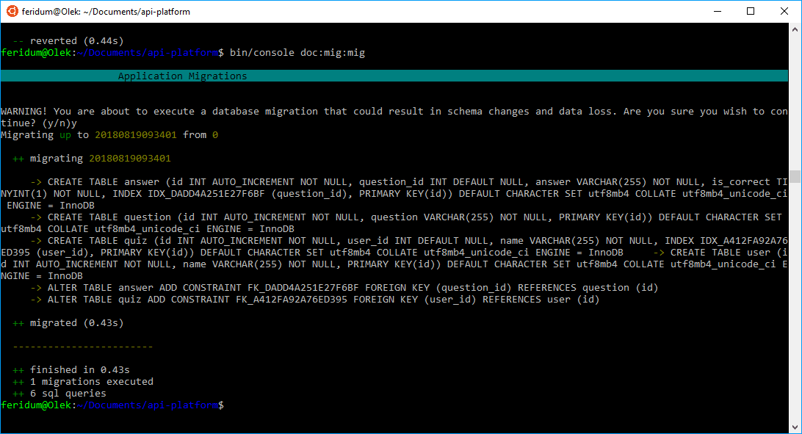
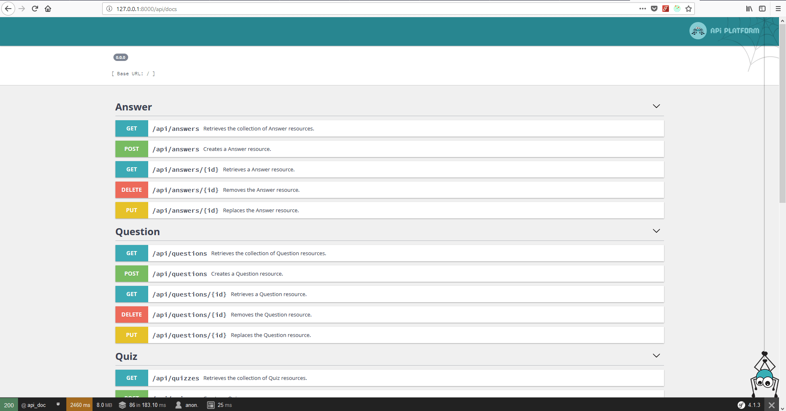

Tworzenie endpointów jest zadaniem powtarzalnym. Trzeba stworzyć odpowiednią encję, zaktualizować bazę danych oraz napisać nowe kontrolery, które pozwolą pobrać dane, stworzyć nowe lub wyedytować istniejące. Jednak dzięki API Platform jesteśmy w stanie część tych rzeczy zautomatyzować i zapomnieć o nich. Jak? Zapraszam do czytania.

<!--more-->

## Encje w Symfony
Zanim jednak automatycznie stworzymy nasze API musimy posiadać encje. W Symfony encjami nazywamy klasy, które reprezentują tabele z bazy danych. W ten sposób zamiast operować bezpośrednio na bazie danych, na kolumnach i relacjach mamy warstwę abstrakcji, która ukrywa bazę dając nam w zamian zwykłe programowanie obiektowe. Tym, żeby zmapować dane pomiędzy tymi dwoma elementami zajmują się biblioteki ORM - w naszym przypadku Doctrine. 

Jak już wspomniałem w poprzednim poście tematem przewodnim tego i następnych wpisów będzie API do aplikacji do tworzenia i rozwiązywania quizów. Na te potrzeby stworzyłem 4 encje: 

- User 
- Quiz 
- Question
- Answer

Same klasy wyglądają następująco:

```php
/**
 * Class User
 * @package App\Entity
 * @ORM\Entity
 * @ApiResource()
 */
class User
{

    /**
     * @ORM\Column(type="integer")
     * @ORM\Id
     * @ORM\GeneratedValue(strategy="AUTO")
     */
    private $id;

    /**
     * @ORM\Column(type="string")
     */
    private $name;

    /**
     * @ORM\OneToMany(targetEntity="Quiz", mappedBy="user")
     */
    private $quizes;

```

```php
/**
 * Class Question
 * @package App\Entity
 * @ORM\Entity
 * @ApiResource()
 */
class Question
{

    /**
     * @ORM\Column(type="integer")
     * @ORM\Id
     * @ORM\GeneratedValue(strategy="AUTO")
     */
    private $id;

    /**
     * @ORM\Column(type="string")
     */
    private $question;

    /**
     * @ORM\OneToMany(targetEntity="Answer", mappedBy="question")
     */
    private $answers;
```

```php
/**
 * Class Answer
 * @package App\Entity
 * @ORM\Entity
 * @ApiResource()
 */
class Answer
{
    /**
     * @ORM\Column(type="integer")
     * @ORM\Id
     * @ORM\GeneratedValue(strategy="AUTO")
     */
    private $id;

    /**
     * @ORM\Column(type="string")
     */
    private $answer;

    /**
     * @ORM\Column(type="boolean")
     */
    private $isCorrect;

    /**
     * @ORM\ManyToOne(targetEntity="Question", inversedBy="answers")
     */
    private $question;
```

```php
/**
 * Class Quiz
 * @package App\Entity
 * @ORM\Entity
 * @ApiResource()
 */
class Quiz
{

    /**
     * @ORM\Column(type="integer")
     * @ORM\Id
     * @ORM\GeneratedValue(strategy="AUTO")
     */
    private $id;

    /**
     * @ORM\Column(type="string")
     */
    private $name;


    /**
     * @ORM\ManyToOne(targetEntity="User", inversedBy="quizes")
     */
    private $user;
```

Oprócz tego co widać zostały stworzone również gettery i settery, czyli funkcje które pozwalają pobierać i ustawiać wartości. W każdym przykładzie widzimy tradycyjną konfigurację dla encji w Symfony. Jest to zwykła klasa posiadająca prywatne pola oraz konfiguracja Doctrina dla każdego pola. Konfiguracja w tym przypadku to adnotacje czyli specjalne komentarze ustawiające pewne parametry np.: typ kolumny w bazie danych lub relacje do innych encji jak na przykład w Quiz do Questions. Zdaję sobie sprawę, że za pierwszym razem może się to wydawać dziwne - sam się dziwiłem jak można konfigurować takie rzeczy przy pomocy komentarzy(prawie je usunąłęm bo myślałem, że są zbędne).

## Synchronizacja encji z bazą danych

Poprawna konfiguracja encji to połowa sukcesu ponieważ trzeba jeszcze zsynchronizować naszą konfigurację do tabel w bazie danych. Do tego celu polecam skorzystanie z DoctrineMigrations - pozwala tworzyć pliki migracji, które pokazują kolejne zmiany jakie były aplikowane na bazie danych. Dzięki tym plikom w razie problemów jesteśmy w stanie wrócić do poprzedniej wersji bazy cofając ostatnie zmiany. Aby móc z tego skorzystać musimy najpierw zainstalować odpowiednią paczkę przy pomocy `composer require migrations`. Następnie przy pomocy `bin/console doctrine:migrations:diff` porównywany jest aktualny stan bazy danych z konfiguracją w plikach encji. Jeżeli występują jakieś różnice to zostanie wygenerowany plik o unikalnej nazwie zawierający polecenia, które przekształcą aktualną bazę danych do nowej wersji. W przypadku encji powyżej powstanie coś takiego: 


```php
final class Version20180819093401 extends AbstractMigration
{
    public function up(Schema $schema) : void
    {
        // this up() migration is auto-generated, please modify it to your needs
        $this->abortIf($this->connection->getDatabasePlatform()->getName() !== 'mysql', 'Migration can only be executed safely on \'mysql\'.');

        $this->addSql('CREATE TABLE answer (id INT AUTO_INCREMENT NOT NULL, question_id INT DEFAULT NULL, answer VARCHAR(255) NOT NULL, is_correct TINYINT(1) NOT NULL, INDEX IDX_DADD4A251E27F6BF (question_id), PRIMARY KEY(id)) DEFAULT CHARACTER SET utf8mb4 COLLATE utf8mb4_unicode_ci ENGINE = InnoDB');
        $this->addSql('CREATE TABLE question (id INT AUTO_INCREMENT NOT NULL, question VARCHAR(255) NOT NULL, PRIMARY KEY(id)) DEFAULT CHARACTER SET utf8mb4 COLLATE utf8mb4_unicode_ci ENGINE = InnoDB');
        $this->addSql('CREATE TABLE quiz (id INT AUTO_INCREMENT NOT NULL, user_id INT DEFAULT NULL, name VARCHAR(255) NOT NULL, INDEX IDX_A412FA92A76ED395 (user_id), PRIMARY KEY(id)) DEFAULT CHARACTER SET utf8mb4 COLLATE utf8mb4_unicode_ci ENGINE = InnoDB');
        $this->addSql('CREATE TABLE user (id INT AUTO_INCREMENT NOT NULL, name VARCHAR(255) NOT NULL, PRIMARY KEY(id)) DEFAULT CHARACTER SET utf8mb4 COLLATE utf8mb4_unicode_ci ENGINE = InnoDB');
        $this->addSql('ALTER TABLE answer ADD CONSTRAINT FK_DADD4A251E27F6BF FOREIGN KEY (question_id) REFERENCES question (id)');
        $this->addSql('ALTER TABLE quiz ADD CONSTRAINT FK_A412FA92A76ED395 FOREIGN KEY (user_id) REFERENCES user (id)');
    }

    public function down(Schema $schema) : void
    {
        // this down() migration is auto-generated, please modify it to your needs
        $this->abortIf($this->connection->getDatabasePlatform()->getName() !== 'mysql', 'Migration can only be executed safely on \'mysql\'.');

        $this->addSql('ALTER TABLE answer DROP FOREIGN KEY FK_DADD4A251E27F6BF');
        $this->addSql('ALTER TABLE quiz DROP FOREIGN KEY FK_A412FA92A76ED395');
        $this->addSql('DROP TABLE answer');
        $this->addSql('DROP TABLE question');
        $this->addSql('DROP TABLE quiz');
        $this->addSql('DROP TABLE user');
    }
}

```


Taka migracja jest zwykłą klasą PHP i składa się z dwóch funkcji `up` i `down`. Pierwsza z nich jest wywoływana kiedy aplikujemy zmiany do bazy danych natomiast druga gdy je cofamy. Oczywiście możemy rozbudować te funkcje o własne zapytania jeżeli tego potrzebujemy. Teraz żeby nałożyć te zmiany musimy skorzystać z polecenia `bin/console doctrine:migrations:migrate`



Warto jeszcze zauważyć, że podczas migrowania bazy danych nie tworzymy od zera bazy tylko nakładamy ostanie zmiany. To jaka zmiana była ostatnia jest wiadome ponieważ nazwy(a dokładniej ta część gdzie jest data np.:`20180819093401`) wszystkich do tej pory wykonanych migracji są trzymane w specjalnej tabeli w bazie danych - `migration_versions`

## Endpointy API Platform
Tyle wystarczy żeby baza danych miała odpowiednią strukturę. Ale możecie zapytać co z tym API? Aby je zobaczyć uruchomcie serwer przy pomocy `bin/console server:run` i wejść w przeglądarce na stronę `127.0.0.1:8000/api/docs`. Zobaczymy tam Swaggera i wszystkie dostępne endpointy:



Jeśli zastanawiacie się skąd się to wzięło to zerknijcie z powrotem do części gdzie wkleiłem kod swoich encji. W adnotacji nad klasą zobaczycie taki wpis: `@ApiResource()` - to on powoduje, że dla tej klasy zostaną wygenerowane enpointy. Dzięki tej jednej adnotacji w bezproblemowy sposób stworzyliśmy pierwsze endpointy, które możemy już wykorzystywać - w normalnej aplikacji, w Postmanie lub wykorzystując interfejs Swaggera. Czy jednak to koniec naszej pracy? No nie do końca. Jeśli byście weszli w szczegóły endpointów to zobaczycie, że przykładowe zapytania zawierają czasami niepotrzebne pola czy też czasami nie będzie wszystkich enpointów które byśmy potrzebowali. Jak można to obejść? Właściwą konfiguracją ale to już następnym razem ;) 


