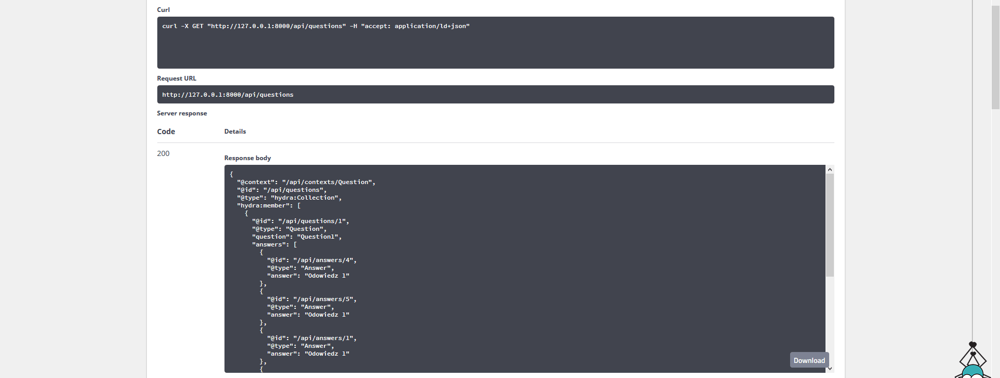
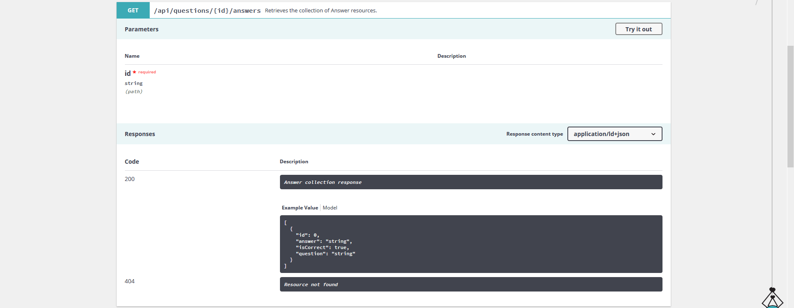
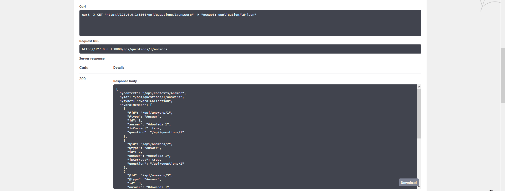

W ostatnim wpisie pokazałem jak możemy stworzyć encje i pierwsze endpointy, jednak to nie jest koniec naszej pracy. Rzadko kiedy te domyślnie wygenerowane będą odpowiadać naszym potrzebom - ciało zapytania może wymagać niepotrzebnych pól, odpowiedź może nie odpowiadać potrzebom frontu lub nawet nie ma endpointów, które potrzebujemy. Na szczęście da się to obejść odpowiednią konfiguracją API Platform o czym dziś parę zdań.

<!--more-->

## Operacje na encji 

Zanim przejdziemy do samej konfiguracji warto wspomnieć o samych operacjach w API Platform. Framework dzieli je na dwie grupy: 

- Collection operations
- Item operations

Endpointy z pierwszej grupy dotyczą całej encji i mamy tam domyślnie dwie operacje - `GET` (do pobierania całej kolekcji) i `POST` do dodania nowego elementu. Analogicznie dla drugiej grupy mamy operacje -  `GET`  (tym razem pobranie pojedynczego elementu), `PUT` - edycja elementu i `DELETE` do usunięcia. Aby zmienić jakie metody będą wygenerowane możemy skorzystać z opcji `collectionOperations` i `itemOperations`. Obie grupy możemy konfigurować osobno czyli jeśli na przykład nie chcemy pozwolić na usunięcie elementu to możemy wyedytować tylko `itemOperations`. 

To o czym jeszcze nie wspomniałem to, że edycja następuje w anotacji `@ApiResources()` nad nazwą klasy czyli dla przykładu jeśli chcielibyśmy pozwolić tylko na tworzenie i pobieranie pytań moglibyśmy napisać coś takiego

```php
@ApiResource(
	collectionOperations={"get","post"},
	itemOperations={"get"}
)
```


## Grupy normalizacyjne i denormalizacyjne

W ten sposób możemy już decydować jakie endpointy chcemy utworzyć i udostępnić w API. Jednak to nie rozwiązuje problemu ilości pól w enpoincie. Zobaczmy taki endpoint `/api/questions`. 


Aktualnie wymaga on podczas tworzenia nowego pytania by podać id, nazwę pytania i tablicę odpowiedzi. Nie jest to zbyt szczęśliwy dobór pól ponieważ: 

A) id powinny nam się generować automatycznie  
B) w momencie tworzenia pytania nie musimy mieć żadnych odpowiedzi

Aktualnie gdy pominiemy jakikolwiek pole dostaniemy błąd 400. Dobrze by było tak skonfigurować ten endpoint by móc tylko przekazać nazwę odpowiedzi. 

To jak będzie wyglądał endpoint - zarówno w momencie gdy wysyłamy dane oraz jak je zwracamy, możemy konfigurować przy pomocy `normalizationContext` i `denormalizationContext`. Pierwszej z nich użyjemy gdy będziemy chcieli ograniczyć ilość pól w odpowiedzi z serwera - nie ważne czy to będzie GET czy odpowiedź po zapytaniu POST. Natomiast druga pozwala nam określać jakie pola są wymagane podczas zapytań POST i PUT. Obie wykorzystujemy w podobobny sposób: 

```php
@ApiResource(
*normalizationContext={"groups"={"read"}},
*denormalizationContext={"groups"={"write"}},
*)
```

Teraz API Platform będzie nam zwracać tylko te pola które są w grupie `Read` oraz wymagać od nas pól z grupy `Write`. Aby teraz dodać pole do grupy musimy skorzystać z anotacji - `@Groups({"grupa1", "grupa2",…})`

```php
/**
* @ORM\Column(type="string")
* @Groups({"read", "write"})
*/
private $question;
```


A co jeśli chcielibyśmy dla niektórych operacji dostawać inne odpowiedzi bo wymaga tego od nas biznes np.: w POST nie potrzebujemy w odpowiedzi pytań ponieważ wiemy że ich tam nie ma ale przy GET miło byłoby coś dostać. Na szczęście możemy definiować grupy dla pojedynczych enpointów

```php
*     collectionOperations={
*              "get" = {
*                  "normalization_context"={"groups"={"read", "getQuestion"}},
*              },
*              "post",
*      },
```


Jedyna rzecz, która nie jest jeszcze idealna to tablica odpowiedzi. Domyślnie API Platform w przypadku relacji zwraca tablicę identyfikatorów dzięki którym możemy pobrać elementy. Ale dzięki grupom jesteśmy w stanie zmienić to zachowanie i automatycznie zwracać dodatkowe pola. Wystarczy, że w encji z którą jesteśmy połączeni relacją umieścimy odpowiednią grupę

```php
/**
* @ORM\Column(type="string")
* @Groups({"getQuestion"})
*/
private $answer;
```



## Subresources

Innym rozwiązaniem dla pobierania odpowiedzi do pytania byłby specjalny endpoint, który zwróci tylko tablicę pytań które zostały dołączone do danego pytania. Jednak gdy spojrzymy do listy endpointów to nie znajdziemy takiego, który nam na to pozwoli. Na szczęście możemy skorzystać z `subresources` (ma ktoś pomysł jak to nazwać po polsku?) i wygenerować taki endpoint. Aby to zrobić musimy umieścić anotację `@ApiSubresource()` nad polem które nas interesuje.





Podobnie jak w przypadku standardowych zapytań tak i te jesteśmy w stanie konfigurować. Oczywiście teraz nie możemy już się odwoływać po nazwie metody bo to jest zarezerwowane dla domyślnych operacji - musimy znaleźć nazwę operacji. Najprościej jest to zrobić przy pomocy polecenia `bin/console debug:router`. Polecenie wyswietla wszystkie dostępne endpointy - wystarczy, że znajdziemy nasz i odczytamy nazwę z pierwszej kolumny(w tym przypadku api_questions_answers_get_subresource). 


Teraz możemy umieścić tą nazwę w sekcji `collectionOperations` i wyedytować tak jak wszytskie inne czyli na przykład dodać grupy serializacyjne i deserializacyjne. Możemy również zmienić domyślną ścieżkę ale wtedy musimy wykorzystać opcję `subresourceOperations` w anotacji encji.

```php
 *      subresourceOperations={
 *          "answers_get_subresource"={
 *              "path"="/api/questions/{id}/all_answers"
 *          },
 *      },
```

Warte zauważenia jest nazwa subresource, które edytujemy - jest tworzona według klucza `<nazwa pola>_get_subresource`.


Takie subresources mogą być zagnieżdżane np.: jeśli teraz w encji Quiz stworzymy subresource do encji Question do od razu zostanie stworzony endpoint który łączy encje Quiz, Question i Answer


Zazwyczaj taki poziom zagłębienia nie jest nam potrzebny i jesteśmy w stanie go kontrolować przy pomocy parametru `maxDepth` np. 

```php
/**
* @ORM\OneToMany(targetEntity="Question", mappedBy="quiz")
* @ApiSubresource(maxDepth=1)
*/
private $questions;
```

Jak widać edycja endpointów w API Platform nie jest ciężka ale wymaga dużych ilości anotacji. W którymś momencie może się okazać, że w klasach encji jest więcej konfiguracji dla pól niż samych pól. Nie jest to najlepsza sytuacja i może powodować powstawanie bałaganu w kodzie. Na szczęście da się przenieść konfigurację do osobnych plików *.yml - ale to już w następnym poście.