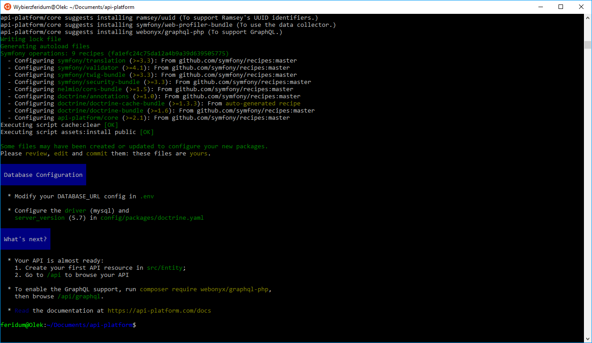

Od kilku lat prawie wszystkie aplikacje internetowe tworzone są w architekturze REST. Schemat tworzenia takiego oprogramowania najczęściej wygląda następująco: stwórz klasę encji, która reprezentuje tabelę w bazie danych, pozwól użytkownikowi stworzyć obiekt tej klasy, pobrać go oraz edytować i na koniec pobrać wszytskie obiekty z danej encji. Potem dochodzi filtrowanie tej listy, paginacja i sortowanie. Nie jest to najciekawsze zajęcie i sprawia, że marnujemy czas na powtarzalne czynności zamiast skupić się na logice biznesowej. Ale może da sie jakoś usprawnić ten proces?

<!--more-->

## API Platform
O ile korzystamy z Symfony to odpowiedzią na powyższe pytanie jest framework API Platform. Pozwala on na podstawie zdefiniowanych przez nas encji oraz odpowiedniej konfiguracji na automatyczne wygenerowanie podstawowych operacji (CRUD) dla encji. Brzmi nieprawdopodobnie ale ta funkcjonalność działa i widziałem już kilka dużych projektów, które z powodzeniem z tego korzystają. Jako, że nigdy nic w tym nie robiłem a temat mnie zaciekawił to postanowiłem się temu nieco dokładniej przyjrzeć jednocześnie opisując kolejne funkcjonalności tej platformy. A tych trochę jest ponieważ oprócz wspomnianej chwilę temu automatycznej generacji endpointów dla kolegów frontendowców, API Platform dodatkowo nam daje:

- Hypermedia (JSON-LD i HAL)
- Dokumentacja dla endointów out-of-box
- Paginacja
- Filtrowanie
- Walidacja requestów
- Autentykacja i autoryzacja 
- wsparcie dla JWT i OAuth
- integracja z FOSUserBundle
- wsparcie dla GraphQL

## Projekt do nauki

W związku z tym, że najlepiej jest się uczyć na projektach to postanowiłem stworzyć prostą aplikację do tworzenia i rozwiązywania quizów - podobną robiłem na projekt na studia więc mniej więcej wiem jak ma działać. Na początek będę operował na 3 encjach: `User`, `Quiz` oraz `Question` ale kolejne pewnie dojdą w trakcie. Jednak żeby móc cokolwiek tworzyć trzeba przygotować sobie projekt. Najprościej jest to zrobić przy pomocy `composer create-project`. Jeśli pracujecie na Macach lub na Linuksie to nie jest to dla was problem ponieważ php i composera możecie sobie zainstalować czy to przy pomocy homebrew czy apt-get. Ale jeśli używacie Windowsa to sprawa nie jest taka prosta choć do katastroficznej jej trochę brakuje. Jeśli jesteście posiadaczami wersji Professional to szczerze zachęcam do sprawdzenia Dockera. Natomiast jeśli macie tylko wersję Home lub nie lubicie Dockera to polecam wypróbowanie mechanizmu WSL (Windows Subsystem for Linuks). Dzięki temu możemy ściągnąć ze sklepu Windowsa jedną z dostępnych dystrybucji Linuksa (ja korzystam z Ubuntu). Możemy wtedy korzystać z linii poleceń Linuksa między innymi apt-get i ściągnąć php oraz composera. Polecam na początku również podlinkować sobie folder z Windowsa gdzie mamy nasze projekty do katalogu użytkownika Linuksa `ln -s /mnt/c/<sciezka do waszego folderu> ~`. Jest to dużo prostsze niż szukanie katalogu domowego z poziomu Windowsa ponieważ jest on w pewien sposób ukryty i dostanie się do niego nie jest wygodne. 

## Stworzenie projektu

Mając wstępnie przygotowane środowisko pracy możemy zainstalować wszystko co potrzebne do projektu. Zacząłem od stworzenia projektu poleceniem `composer create-project symfony/skeleton nazwa-projektu` - utworzy nam to odpowiedni folder o nazwie projektu oraz zainstaluje pierwsze paczki. `symfony/skeleton` jest minimalną wersją projektu, która instaluje wyłącznie zależności potrzebne do działania Symfony. Jako, że będę tworzył API to nie potrzebuję np.: Twiga ale jeśli wy go będziecie potrzebować to możecie skorzystać z `symfony/website-skeleton`.

Dodatkowo zainstalowałem sobie `composer require symfony/web-server-bundle --dev` aby uruchomić aplikację bez potrzeby stawiania i konfigurowania Nginx'a lub Apache'a. Wystarczy że wpiszę następujące polecenie w konsoli: `php bin/console server:run` by uruchomić serwer, który będzie dostępny pod adresem `127.0.0.1:8000`

Jeżeli widzicie to samo co na zdjęciu to znaczy, że wszystko się udało. Teraz możemy doinstalować API Platform poleceniem: `composer require api`

## Symfony Flex

Jak przyjrzycie się poleceniu oraz pierwszym linom na zdjęciu możecie zobaczyć coś dziwnego. Po pierwsze jeśli spróbujecie użyć tego polecenia we wcześniejszych wersjach Symfony lub w projekcie gdzie go nie ma to dostaniecie błąd, że nie istnieje taka paczka. Po drugie jeśli wierzyć informacji u góry to po zainstalowaniu paczek nastąpiła ich automatyczna konfiguracja. Obie te rzeczy są wynikiem działania narzędzia Symfony Flex. Jest to wtyczka do Composer'a, która modyfikuje zachowanie poleceń `require`, `update`, `remove`. Dzięki niej możemy po pierwsze korzystać ze skróconych nazw przy dodawaniu niektórych paczek ale co najważniejsze powstaje też dla nich domyślna konfiguracja. Twórcy Symfony zauważyli, że w większość programistów po zainstalowaniu paczki kopiuje domyślną konfigurację, którą następnie czasami modyfikują. Dzięki wykorzystaniu Symfony Flex możemy ten krok pominąć i zaoszczędzić czas na czynności, która:

a) jest nudna  
b) kopiowanie czasem powoduje błędy  
c) nie daje korzyści biznesowi

Oczywiście nie wszystkie wtyczki jesteśmy w stanie tak zainstalować. Dostępne zależności możemy zobaczyć [tutaj](https://flex.symfony.com/). Część z nich jest oficjalna, część natomiast stworzyli sami użytkownicy - warto zerknąć i zobaczyć czy taki sposób pracy nam odpowiada. 
