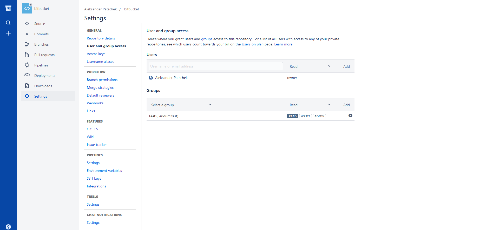
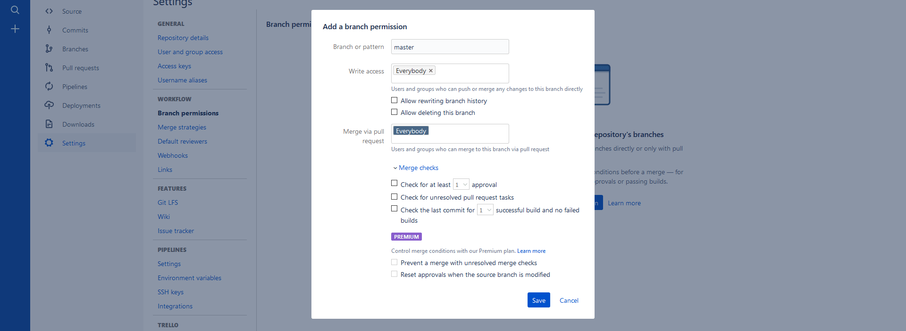
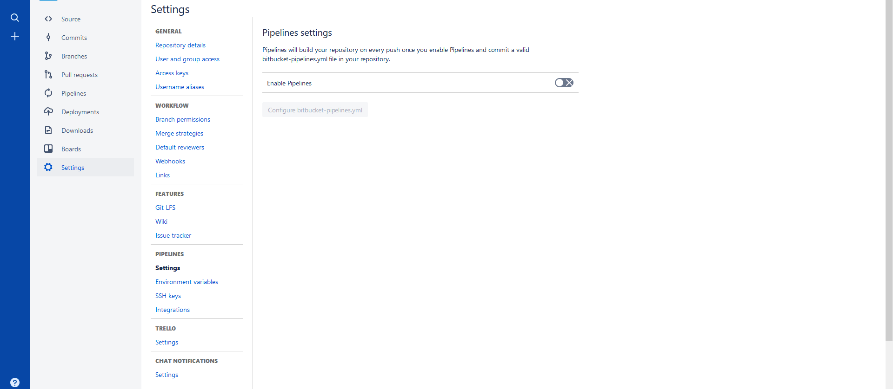
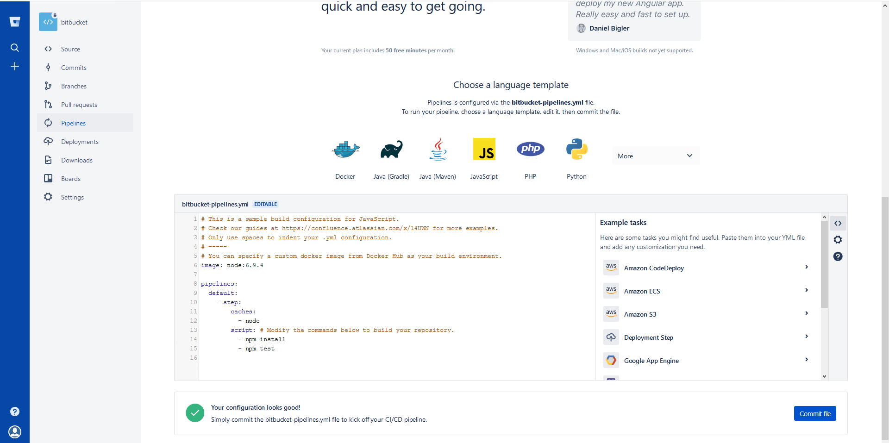
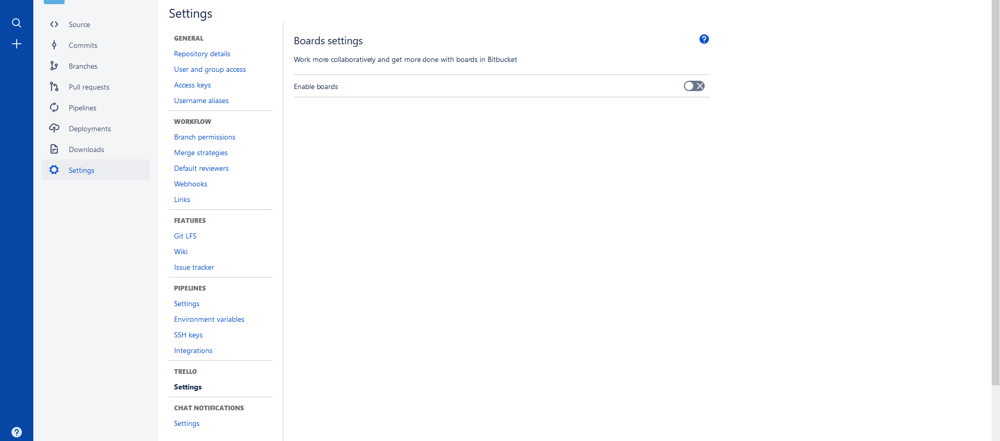
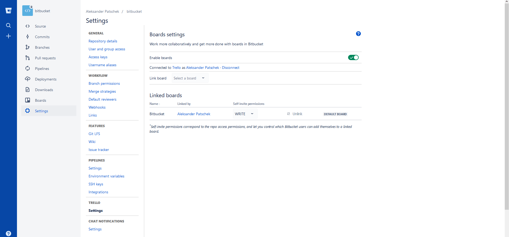
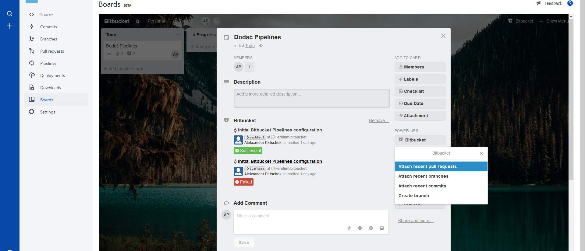

Git jest narzędziem, który wykorzystujemy prawie codziennie i nie da się ukryć jak wiele rzeczy nam ułatwia. Aby z niego korzystać wykorzystujemy platformę Git lub Bitbucket. I dziś o tej drugiej chciałem chwilę poopowiadać, ponieważ oprócz samej możliwości trzymania plików dosatjemy dużo potężniejsze narzędzie z któego często nie korzystamy w pełni.

<!--more-->

## Ustawienia repozytorium

Nie można zaprzeczyć, że Git jest potężnym narzędziem i można wiele zrobić przy jego pomocy. Ale w nieodpowiednich lub niedoświadczonych rękach niektóre komendy mogą spowodować duże problemy. Przypadkowe usunięcia brancha master czy zmiana jego historii przy pomocy `rebase'a` to przykłady tego czego nikt nie chce doświadczyć. Na szczęście jesteśmy w stanie zapobiec takim sytuacjom jeżeli dobrze skonfigurujemy nasze repozytorium. Możemy tam zdefiniować prawa dostępu do naszego repozytorium, poszczególnych gałęzi oraz zdefiniować dozwolone tam akcje. Zaczniemy od dostępu do repozytorium:

Dostęp do repozytorium możemy dodawać albo dla pojedynczych użytkowników albo dla całych grup. Każda z tych opcji zawiera 3 wartości: 

- `Read` - może przeglądać kod, klonować i forkować ale nie może umieszczać swoich poprawek
- `Write` - dodatkowo pozwala na umieszczanie zmian w repozytorium
- `Admin` - użytkownik dostaje dostęp do repozytorium taki jak właściciel, może zmieniać jego ustawienia, dostępy dla użytkowników czy też usunąć całe repozytorium

Zazwyczaj jako programiści mamy dostęp `Write` ale warto by przynajmniej jeden miał dostęp `Admin` najlepiej senior albo główny programista w zespole. Jest to potrzebne aby dodawać różne integracje do repozytorium np.: pipelines i trello opisane dalej. Na pewno nie warto rozdawać tego na prawo i lewo bo może się zemścić. 

Oprócz samego dostępu do repozytorium warto ustawić także zabezpieczenia na samych gałęziach co znajdziemy tutaj:

Pierwsze co trzeba uzupełnić to nazwa docelowego brancha - może to być jeden branch (bezpośrednio jego nazwa) lub grupa branchy ( wtedy podajemy wzór który ma spełnić nazwa). To drugie może być przydatne gdy mamy wzór nadawania nazw branchom np. dla ProjectName dajemy nazwy PN-numer-taska i chcemy by reguły były nadane im wszystkim. Wtedy wystaczy taki wzór `PN-*`, żeby reguły dotyczyły wszystkich aktualnych i przyszłych branchy. 
Następnie mamy dwa ustwaienia dotyczące dodwania kodu do gałęzi. Pierwszy to pozwolenie na bezpośrednie dodawania kodu(czyli pushujemy kod bezpośrednio do brancha), natomiast drugie to pozwolenie na edycję przez PullRequesty. Dodatkowo warto upewnić się (przynajmniej dla mastera), że są odznaczone opcje do zmiany historii (rebase) i usunięcia brancha. Zabezpiecza nas do dodatkowo przez wypadkami ;) 

Dodatkowo ciekawe opcje są pod `Merge checks`, na przykład minimalna liczba approvali czy minimalna liczna buildów, które muszą przejść. Na darmowym koncie dostaniemy tylko ostrzeżenia ale mając premium możemy zablokować merdżowanie jeśli warunki nie są spełnione.

## Pipelines

Kojarzycie temat devopsa, który konfiguruje dla nas środowiska aby sprawdzały kod podczas pull requestów albo wykonywały deploy kodu na środowiska? Dla większości początkujących jest to czarna magia i zazwyczaj robią to osoby dużo bardziej doświadczone. Ale okazuje się że nie potrzeba wielkiej wiedzy, ponieważ w prosty sposób jesteśmy w stanie to zrobić przy użyciu Bitbucket Pipelines. Dzięki tej funkcjonalności jesteśmy w stanie przy pomocy jednego pliku odpalić testy dla każdego naszego brancha, tworzyć obrazy dockerowe z brancha i budować aplikację czy też automatycznie aktualizować środowisko jeśli pojawi się nowy kod na danym branchu. Aby skorzystać z tej funkcjonalności musimy ją najpierw włączyć. Aby to zrobić musimy być właścicielem repozytorium lub mieć uprawnienia admina. 

Druga rzecz to musimy stworzyć plik `bitbuckets-pipelines.yml`. W tym pliku zdefiniujemy za chwilę dla jakich branchy zostanie uruchomiony pipeline oraz jak będzie przebigał cały proces. Tutaj mamy dwie opcje: albo sami zdefinujemy sami ten plik lub wejdziemy w zakładkę pipelines i tam wygenerujemy domyślną konfigurację co też zrobiłem. 

Każdy plik  `bitbuckets-pipelines.yml` musi zawierać na najwyższym poziomie słówko `pipelines` . Następnie definujemy nasze buildy - w tym przypadku jest to typ default czyli uruchomi się dla każdego brancha. Oprócz tego możemy zdefiniować build dla konkretnych branchy, tagów lub custom, który można uruchomić ręcznie lub zaplanować - custom nie uruchomi się automatycznie po aktualizacji brancha. Następnie definujemy kroki jakie będziemy wykonywać w naszym buidzie np.: testowanie, budowanie, deploy na serwer oraz jak będzie przebiegał każdy z kroków. W wygenerowanym pliku mam tylko jeden krok z dwoma akcjami wewnątrz.

W sekcji `step` mamy dwie wartości: `caches` i `scripts`. `caches` pozwala na zapisywanie niektóych danych aby przyspieszyć kolejne buildy - dla JavaScriptu oznacza tyle, że Bitbucket będzie zapisywał sobie katalog node_modules aby kolejne buildy tylko go aktualizowały a nie instalowały wszystko od nowa. Na samym końcu mamy to co najważniejsze czyli `scripts` - tutaj tak naprawdę definiujemy co będzie się działo w naszym kroku. W naszym przypadku będzie to zainstalowanie(lub aktualizacja node_modules) oraz uruchomienie testów. Możemy tutaj umieścić każde polecenie z którego korzystamy podczas tworzenia kodu np.: eslint, prettier itd oraz te stworzone specjalne dla pipeline'a np.: skrypty shellowe.

Od momentu gdy umieścimy kod w repozytorium każdy commit, który w nim umieścimy spowoduje uruchomienie pipeline'a, co możemy zobaczyć na liście commitów.

Jak widać jeden commit nie przeszedł buildu i jest na czerwono. Jeśli klikniemy tam to zobaczymy szczegóły niepowodzenia oraz mamy możliwość uruchomienia go ponownie jeśli uważamy, że błąd nie był spowodowany przez nas a na przykład problem z serwerami npm. W moim przypadku błąd był spowodowany przez złą wersję obrazu dockerowego node'a w którym nie było jeszcze yarn'a.

Dodatkowo w momencie jak wystąpił błąd dostałem powiadomienie na maila przez co ciężko jest go przeoczyć. Oczywiście jest też możliwość podpięcia informacji z Bitbucketa pod inne media na przykład kanał na Slacku.

W momencie gdy wypuściłem nowy commit z inną wersją node'a to wszystko poszło pomyślnie. W Pipeline możemy zobaczyć co po kolei się działo i jakie dało rezultaty. Widzimy, że dla jedynego stepu zostały uruchomione dwa skrypty oraz jakie dały rezultaty. Doatkowo jeśli wszystko poszło dobrze to ostatnim etapem naszego kroku jest zapisanie `node-modules` do cache'a.

Jedyne o czym trzeba pamietać to, że w darmowym planie mamy tylko 50 minut więc nie nadaję się to do zastosowań produkcyjnych gdzie jest dużo osób i zmian w kodzie. Ale myślę, że wystarczy to do zabawy na tyle by można było to wykorzystać potem w pracy przy zwykłym projekcie. To ile nam zostało minut możemy zobaczyć w zakładce Pipelines

## Trello

No i na sam koniec jeszcze przejęta rok temu przez Attlasiana alternatywa do Jiry czyli Trello. Jeśli w swojej pracy wykorzystujecie Kanbana może to być tańszy zamiennik Jiry i dodatkowo wcale nie gorszy. Dodatkowo przez przejęcie go przez Atlassiana podpięcie Trello pod Bitbucket'a jest banalnie proste i wymaga od nas jedynie paru kliknięć. Podobnie jak pipelines pierwsze co musimy zrobić to aktywować tą funkcjonalność.

Następnie musimy wybrać jaki board chcemy podpiąć oraz wybrać domyślny poziom dostępu do niego. 

Domyślnie mają go osoby, które mają przynajmniej poziom Write dla repozytorium. Od tego momentu możemy korzystać z opcji Boards w menu. Otworzy nam się wtedy zawartość naszego Boardu i możemy korzystać identycznie jak w aplikacji. Dodatkowo przy tworzeniu kart mamy dostęp do rozszerzenia Bitbucket, które pozwala podpiąć dodatkowe informacje takie jak nazwa brancha, pull Request czy też commit. 

Tutaj polecam zmianę języka na angielski ponieważ po polsku nie byłem w stanie odszyfrować nazw :D

Nie działa to jeszce idealnie - zdarzało mi się, że jak chciałem dodać informację z Bitbucketa to cały modal się odświeżał co było troszkę irytujące. Ale myślę, że z czasem to poprawią i będzie to dobra odmiana dla Jiry dla mniejszych zespołów.