15 minut to nie jest dużo czasu. Pewnie niektórzy zdążą sobie przygotować w tym czasie kawę, otworzyć ulubione IDE i zastanowić się, od czego zacząć. Natomiast ja wam pokażę, jak w tym ograniczonym czasie da się stworzyć prostą aplikację todo. Wykorzystam do tego platformę Bubble.io.

<!--more-->

## Zobacz video na YouTube

`youtube: https://www.youtube.com/watch?v=vUixaotMNGM`

## Buuble.io

[Bubble.io](http://bubble.io) jest przykładem aplikacji no-code o których pisałem [tutaj](https://fsgeek.pl/post/czym-jest-low-code-no-code). Jest bardzo zaawansowaną platformą, która umożliwia tworzenie stron i aplikacji internetowych. Posiada gotową bibliotekę elementów, pozwalających na tworzenie UI aplikacji oraz na łączenie ich z danymi. To, co mnie najbardziej przypadło do gustu to system reagowania na zdarzenia w aplikacji. Od strony wizualnej jest bardzo prostym systemem, ale jednocześnie pozwala na tworzenie zaawansowanych reakcji na zdarzenia. Powoduje to, że czasami trzeba się zastanowić jak ugryźć dany problem, by odpowiednio wyklikać go w edytorze.

## Tworzenie aplikacji

Aplikacje typu todo są idealnym projektem na początek — prosty UI, formularz, tworzenie i zarządzanie danymi. Zazwyczaj ich stworzenie zajmuje trochę czasu, ponieważ trzeba wybrać biblioteki, napisać komponenty, ostylować je i dodać logikę, która będzie zarządzać wpisanymi danymi — szczególnie jeśli dopiero się uczymy. Natomiast ja pokażę, jak można to zrobić w 15 minut z wykorzystaniem bubble.io. 

Zaczniemy od stworzenia modelu danych, który będzie reprezentował nasze zadania. Aby to zrobić trzeba wejść do `Data > Data types > New type` 

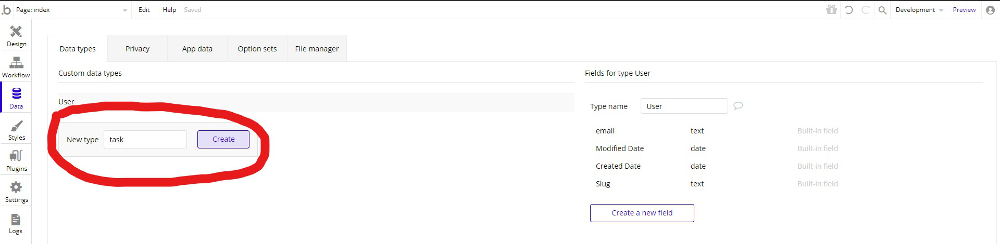

Następnie musimy dodać nowe pola. Dla podstawowych zadań wystarczy nam pole tekstowe `name` oraz pole `finished`, które przyjmie wartości true/false,

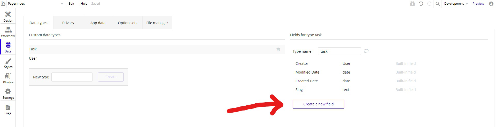

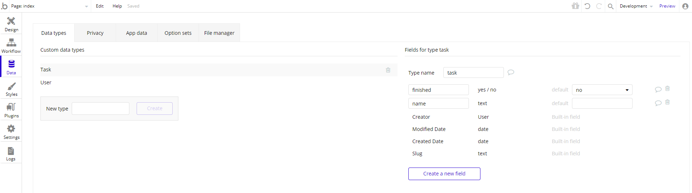

Mając określony kształt danych, możemy stworzyć UI aplikacji. Robimy to w zakładce `Design`. Dla podstawowej wersji potrzebujemy pola tekstowego, by móc wpisać nazwę zadania, przycisk oraz listę zadań z polem typu checkbox do zaznaczania gotowych zadań. Wszystkie rzeczy możemy przeciągnąć z listy elementów. Dla dwóch pierwszych elementów będą to odpowiednio ` Input forms > Input` i `Visual Elements > Button`. Do wyświetlenia listy elementów skorzystamy z elementu `Containers > Repeating Groups`. Możemy teraz określić wygląd listy. Aby to robić, musimy przeciągnąć odpowiednie elementy do **pierwszego wiersza**. Wykorzystamy do tego elementy `Visual Elements > Text` i `Input forms > Checkbox`. Wszystko, co będzie się znajdowało w tym wierszu, zostanie potem powielone w kolejnych. Po wykonaniu wszystkich kroków nasza aplikacja będzie wyglądała następująco.

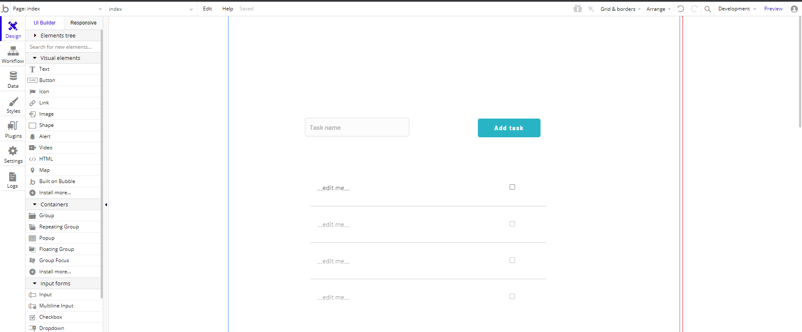

Teraz musimy podpiąć dane do listy. Aby otworzyć ustawienia, musimy zrobić dwuklik na liście. Interesuje nas pole `Type of content` oraz `Data source`. Pierwsze określa typ danych jakie będą w naszej liście. Natomiast drugie służy faktycznie do pobrania tych danych. Dzisiaj będzie nas interesowała opcja `Do a search for`

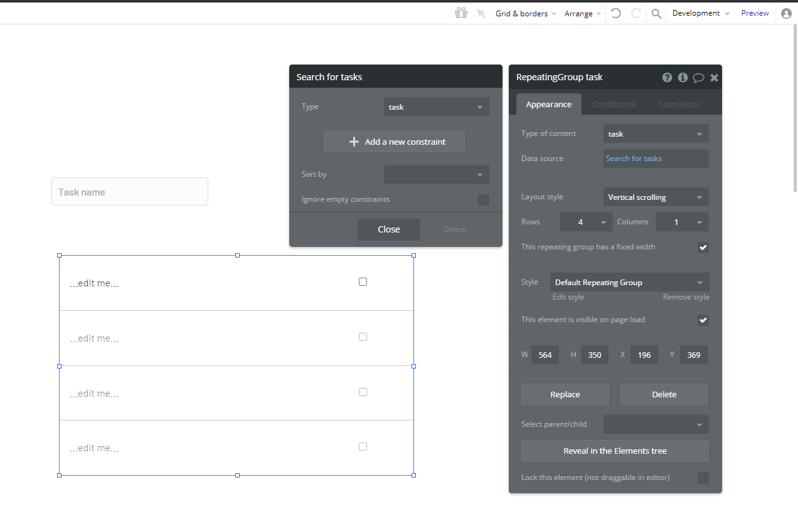

Teraz wystarczy, że ustawimy pole tekstowe oraz checkbox, by brały wartości z danego wiersza w tabeli. Dla inputa w polu z wartością musimy kliknąć przycisk `Insert dynamic data` i wybrać co nas interesuje (w naszym przypadku jest to wartość pola `name`) 

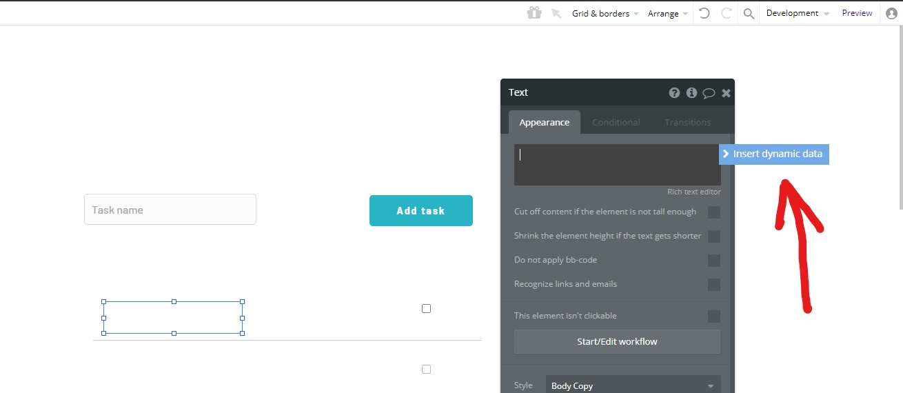

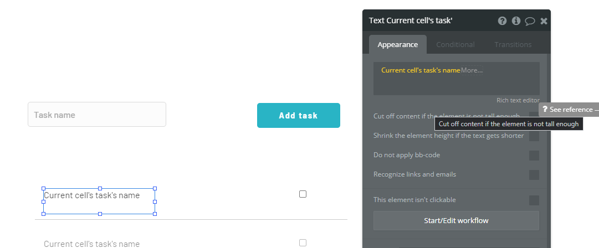

Dla checkboxa musimy ustawić dla `Preset status` wartość `Dynamic` oraz w `Dynamic status` ustawić by brał wartość z pola `finished`.

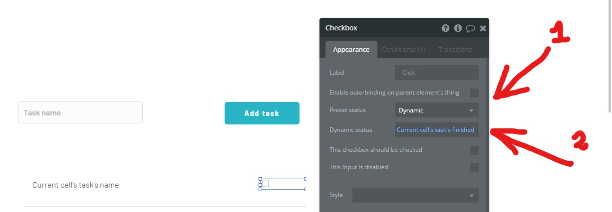

Tym sposobem mamy już ograne wyświetlanie danych. Zostało już tylko dodawanie nowych. Do tego celu trzeba skorzystać ze wspomnianego przeze mnie systemu zdarzeń. Chcemy reagować na zdarzenie kliknięcia przycisku, tak aby skutkowało to dodaniem zadania o nazwie, która była w polu tekstowym. Zrobimy to w zakładce `Workflow`.

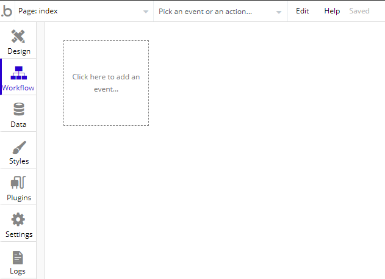

Teraz musimy wyklikać po kolei elementy: 

- kliknąć pole `Click here to add an event` i wybrać `Elements > An Element is clicked`
- następnie jako reakcje wybrać `Data(things) > Create a new thing`
- w oknie ustawień wybieramy, że chcemy utworzyć `task` i ustawić wartość `name` na bazie pola input
- dodatkowo możemy po dodaniu nowego pola wyczyścić pole tekstowe, by było gotowe na kolejne wpisy (reakcja `Elemnt Actions > Reset inputs`)

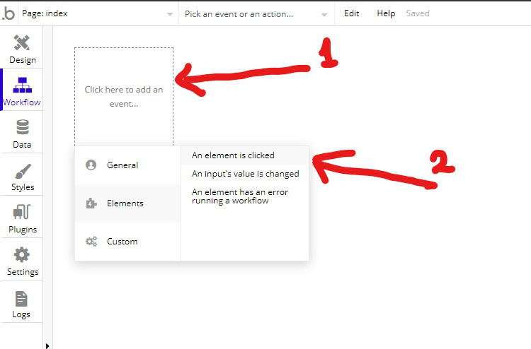

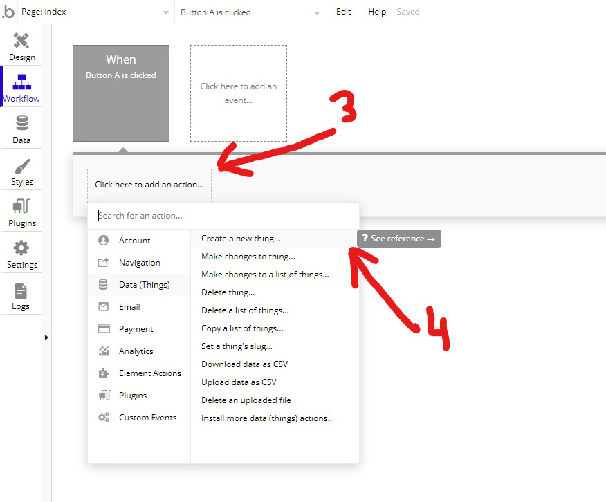

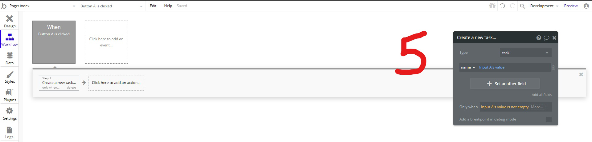

Podobnie musimy ustawić dla pola checkbox. Tylko tutaj jako zdarzenie wybierzemy `Elements > An Input's value is changed` a jako akcję `Data(things) > Make changes to thing`.

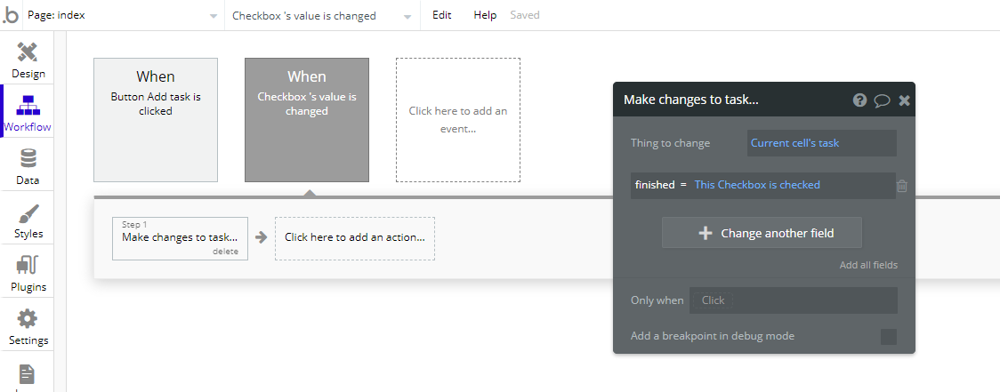

Na sam koniec dobrze by było zobaczyć efekty naszych działań. Możemy to podejrzeć klikając przycisk `Preview` w prawym górnym rogu aplikacji.

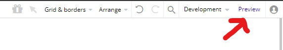

Jeśli zrobiliśmy wszystko poprawnie, to dostaliśmy prostą aplikację todo. Jak widać, nie jest to trudne i nie zajęło dużo czasu. Oczywiście nie wygląda oszałamiająco ale mamy podstawową funkcjonalność. Teraz można popracować nad UI, bawić się w dodawanie filtrów, kolejnych pól, sortowania, lepszej edycji zadań itd. Jednym słowem możemy skupić się na tym, co sprawi, że nasza lista todo będzie tą wyjątkową, z której ludzie będą chcieli korzystać. A wy co sądzicie o tej platformie? Pracowaliście z nią? A może korzystaliście z czegoś innego, co według was jest lepsze?