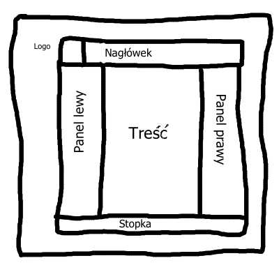
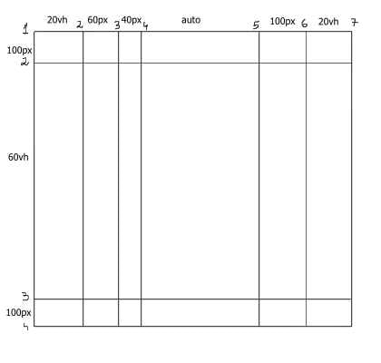

Nie wiem czy śledzicie nowinki ze świata css ale niedawno pojawiła się w nim nowość w postaci CSS-Grid. Pozwala w prosty sposób stworzyć szablon strony w czystym css. Jest to druga nowość obok już popularnego flexboxa, która ułatwia ustawianie elementów na stronie dlatego warto go poznać i zacząć używać, szczególnie, że według [canIUse](https://caniuse.com/#search=css-grid) większość przeglądarek już go wspiera
<!--more-->

## Słowo wstępu
CSS-Grid jest to system, który pozwala na tworzenie szablonu strony. Jest on dwuwymiarowy( w przeciwieństwie do flexboxa, który jest jedno wymiarowy) czyli pozwala na skonfigurowanie zarówno wierszy jak i kolumn (w flexboxie nasz div mógł zawierać rząd albo kolumnę ale nigdy i jedno i drugie). Możemy rozróżnić tutaj dwa nadrzędne elementy czyli Grid Container (element, który będzie rodziciem) oraz Grid Items(elementy, które są dziećmi). Możemy również zagnieżdżać elementy rodziców w sobie tworząc zagnieżdżone szablony. 

## Czas na trochę kodu

Jako, że najprościej pokazywać takie rzeczy na przykładach postanowiłem stworzyć na szybko szablon standardowej strony  przy wykorzystaniu tylko CSS-Grid. Jako standardowy mam na myśli taki który będzie zawierać nagłówek, dwa panele boczne oraz stopkę. Na obrazku poniżej możecie zobaczyć przykładowy widok. Całość jest również dostępna na [githubie](https://github.com/Feridum/css-grid-PoC).



```html
<!DOCTYPE html>
<html lang="en">
<head>
<meta charset="UTF-8">
<meta name="viewport" content="width=device-width, initial-scale=1.0">
<meta http-equiv="X-UA-Compatible" content="ie=edge">
<link rel="stylesheet" type="text/css" href="style.css">
<title>Css Grid</title>
</head>
<body>
<div class="logo"></div>
<header>Tutaj jest nagłówek</header>
<div class="sidebarLeft">lewy panel boczny</div>
<div class="sidebarRight">prawy panel boczny</div>
<div class="content">Tutaj ma być treść</div>
<footer>stopka</footer>
</body>
</html>
```

Tak wygląda nasz plik html. Wiele tutaj nie ma do opisywania więc nie będę się nad nim rozwodził. Została tutaj napisana struktura jaką chcę uzyskać. Teraz wystarczy tylko odpowiednio dopisać style  w pliku style.css. Na pierwszy ogień pójdzie znacznik body, który stanie się __Grid Container'em__. 

```css
body{
display: grid;
grid-template-columns:20vw 60px 40px auto 100px 20vw;
grid-template-rows: 100px 60vh 100px;
}
```

Robimy to tak jak widać powyżej. Najważniejsze jest właściwość display: grid dzięki, któremu informujemy przeglądarkę, że będziemy korzystać z CSS-Grid oraz daje nam możliwość korzystania z nowych właściwości: grid-template-columns oraz grid-template-rows. Pierwszy z nich określa ile oraz jak szerokich kolumn będziemy używać. Każda wartość to jest nowa kolumna. Podobnie jest w przypadku drugiej właściwości gdzie definiujemy wiersze.  Teraz nasza przeglądarka widzi następujący szkielet: 



Wystarczy wstawić w odpowiednie miejsca nasze elementy. Możemy to zrobić na dwa sposoby. Pierwszy z nich to zadeklarowanie dla każdego naszego elementu gdzie się zaczyna i kończy. Robimy to za pomocą grupy właściwości grid-(column|row)-(start|end). Musimy tutaj podać liczbę oznaczającą od którego wiersza/kolumny chcemy zacząć oraz na której zakończyć. Numeracje zarówno dla kolumn i wierszy zaczynają się od wartości 1. W kodzie wygląda to następująco:

```css
.logo{
grid-column-start:2;
grid-column-end:3; 
grid-row-start: 1;
grid-row-end: 2;
}


header{
grid-column-start: 3;
grid-column-end:6; 
grid-row-start: 1;
grid-row-end: 2;
background-color: lightblue;
}
```

I reszta elementów wygląda podobnie. Jeśli chcecie zobaczyć to zapraszam do repozytorium gdzie to znajdziecie jako zakomentowany kod. Dlaczego zakomentowany? Ponieważ istnieje według mnie prostszy sposób na ułożenie elementów na siatce. W Grid Containerze możemy skorzystać z właściwości __grid-template-areas__.

```css
grid-template-areas:
". logo header header header ."
". leftSidebar leftSidebar contentArea rightSidebar ."
". footer footer footer footer .";
```

Tak jak można zobaczyć jest to widok naszej strony przedstawiony przy pomocy odpowiednio nazwanych obszarów. Każda linia natomiast to osobny rząd. Musimy mieć taką ilość obszarów ile mamy kolumn oraz tyle linii ile mamy wierszy. Oprócz nazwy obszaru możemy wstawić kropkę(oznacza pustą komórkę) lub none(nienazwany obszar). W moim przypadku wykorzystałem kropkę do zdefiniowania marginesów strony. Jedyna rzecz jaka została do zrobienia to przypisać nasze elementy do odpowiednich obszarów przy pomocy właściwości __grid-area__

```css
.logo{	
	grid-area: logo;
}
header{
	grid-area: header;
	background-color: lightblue;
}
```


W ten sposób otrzymujemy dokładnie ten sam widok co powyżej. To, że widok wygląda tak jak sobie założyłem możecie zobaczyć tutaj: [github](https://feridum.github.io/css-grid-PoC/).


Jak dla mnie jest to dużo lepszy sposób na tworzenie szablonu strony niż manewrowanie divami. Użycie nowych właściwości CSS pozwala w znaczy sposób uprościć proces tworzenia podstawowego szablonu oraz skrócić czas jego tworzenia. Szczególnie dla osób początkujących może to być ułatwienie. A wy co o tym myślicie? Podoba wam się ta nowa funkcjonalność? Używaliście już na produkcji? Zapraszam do komentowania i dzielenia się swoimi przemyśleniami na temat CSS-Grid.
