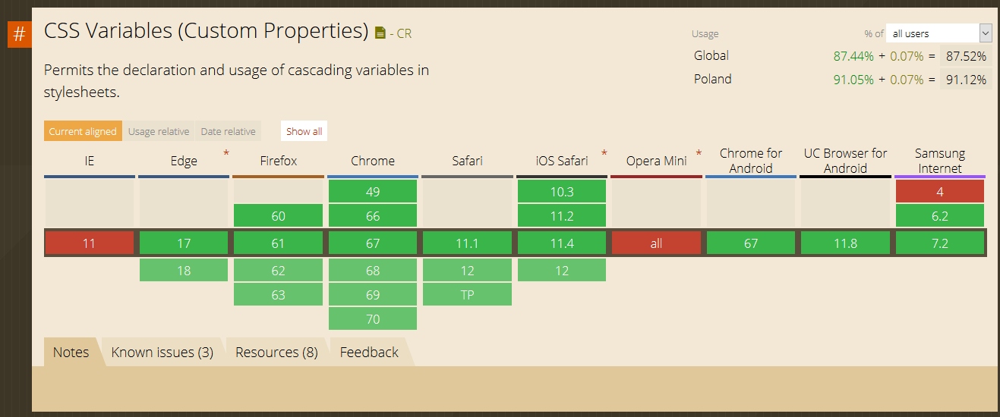

CSS już dawno przestał być językiem służacym tylko do kolorowania stron internetowych. Każda kolejna wersja pozwala robić coraz więcej na stronie bez konieczności sięgania do Javascriptu lub preprocesorów CSS takich jak SASS czy LESS. Dziś chciałbym po krótce opowiedzieć o czymś co w preprocesorach istnieje od dawna a teraz jest też możliwe bez nich czyli tworzenie zmiennych wewnątrz plików.

<!--more-->

## CSS Variables

Zmienne możemy wykorzystywać w najpopularniejszych przeglądarkach już od jakiegoś czasu i jest to całkiem nieźle wspierane: 



Zmienne tworzymy wewnątrz zwykłych plików `*.css` i możemy je potem wykorzystywać jako wartości dla atrybutów. Jak to jednak wygląda w porównaniu z tym co znamy i często wykorzystujemy w preprocesorach? 

#### SCSS
```scss
$color: red;

p {
color: $color
}

```

#### LESS
```less
@color: red;

p {
color: @color
}

```

#### CSS
```css
:root {
  --color: #06c;
}

p {
color: var(--color)
}

```


## Elementy składowe zmiennych 

Jak łatwo zauważyć każda zmienna musi zaczynać się od podwójnego myślnika `--`. Dodatkowo trzeba uważać przy pisaniu nazw ponieważ wielkość liter ma znaczenie w tym przypadku. 

```css
:root {
	--color: red
}

p{
 background-color: var(--color); /* zadziała */
 background-color: var(--Color); /* nie zadziała */
}
```

Aby użyć teraz takiej zmiennej musimy wykorzystać specjalną funkcję `var()`, która wstawi wartość naszej zmiennej do odpowiedniego atrybutu. Dodatkowo w tej funkcji możemy podać domyślną wartość, która zostanie użyta jeśli poszukiwana przez nas zmienna nie istnieje. Ciekawostką może być fakt, że możemy podać jako domyślną wartość inną zmienną tworząc w ten sposób łańcuch gdzie na końcu możemy umieścić zwykłą wartość.

```css
:root {
  --color: red;
}

background-color: var(--bg-color, blue);
background-color: var(--bg-color, --color); /* tak nie zadziała */
background-color: var(--bg-color, var(--color)); /* ale w ten sposób już tak */
background-color: var(--bg-color, var(--color2, yellow)); /* to też zadziała */
```

Warto jeszcze wspomnieć o tym gdzie można definiować nasze zmienne. Możemy je umieścić w każdym poprawnym selektorze tak jak zwykłe atrybuty. Bardzo często korzystamy tutaj też z pseudoklasy `:root`, która wskazuje na element który jest na szczycie drzewa DOM. W przypadku stron internetowych wskazuje on na element `html` ale ma od niego wyższy priorytet.

```css
:root {
  --color: blue;
}

html{
  --color: red;
  background-color: var(--color) /* strona ma niebieskie tło */
}
```

## Dlaczego zmienne w CSS są lepsze od preprocesorów?

Na razie nie pokazałem niczego nowego w stosunku do tego co już znamy i wykorzystujemy w preprocesorach. Po co w takim razie się interesować tym tematem skoro to co mamy działa tak samo? No właśnie nie zawsze. Pierwszym powodem jest obecność kaskady jaką znamy ze standardowych atrybutów, czyli możemy wykorzystać tą samą zmienna dla selektorów na różnych poziomach. Wartości w zmiennych w selektorach szczegółowych będą przesłaniać te zdefiniowane dla ogólnych.

<p data-height="265" data-theme-id="0" data-slug-hash="GBjoKO" data-default-tab="css,result" data-user="Feridum" data-embed-version="2" data-pen-title="Variable cascade" class="codepen">See the Pen <a href="https://codepen.io/Feridum/pen/GBjoKO/">Variable cascade</a> by Aleksander (<a href="https://codepen.io/Feridum">@Feridum</a>) on <a href="https://codepen.io">CodePen</a>.</p>
<script async src="https://static.codepen.io/assets/embed/ei.js"></script>

Drugi powód to możliwość łatwiejszego operowania tymi zmiennymi z poziomu Javascriptu. Do tej pory nie mieliśmy tej możliwości nawet przy pomocy preprocesorów. Teraz przy odpowiednim wykorzystaniu zmiennych jesteśmy w stanie zmienić kolory na całej stronie przy pomocy jednego polecenia. Jak możemy to zrobić? 

<p data-height="265" data-theme-id="0" data-slug-hash="NBRrBY" data-default-tab="css,result" data-user="Feridum" data-embed-version="2" data-pen-title="NBRrBY" class="codepen">See the Pen <a href="https://codepen.io/Feridum/pen/NBRrBY/">NBRrBY</a> by Aleksander (<a href="https://codepen.io/Feridum">@Feridum</a>) on <a href="https://codepen.io">CodePen</a>.</p>
<script async src="https://static.codepen.io/assets/embed/ei.js"></script>

Jak już wspomniałem o możliwych sposobach wykorzystania zmiennych to nie można nie wspomnieć o tworzeniu motywów dla naszej strony. Jeśli tylko będziemy konsekwentni w wykorzystywaniu zmiennych(czytaj używali ich prawie wszędzie) to przy pomocy klasy podpiętej do elementu body możemy zmienić szatę kolorystyczną naszej strony

<p data-height="265" data-theme-id="0" data-slug-hash="gjwLJa" data-default-tab="css,result" data-user="Feridum" data-embed-version="2" data-pen-title="gjwLJa" class="codepen">See the Pen <a href="https://codepen.io/Feridum/pen/gjwLJa/">gjwLJa</a> by Aleksander (<a href="https://codepen.io/Feridum">@Feridum</a>) on <a href="https://codepen.io">CodePen</a>.</p>
<script async src="https://static.codepen.io/assets/embed/ei.js"></script>

Trzeba przynać, że CSS rozwija się w dobrym kierunku. Jeśli będzie rozwijać się dalej w takim tempie to preprocesory mogą przestać być w ogóle potrzebne. Mnie osobiście brakuje możliwości zagnieżdżania selektorów w sobie by supełnie porzucić SASS. Kto wie, może kiedyś się tego doczekam :)