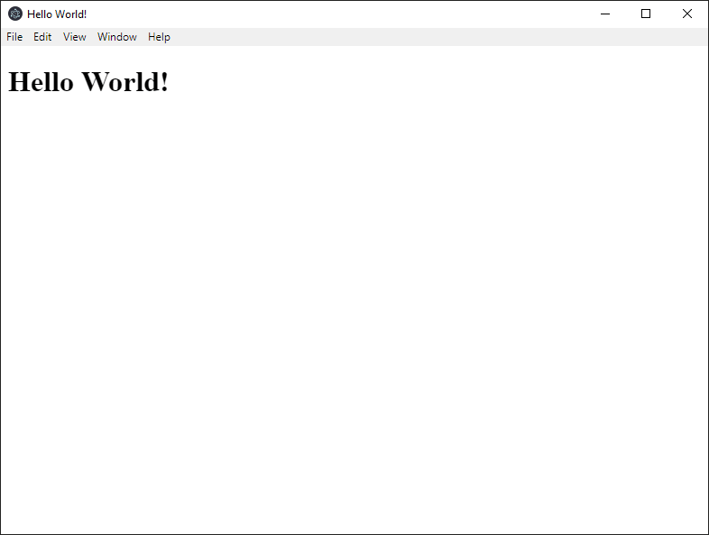
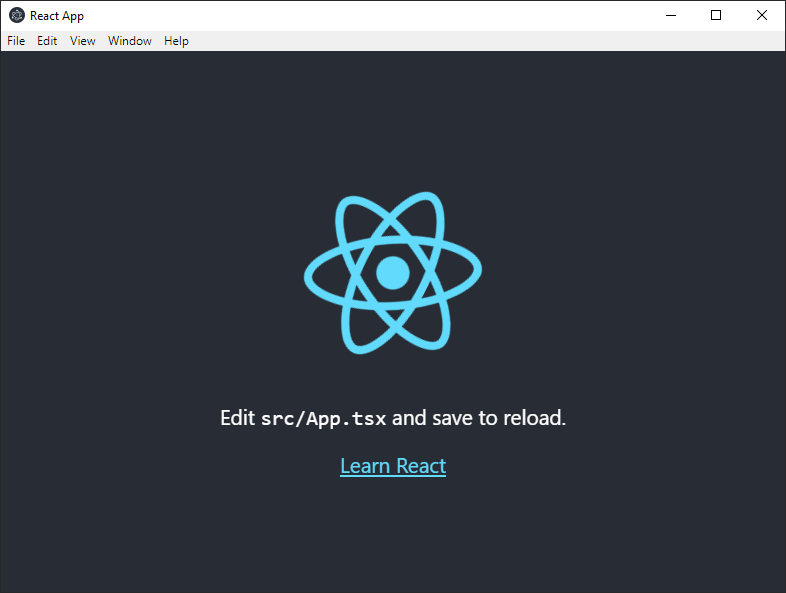

Większość ludzi kojarzy JavaScript głównie z tworzeniem stron internetowych. Ostatnio pojawia sie też coraz więcej aplikacji backendowych i mikroserwisów napisanych w NodeJs. Ale czy wiecie, że możemy również tworzyć aplikacje desktopowe? Okazuje się, że JavaScript jest językiem w którym da się napisać prawie wszystko. Co więcej możecie korzystać z takiej aplikacji nie wiedząc o tym. Więc jak napisać własną aplikację desktopową?

<!--more-->

## Electron

W świecie JavaScriptu mamy biblioteki już chyba do wszystkiego. Znajdziemy też bibliotekę, która pozwala nam stworzenie i uruchomienie programu desktopowego. Wbrew pozorom nie jest to nowa biblioteka ponieważ pierwszy release (według oficialnej strony) miał miejsce 6 lat temu i od tego momentu jest ciągle aktywnie rozwijana. W świecie JS to jest naprawdę dużo co czyni biblotekę wartą objerzenia i wypróbowania.  Oczywiście jeśli nigdy o niej nie słyszeliście to możecie sądzić, że Electron nadaje się jedynie do zabawy a nie do praktycznego zastosowania. Nic bardziej mylnego - oficjalna strona podaje, że powstało już 759 aplikacji, czyli da się napisac produkcyjną aplikację. A jak wygląda z wydajnością i popularnością takich bibliotek - to, że jest ich dużo to nie znaczy, że ktokolwiek z nich korzysta?  Ostatni argument, który powinien was przekonać, żeby dać szansę tej bibliotece to obecność na liście aplikacji takich programów jak: Slack, Visual Studio Code, Skype, Github Desktop czy też GitKraken. Skoro tacy gracze piszą w tym swoje aplikacje to znaczy, że da się je pisać w sposób wydajny oraz przyjemny w użytkowaniu dla użytkownika.

## Pierwsze kroki w Electronie

Skoro doszliście aż tutaj to znaczy, że was przynajmniej odrobinę zaciekawiłem i zainteresowałem tematem. Skoro tak to możemy stworzyć naszą pierwszą aplikację z wykorzystaniem tej biblioteki. Pierwsze co musimy zrobić to dodać bibliotekę `electron` do naszego projektu: 

```console
yarn add electron
```

Następnie potrzebujemy przynajmniej dwóch plików: 

- index.html - tutaj zdefiniujemy jak będzie wyglądała aplikacja od strony UI
- main.js - plik, odpowiedzialny za główny wątek aplikacji, utworzy nam okienko oraz zapewnia interakcję z systemem

Tak więc po kolei - na początek plik związany z wyglądem czyli index.html

```html
<!DOCTYPE html>
<html>
  <head>
    <meta charset="UTF-8">
    <title>Hello World!</title>
  </head>
  <body>
    <h1>Hello World!</h1>
  </body>
</html>
```

Tutaj nie ma co tłumaczyć - zwykły plik html, który wyświetla napis `Hello World`.  Zobaczmy co mamy w drugim: 

```js
const { app, BrowserWindow } = require('electron')

function createWindow () {

  let win = new BrowserWindow({ width: 800, height: 600 })

  win.loadFile('index.html')
}

app.on('ready', createWindow)
```

Tutaj już można powiedzieć nieco więcej. Na pierwszy ogień funkcja `createWindow`. Tworzy ona okno naszej aplikacji o zdefiniowanych przez nas rozmiarach. Następnie do tego okna jest ładowany nasz plik `*.html` czego skutkiem będzie wyświetlenie go w aplikacji. Dodatkowo wykorzystujemy obiekt `app`, który jest odpowiedzialny za kontrolę cyklu życia naszej aplikacji. To co potrzebujemy zawsze to zdarzenie dotyczące gotowości naszej aplikacji - służy nam do tego zdarzenie `ready`. Dopiero w momencie gdy wszystko jest gotowe możemy stworzyć okno zawierające naszą treść. 

Teraz musimy uruchomić naszą aplikację. W tym celu musimy wyedytować nasz plik `package.json` - po pierwsze musimy dodać do sekcji scripts taki wpis `"start": "electron ."` oraz ustawić nasz plik `main.js` jako główny skrypt - `"main": "main.js"`. A jak wygląda efekt finalny? 



Widzimy tutaj u góry menu narzędziowe. Jest ono przydatne podczas tworzenia aplikacji ponieważ pozwala na przykład na pokazywanie i ukrywanie DevTools. Ale możemy nie chcieć tego w końcowej aplikacji. Aby się tego pozbyć musimy dodać parametr `frame: false` podczas tworzenia okna

```js
let win = new BrowserWindow({ width: 800, height: 600, frame: false })
```


## React + Electron

Wygląda fajnie ale tworzenie interfejsu użytkownika od zera może być uciążliwe. Oczywiście od czego mamy biblioteki takie jak React, które nam w tym pomagają? Tylko jak połączyć te obie biblioteki by działało to zarówno w środowisku deweloperskim jak i produkcji? Jeśli zaczynamy nowy projekt to najprościej najpierw stworzyć go przy pomocy `create-react-app` i następnie doinstalować osobno `electron`. Tylko jak teraz przekazać plik  `*.html`, który ma zostać wyświetlony? Przecież nie będziemy po każdej zmianie budować całej aplikacji bo ani to wygodne ani efektywne. Musimy zmienić funkcje `loadFile` na `loadUrl` - teraz możemy podać url do aplikacji z React. 

```js
win.loadURL("http://localhost:3000");
```

Musimy tylko pamiętać, żeby uruchomić najpierw aplikację React'a a dopiero potem tą desktopową.  Tyle wystarczy by uzyskać następujący efekt końcowy. Co istotne w momencie gdy będziemy edytować nasz kod React'a to odświeżanie będzie działać poprawnie również w aplikacji desktopowej.



I jak wam podoba się pomysł tworzenia aplikacji desktopowych w ten sposób? Przy odpowiednim tworzeniu kodu moglibyśmy prawie za darmo mieć do naszej aplikacji webowej również klienta desktopowego. Pisaliście kiedyś aplikacje w ten sposób. Jeśli chcielibyście kolejnych postów dotyczących tej biblioteki oraz jak tworzyć w tym aplikacje dajcie znać w komentarzach :) 

