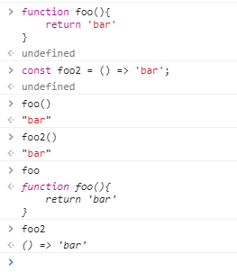
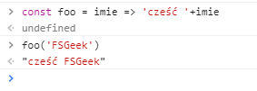
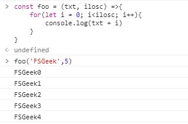
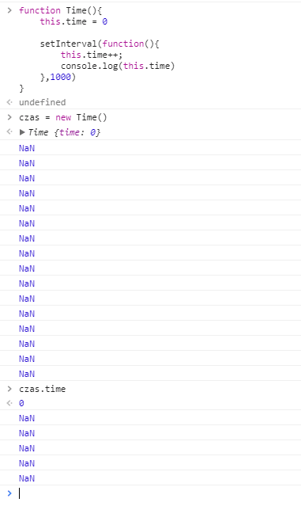
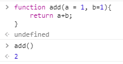
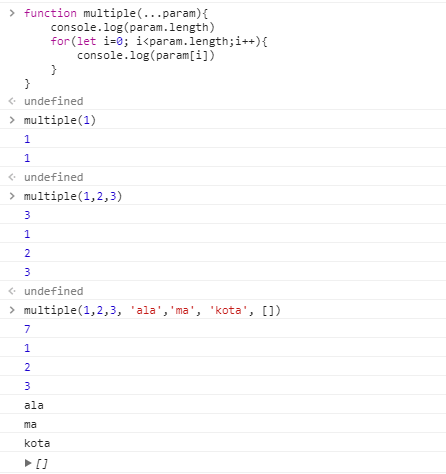

Nie tylko zmienne doczekały się zmian w specyfikacji ES6. Takie zmiany również dotknęły funkcje, które dostały parę nowych możliwości. Zapraszam na drugi post dotyczący standardu ES6. Jeśli nie czytaliście pierwszego postu to zapraszam [tutaj](http://fsgeek.pl/post/seria-es6-zmienne-const-let/). Post jest krótki ponieważ nie ma tutaj wielu zaawansowanych rzeczy a i nie chciałem się niepotrzebnie rozwlekać nad tematem. 
<!--more-->
## Arrow Functions
To jest jedna z nowości, którą najbardziej polubiłem i równie często wykorzystuję podczas swojej pracy. Jest to wyrażenie, które jest krótszą formą zapisu funkcji. 

Jednym z minusów tego wyrażenia jest brak czytelności dla osób, które o tym nie słyszały. Jednak jak się go pozna to staje się zrozumiały i w pewien sposób wygodny. Pierwsze co się rzuca w oczy to brak słówka kluczowego function, zamiast niego deklarujemy zwykłą zmienną(ja najczęściej robię to przy pomocy słówka kluczowego const). Teraz po znaku '=', tak jak w przypadku standardowych funkcji, w okrągłych nawiasach wpisujemy parametry funkcji. Jeśli mamy tylko jeden parametr to możemy je opuścić. W przypadku braku argumentów należy umieścić puste nawiasy. Następnie mamy grupę znaków od których wzięło nazwę wyrażenie czyli '=>' (w końcu przypomina strzałę) . Po niej następuje to co nazywamy ciałem funkcji. Jednak tutaj mamy większą dowolność niż wcześniej. Jeśli nasza funkcja nie będzie wykonywała żadnych dodatkowych instrukcji oprócz polecenia return to możemy opuścić nawiasy klamrowe '{ }' (tak jak to zrobiłem w poprzednich przykładach). Jednak nic nie stoi na przeszkodzie by wykorzystać nawiasy i zbudować bardziej skomplikowane ciało funkcji. 

Jednak Arrow Functions to nie tylko inny sposób zapisu funkcji. Wniosły też jedną poważną zmianę w stosunku do standardowych funkcji. Arrow Functions nie tworzą własnego zakresu słówka kluczowego this. W Javascript'cie do tej pory nie mieliśmy klas znanych z innych języków ale do programowania obiektowego mogliśmy wykorzystać funkcje. Problem był jednak taki, że w takich naszych stworzonych 'klasach' w funkcjach nie mogliśmy się odwołać do zmiennych klasowych przy pomocy słówka this.

Problem ten rozwiązuje nowy zapis, który nie powoduje tworzenia nowego zakresu dla this.

Powoduje to jednak, że nie możemy takiej funkcji nie możemy użyć jako konstruktora przy pomocy operatora new

## Inne nowości dotyczące funkcji

Oprócz wyżej opisanego wyrażenia dostaliśmy również parę mniejszych rzeczy, które warto znać i stosować jak zajdzie taka potrzeba. Pierwszą z nich jest możliwość definiowania domyślnych wartości parametrów funkcji czyli coś co znamy z innych języków. Działa to tutaj bardzo podobnie do tego co znamy na przykład z C++ czy PHP

Ciekawszą rzeczą jest możliwość przekazywania zmiennej ilości parametrów  w funkcji. W JS dokonujemy tego za pomocą operatora '…'. Dodatkowo przekazywane parametry nie muszą być tego samego typu. 

Więcej zmian dotyczących samych funkcji nie znalazłem jednak jeśli jest coś o czym warto napisać to dajcie znać w komentarzu a na pewno się nad tym pochylę. Co prawda nie ma tego wiele ale potrafi ułatwić życie. Arrow functions bardzo szybko zdobywa popularność i można go coraz częściej spotkać np.: przy tworzeniu bezstanowych komponenetów w react'cie. Jak już wspomniałem bardzo lubię tą funkcję. A jak top wygląda u was? Lubicie, używacie czy może staracie się unikać?