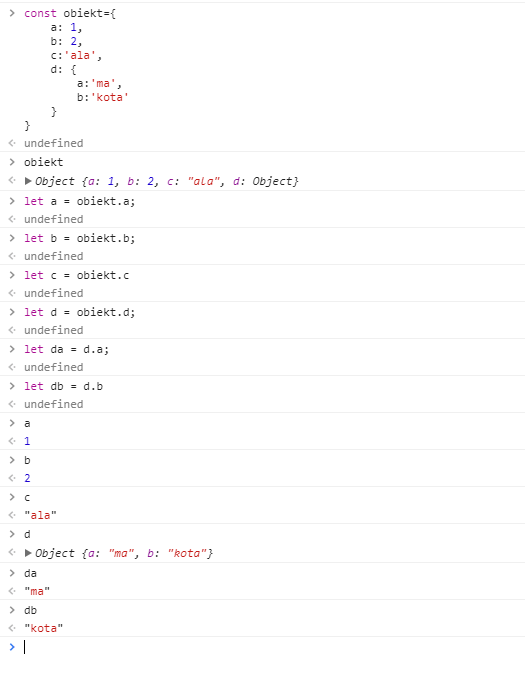
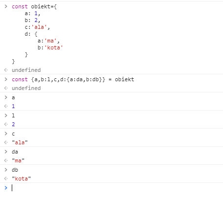
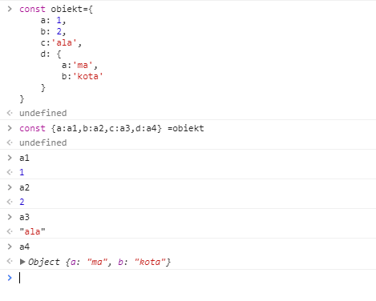
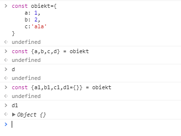
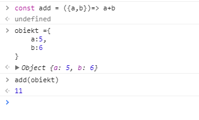
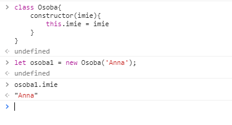
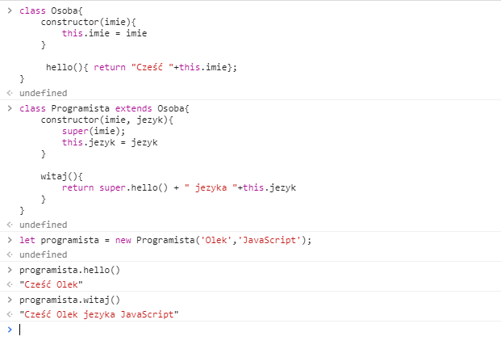

Do tej pory opisałem co się zmieniło w specyfikacji ES6 dla zmiennych i funkcji (pierwszy post znajdziecie [tutaj](https://fsgeek.pl/post/seria-es6-zmienne-const-let/) a drugi [tutaj](https://fsgeek.pl/post/seria-es6-funkcje/)). Teraz przyszedł czas na opisanie zmian w obiektach oraz parę słów na temat nowości jaką są klasy.  Bardzo często nieświadomie już z tego korzystamy więc warto poczytać i używać tych funkcji świadomie.
<!--more-->
## Obiekty

Na pierwszy ogień postanowiłem się zająć obiektami ponieważ pojawiła się tutaj jedna bardzo ciekawa funkcjonalność, a mianowicie rozkład obiektu. Brzmi dziwnie ale idea jest prosta. Chodzi o rozłożenie obiektu na mniejsze składowe. Bardzo często obiekty traktujemy jak pojemniki do których wrzucamy różne rzeczy by w prosty sposób je przenosić. Jednak po przeniesieniu warto by było odzyskać te wewnętrzne elementy.



W ES5 wymagało to trochę pisania co widać powyżej. Na szczęście w nowym standardzie da się prościej.



Na pewno potrzebujemy mniej kodu by osiągnąć ten sam efekt, co sprawia, że nasz kod jest czytelniejszy. Jednak żeby działało to trzeba pamiętać o paru rzeczach.  Po pierwsze jeśli chcemy skorzystać z uproszczonego zapisu np..: 

```javascript
const {a,b,c,d} = obiekt 
```

to nasze zmienne a,b,c,d muszą być istniejącymi kluczami w naszym obiekcie ponieważ inaczej przybiorą wartość undefined. Jeśli chcemy rozłożyć obiekt na zmienne o innej nazwie to możemy tego dokonać takim zapisem

```javascript
const {a:a1,b:a2,c:a3,d:a4} =obiekt
```



Najpierw podajemy nazwę klucza potem znak dwukropka i następnie nazwę zmiennej pod której chcemy przechowywać wartość. Czasami może się zdarzyć, że będziemy korzystać w tym samym miejscu z różnych obiektów i nie chcielibyśmy wartości undefined ponieważ psułoby to aplikacje. Wtedy możemy skorzystać z wartości domyślnych. Działa to podobnie jak w przypadku funkcji



Na sam koniec warto jeszcze wspomnieć że rozkład obiektu możemy wykorzystać w funkcjach



Jak widać działa to w prosty sposób, ponieważ wystarczy że jako parametr funkcji damy nasze wyrażenie które rozkłada obiekt.  I tak jak wspomniałem we wstępie jeśli pracujecie z Reactem to prawdopodobnie wykorzystujecie to żeby wyciągnąć parametry z obiektu props.


## Klasy

No to teraz przyszedł czas na pewnego rodzaju nowość a mianowicie klasy. Dało się wprawdzie wszystko co chcę pokazać wykonać w ES5 ale teraz jest to wygodniejsze i wygląda podobnie do innych języków. 



Jak widać zapis jest znajomy dla każdego kto programował obiektowo więc tutaj nie ma zaskoczenia. Mamy klasę, konstruktor z jednym argumentem i jedno pole.  Warto wspomnieć, nie mamy tutaj oficjalnego wsparcia dla zakresów zmiennych i wszystkie są po prostu publiczne.  Może w przyszłości zostanie to zmienione. Ale za to mamy mechanizm dziedziczenia klas, który wygląda następująco:


Przy pomocy słówka kluczowego super mamy dostęp do rodzica klasy. W tym przykładzie przy pomocy tego słówka wywołaliśmy konstruktor rodzica, który przypisał przekazane przez nas imię do zmiennej.  W podobny sposób możemy uzyskać dostęp do funkcji zdefiniowanych u rodzica.



Jednocześnie tworząc nową instancję klasy mamy dostęp do funkcji z klasy bazowej. Klasy w JS są dużym krokiem naprzód. Sprawiają, że ten język powoli przybliża się do innych języków obiektowych i może pewnego dnia będzie traktowany na równi z nimi. No i pisanie w nim zaczyna być coraz przyjemniejsze. Aktualnie klasy możemy spotkać między innymi w React'cie gdzie w ten sposób są tworzone komponenty. A wy co uważacie o klasach i kierunku w którym zmierza JavaScript. Jest dobry, niepotrzebny czy może za wolny? Zapraszam do dyskusji.
