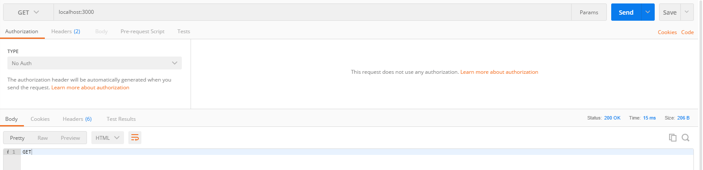
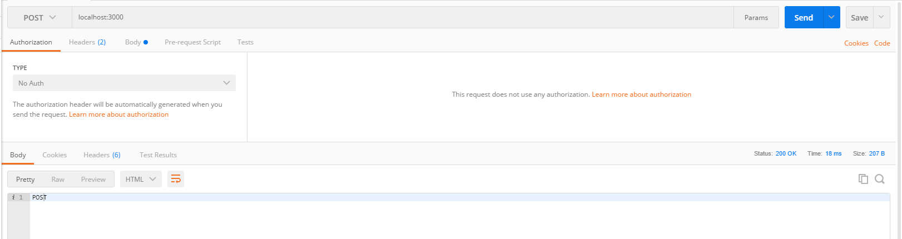
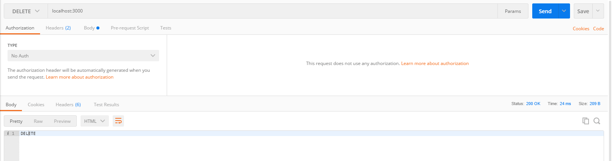

W podsumowaniu poprzedniego roku zastanawiałem się czym się zająć w kwestii backendu. Początkowo myślałem o Go albo .Net ale póki co postanowiłem dalej kontynuować temat Node.js. Uznałem, że lepiej będzie dla mnie jak się skupię póki co na Javascript a potem można poznawać inne języki. Zdecydowałem się również na framework Express, który mam zamiar wykorzystać w mojej pracy inżynierskiej. Dziś szybki wstęp jak zacząć z nim pracę.

<!--more-->

## Instalacja

Express.js jest prosty w instalacji i jedyne czego wymaga to zainstalowanej platformy Node.js oraz posiadania narzędzia npm lub yarn do instalowania zależności.  Jedyny krok jaki musimy zrobić to w konsoli uruchomić następującą linijkę
`yarn add express`. 


Pobierze to nam odpowiednie biblioteki, które są potrzebne dla tego frameworka, dzięki czemu można przejść od razu do pisania pierwszej aplikacji.


## Hello World

Żeby móc cokolwiek uruchomić musimy sobie stworzyć plik gdzie będzie pisany dalszy kod. Plik może mieć dowolną nazwę u mnie to będzie `app.js`. Mając to możemy zacząć pisać:

```
const express = require('express')
const app = express()

```

Pierwsze dwie linijki to będzie tylko zaimportowanie naszego frameworka oraz utworzenie jego instancji, którą będziemy dalej wykorzystywać. Dalej będziemy mieć coś takiego: 

```
app.get('/', (req, res) => res.send('Hello World!'))

app.listen(3000, () => console.log('Server is working on port 3000'))

```

Pierwsza linia jest to zdefiniowanie adresu pod którym będzie nasłuchiwać nasza aplikacja. W momencie gdy się odwołamy pod ten adres zapytaniem GET to zostanie wywołana funkcja posiadająca dwa parametry: request(req) czyli dane które trafiają do nas od klienta, oraz response(res) dzięki któremu będziemy mogli zwrócić dane. Jest to zachowanie identyczne do tego, które opisałem w poście dotyczącym [własnego serwera http w Node.js](https://fsgeek.pl/post/node-jak-postawic-serwer/).

Druga linia określa pod jakim portem będzie widoczna nasza aplikacja. Serwerem naszej aplikacji w tym przypadku będzie localhost ale żeby móc korzystać  z naszego serwera musimy przy zapytaniach określić port jaki odpytujemy inaczej nam to nie zadziała.

Po uruchomieniu tego w konsoli zobaczymy następujący widok: 


Znaczy to, że nasz serwer działa i możemy uruchomić naszą aplikację w przeglądarce i sprawdzić efekt:


## Prosty routing

Jako sprawdzenie czy instalacja przebiegła pomyślnie to taki routing nam wystarczy. Jednak w każdej aplikacji będziemy potrzebować dużo większego routingu. Na szczęście Express.js nam ułatwia pracę dostarczając gotowe metody. Parę linijek wyżej pokazałem, jak zareagować na zapytanie GET pod scieżkę `/`. W analogiczny sposób możemy reagować na inne zapytania REST: 

- app.post(scieżka, funkcja)
- app.put(scieżka, funkcja)
- app.delete(scieżka, funkcja)

```
app.get('/', (req, res) => res.send('GET'));
app.post('/', (req, res) => res.send('POST'));
app.put('/', (req, res) => res.send('PUT'));
app.delete('/', (req, res) => res.send('DELETE'));

```

Najprościej żeby sprawdzić czy nasz nowy routing działa jest wykorzystać jakąś aplikację, która pozwala wysyłać zapytania REST. Ja korzystam z  [Postman](https://www.getpostman.com/postman) ale możecie użyć innej.






W bardzo prosty sposób byliśmy w stanie stworzyć kod, który reaguje na różne rodzaje zapytań. Teraz wystarczy rozbudować funkcję obsługującą zapytanie by nasz serwer robił coś więcej niż tylko zwracał statyczny tekst. Ale tym się zajmę w następnym poście.
