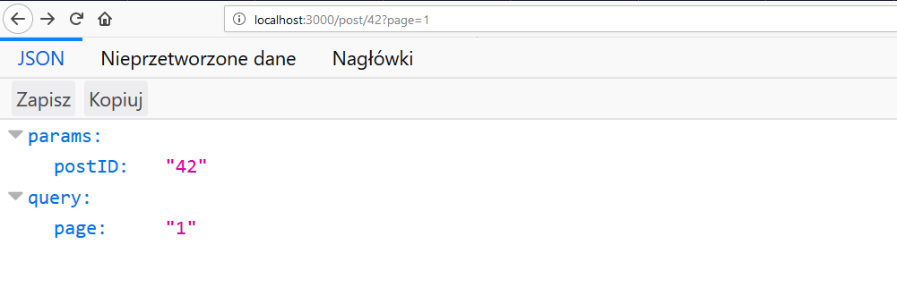

W ostatnim poście (jeśli go ominęliście to zerknijcie [tutaj](https://fsgeek.pl/post/expressjs-hello-world/)) opisałem po krótce jak można zacząć zabawę z frameworkiem Express.js. Dziś chciałbym pokazać najważniejszą rzecz według mnie w takim systemie a więc możliwość tworzenia endpointów. Jeśli chcecie zobaczyć co możemy stworzyć w tej kwestii w Express.js zapraszam do czytania.

<!--more-->

## Prosty routing

Pisałem już o tym w poprzednim poście dlatego dziś tylko o tym wspomnę. Express daje nam możliwość prostego definiowania ścieżek. Dostarcza nam metody które pozwalają na reagowanie na konkretne zapytania od użytkownika. Każda taka metoda składa się z dwóch części: 

- adresu(ścieżki) pod jakim nasza metoda nasłuchuje
- funkcja która służy do obsługi naszego adresu(ścieżki)

Każda funkcja do obsługi ścieżki posiada dwa argumenty najczęściej zapisywane jako:

- req - są tutaj dostępne parametry zapytania takie jak metoda, argumenty itd (request)
- res - tutaj możemy skorzystać z kilku metod by zwrócić dane np.: plik lub json (response)

Do standardowych metod jakich możemy użyć można zaliczyć:

- get 
- post
- put
- delete

Mamy również możliwość wykorzystania metody `all()`, która reaguje na każde zapytanie REST. Jeśli chcielibyśmy wykorzystać taką funkcję i dopiero w funkcji zdecydować co zrobić możemy wykorzystać pole `method` w argumencie `req` w celu wyciągnięcia metody z jaką użytkownik wysłał swoje zapytanie.


## Definicja ścieżki

W większości przypadków wystarczy nam proste zdefiniowanie ścieżki czyli jasne określenie pod jaką ścieżkę należy się odwołać by otrzymać lub przekazać dane. Jednak to nie znaczy, że nie możemy wykorzystać tego inaczej. Ścieżkę na jaką ma reagować nasz system możemy określić jako zwykły string, wzorzec lub nawet wyrażenie regexp.

Co do pierwszej opcji to nie ma za dużo do rozpisywania się ponieważ jest to naturalny sposób definiowania ścieżek. Dużo ciekawsze są pozostałe dwie opcje.  Wzorzec ścieżki pozwala w prosty sposób zdefiniować pewną opcjonalność i modyfikacje w docelowym adresie przy pomocy kilku znaków: 

- `?` litera (lub grupa liter w nawiasach okrągłych) jest opcjonalna  
dla ścieżki `/ala?` pasuje zapytanie pod adres `/al` oraz `/ala`  (podobnie dla `/ala(ma)?` pasuje `/ala` i `/alama`)
- `+` litera musi wystąpić przynajmniej raz ale może wystąpić większą ilość razy (podobnie z grupą liter w nawiasie)  
dla ścieżki `/ala+` pasuje zapytanie pod adres `/ala` , `/alaa`, `alaaa` itd. (podobnie dla `/ala(ma)+` pasuje `/alama`, `/alamama` itd)
- `*` w miejscu tego znaku może wystąpić dowolny ciąg znaków ale może być to również pominięte  
dla ścieżki `/a*a` pasują zapytania `/aa`, `/ala`, `/ada` oraz również `/alamakota` itd.

Jeśli chcecie sprawdzić czy adres pod jaki uderzacie odpowiada zdefiniowanej przez was ścieżce to możecie wykorzystać tę [stronę](http://forbeslindesay.github.io/express-route-tester/)

Jeśli nie jesteśmy w stanie przy pomocy powyższych opcji uzyskać porządanego efektu możemy wykorzystać 3 opcję czyli wyrażenia regularne. Jednak aktualnie nie potrafię podać sensownego przypadku użycie dla którego można by wykorzystać ten mechanizm. Jeśli spotkaliście się z czymś takim to podzielcie się w komentarzu gdzie to można korzystnie wykorzystać.

Aby wykorzystać wyrażenia regularne musimy wpisać w miejscu gdzie zazwyczaj wpisujemy zwykły ciąg znaków nasze wyrażenie np.:

```
app.get(/a/, (req, res)=>{
    res.send(req.path);
});
```
W momencie gdy adres, pod który się odwołamy będzie pasował do wyrażenia regularnego to dostaniemy odpowiedź.


## Przekazywanie parametrów

No i na sam koniec jeszcze najważniejsza kwestia czyli przekazywanie parametrów. Bez tego mechanizmu nasze linki byłyby właściwie nieprzydatne. W Expressie jesteśmy w stanie definiować parametry w naszej ścieżce w prosty sposób przy pomocy znaku `:`. Przykładowo dla ścieżki `/posts/:postId` parametrem jest zmienna `postId` i pod taką nazwą będziemy się mogli do niej odwołać. Aby odwołać się do przekazanej zmiennej musimy skorzystać z parametru `req` w funkcji obsługującej nasze zapytanie. W `req.params` jesteśmy w stanie znaleźć wszystkie parametry jakie zostały przekazane do naszej aplikacji.

```
app.get('/post/:postID', (req, res)=>{
	res.json(params: req.params);
});

```
 

Jednak warto wspomnieć, że `req.params` nie zwróci nam query string(czyli parametrów które dopisujemy do zapytania GET po znaku `?` np. `post/123?page=1&limit=10`). Aby dostać się do tych wartości w Express musimy wykorzystać inną zmienną - `req.query`

app.get('/post/:postID', (req, res)=>{
    res.json({params: req.params, query: req.query});
});


 


Jak widać nie jest to ciężkie i po chwili czytania każdy byłby w stanie stworzyć prosty system, który będzie odbierał zapytania od użytkownika, przetwarzał oraz zwracał odpowiednie dane. Dopiero szczegóły sprawiają, że sprawy się komplikują ale i do tego jeszcze dojdziemy w przyszłości ;) 

