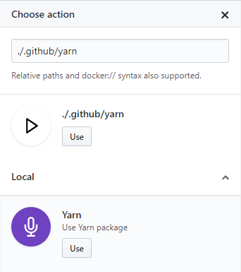

Jedną z zalet Github Actions jest obecność wizulanego edytora. Pomaga on stworzyć podstawowy workflow, nie wymagając przy tym znajomości pliku konfiguracyjnego. Druga z zalet to możliwość tworzenia własnych obrazów na których będziemy opierać akcję. To i możliwość tworzenia workflow przy pomocy pliku konfiguracyjnego daje sporo możliwości dla doświadczonego użytkownika.
<!--more-->

## Tworzenie własnych obrazów  

Jak wspominałem w poprzednim poście (który znajdziecie [tutaj](https://fsgeek.pl/post/github-actions-pierwsze-kroki/)) możemy korzystać z gotowych obrazów i w większości przypadków wystarczy umiejętne skorzystanie z nich. Na szczęście możemy również definiować lokalne obrazy tylko dla własnego użytku, które będą trzymane w repozytorium (w momencie jak byśmy chcieli je upublicznić wystarczy przenieść pliki do osobnego repozytorium). Z racji tego, że są to obrazy Dockera mamy prawie niczym nieograniczone możliwości w tworzeniu naszych akcji. Folder z własnym obrazem możemy umieścić w dowolnym miejscu naszego repozytorium ale proponuję go umieszczać w katalogu `.github` gdzie jest już zdefiniowany nasz workflow - wedlug mnie porządkuje to elementy aplikacji według ich przeznaczenia. Teraz potrzebujemy dwóch plików: 

- Dockerfile - jedyny wymagany plik do stworzenia akcji, zawiera instrukcje potrzebne do stworzenia obrazu Dockera
- entrypoint.sh - plik shella - możemy tutaj uruchamiać polecenia lub dodawać logikę do naszego obrazu

Aby pokazać jak szybko można stworzyć własny obraz postanowiłem na stworzyć taki, który pozwoli na wykonywnanie poleceń `yarn'a` w konsoli. Na pierwszy ogień plik `Dockerfile`:

```
FROM node:lts-alpine

LABEL "com.github.actions.name"="Yarn"
LABEL "com.github.actions.description"="Use Yarn package"
LABEL "com.github.actions.icon"="mic"
LABEL "com.github.actions.color"="purple"

COPY "entrypoint.sh" "/entrypoint.sh"
ENTRYPOINT ["/entrypoint.sh"]
CMD ["help"]

```

Warto zwrócić uwagę na wartości dla instrukcji LABEL. Konfigurują one ustawienia naszej akcji dla edytora wizualnego oraz potem dla działającego workflow - mamy tutaj nazwę, opis, kolor i ikonkę. Kolor niestety nie może być dowolny tylko musi być jedną z wartości:  white, yellow, blue, green, orange, red, purple, gray-dark. Natomiast listę dostępnych ikon można znaleźć [tutaj](https://developer.github.com/actions/creating-github-actions/creating-a-docker-container/#supported-feather-icons). 

Oprócz tego stworzyłem też drugi plik `entrypoint.sh`:

```
#!/bin/sh
set -e

sh -c "yarn $*"
```

Plik jest prosty i jedyne co robi to uruchamia yarna z przekazanymi argumentami. 



Teraz aby wykorzystać to co stworzyliśmy możemy albo wykorzystać edytor wizualny - wtedy mamy dostępną osobnę sekcję `Local` lub jeśli piszemy sami plik konfiguracyjny to podając ścieżkę do folderu. W przypadku podawania ścieżki samodzielnie trzeba pamiętać, że zaczynamy z głównego katalogu czyli jeśli dodaliśmy akcję w folderze `.github` to wtedy podajemy taką ścieżkę `./.github/<nazwa_obrazu>`.

## Plik konfiguracyjny

Edytor wizualny jest o tyle przyjemny w korzystaniu, że bardzo ciężko jest zrobić coś w zły sposób. Jednak edycja istniejącego workflow np.: zamiana akcji miejscami, zamiana z postaci gdzie wszystkie akcje idą jedna po drugiej na wersję gdzie idą równolegle dużo łatwiej zrobić edytując plik. Przy własnoręcznym tworzeniu pliku konfiguracyjnego należy pamiętać o dwóch istotnych rzeczach - o rodzajach bloków jakie mamy do dyspozycji oraz jakie atrybuty możemy w nich wykorzystać. Pierwszy z bloków to `workflow`, którym definiujemy każdy nowy zbiór zadań

```
workflow "Build, Test, and Check Format" {
  on = "push"
  resolves = [
    "Build React",
    "Test",
    "Format Check",
  ]
}

```
Mamy tutaj tylko dwa atrybuty i każdy z nich musimy wykorzystać: 

- `on` - określa na jaką akcję w repozytorium ma nasłuchiwać nasz workflow aby się uruchomić np. push; wszytskie akcje na jakie możemy nasłuchiwać znajdziecie [tutaj](https://developer.github.com/actions/creating-workflows/workflow-configuration-options/#events-supported-in-workflow-files)
- `resolves` - określa jakie akcje mają być wywołane - może to być zarówno jedna akcja w postaci stringa lub tablica stringów kiedy chcemy wywołać kilka akcji równolegle

Do definiowania pojedynczych akcji korzystamy ze słówka kluczowego `action`

```
action "Test" {
  uses = "./.github/yarn"
  needs = ["Build"]
  args = "test"
  env = {
    CI = "true"
  }
}

```

No i tutaj mamy dużo więcej atrybutów jakie możemy przypisać: 

- `uses` -  jedyny wymagany atrybut dla akcji; określamy tutaj z jakiego obrazu dockerowego będziemy korzystać, możemy tutaj wykorzystywać już gotowe oraz te stworzone przez nas tak jak to pokazałem wyżej
- `needs` - akcje jakie muszą się zakończyć aby można było uruchomić aktualną, akcje zdefiniowane w atrybucie needs będą uruchomione przed aktualną i aktualna wykona się tylko jeśli poprzednie będą zakończone sukcesem
- `runs` - możemy tego użyć do nadpisania pliku entrypoint z obrazu
- `args`- argumenty jakie zostaną przekazane do pliku entrypoint w obrazie
- `env` - zmienne środowiskowe, istotne dla niektórych narzędzi CLI aby uruchamiały się i kończyły poprawnie
- `secrets` - zmienne, które służą do przechowywania danych wrażliwych jak tokeny, a których potrzebujemy podczas działania workflow

Nie jest to cieżkie o ile się pamięta o kilku rzeczach. Jedyny minus, że nie ma narzędzia, które pozwoliłoby na walidację własnoręcznie stworzonego pliku konfiguracyjnego. To czy jest on poprawny sprawdzimy dopiero po wypuszczeniu zmian do repozytorium. Z tego powodu postanowiłem napisać narzędzie, które pozwoli sprawdzić czy nasz plik konfiguracyjny jest poprawny - aktualnie jest ono we wczesnej fazie rozwoju i znajdziecie je [tutaj](https://github.com/Feridum/github-actions-validator). Warto również w projektach komercyjnych tworzyć własne obrazy - daje nam to możliwość zarządzania wersjami środowisk i innymi krytycznymi elementami infrastruktury. Dodatkowo jesteśmy niezależni od zewnętrzych bibliotek i rozwiązań.