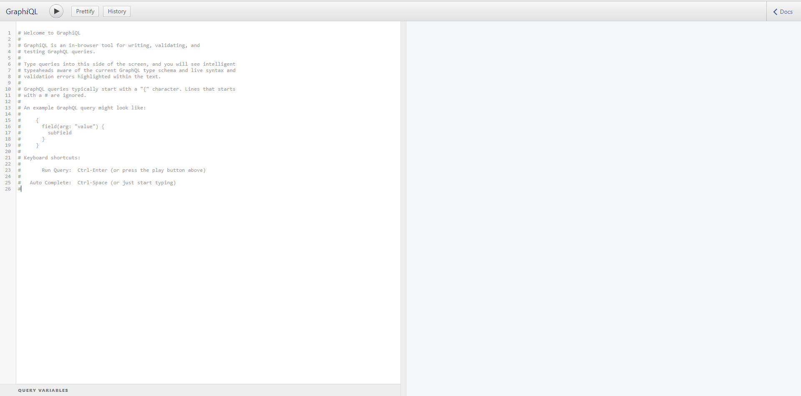
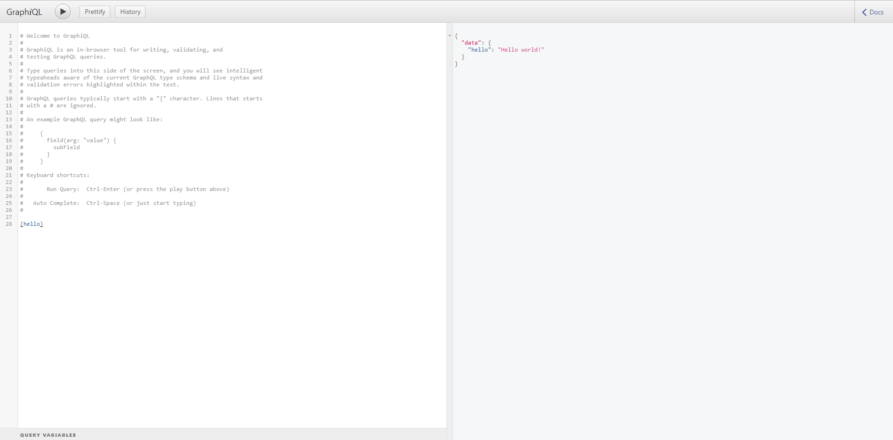
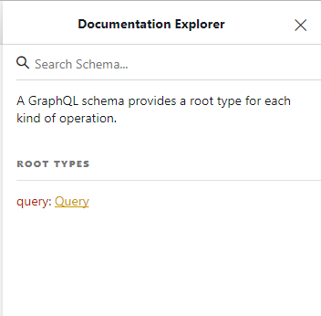
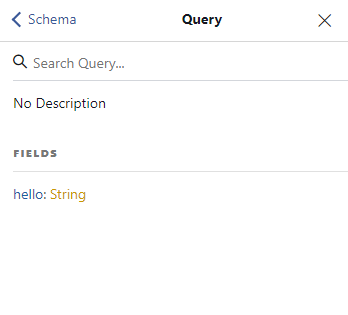

Jak już wielokrotnie wspominałem GraphQL mnie w pewien sposób zauroczył na tegorocznym FrontendCon. Zauroczył mnie tak bardzo, że postanowiłem się tym chwilę pobawić. Stąd też mam zamiar napisać małą serię dotyczącą tego rozwiązania w miarę postępu moich zabaw. Dziś chciałbym zacząć od podstaw czyli czym jest GraphQL oraz jak można rozpocząć zabawę z nim.
<!--more-->
## Co to GraphQL?
GraphQl jest sposobem komunikowania się z serwerem API, który powstał dwa lata temu jako alternatywa REST'a. Żeby powiedzieć w jaki sposób jest od niego różny muszę przypomnieć na czym się opiera dotychczas najczęściej używany REST. Jak wszyscy wiedzą jest to swego rodzaju styl w projektowaniu API. Zgodnie z nim każdy model danych jest dostępny pod osobnym adresem. Mając na przykład sklep internetowy możemy mieć następujące adresy:

- /klient
- /magazyn
- /produkty
- /dostawcy 
- itd..

Tak naprawdę liczba takich adresów nigdy nie będzie mała a wręcz przeciwnie będzie rosła wraz z systemem. Należy również pamiętać, że dla prawie każdego adresu trzeba stworzyć komplet wersji do obsługiwania zapytań GET, POST,PUT,DELETE. W ten sposób otrzymamy sporą liczbę adresów do utrzymania.

W GrapQL jest zupełnie na odwrót. Mamy tylko jeden adres do którego możemy się zwracać o dane. To co otrzymamy zależy tylko i wyłącznie od nas i od tego jak skonstruujemy zapytanie.

## Jak rozpocząć zabawę z GraphQL

Skoro powiedziałem czym jest po krótce GraphQL to warto by było wspomnieć jak zacząć się nim bawić. Ja zabawę zacząłem od postawienia go na serwerze Node'a. Dzięki temu mogę się bawić tak jakbym wykorzystywał to w normalnej pracy. Aby zacząć trzeba zainstalować odpowiednie paczki node'a:

```javascript
yarn add express express-graphql graphql
```

Teraz wystarczy napisać parę linijek kodu by wszystko działało ;p. Kod został wzięty z oficialnej dokumentacji GraphQL.

```javascript
var express = require('express');
var graphqlHTTP = require('express-graphql');
var { buildSchema } = require('graphql');

var schema = buildSchema(`
  type Query {
    hello: String
  }
`);

var root = {
  hello: () => {
    return 'Hello world!';
  },
};

var app = express();
app.use('/graphql', graphqlHTTP({
  schema: schema,
  rootValue: root,
  graphiql: true,
}));
app.listen(4000);
console.log('Running a GraphQL API server at localhost:4000/graphql');
```

Pierwsze 3 linijki to zwykłe zaimportowanie potrzebnych plików. Pierwsza najważniejsza rzecz jaką należy stworzyć to schemat. Definiuje ona o co tak naprawdę możemy odpytywać nasz serwer. W schemacie musi być zdefiniowany typ Query ponieważ to jego szuka GraphQL. Jego brak spowoduje wywołanie błędu podczas uruchamiania serwera. Warto również spojrzeć na definicję pola w schemacie. Oprócz samej nazwy pola jest tam również typ zwracanego zasobu. Domyślnie jest wspieranych 5 typów: String, Int, Float, Boolean oraz ID. Wszystkie inne typy można sobie stworzyć samemu. 

```javascript
var root = {
  hello: () => {
    return 'Hello world!';
  },
};
```

Jako, że zdefiniowaliśmy jakie pola są dostępne to teraz musimy jeszcze określić jak się ma zachować GraphQL, kiedy użytkownik odpyta serwer o dany zasób. Innymi słowy musimy określić co serwer ma zwrócić. Do tego służy tak zwana funkcja 'resolver', która musi być stworzona dla każdego pola zdefiniowanego w schemacie. W tym przykładzie funkcje te przechowujemy we wspólnym obiekcie, który potem jest przekazywany do instancji graphqlHTTP jako rootValue. 

```javascript
app.use('/graphql', graphqlHTTP({
  schema: schema,
  rootValue: root,
  graphiql: true,
}));
```
No i w ten sposób doszliśmy do ostatniego etapu stawiania serwera. W tym przykładzie wykorzystałem express.js jako serwer dla aplikacji. Przy wykorzystaniu `app.use` definiujemy pod jakim adresem będzie dostępny nasz graphQL i przekazujemy tam instację grapghqlHTTP przekazując nasz zdefiniowany wcześniej schemat i obiekt z funkcjami do odpowiednich pól. Warte zauważenia jest trzecie pole graphiql, które dostarcza nam przyjemny interfejs do testowania naszych zapytań. Aby uruchomić serwer wystarczy wpisać w konsoli `node twój_plik.js` 


## Graphiql

Jak wejdziemy teraz w przeglądarce na adres http://localhost:4000/graphql zobaczymy coś takiego:



Jest to całkiem przyjemny graficzny interfejs, który służy do testowania naszych zapytań. Same zapytania są dosyć proste. Jest to obiekt w którym podajemy nazwę pól o jakie chcemy odpytać serwer i otrzymać z nich wiadomości. W naszym przypadku możemy odpytać tylko o jedno pole: hello



Oprócz samego testowania zapytań możemy sprawdzić o co właściwie możemy zapytać przy pomocy zakładki Docs w prawym górnym rogu. Widzimy w nim jakie pola mamy zdefiniowane oraz jaki tym wiadomości nam zwrócą. 





U nas na razie jest tego mało ale możecie sprawdzić jak to wygląda w przypadku większej ilości pól w schemacie na tej [stronie](http://graphql.org/swapi-graphql/)


Mam nadzieję, że was choć trochę zainteresowałem. W następnym poście mam zamiar wejść głębiej w GraphQL i zobaczyć co jesteśmy w stanie z jego pomocą zrobić. A wy co uważacie o tym? A może używacie i macie jakieś rady lub przemyślenia na co zwrócić uwagę? Zapraszam do komentowania i dzielenia się artykułem.
