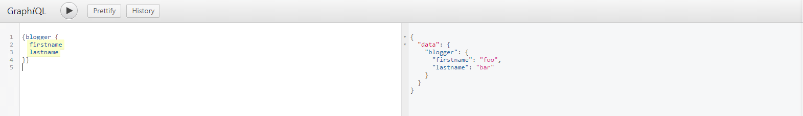
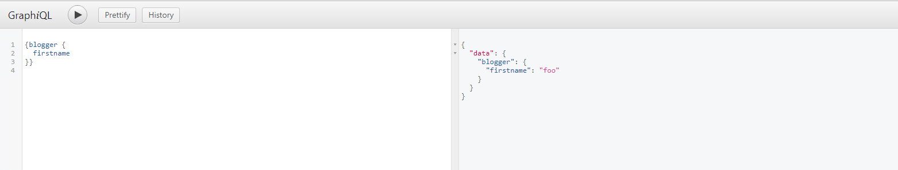
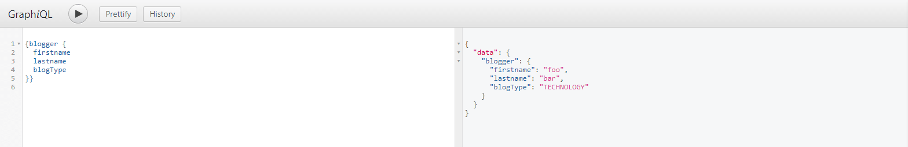
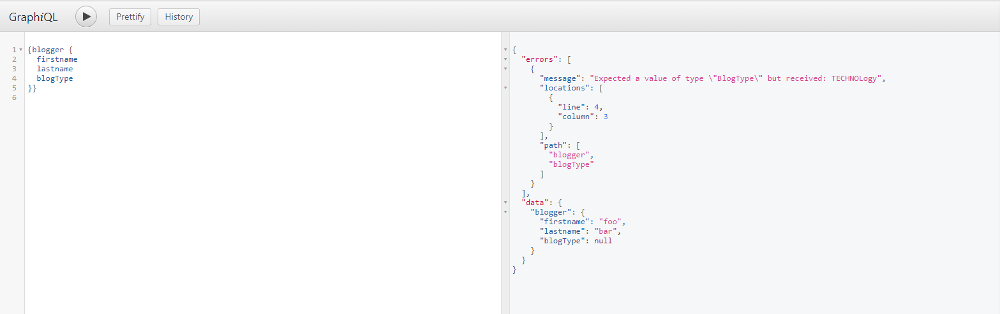
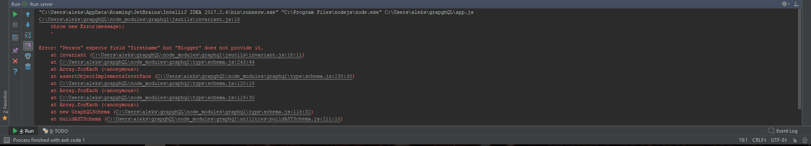

W ostatnim wpisie pokazałem jak można zacząć przygodę z GraphQL (jeśli ominęliście ten post to znajdziecie go [tutaj](https://fsgeek.pl/post/czym-jest-graphql/)). Jednak by był to funkcjonalny system trzeba wiedzieć jak go rozbudować o kolejne elementy. Dziś chciałbym przedstawić jak można konstruować schematy z własnych, bardziej rozbudowanych typów. Zapraszam do czytania :)
<!--more-->
## Krótka powtórka

Zanim przejdę do właściwej części postu, krótkie przypomnienie na temat GraphQL. Jest to sposób na komunikację z serwerem w którym mamy tylko jeden adres do którego się zwracamy po dane. Aby otrzymać dane należy wysłać obiekt z nazwami pól, które chcemy dostać z powrotem. Tak więc to od nas zależy co dostaniemy. W ostnim poście skończyliśmy na takiej strukturze schematu i funkcji zwracającej wynik:

```javascript
var schema = buildSchema(`
  type Query {
    hello: String
  }
`);

var root = {
  hello: () => {
    return 'Hello world!';
  },
};

var app = express();
app.use('/graphql', graphqlHTTP({
  schema: schema,
  rootValue: root,
  graphiql: true,
}));
```

Mogliśmy wykonać tak naprawdę tylko jedna zapytanie `{hello}`. Dziś mam zamiar to rozszerzyć.

## Własne typy w GraphQL

W GraphQl mamy 5 wbudowanych typów: String, Int, Float, Boolean oraz ID. Są pomocne ale nie wystarczające w codziennych rozwiązaniach. Żeby móc modelować rzeczywiste systemy i rozwiązania musimy mieć możliwość definiowania własnych typów. Aby to zrobić należy użyć słówka kluczowego type po którym piszemy nazwę typu. 

```javascript
const schema = buildSchema(`
type Blogger{
    firstname: String,
    lastname: String,
  }
type Query {
    hello: String, 
    blogger: Blogger
}
`)
```

To wystarczy by móc wykorzystywać nowy typ w naszym schemacie. Należy również pamiętać że dla pola blogger musimy stworzyć funkcję, która będzie zwracała obiekt zgodny ze zdefiniowanym typem: 

```javascript
const root = {
    hello: () => 'Hello world!',
    blogger: () =>({firstname: 'foo', lastname:'bar'})
}
```

Teraz po uruchomieniu serwera node'a jesteśmy w stanie odpytywać serwer o nowe pole. W przypadku gdy wyślemy zapytanie w postaci `{blogger}` to zostanie ono domyślnie przekształcone by zwrócić wszystkie dostępne pola.



Warte zauważenia jest, że nie musimy prosić serwer o każde pole typu Blogger, co więcej nie musimy tworzyć osobnych funkcji by to obsłużyć:



## Listy i wartości nie puste

Oprócz tego że możemy zdefiniować własne typy możemy je w pewien sposób modyfikować: określić czy wartość nie może być pusta lub stworzyć tablicę. Wykonujemy to przy pomocy operatora `!` lub `[]`. W ten sposób możemy definiować następujące rzeczy:

- Field: Int! -> pole nie może mieć wartości null
- Field: [Int]-> zwrócona wartość musi być tablicą której elementy są typu Int
- Field: [Int]! -> pole nie może mieć wartości null ale może być tablicą w której są wartości null
- Field: [Int!] -> pole może być wartością null ale jeśli jest już tablicą nie może mieć w sobie wartości null (może być pustą tablicą)
- Field: [Int!]! -> pole nie może mieć wartości null ani nie może być tablicą gdzie istnieje element  o wartości null
	
## Typ enum

Oprócz samej możliwości tworzenia typów możemy również definiować specjalny typ jakim jest enum. Typ ten jest obiektem, który zawiera  możliwe wartości dla danego typu. Innymi słowy, jeśli przypiszemy tym enum do danego pola to będzie mógł on przybrać tylko i wyłącznie pola przez nas zdefiniowane

```javascript
const schema = buildSchema(`
 enum BlogType{
    TECHNOLOGY,
    EATING,
    TOURISM
  }
  type Blogger{
    firstname: String,
    lastname: String,
    blogType: BlogType
  }
`)

const root = {
    hello: () => 'Hello world!',
    blogger: () =>({firstname: 'foo', lastname:'bar', blogType: 'TECHNOLOGY'}),
}
```



Jeśli zwrócona przez nas wartość nie będzie się zgadzała z zdefiniowanymi wartościami typu enum to dostaniemy błąd a pole będzie miało wartość `null`.



Takie pole jest przydatne w przypadku gdy wiemy jakiego typu będziemy dostawać wiadomości np. statusy, jakieś skończone i ustalone typy tak jak w tym przypadku typ bloga.

## Interfejsy

Ostatnia rzecz na dzisiaj o której chciałem powiedzieć to mechanizm interfejsu, który jest wspierany przez GraphQL. Jest to mechanizm znany z innych języków. Typ który implementuje interfejs musi w sobie zawierać wszystkie pola, które są zdefiniowane w interfejsie. Brak takiego pola wywoła błąd już w momencie startu serwera. 



Oprócz tych pól typ może zawierać w sobie dodatkowe pola nie będące częścią interfejsu.

```javascript
const schema = buildSchema(`
interface Person{
    firstname: String,
    lastname: String,
  }
  type Blogger implements Person{
    firstname: String,
    lastname: String,
    blogType: BlogType
  }
`)
```

Dziś pokazałem jakie mamy możliwości przy tworzeniu własnych schematów w GraphQL. Skupiłem się na różnych typach jakie możemy przypisywać do naszych pól i jakie to może mieć kosekwencje dla całego schematu. Następnym razem chciałbym poruszyć kwestię wprowadzania danych ponieważ do tej pory tylko je wypisywaliśmy a warto też coś wprowadzić. Napiszcie czy wam się podobało i czy chcielibyście poczytać o czymś konkretnym w kwesti GraphQL. 