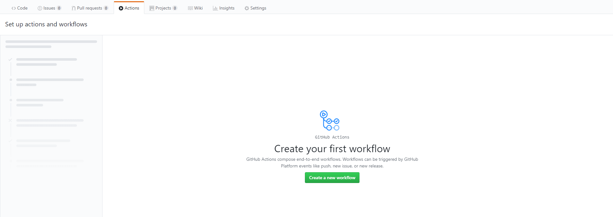
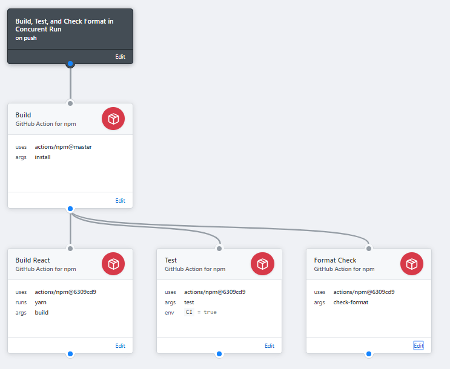

W połowie pażdziernika Github ogłosił start nowej funkcjonalności na swojej platformie. Github Actions ma pozwalać na konfigurację zadań, które będą się wykonywały w naszym repozytorium w wyniku wystąpienia różnych zdarzeń np.: wypuszczenie nowego kodu. Ostatnio dostałem do tego dostęp więc postanowiłem zobaczyć czy da się z tego korzystać, co można zrobić oraz czy warto w ogóle się tym zainteresować.

<!--more-->

## Github Actions - informacje wstępne

Póki co jest to funkcjonalność w stanie zamkniętej bety więc jeśli chcecie się tym pobawić to musicie wejść na tą [stronę](https://github.com/features/actions), zapisać się i być cierpliwym. Ja musiałem czekać ok 2 miesiące ale myślę, że z czasem będą zapraszać coraz więcej użytkowników. Sama możliwość tworzenia i automatyzacji zadań w repozytorium nie jest nowym pomysłem i możemy ją spotkać na przykład w Bitbucket Pipelines (co opisałem w poście [Wyciągnij więcej z Bitbucketa](https://fsgeek.pl/post/badz-produktywny-wyciagnij-wiecej-z-bitbucketa/)). Do tej pory nie mogliśmy tworzyć czegoś takiego bezpośrednio z poziomu Githuba tylko musieliśmy się wspomagać zewnętrzymi rozwiązaniami jak TravisCI czy CircleCI. Oczywiście z racji tego, że jest to zamknięta beta są nałożone ograniczenia z czego najważniejsze dotyczy typu repozytorium dla którego można to wykorzystać - aktualnie jesteśmy w stanie z tego korzystać tylko dla prywatnych repozytoriów. 

## Tworzenie pierwszego workflow

Github Actions jest widoczne jako nowa zakładka na w repozytorium o nazwie `Actions`. W momencie jak wejdziemy tam po raz pierwszy zobaczymy następujący widok: 

Żeby dodać nowy workflow (czyli nasz zbiór akcji, które będą się wykonywać) wystarczy, że klikniemy na przycisk `Create a new workflow` i zostaniemy przeniesieni do edytora wizualnego.

Jest tam już umieszona pierwsza akcja, która odpowiada za uruchomienie naszego workflow jeśli wystąpi określone zdarzenie w naszym repozytorium. Mamy tutaj do wyboru te najważniejsze czyli `push` i `pull-request` oraz wiele innych, których nie ma sensu wypisywać ponieważ są świetnie opisane na [stronie](https://developer.github.com/actions/creating-workflows/workflow-configuration-options/#events-supported-in-workflow-files). Od tego momentu nasze zadanie ogranicza się do dokładania kolejnych kroków aby workflow spełniał nasze oczekiwania.  

Na potrzeby tego wpisu stworzyłem prostą aplikację przy pomocy `create-react-app` i chciałem aby moje workflow pozwalało na uruchomienie testów, sprawdzenie formatowania przy pomocy prettiera i zbudowanie aplikacji. Aby coś takiego uzyskać potrzebuję wykorzystać obraz dockera, który pozwoli na uruchomienie komend `npm`.  Na szczęście nie musiałem tworzyć go od zera tylko mogłem skorzystać z już istniejącego.

Po wyborze obrazu możemy go dostosować do naszych potrzeb. Najważniejsze jest pole `arg` w którym wpisujemy jaki skrypt chcemy urchomić np.: jeśli chcemy uruchomić `npm run test` to wpisujemy tam `test`.  Ważna kwestia przy wykorzystywaniu takich akcji to upewnić się lokalnie, że wszystkie nasze komendy po wykonaniu się, kończą swoją pracę a nie zostają w trybie np.: `watch` - powoduje to, że dana akcja się nie skończy a w związku z tym cały workflow

Teraz wystarczy dodać kolejne bloki, które będą wykonywały kolejne akcje. U mnie cały workflow prezentuje się następująco.

Za każdym razem jak wypuścimy nowy kod do repozytorium zostanie uruchomiony tak skonstruowany workflow.  Akcje wykonują się od góry i schodzą coraz niżej. W momencie gdy któraś z akcji zakończy sie niepowodzeniem to wtedy te poniżej nie są już wykonywane oraz cały workflow kończy się niepowowdzeniem. Coś co wyróżnia Github Actions jest możliwość tworzenia akcji tak aby wykonywały się równolegle. Wystarczy, że trochę przerobimy nasz układ. 

Mam nadzieję, że pomoże to trochę poprawić czas i przyśpieszyć wykonanie całego workflow. Podczas moich testów zrównoleglenie akcji dawało czasami parę sekund zysku a czasami wręcz przeciwnie :D. To czy ma to wpływ na całkowity czas będzie dało się sprawdzić dopiero w przypadku aplikacji, które mają sporo kodu i testów do niego - póki co dla mnie jest to tylko ciekawostka.

## Czy warto wykorzystywać? 
Odpowiedź brzmi - oczywiście, że tak. Wszystkie takie systemy pozwalają programistom przejąć część pracy od devopsów, dając im czas na poważniejsze kwestie. Oczywiście system jest w becie i cierpi na wiele bolączek wczesnego dostępu. Według mnie interfejs nie jest zbyt intuicyjny i na przykład przejście z podsumowania do edycji workflow wymaga za dużej ilości akcji od użytkownika. Oprócz tego nie potrafiłem znaleźć opcji by zatrzymać proces, który nie mógł się zakończyć ze względu na mój błąd (na szczęście został zatrzymany po 1h ale fajnie by było gdybym mógł to zrobić szybciej). Kolejna rzecz, której mnie brakuje to możliwość ręcznego uruchomienia workflow dla danego brancha. 

Ale trzeba pochwalić Github, że w końcu zdecydowali się na wprowadzenie takiego rozwiązania, szczególnie że konkurencja ma to od dawna. Na duży plus zasługuje edytor wizualny, który dla najprostszych przypadków wystarczy i pozwoli mniej doświadczonym programistom również z tego skorzystać. Oprócz tego dla bardziej doświadczonych jest dostępny zwykły plik konfiguracyjny oraz możliwość tworzenia własnych akcji (zarówno lokalnie dla repozytorium jak i globalnie dla innych użytkowników)

Mam nadzieję, że Github będzie ciągle pracował nad tym narzędziem i w ciągu paru miesięcy będzie się z tego przyjemnie korzystać. A wy macie już dostęp do Github Actions? Jak wasze wrażenia? 
