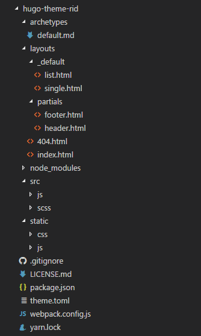

Wiem, że ostatnim razem mówiłem że wspomnę parę słów na temat Cloudflare'a ale mój aktualny szablon w pewien sposób mnie zirytował. Wszytsko przez to, że w znalazłem pewną  niekonsekwencję. Z jednej strony wymagał aby baseUrl był zakończony slashem a z drugiej powodowało to błąd w paginacji. Co prawda naprawiłem to ale zachęciło mnie to do przyspieszenia tworzenia własnego szablonu. I dziś będzie pierwszy post z tej serii. A do Cloudflare'a wrócę przy okazji ;) 
<!--more-->
## Założenia szablonu

W kwestiach wyglądu strony będę się wzorował na aktualnym wyglądzie(bardzo lubię kafelki :D) ale mam parę własnych pomysłów. Moim głównym założeniem będzie stworzenie szablonu, który będzie przyjazny zarówno dla użytkownika jak i przeglądarki. Mam tu na myśli szybkość ładowania elementów oraz zachowanie szablonu na urządzeniach mobilnych. Na pewno zacznę od podstawowego szablonu oraz dodania integracji takich jak: Google Analytics i Disqus. A potem co tylko przyjdzie do głowy.

## Konfiguracja 

Konfigurację oparłem na webpacku, którego konfigurację możecie zobaczyć poniżej. 

```javascript
'use strict';
var webpack = require('webpack');
var ExtractTextPlugin = require('extract-text-webpack-plugin');

var config = {
  context: __dirname + '/src',
  entry: {
    app: './js/main.js',
  },
  output: {
    path: __dirname, 
    filename: './static/js/app.js',
  },
  module: {
    rules: [
     {
      test: /\.js$/,
      use: [{
        loader: 'babel-loader',
        options: { presets: ['es2015'] }
      }]
    },
      { 
        test: /\.css$/,
        use: ExtractTextPlugin.extract({
          use: 'css-loader?importLoaders=1',
        }),
      },
      {
        test: /\.(sass|scss)$/,
        use: ExtractTextPlugin.extract(['css-loader', 'sass-loader'])
      }
    ]
  },
  plugins: [
    new ExtractTextPlugin({ 
      filename: './static/css/app.css',
      allChunks: true,
    }),
  ],
};

module.exports = config;
```

Jak widać do tworzenia styli będę używał scss, którego mam zamiar potem kompilować do css. Mam zamiar również korzystać z dobrodziejstw ES6 i potem przy pomocy babela przetłumaczyć do ES5. Nie jest to skończona konfiguracja, ponieważ będzie ona rosła w miare potrzeb. Na pewno w przyszłości zostanie tam umieszony fragment kodu odpowiedzialny za zmniejszanie wielkości plików by jak najbardziej przyspieszyć ładownie strony. Nie jest to również moja autorska konfiguracja webpacka tylko zlepek potrzebnych rzeczy z internetu, ponieważ jestem dopiero w trakcie jego nauki. Ale grunt że działa :D

## Struktura

No i najważniejsza część czyli struktura, która jest ściśle określona przez Hugo.  Na szczęście nie musimy jej sami tworzyć ponieważ istnieje komenda, którą można użyć by stworzyć podstawowy szablon. Aktualnie struktura wygląda następująco:



Folder src został stworzony przeze mnie i tam będę umieszczał wszystkie swoje skrypty, które potem będą zmniejszane i umieszczane w odpowiednich folderach w folderze static przy pomocy webpacka.

Póki co to tyle. Jak uda mi się coś sensownego stworzyć lub też napotkam jakieś problemy to chętnie się z nimi podzielę. A może wy macie jakieś uwagi lub rady dotyczące Hugo lub tworzenia szablonów w ogóle. Dzielcie się z nimi w komentarzach. Każda rada jest mile widziana.
Rozwój szablonu będzie można śledzić [tutaj](https://github.com/Feridum/hugo-theme-rid). Póki co nie ma tam wiele ale wkrótce będą się tam pojawiały nowe commity.
