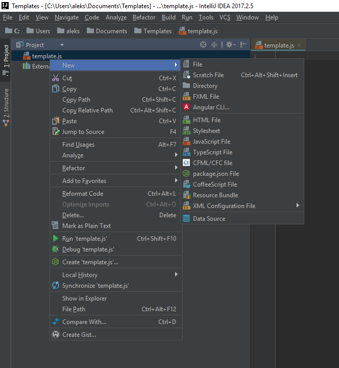
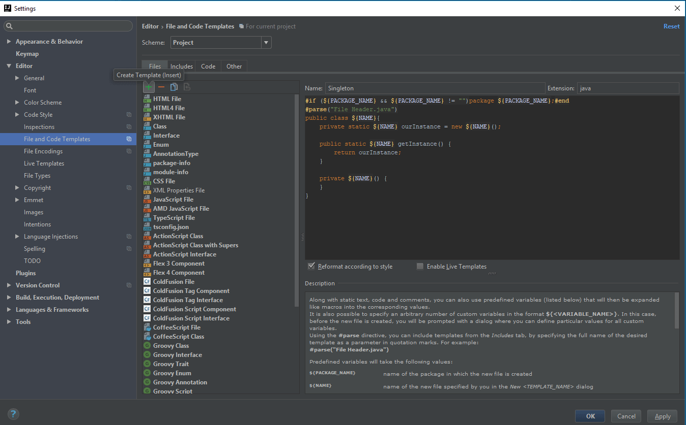
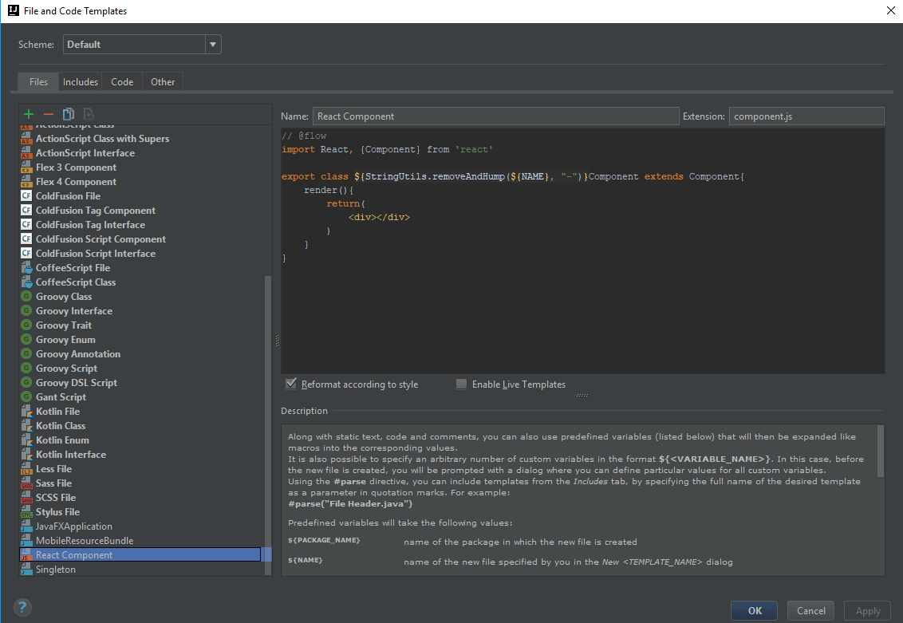
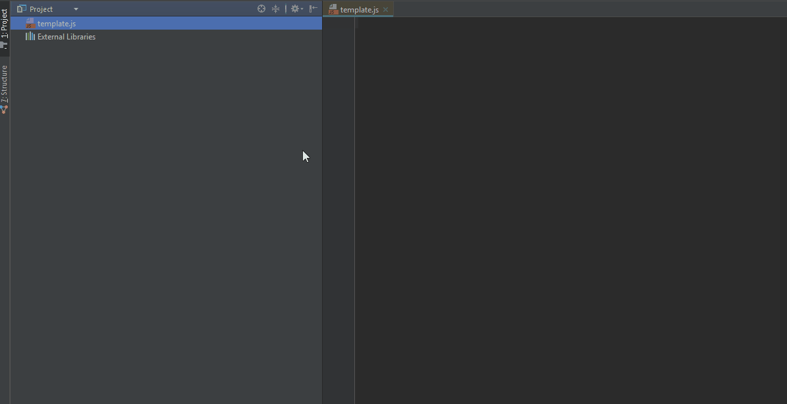
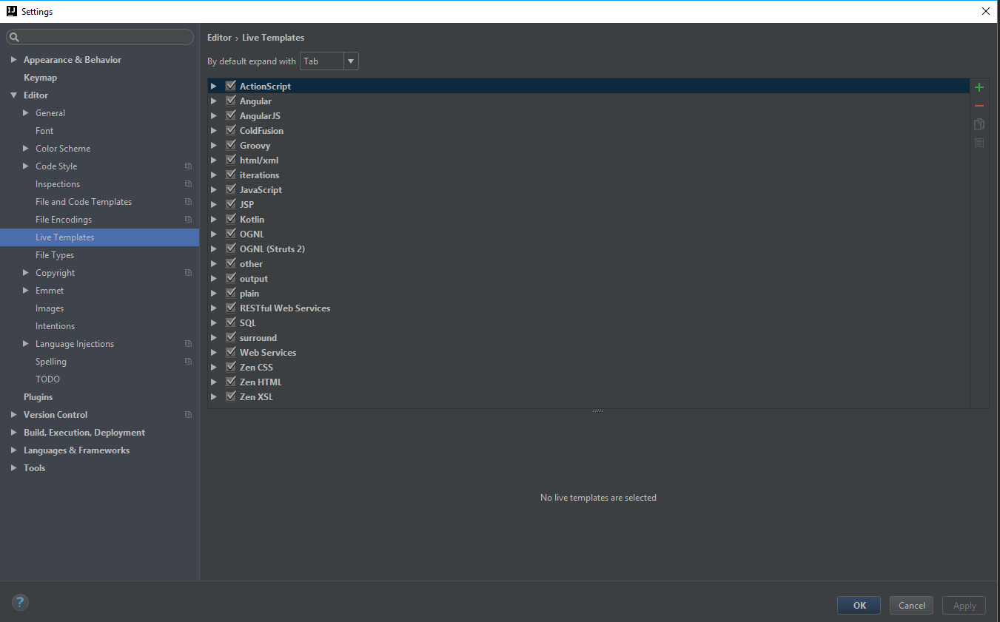
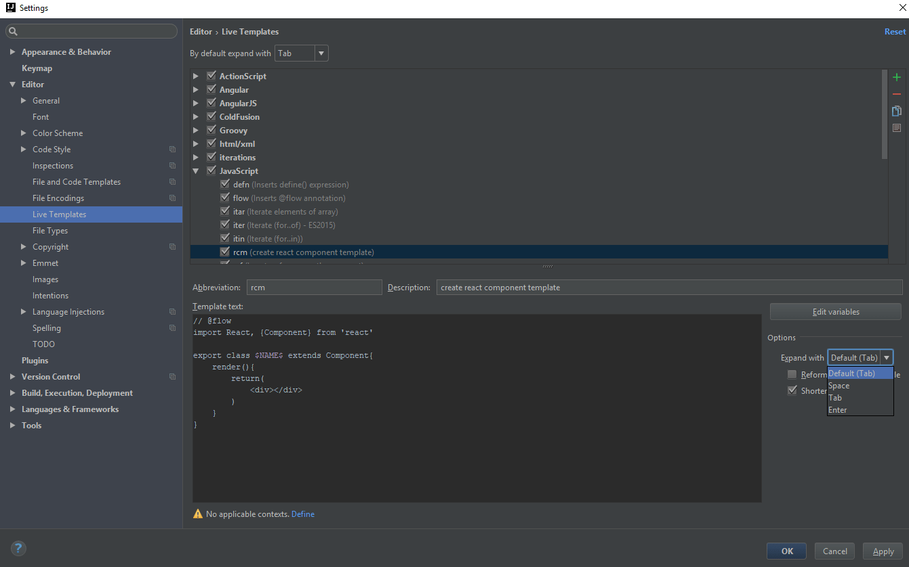
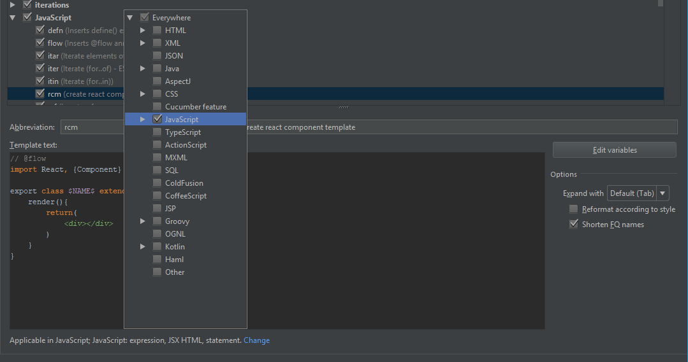
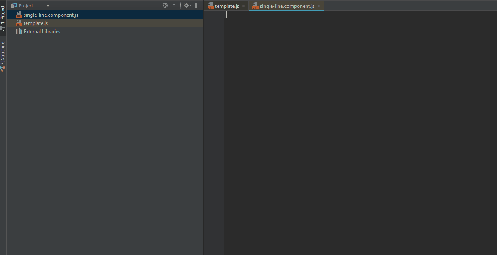

Sesja, sesja i po sesji więc można wrócić do pisania wpisów :) . Na sam początek chciałbym zacząć mini-serię dotyczącą produktywności. Będą to krótkie i treściwe posty w których będę opisywał jak można sobie pomóc podczas programowania. Na sam początek wziąłem edytor z rodziny Intellij i możliwość tworzenia szablonów. Zapraszam do czytania.

<!--more-->
## Szablony plików w Intellij

Intellij dostarcza świetne edytory dla chyba każdego języka. Bardzo dużo firm z nich korzysta a i chyba programiści go lubią (ja nie wyobrażam sobie pracy w innym). Warto wiedzieć co zrobić by pozbyć się pewnych powtarzalnych elementów, które zabierają czas a można je w prosty sposób wyeliminować. Jedną z takich rzeczy jest konieczność pisania ciągle tego samego szkieletu dla klasy, komponentu, kontenera itd. Te rzeczy możemy wyeliminować przy pomocy szablonów.

Szablon pliku jest to już wstępnie przygotowany plik, który możemy wybrać podczas dodawania nowego pliku do projektu. Może zawierać już wstępnie przygotowany kod, który będzie trzeba tylko delikatnie pozmieniać co przyspieszy w pewnien sposób pracę.



Aby dodać własny szablon pliku musimy wejść w: *Settings->Editor->File and Code Templates*. Teraz w zakładce Files musimy kliknąć na `+` który pozwoli na dodanie nowego szablonu:



W widocznym okienku możemy wpisać dowolny kod jaki chcemy by był automatycznie generowany. Ja na przykład ostatnio dużo piszę w React'cie więc stworzyłem szablon do tworzenia szkieletu komponentu. 



```
// @flow
import React, {Component} from 'react'

export class ${StringUtils.removeAndHump(${NAME}, "-")}Component extends Component{ 
    render(){
        return(
            <div></div>
        )
    }
}

```

Jedyne co może być dziwne to ten kawałek kodu:
```
${StringUtils.removeAndHump(${NAME}, "-")}

```
Pozwala on zamienić nazwę pliku napisaną w kebab-case na PascalCase którego używam przy nazewnictwie klas komponentów w React'cie. 

Teraz możemy stworzyć od razu nowy komponent: 



## Live Templates

Możemy również użyć tzw.: Live Templates, czyli kawałki kodu, które mogą zostać dodane do istniejącego pliku podczas pisania. Działa to identycznie jak Emmet - piszemy sobie skrót, klikamy `Tab` i voila mamy wstawiony własny kawałek kodu. Aby takie coś stworzyć musimy wejść w podobne miejsce co chwilę temu: *Settings->Editor->Live Templates*.



Mamy tutaj sporo różnych grup szablonów. Aby dodać nową musimy kliknąć na grupę która nas interesuje, kliknąć na `+` i wybrać pierwszą opcję: `1. Live Template`:


Po wybraniu tej opcji na dole okna pojawią się nowe pola do których możemy wpisać:

- Skrót który będzie nam służył do wywołania szablonu
- Opis skrótu 
- No i część najważniejsza czyli szablon




```
// @flow
import React, {Component} from 'react'

export class $NAME$ extends Component{ 
    render(){
        return(
            <div></div>
        )
    }
}

```

Po prawej stronie możemy wybrać czy jakim klawiszem chcemy rozwijać nasz szablon. Ja zostanę przy klawiszu `Tab` ale nic nie stoi na przeszkodzie by wybrać coś innego.

Ważne abyśmy wybrali `context` w którym ma działać nasze rozwinięcie - innymi słowy pod jakimi rozszerzeniami ma działać. Dla tego przykładu chcemy by działało we wszystkich plikach `.js`. 



Oprócz tego warto dodać zmienne dla naszego rozwinięcia. Zmienne dodajemy przy pomocy znaków `$$` pomiędzy którymi wpisujemy nazwę. Potem taką zmienną możemy edytować w specjalnym oknie, które można otworzyć przy pomocy przycisku `Edit variables`. 


Dla mojego rozwinięcia postanowiłem zmienić nazwę pliku na PascalCase i wstawić jako nazwa klasy - czyli podobnie jak chwilę wyżej. Da się to osiągnąć następującymi funkcjami: `capitalize(camelCase(fileNameWithoutExtension()))` Jak to działa? 



Napiszcie jak wam się podobało i czy chcielibyście takie poradniki dla innych edytorów. Jeśli tak to napiszcie w komentarzu czego wy używacie do pisania a ja zobaczę jak można w tym usprawnić sobie pracę ;) 

